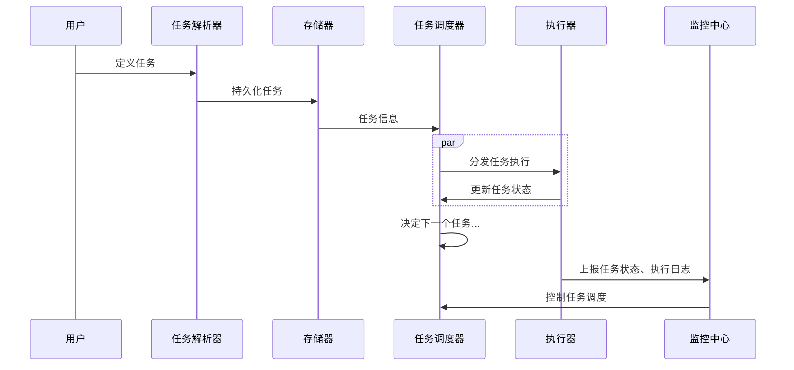
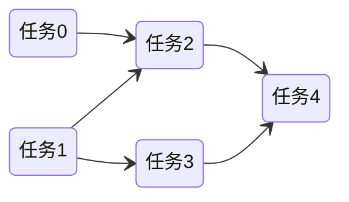

# 任务调度系统

> 分析主流任务调度系统架构、有哪些功能

## 整体流程



## 任务定义与解析

### 任务类型

#### 原子任务（Task）

- 定时任务
- 基于事件触发的任务

Task 是调度的基本单位，这种类型的任务通过将依赖关系作为任务的一个属性存储来实现任务编排，如

```json
{
  "task": "任务2",
  "precursor": "任务0,任务1"
}
```

#### 工作流（WorkFlow）

定义一个DAG，描述任务依赖关系



想要支持复杂的任务编排，必须使用工作流模式

### 任务定义

- 内置任务：大部分调度系统都内置了诸如sql spark等类型的任务，对于内置任务，只需要在新建任务时配置对应参数并保存
- 自定义任务：这种类型的任务一般就需要上传代码，如直接上传jar包，保存脚本代码等。如果调度器跟执行器在同一台机器内，就可以通过指定Class类名的方式进行

也有调度系统实现了自动任务发现的机制，不必显式进行任务配置。但这种方式无法用于复杂的工作流编排

### 任务触发

大部分调度系统都是基于定时触发来触发任务的，部分调度系统可以实现跨任务依赖，即另外等待另外一个任务执行完毕，当前任务才会执行

### 版本控制

对于任务定义，系统会保存多份历史记录，以便能随时回溯

### 任务定义解析相关问题

1. 任务的执行内容如何定义
2. 定义任务使用原子任务还是工作流
3. 如何解析任务依赖关系，以什么结构存储解析后的关系
4. 支持哪些触发方式
5. 如何进行版本控制

## 存储

### 隔离

调度系统可以为不同任务划分不同任务组，进行一定程度的隔离，避免互相影响。同时也可以根据任务组的特点，有针对性地将组下的任务调度到特定执行器上。

### 存储相关问题

1. 需不需要任务组隔离
2. 以什么结构存储任务信息

## 调度执行

### 调度策略

批处理系统最关心的就是吞吐量，大部分用都是都是FCFS这种策略

1. 先来先服务 first-come first-serverd（FCFS）
2. 短作业优先 shortest job first（SJF）
3. 最短剩余时间优先 shortest remaining time next（SRTN）

### 重试

调度系统支持在任务定义阶段，配置任务失败重试次数

- 全部重试
- 部分重试：从工作流DAG的某一个节点重跑，这种重试也被叫做补数

重试需要任务本身是无状态的，或者任务自己做好重试相关处理

### 优先级

优先级是作为任务或者工作流的一个属性，当有多个任务被等待调度时，通过该属性进行排序

### 执行资源

有些调度系统会统一管理数据源，以方便在任务定义阶段能以统一的方式使用

### 参数

调度中涉及到的配置、环境信息等，都通过参数传递，任务能以特定的接口，读取这些参数，以在执行过程中使用：

- 内置参数：如任务的基础信息等
- 全局参数：指针对整个工作流的所有任务节点都有效的参数，在工作流定义页面配置
- 本地参数：在任务定义页面配置的参数，默认作用域仅限该任务，如果配置了参数传递则可将该参数作用到下游任务中

### 调度执行相关问题

1. 如何重试任务（全部重试、部分重试）
2. 如何分发任务（分布式）
3. 任务优先级如何实现
4. 任务执行涉及到的资源如何管理
5. 上下游任务如何进行信息传递
6. 如何保证不重复调度
7. 如何支持工作流的上下线，正在运行中的工作流如何优雅下线

## 监控

### 监控数据

有些系统支持向外透出指标与监控组件集成的方式提高监控能力，一些常见的监控指标：

- timeout：超时的任务数量
- finish：完成的任务数量，成功和失败的任务都算在内
- success：成功完成的任务数量
- fail：失败的任务数量
- stop：暂停的任务数量
- retry：重试的任务数量
- submit：已提交的任务数量
- failover：容错的任务数量
- ...

### 日志

除了调度本身产生的日志，任务执行产生的日志也能被监控，具体原理就是监控日志文件并与任务关联，从而可以在调度中心可以实时监控脚本运行情况

### 质量监控

用于检查数据在集成、处理过程中的数据准确性

- Accuracy：准确性。如是否符合表的加工逻辑。
- Completeness：完备性。如数据是否存在丢失。
- Timeliness：及时性。如表数据是否按时产生。
- Uniqueness：唯一性。如主键字段是否唯一。
- Validity：合规性。如字段长度是否合规、枚举值集合是否合规。
- Consistency：一致性。如表与表之间在某些字段上是否存在矛盾

### 监控相关问题

1. 如何上报监控数据，上报哪些监控数据
2. 如何告警、告警渠道
3. 如何记录日志，日志要包含哪些信息

