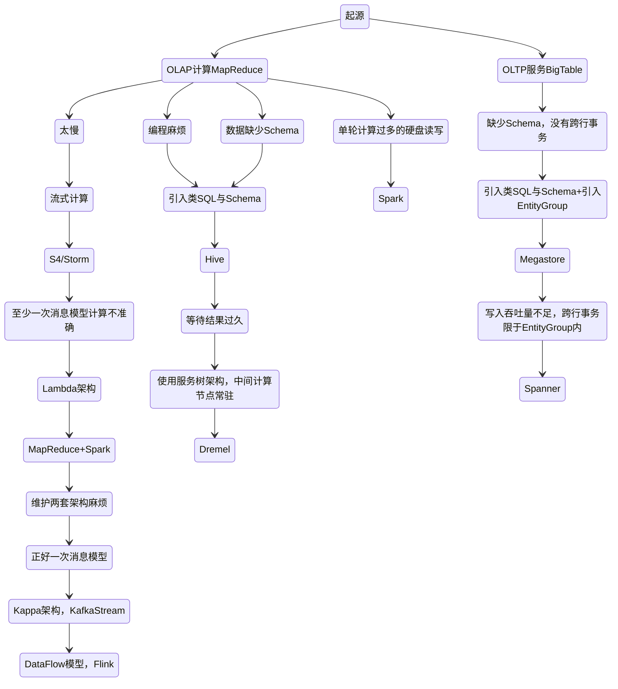
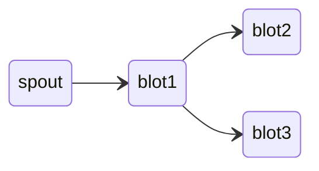
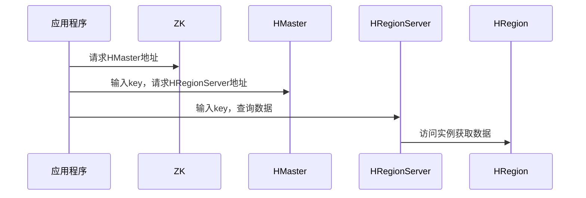

# 大数据

- 数据采集：Flume 、Logstash、Kibana 等
- 数据存储： HBase
- 批处理：Hadoop MapReduce、Spark、Flink 
- 流处理：Storm、Spark Streaming、Flink Streaming

## 计算向存储移动

1. 大规模数据存储在服务器集群的所有服务器上
2. 分布式启动若干任务执行进程
3. 分布式计算编程模型：MapReduce、RDD等，上传代码到各台服务器上
4. 服务器执行代码，代码读取数据进行分布式计算与合并结果

## 特点

4V：

- Volume 大量
- Velocity 高速
- Variety 多样
- Value 低价值密度

## 大数据生态体系

### 大数据生态演化

### Hive

它可以将结构化的数据文件映射成表，并提供类 SQL 查询功能，但受限于编程模型，一些诸如嵌套SQL等标准SQL的功能时不支持的

- 离线分析

### Spark

- Spark SQL 主要用于结构化数据的处理：支持以SQL语法查询各种数据源
- Spark Streaming：微批处理 达到类流处理
- MLlib：机器学习库
- Graphx：用于图形计算和图形并行计算的新组件

Spark 比 MapReduce 快的原因：更为简单的 RDD 编程模型减少了作业调度次数，以及优先使用内存

1. SparkContext 启动 DAGScheduler 构造执行的 DAG 图，拆分成计算任务
2. Driver 向 Cluster Manager 请求计算资源，分配 Worker
3. Worker 向 Driver 注册并下载代码执行

### Storm

- 实时流处理

### Flink

- 分布式的流处理框架，它能够对有界和无界的数据流进行高效的处理

### Hbase

- 构建在 Hadoop 文件系统之上的面向列的数据库管理系统

HRegion 是负责数据存储的主要进程，每个 HRegionServer 上可以启动多个 HRegion 实例，当一个 HRegion 中写入的数据太多，一个 HRegion 会分裂成两个，进行负载迁移

Phoenix：HBase 的开源 SQL 中间层

### Flume

- 数据收集系统，通常用于日志数据的收集

## 大数据平台

整合采集、使用与展示两端的差异，这就是大数据平台的使命

除了采集、处理、输出与展示三个主要模块之外，还需要一个任务调度系统来将三者整合起来，大数据平台上的其他系统一般都有成熟的开源软件可以选择，但是任务调度管理会涉及很多个性化的需求，通常需要团队自己开发

