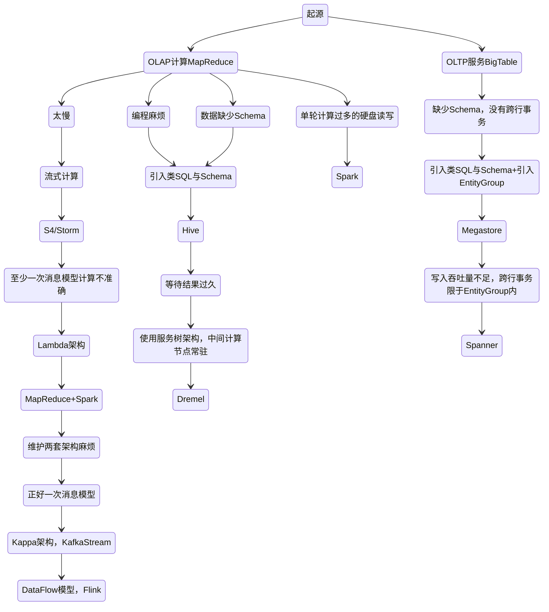
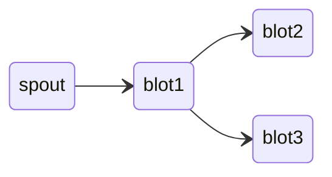
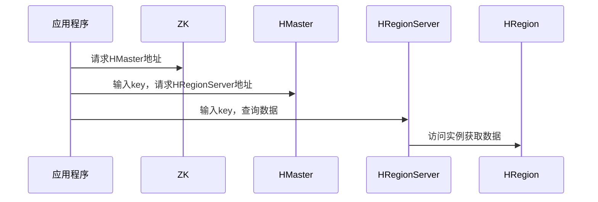
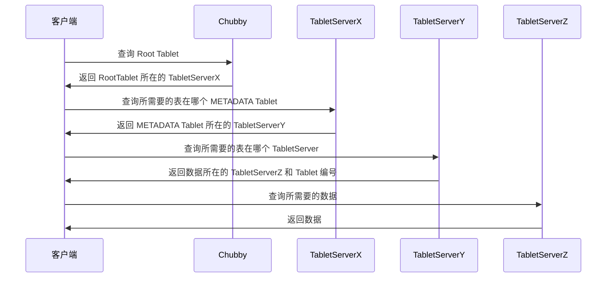
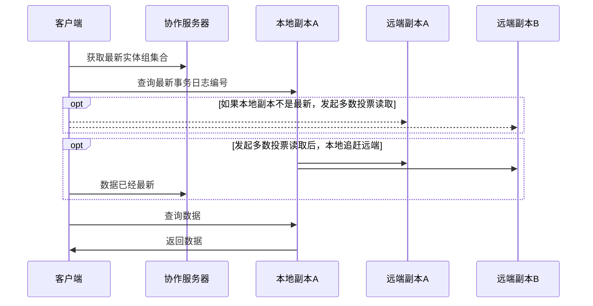

# 大数据


- 数据采集：Flume 、Logstash、Kibana 等
- 数据存储： HBase
- 批处理：Hadoop MapReduce、Spark、Flink 
- 流处理：Storm、Spark Streaming、Flink Streaming

## 计算向存储移动

1. 大规模数据存储在服务器集群的所有服务器上
2. 分布式启动若干任务执行进程
3. 分布式计算编程模型：MapReduce、RDD等，上传代码到各台服务器上
4. 服务器执行代码，代码读取数据进行分布式计算与合并结果

## 特点

4V：

- Volume 大量
- Velocity 高速
- Variety 多样
- Value 低价值密度

## 大数据生态体系


### 大数据生态演化



### Hive

它可以将结构化的数据文件映射成表，并提供类 SQL 查询功能，但受限于编程模型，一些诸如嵌套SQL等标准SQL的功能是不支持的

- 离线分析

Hive 通过一些中间层，数据行与HDFS之间可以进行转换：


Hive 通过数据分区的方式来避免在进行 SQL 查询的全表扫描，而且还能再根据列的哈希值，进一步分桶

整体架构：


编译器会把 HQL 编译成一个逻辑计划（Logical Plan），SELECT 里的字段需要通过 map 操作获取，也就是需要扫描表的数据。Group By 的语句需要通过 reduce 来做分组化简，而 Join 则需要两个前面操作的结果的合并

优化器会在必要时比如发现 JOIN 的 key 都是相同时对 MapReduce 进行优化：

```sql
SELECT A.user_id, MAX(B.user_interests_score), SUM(C.user_payments) 
FROM A 
LEFT JOIN B on A.user_id = B.user_id
LEFT JOIN C on A.user_id = C.user_id
GROUP BY A.user_id
```


Hive 的所有数据表的位置、结构、分区等信息都在 Metastore 里，通常是使用中心化的关系数据库来进行存储

### Spark

- Spark SQL 主要用于结构化数据的处理：支持以SQL语法查询各种数据源
- Spark Streaming：微批处理 达到类流处理
- MLlib：机器学习库
- Graphx：用于图形计算和图形并行计算的新组件

Spark 比 MapReduce 快的原因：更为简单的 RDD 编程模型减少了作业调度次数，以及优先使用内存


1. SparkContext 启动 DAGScheduler 构造执行的 DAG 图，拆分成计算任务
2. Driver 向 Cluster Manager 请求计算资源，分配 Worker
3. Worker 向 Driver 注册并下载代码执行

### Storm

- 实时流处理



### Flink

- 分布式的流处理框架，它能够对有界和无界的数据流进行高效的处理

### Hbase

- 构建在 Hadoop 文件系统之上的面向列的数据库管理系统


HRegion 是负责数据存储的主要进程，每个 HRegionServer 上可以启动多个 HRegion 实例，当一个 HRegion 中写入的数据太多，一个 HRegion 会分裂成两个，进行负载迁移



Phoenix：HBase 的开源 SQL 中间层

#### BigTable

基本数据模型：

- 一条数据里面有一个行键（Row Key），也就是这条数据的主键
- 每一行里的数据需要指定一些列族（Column Family），每一条数据都可以有属于自己的列，每一行数据的列也可以完全不一样
- 列下面如果有值的话，可以存储多个版本，不同版本都会存上对应版本的时间戳（Timestamp），你可以指定保留最近的 N 个版本


数据分区：

采用了动态区间分区的方式，按照行键排好序，然后按照连续的行键一段段地分区，随着数据的大小自动进行分裂或者合并


- Tablet Server：实际提供数据读写服务的，会分配到 10 到 1000 个 Tablets（分区），Tablet Server 就去负责这些 Tablets 的读写请求，并且在单个 Tablet 太大的时候，对它们进行分裂
- Master：负责分区分配、对每个 Tablet Server 进行负载调度、检测 Tablet Server 的新增和过期、对于 GFS 上的数据进行GC、管理表（Table）和列族的 Schema 变更
- Chubby：Master 选主、存储 Bigtable 数据的引导位置、发现 Tablet Servers 以及在它们终止之后完成清理工作、存储 Schema 信息、存储 ACL 访问权限

数据读写：

分区和 Tablets 的分配信息存放在了 Bigtable 的一张 METADATA 表，通过 Chubby 的引导，客户端可以实现不经过 Master 就能读取这些元数据




用了三次网络查询，找到了想要查询的数据的具体位置，然后再发起一次请求拿到最终的实际数据，一般会把前三次查询位置结果缓存起来，以减少往返的网络查询次数。而对于整个 METADATA 表来说，会把它们保留在内存里，减少对 GFS 的访问

查询 Tablets 在哪里这件事情，尽可能地被分摊到了 Bigtable 的整个集群，即使 Master 挂掉了，也不影响读写

调度：

Master 通过监听 Chubby 的目录，TabletServer 上线会向这个目录注册，这样就能发现有没有新的 TabletServer 可以用了，TabletServer 通过对锁的独占来确定自己是否还为自己分配到的 Tablets 服务，如果 TabletServer 下线了，这些 Tablets 都需要重新分配，Master 如果发现 TabletServer 下线了，则会自己去尝试获取一下这个锁，如果获取得到，一切正常，就对 TabletServer 进行清退，如果 Master 发现自己跟 Chubby 连接有问题，就选择自杀，以避免脑裂


Bigtable 为了在不可靠跟全是机械硬盘的 GFS 上面做到高性能的随机读写，没有在 GFS 上进行任何的随机写入，这是通过 [LSM树](/中间件/数据库/索引.md#LSM树)来实现通过顺序的写实现随机的写

由于 LSM树查询需要遍历所有的 SSTable直至找到所需要的key，为了提升查询效率， BigTable 有几个手段：

- 定期在后台合并 SSTable，以减少读请求需要访问的 SSTable 的数量
- 通过在内存里缓存 BloomFilter 过滤掉不存在于 SSTable 中的 key
- 通过 Scan Cache 和 Block Cache 两层缓存，利用局部性原理，使得查询结果可以在缓存中找到
  - Scan Cache：针对某个 key 的结果的缓存
  - Block Cache：查询某个 key ，与该 key 在同一个数据块的全部数据缓存

#### Megastore

Megastore 是直接在多个数据中心里，采用 Paxos 同步写入数据，是一个同步复制所有的数据库日志，但是没有主从区分的系统

实际应用层面，对于“可串行化”以及“可线性化”的需求并不是全局的，而是可以分区的，分区内的事务是可以保证的


分区之间通过数据同步来达到最终一致性，也可以通过重量级的两阶段提交来实现事务


索引机制：


- Megastore 可以通过一个 STORING 语句，指定索引里存储下对应的数据记录的某一个字段的值，这样就不会回表查询，相比单体数据库不仅少了磁盘读，还少了一次网络往返
- 可以为 repeated 类型的字段建立索引（Repeated Indexes）
- 内联索引（Inline Indexes）的支持


索引的实现，也是BigTable中的一条条记录：


事务：

Megastore 利用 BigTable 会维护多版本数据的特性，使用时间戳作为版本号，实现了 MVCC 

- 读（Read）：我们先要获取到时间戳，以及最后一次提交的事务的日志的位置
- 应用层的逻辑（Application Logic）：我们要从 Bigtable 读取数据，并且把所有需要的写操作，收集到一条日志记录（log entry）中
- 提交事务（Commit）：通过 Paxos 算法，我们要和其他数据中心对应的副本，达成一致，把这个日志记录追加到日志的最后
- 应用事务（Apply）：也就是把实际对于实体和索引的修改，写入到 Bigtable 里
- 清理工作（Clean UP）：也就是把不需要的数据删除掉。

确保数据的可线性化：

1. 每一次读都需要能够观察到最后一次被确认的写入
2. 一旦一个写入被观察到了，所有未来的读取都能观察到这个写入

为了能快速且一致地读取数据，快速读：

1. 查询本地的协同服务器，协同服务器用来追踪一个当前数据中心的副本里，已经观察到的最新的实体组的集合，类似于 Kafka 的 ISR
2. 根据查询的结果，来判断是从本地副本还是其他数据中心的副本，找到最新的事务日志位置，这个日志位置就是一个编号，由于这个编号是存在 BigTable 里面的
3. 根据协同服务器的结果，判断本地副本是不是最新的，如果不是，本地副本就要进行一个追赶共识，也就是通过 Paxos 去达成数据的一致性
4. 然后就可以查询数据了



快速写：

写入数据之前，客户端会先“读”一次数据，确保能够拿到下一次事务日志位置、最后一次写入数据的时间戳，以及哪一个副本在上次一次 Paxos 算法的时候，被确定是整个集群的 Leader

1. Accept Leader 阶段：直接向 Leader 副本发起一个 Accept 请求，如果被接受了，则跳到第3步
2. 如果第 1 步失败了，正常走一个 Paxos 算法的流程，向所有的副本，发起一个 Prepare 请求，编号是当前客户端的最大编号 + 1
3. Accept 阶段：所有副本都去接收客户端发起的提案
4. 向所有没有 Accept 最新的值的副本，发起一个 Invalidate 的请求
5. Apply 阶段：客户端会让尽可能多的副本，去把实际修改应用到数据库里

Megastore 对于每一个数据中心的副本有三种类型：

1. 完全副本
2. 见证者副本：只参与投票，并且记录事务日志。但是它不会保留实际的数据库数据
3. 只读副本：异步复制的数据副本

### Flume

- 数据收集系统，通常用于日志数据的收集


## 大数据平台


整合采集、使用与展示两端的差异，这就是大数据平台的使命

除了采集、处理、输出与展示三个主要模块之外，还需要一个任务调度系统来将三者整合起来，大数据平台上的其他系统一般都有成熟的开源软件可以选择，但是任务调度管理会涉及很多个性化的需求，通常需要团队自己开发

