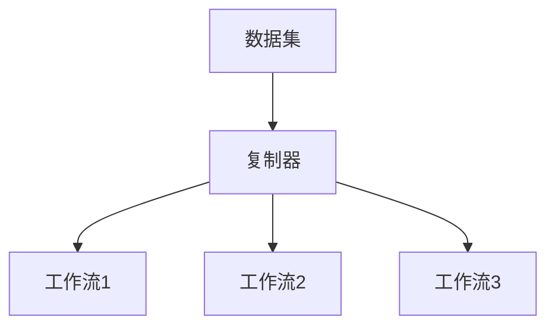
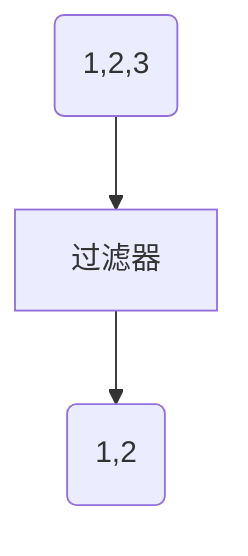
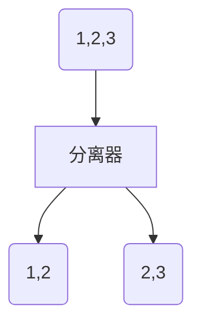
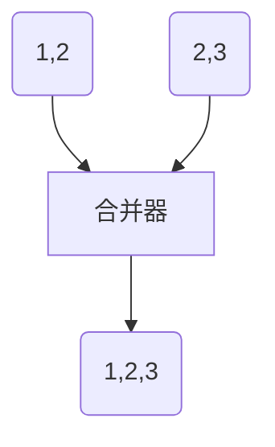
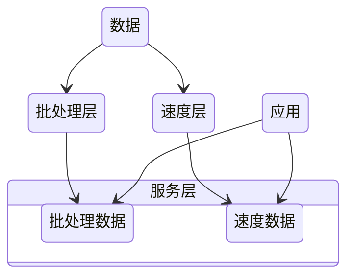
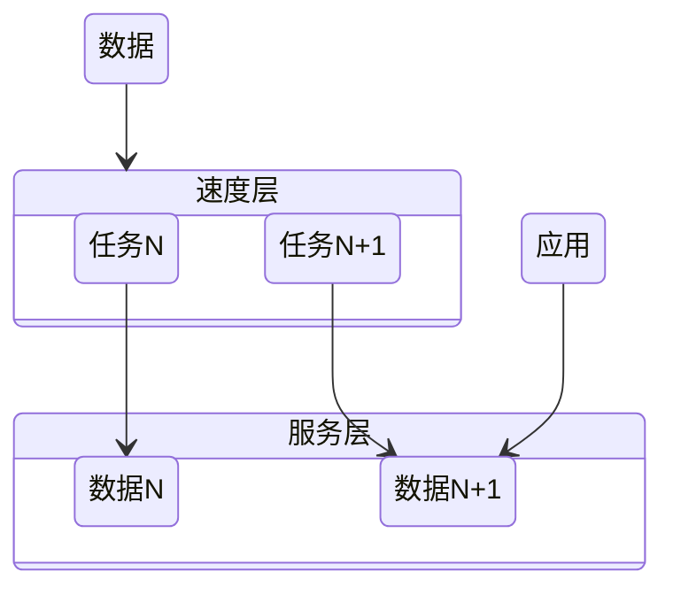

# 大规模数据处理

## MapReduce的不足

- 抽象层次不足，太原始
- 维护成本：每一步的 MapReduce 都有可能出错，为了这些异常处理，就需要协调系统，协调系统又是一个复杂度的来源
- 时间性能：对 MapReduce 的配置细节不理解，难以发挥其高性能，每一步计算都要进行硬盘的读取和写入
- 只支持批处理

需要的：

1. 一种技术抽象让多步骤数据处理变得易于维护
2. 不要复杂的配置，需要能自动进行性能优化
3. 要能把数据处理的描述语言，与背后的运行引擎解耦合开来
4. 要统一批处理和流处理的编程模型
5. 要在架构层面提供异常处理和数据监控的能力

## [批处理与流处理](/软件工程/架构/数据系统.md#数据集成)

## 模式

### Workflow

#### 复制模式

#### 过滤模式

#### 分离模式

#### 合并模式

### [发布订阅](/软件工程/设计模式/行为模式.md#观察者)

## 架构

### Lambda

完整的数据集 = λ (实时数据) * λ (历史数据)

- 批处理层通过处理所有的已有历史数据来实现数据的准确性，是基于完整的数据集来重新计算的
- 速度层通过流处理，提供最新数据的实时视图来最小化延迟

### Kappa

- 一个可以重跑历史数据的消息队列

## Spark

### RDD

- 弹性分布式数据集（Resilient Distributed Dataset）

分区：同一个 RDD 包含的数据被存储在系统的不同节点中，需要读取时根据ID 和分区的 index 可以唯一确定对应数据块的编号，从而通过底层存储层的接口中提取到数据进行处理

不可变：一个 RDD 都是只读的，只可以对现有的 RDD 进行转换（Transformation）操作，得到新的 RDD 作为中间计算的结果

并行：由于上面两个特性，就可以并行对 RDD 进行操作

#### 结构

SparkContext：所有 Spark 功能的入口，它代表了与 Spark 节点的连接，一个线程只有一个 SparkContext

SparkConf： 一些参数配置信息

Partitions：数据的逻辑结构，每个 Partition 会映射到某个节点内存或硬盘的一个数据块

Dependencies：每一步产生的 RDD 里都会存储它的依赖关系，即它是通过哪个 RDD 经过哪个转换操作得到的

窄依赖允许子 RDD 的每个分区可以被并行处理产生，而宽依赖则必须等父 RDD 的所有分区都被计算好之后才能开始处理

Checkpoint：对于一些计算过程比较耗时的 RDD，可以进行持久化，标记这个 RDD 有被检查点处理过，并且清空它的所有依赖关系，这样在进行崩溃恢复的时候就不用在向前向父 RDD 回溯

Storage Level：记录 RDD 持久化时的存储级别，内存或内存硬盘 或在分区节点上内存、内存硬盘

Iterator：迭代函数，Compute：计算函数 都是用来表示 RDD 怎样通过父 RDD 计算得到的

#### 数据操作

大部分操作跟[Stream](/编程语言/JAVA/高级/Stream流.md)差不多

- 转换（Transformation）：把一个 RDD 转换成另一个 RDD map、filter、mapPartitions，groupByKey
- 动作（Action）：通过计算返回一个结果 collect、reduce、count，countByKey
