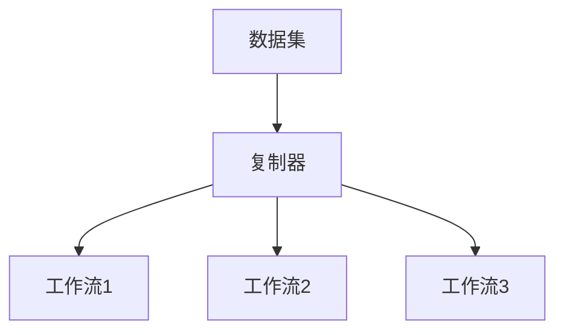
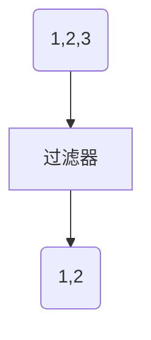
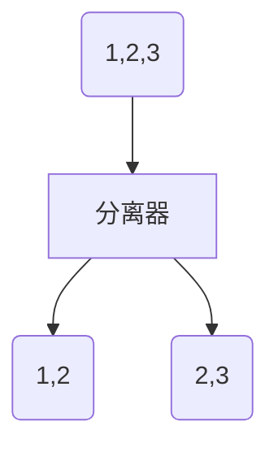
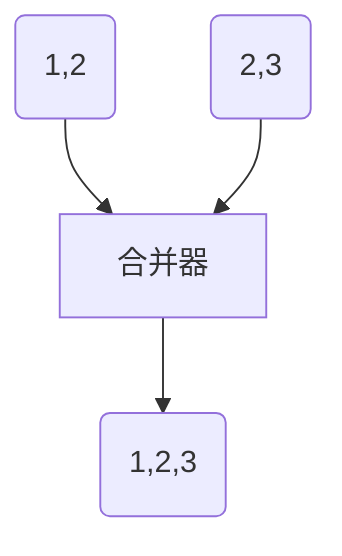

# 大规模数据处理

## MapReduce的不足

- 维护成本：每一步的 MapReduce 都有可能出错，为了这些异常处理，就需要协调系统，协调系统又是一个复杂度的来源
- 时间性能：对 MapReduce 的配置细节不理解，难以发挥其高性能

需要的：

1. 一种技术抽象让多步骤数据处理变得易于维护
2. 不要复杂的配置，需要能自动进行性能优化
3. 要能把数据处理的描述语言，与背后的运行引擎解耦合开来
4. 要统一批处理和流处理的编程模型
5. 要在架构层面提供异常处理和数据监控的能力

## [批处理与流处理](/软件工程/架构/数据系统.md#数据集成)

## 模式

### Workflow

#### 复制模式

#### 过滤模式

#### 分离模式

#### 合并模式

