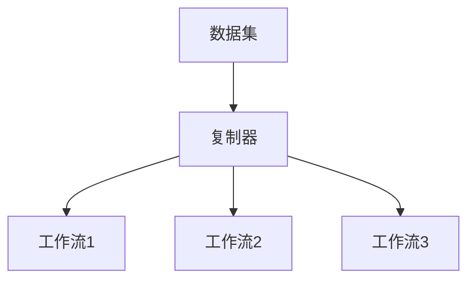
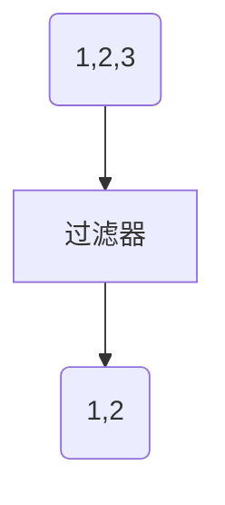
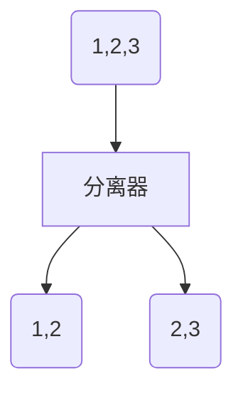
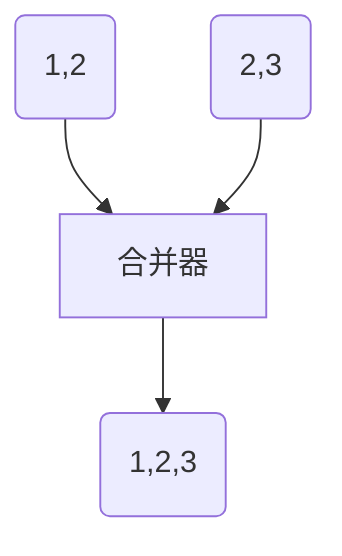
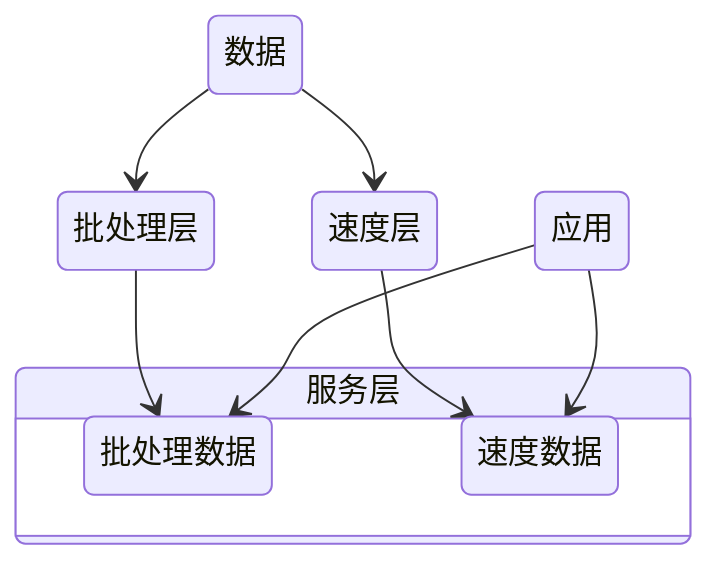
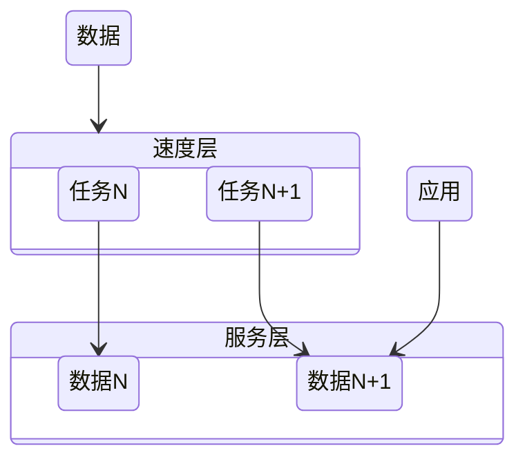
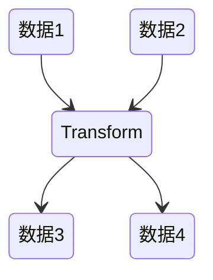
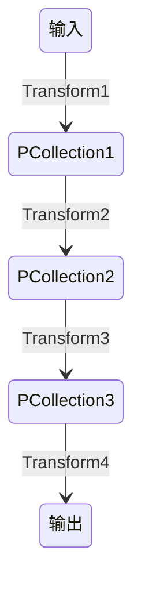

# 大规模数据处理

## MapReduce的不足

- 抽象层次不足，太原始
- 维护成本：每一步的 MapReduce 都有可能出错，为了这些异常处理，就需要协调系统，协调系统又是一个复杂度的来源
- 时间性能：对 MapReduce 的配置细节不理解，难以发挥其高性能，每一步计算都要进行硬盘的读取和写入
- 只支持批处理

需要的：

1. 一种技术抽象让多步骤数据处理变得易于维护
2. 不要复杂的配置，需要能自动进行性能优化
3. 要能把数据处理的描述语言，与背后的运行引擎解耦合开来
4. 要统一批处理和流处理的编程模型
5. 要在架构层面提供异常处理和数据监控的能力


## [批处理与流处理](/软件工程/架构/数据系统.md#数据集成)

## 模式

### Workflow

#### 复制模式



#### 过滤模式



#### 分离模式



#### 合并模式



### [发布订阅](/软件工程/设计模式/行为模式.md#观察者)

## 架构

### Lambda

完整的数据集 = λ (实时数据) * λ (历史数据)



- 批处理层通过处理所有的已有历史数据来实现数据的准确性，是基于完整的数据集来重新计算的
- 速度层通过流处理，提供最新数据的实时视图来最小化延迟

### Kappa



- 一个可以重跑历史数据的消息队列

## Spark

- Spark SQL 主要用于结构化数据的处理：支持以SQL语法查询各种数据源
- Spark Streaming：微批处理 达到类流处理
- MLlib：机器学习库
- Graphx：用于图形计算和图形并行计算的新组件

Spark 比 MapReduce 快的原因：更为简单的 RDD 编程模型减少了作业调度次数，以及优先使用内存


1. SparkContext 启动 DAGScheduler 构造执行的 DAG 图，拆分成计算任务
2. Driver 向 Cluster Manager 请求计算资源，分配 Worker
3. Worker 向 Driver 注册并下载代码执行

### RDD

- 弹性分布式数据集（Resilient Distributed Dataset）

分区：同一个 RDD 包含的数据被存储在系统的不同节点中，需要读取时根据ID 和分区的 index 可以唯一确定对应数据块的编号，从而通过底层存储层的接口中提取到数据进行处理

不可变：一个 RDD 都是只读的，只可以对现有的 RDD 进行转换（Transformation）操作，得到新的 RDD 作为中间计算的结果

并行：由于上面两个特性，就可以并行对 RDD 进行操作

#### 结构

SparkContext：所有 Spark 功能的入口，它代表了与 Spark 节点的连接，一个线程只有一个 SparkContext

SparkConf： 一些参数配置信息

Partitions：数据的逻辑结构，每个 Partition 会映射到某个节点内存或硬盘的一个数据块

Dependencies：每一步产生的 RDD 里都会存储它的依赖关系，即它是通过哪个 RDD 经过哪个转换操作得到的


窄依赖允许子 RDD 的每个分区可以被并行处理产生，而宽依赖则必须等父 RDD 的所有分区都被计算好之后才能开始处理

Checkpoint：对于一些计算过程比较耗时的 RDD，可以进行持久化，标记这个 RDD 有被检查点处理过，并且清空它的所有依赖关系，这样在进行崩溃恢复的时候就不用在向前向父 RDD 回溯

Storage Level：记录 RDD 持久化时的存储级别，内存或内存硬盘 或在分区节点上内存、内存硬盘

Iterator：迭代函数，Compute：计算函数 都是用来表示 RDD 怎样通过父 RDD 计算得到的

#### 数据操作

大部分操作跟[Stream](/编程语言/JAVA/高级/Stream流.md)差不多

- 转换（Transformation）：把一个 RDD 转换成另一个 RDD map、filter、mapPartitions，groupByKey
- 动作（Action）：通过计算返回一个结果 collect、reduce、count，countByKey

### 调度系统


1. DAGScheduler 以 Shuffle 为边界，将开发者设计的计算图 DAG 拆分为多个执行阶段 Stages，然后为每个 Stage 创建任务集 TaskSet
2. SchedulerBackend 通过与 Executors 中的 ExecutorBackend 的交互来实时地获取集群中可用的计算资源，并将这些信息记录到 ExecutorDataMap 数据结构
3. 与此同时，SchedulerBackend 根据 ExecutorDataMap 中可用资源创建 WorkerOffer，以 WorkerOffer 为粒度提供计算资源
4. 对于给定 WorkerOffer，TaskScheduler 结合 TaskSet 中任务的本地性倾向，按照 PROCESS_LOCAL、NODE_LOCAL、RACK_LOCAL 和 ANY 的顺序，依次对 TaskSet 中的任务进行遍历，优先调度本地性倾向要求苛刻的 Task
5. 被选中的 Task 由 TaskScheduler 传递给 SchedulerBackend，再由 SchedulerBackend 分发到 Executors 中的 ExecutorBackend。Executors 接收到 Task 之后，即调用本地线程池来执行分布式任务。

### SparkSQL


#### DataSet

DataSet 所描述的数据都被组织到有名字的列中，就像关系型数据库中的表一样


#### DataFrame

可以被看作是一种特殊的 DataSet，但是它的每一列并不存储类型信息，所以在编译时并不能发现类型错误

### SparkStreaming

Spark Streaming 用时间片拆分了无限的数据流，然后对每一个数据片用类似于批处理的方法进行处理，输出的数据也是一块一块的，通过提供了一个对于流数据的抽象 DStream 来描述数据流，底层 DStream 也是由很多个序列化的 RDD 构成，按时间片（比如一秒）切分成的每个数据单位都是一个 RDD


主要缺点是实时计算延迟较高，这是由于 Spark Streaming 不支持太小的批处理的时间间隔

### StructuredStreaming

输入的数据流按照时间间隔（以一秒为例）划分成数据段。每一秒都会把新输入的数据添加到表中，Spark 也会每秒更新输出结果。输出结果也是表的形式，输出表可以写入硬盘或者 HDFS。


Structured Streaming 提供一个 level 更高的 API，这样的数据抽象可以让开发者用一套统一的方案去处理批处理和流处理

相比 SparkStreaming，StructuredStreaming可以支持更小的时间间隔，2.3 也引入了连续处理模式，同时也有对事件时间的支持

## Flink

### 架构


### 核心模型

最核心的数据结构是 Stream，它代表一个运行在多个分区上的并行流

当一个 Flink 程序被执行的时候，它会被映射为 Streaming Dataflow：


程序天生是并行和分布式的。一个 Stream 可以包含多个分区（Stream Partitions），一个操作符可以被分成多个操作符子任务，每一个子任务是在不同的线程或者不同的机器节点中独立执行的：


## Beam

一个适配流处理、批处理的中间层

### 编程模型

- 窗口：将无边界数据根据事件时间分成了一个个有限的数据集
- 水位线：来表示与数据事件时间相关联的输入完整性的概念，用来测量数据进度
- 触发器：指的是表示在具体什么时候，数据处理逻辑会真正地触发窗口中的数据被计算
- 累加模式：如果在同一窗口中得到多个运算结果，我们应该如何处理这些运算结果

### PCollection

- Parallel Collection，意思是可并行计算的数据集

特性：

- 需要编码器：需要将你的数据序列化/反序列化以在网络上传输
- 无序：以个 PCollection 被分配到不同的机器上执行，那么为了保证最大的处理输出，不同机器都是独立运行的，它的执行顺序就无从得知了
- 无界：Beam 要统一表达有界数据和无界数据，所以没有限制它的容量
- 不可变

### Transform



常见的 Transform 接口：

- ParDo：类似于flatMap
- GroupByKey：把一个 Key/Value 的数据集按 Key 归并

### Pipeline



分布式环境下，整个数据流水线会启动 N 个 Workers 来同时处理 PCollection，在具体处理某一个特定 Transform 的时候，数据流水线会将这个 Transform 的输入数据集 PCollection 里面的元素分割成不同的 Bundle，将这些 Bundle 分发给不同的 Worker 来处理

在单个 Transfrom中，如果某一个 Bundle 里面的元素因为任意原因导致处理失败了，则这整个 Bundle 里的元素都必须重新处理

在多步骤的 Transform 上，如果处理的一个 Bundle 元素发生错误了，则这个元素所在的整个 Bundle 以及与这个 Bundle 有关联的所有 Bundle 都必须重新处理

### IO

- XXIO.read()
- XXIO.write()

## StreamingSQL

```sql
/* 窗口：最近10个温度的平均值 */
Select bid, avg(t) as T From BoilerStream WINDOW HOPPING (SIZE 10, ADVANCE BY 1);
/* join */
from TempStream[temp > 30.0]#window.time(1 min) as T
  join RegulatorStream[isOn == false]#window.length(1) as R
  on T.roomNo == R.roomNo
select T.roomNo, R.deviceID, 'start' as action
insert into RegulatorActionStream; // Siddhi Streaming SQL
/*  某个模式有没有在特定的时间段内发生 */
from every( e1=TempStream ) -> e2=TempStream[ e1.roomNo == roomNo and (e1.temp + 5) <= temp ]
    within 10 min
select e1.roomNo, e1.temp as initialTemp, e2.temp as finalTemp
insert into AlertStream;
```
