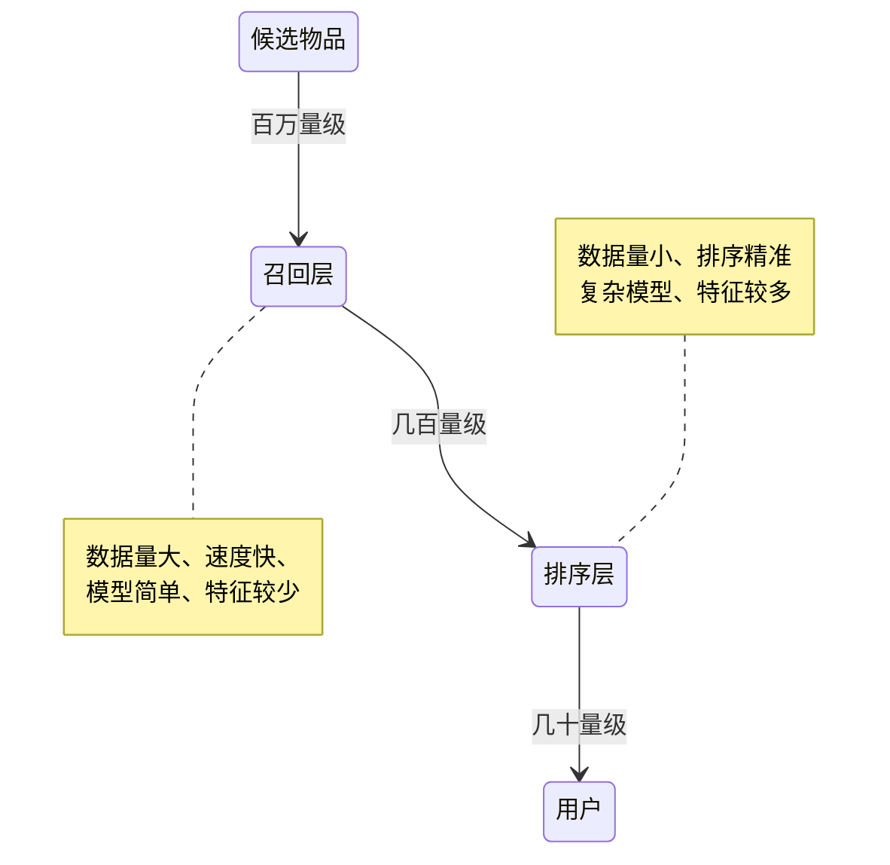

# 推荐系统

> 一种信息过滤系统，手段是预测用户（User）对物品（Item）的评分和偏好

- 能做什么：把那些最终会在用户（User）和物品（Item）之间产生的连接提前找出来
- 需要什么：根据存在的连接，从已有的连接去预测未来的连接
- 怎么做：机器推荐与人工推荐

## 问题

### 模型

1. 评分预测 假如用户消费完一个物品之后会给出一个打分，能不能提前预测一个用户对每一个物品会打多少分，找出那些他可能会打高分的物品，推荐给他
2. 行为预测 利用隐式反馈数据预测隐式反馈的发生概率

评分预测的问题在于评分比较难收集，并且评分更偏主观，这种主动告知评分称之为显式反馈，与之相对的还有隐式反馈，通常根据各类用户行为对物品进行打分

隐式反馈能收集的数据更多，并且更代表用户的真实想法，常常和模型的目标函数关联更密切

### 顽疾

1. 冷启动 缺乏相关数据的用户和物品，很难直接加入到推荐系统
2. 探索与利用 EE 问题，已知用户喜好，如何给他推荐
3. 安全问题 推荐系统攻击问题，不靠谱的推荐、难以消除的脏数据、损害商业利益

## 特性

- 不确定性
- 追求的是目标的增长

## 内容推荐

- 内容源：推荐系统必须有源源不断的新鲜数据
- 内容分析：主要是为了结构化内容库，以及产出内容分析模型
- 内容推荐算法：最基本的就是基于向量的相似度算法，更复杂的则是基于机器学习的算法

### 用户画像

- 对用户信息的向量化表示，是构建推荐系统的过程中产生的一个关键环节的副产品

#### 关键因素

1. 维度
2. 维度的量化

这两个关键因素很主观，取决于设计者

#### 构建方法

1. 直接使用原始数据作为用户画像的内容，对于用户冷启动等场景非常有用
2. 通过统计手段从历史数据挖掘出标签
3. 机器学习，提炼出人类无法理解也无法解释的稠密向量

#### 文本构建用户画像

1. 把所有非结构化的文本结构化，去粗取精，保留关键信息
2. 根据用户行为数据把物品的结构化结果传递给用户，与用户自己的结构化信息合并

结构化文本的方法：

1. [TF-IDF](/数据技术/检索技术.md#TF-IDF%2d算法)
2. TextRank
3. 内容分类 SVM算法
4. 命名实体识别 进行NLP，分词后识别为定义的命名实体集合之一，可以用提前准备好的实体字典来识别
5. 文本[聚类](/数据技术/数据挖掘.md#聚类)
6. 词嵌入 除了 LDA，其他都是得到一些标签，而这些标签无一例外都是稀疏的，而词嵌入则能够为每一个词学习得到一个稠密的向量
   1. Word2Vec

选择标签：

- [卡方检验和信息增益](/数学/概率论与数理统计.md#特征选择)

## 近邻推荐

### 协同过滤

- 基于记忆的协同过滤（Memory-Based）
- 基于模型的协同过滤（Model-Based）

假设已知物品特征为$X(x^{(1)},x^{(2)},...,x^{(n)})$，用户喜欢的物品特征为$W(w^{(1)},w^{(2)},...,w^{(n)})$，那么对于一个物品i，求出用户j对它可能喜欢的程度可以定义为

$$
W^{(j)}\cdot X^{(i)} + b^{(i)}
$$

就可以通过求该回归的代价函数求出w与b，i:r(i,j) 只对用户评过分的物品进行计算：

$$
\mathbf{J}\big(w^{(j)},b^{(j)}\big)=\frac{1}{2}\sum_{i:r(i,j)=1}\big(w^{(j)}\cdot x^{(i)}+b^{(j)}-y^{(i,j)}\big)^{2}+\frac{\lambda}{2}\sum_{k=1}^{n}\big(w_{k}^{(j)}\big)^{2}\\
$$

如果没有物品的特征，那么对于代价函数，我们还需要再多求一个物品的特征$X$

$$
\mathbf{J}\big(w^{(j)},b^{(j)},x^{(i)}\big)=\frac{1}{2}\sum_{i:r(i,j)=1}\big(w^{(j)}\cdot x^{(i)}+b^{(j)}-y^{(i,j)}\big)^{2}+\begin{aligned}\frac{\lambda}{2}\sum_{j=1}^{n_{u}}\sum_{k=1}^{n}\left(w_{k}^{(j)}\right)^2+\frac{\lambda}{2}\sum_{i=1}^{n_{m}}\sum_{k=1}^{n}\left(x_{k}^{(i)}\right)^2\end{aligned}
$$

对代价函数进行梯度下降，这样对于每个用户，都有自己的参数W,b了。同时物品的特征也求出来了

如果对于物品的评价是 0 1 二进制标签，则需要对代价函数做个调整：

$$
J(w,b,x)=\sum_{(i,j):r(i,j)=1}L(f_{(w,b,x)}(x),y^{(i,j)})\\
L\left(f_{\{w,b,x\}}(x),y^{(ij)}\right)=-y^{(i,j)}\log\left(f_{(w,b,x)}(x)\right)-(1-y^{(i,j)})\log\left(1-f_{\{w,b,x\}}(x)\right)
$$

#### 均值归一化

$$
Y=\begin{bmatrix}5&5&0&0&?\\5&?&?&0&?\\?&4&0&?&?\\0&0&5&4&?\\0&0&5&0&?\end{bmatrix}\quad\mu=\begin{bmatrix}2.5\\2.5\\2\\2.25\\1.25\end{bmatrix}\rightarrow Y=\begin{bmatrix}2.5&2.5&-2.5&-2.5&?\\2.5&?&?&-2.5&?\\?&2&-2&?&?\\-2.25&-2.25&2.75&1.75&?\\-1.25&-1.25&3.75&-1.25&?\end{bmatrix}
$$

将用户的评分减去均值，预测时，线性回归就变成 $w^{(j)} + x^{(i)} + b^{(j)} = \mu_i$

它将促使对新用户的评分预测会更偏向于其他用户的平均值

#### 基于用户

> 将用户的喜欢的物品转为向量，通过向量计算与用户之间的相似度

一些工程上的问题：

1. 相似度计算，如果物品很多，即向量很长，为了降低复杂度，有两种方法
   1. 对向量采样计算 随机选取n个维度来计算
   2. 向量运算
2. 如果用户量很大，两两之间计算代价就很大，这个时候就需要引入Map Reduce之类的并行计算来加快速度
3. 推荐计算：为每一个用户计算每一个物品的推荐分数，优化方式是只有相似用户喜欢过的物品需要计算，另外一个就是并行计算
4. 权重，一般来说，热门、过期的物品，权重值越低

#### 基于物品

> 首先计算相似物品，然后再根据用户消费过、或者正在消费的物品为其推荐相似的

设某个物品的特征向量为$X[x_1,x_2,x_3,...x_n]$，用户的偏好向量为$W[w_1,w_2,w_3...w_n]$，要求用户对该物品的喜欢程度就是$W\cdot X$

需要做的就是把用户的特征向量转为用户的偏好向量，把两个不同维度的向量转为统一维度的向量，并进行组合：

使用以下代价函数促使神经网络找到合适的路，以根据用户特征向量及物品特征向量预测用户喜欢物品的可能性

$$
J=\sum_{(i,j):r(i,j)=1}(v_u^{(j)}\cdot v_m^{(i)}-y^{(i,j)})^2\color{red}{+\text{NN regularization term}}
$$

相似度算法改进：

1. 物品中心化。把矩阵中的分数，减去的是物品分数的均值，可以去掉评分中的非理性因素
2. 用户中心化。把矩阵中的分数，减去对应用户分数的均值，一定程度上仅仅保留了偏好，去掉了主观成分

推荐结果：

1. 计算用户对所有物品的喜欢度，进行TOPK推荐
2. 相关推荐

**Slope One 算法**

#### 相似度算法

- [向量距离](/数学/线性代数.md#距离)

欧式距离度量的是空间中两个点的绝对差异，适用于分析用户能力模型之间的差异，比如消费能力、贡献内容的能力

余弦相似度则是对两个向量进行归一化处理，对绝对值不敏感

皮尔逊相关度度量的是两个变量的变化趋势是否一致，所以不适合用作计算布尔值向量之间相关度

杰卡德（Jaccard）相似度：两个集合的交集元素个数在并集中所占的比例，适合用于隐式反馈数据

#### 局限性

- 冷启动问题：没有用户的评价数据初期很难过，对于很少进行评价的用户如何对其推荐
- 无法很好地利用用户特征

## 矩阵分解

近邻模型的问题：

1. 物品之间存在相关性，信息量并不随着向量维度增加而线性增加
2. 矩阵元素稀疏，计算结果不稳定

矩阵分解，直观上说来简单，就是把原来的大矩阵，近似分解成两个小矩阵的乘积，在实际推荐计算时不再使用大矩阵，而是使用分解得到的两个小矩阵，也就是降维，[SVD](/数学/线性代数.md#SVD%20奇异值分解)是其中的一种算法

$$\min_{q^*,p^*}\sum_{(u,i)\in\kappa}(r_{ui}-p_uq_i^T)^2+\lambda(||q_i||^2+||p_u||^2)$$

整个 SVD 的学习过程就是：

1. 准备好用户物品的评分矩阵，每一条评分数据看做一条训练样本
2. 给分解后的 U 矩阵和 V 矩阵随机初始化元素值
3. 用 U 和 V 计算预测后的分数
4. 计算预测的分数和实际的分数误差
5. 按照梯度下降的方向更新 U 和 V 中的元素值
6. 重复步骤 3 到 5，直到达到停止条件

偏置信息：一个用户给一个物品的评分会由全局平均分、物品的评分偏置、用户评分的偏置、用户和物品之间的兴趣偏好四部分相加

历史行为：用户有过行为的物品集合也都有一个隐因子向量，维度是一样的。把用户操作过的物品隐因子向量加起来，用来表达用户的兴趣偏好。另外一个是用户属性，全都转换成 0-1 型的特征后，对每一个特征也假设都存在一个同样维度的隐因子向量，一个用户的所有属性对应的隐因子向量相加，也代表了他的一些偏好

时间因素：让久远的评分更趋近平均值、不同的时间区间内分别学习出隐因子向量

### 交替最小二乘

要把一个矩阵分解为两个矩阵的相似解：

1. 初始化随机矩阵 Q 里面的元素值
2. 把 Q 矩阵当做已知的，直接用线性代数的方法求得矩阵 P
3. 得到了矩阵 P 后，把 P 当做已知的，故技重施，回去求解矩阵 Q
4. 上面两个过程交替进行，一直到误差可以接受为止

加权交替最小二乘对待隐式反馈：

- 对物品无隐式反馈则认为评分是 0
- 用户对物品有至少一次隐式反馈则认为评分是 1，次数作为该评分的置信度

没有反馈的缺失值，就是在我们的设定下，取值为 0 的评分就非常多，就需要进行负样本采样

因此按照物品热门程度采样的思想就是：一个越热门的物品，用户越可能知道它的存在。那这种情况下，用户还没对它有反馈就表明：这很可能就是真正的负样本

得到了分解后的矩阵后，相当于每个用户得到了隐因子向量，这是一个稠密向量，用于代表他的兴趣，让用户和物品的隐因子向量两两相乘，计算点积就可以得到所有的推荐结果

### 贝叶斯个性化排序BPR

- 排序的评价指标：AUC，全称是 Area Under Curve，意思是曲线下的面积，这里的曲线就是 ROC 曲线

BPR做了三件事：

1. 一个样本构造方法
2. 一个模型目标函数
3. 一个模型学习框架

## 模型融合

推荐系统技术实现的三个阶段：

1. 挖掘：对用户和物品做非常深入的结构化分析
2. 召回：每次给一个用户计算推荐结果时，用一些手段从全量的物品中筛选出一部分
3. 排序

### 逻辑回归和梯度提升决策树组合

逻辑回归输出值范围就是 0 到 1 之间，是广义线性模型

树模型天然就可以肩负起特征组合的任务，最原始的是决策树，简称 DT

### 因子分解机模型

### Wide & Deep 模型

使用用户特征和上下文场景特征从物品库中召回候选推荐结果，比如得到 100 个物品，然后用融合模型对这 100 个物品做最终排序，输出给用户展示

同时开始记录展示日志和用户行为日志，再把收集到的日志和用户特征、上下文场景特征、物品特征拉平成为模型的训练数据，训练新的模型，再用于后面的推荐，如此周而复始

## MAB问题

- 多臂赌博机问题 (Multi-armed bandit problem, K-armed bandit problem, MAB)

如何选择

### Bandit算法

在冷启动和处理探索问题时，Bandit 算法简单好用

- 思想是：看看选择会带来多少遗憾，遗憾越少越好

小心翼翼地试，越确定某个选择好，就多选择它，越确定某个选择差，就越来越少选择它

1. 臂：每次推荐要选择候选池，可能是具体物品，也可能是推荐策略，也可能是物品类别
2. 回报：用户是否对推荐结果喜欢，喜欢了就是正面的回报，没有买账就是负面回报或者零回报
3. 环境：推荐系统面临的这个用户就是不可捉摸的环境

汤普森采样算法：假设每个臂背后都有一个概率分布，每次做选择时，让每个臂的概率分布各自独立产生一个随机数，按照这个随机数排序，输出产生最大随机数那个臂对应的物品

UCB算法（Upper Confidence Bound，即置信区间上界）：为每个臂评分，每次选择评分最高的候选臂输出，每次输出后观察用户反馈，回来更新候选臂的参数

Epsilon贪婪算法：朴素算法，先选一个 (0,1) 之间较小的数，每次以概率 Epsilon 从所有候选臂中随机选一个，以 1-Epsilon 的概率去选择平均收益最大的那个臂

LinUCB：选择时加入了特征，各个候选臂之间参数是独立的，参与计算的是特征，所以可以处理动态的推荐候选池

COFIBA 算法：-

## 深度学习

在推荐系统中更好地表达事物特征：

- x2vec

## 排行榜算法

防止刷榜、马太效应，同时需要一定的时效性，算法需要考虑时间因素、投票公平性：

### Hacker News 计算帖子热度

$$\frac{P-1}{(T + 2) ^ G}$$

1. P：得票数，去掉帖子作者自己投票
2. T：帖子距离现在的小时数，加上帖子发布到被转帖至 Hacker News 的平均时长
3. G：帖子热度的重力因子，重力因子越大，帖子的热度衰减越快

### 牛顿冷却定律

$$T(t) = H + Ce^{-αt}$$

1. H：为环境温度，可以认为是平均票数，由于不影响排序，可以不使用
2. C：为净剩票数，即时刻 t 物品已经得到的票数，也就是那个最朴素的统计量。
3. t：为物品存在时间，一般以小时为单位。
4. α ：是冷却系数，反映物品自然冷却的快慢

当投票数越多，冷却系数就可以越大，代表物品热度越高

### 考虑正负投票

- 同样多的总票数，支持赞成票多的
- 同样多的赞成票数，支持最有价值的

### 考虑偏好公平性

好评率估算公式，叫做威尔逊区间，公式太复杂，不写了

贝叶斯平均：

$$\frac{v}{v+m}R + \frac{m}{v+m}C$$

1. R，物品的平均得分
2. v，参与为这个物品评分的人数
3. m，全局平均每个物品的评分人数
4. C，全局平均每个物品的平均得分

这个公式的好处是：所有的物品，不论有多少人为它评分，都可以统一地计算出一个合理的平均分数

## 加权采样算法

已知一些样本及其对应的权重，如何进行召回才能保证概率与其权重一致

### 有限数据集

$$S_i = R^{\frac{1}{wi}}$$

1. wi 是每个样本的权重
2. R 是遍历每个样本时产生的 0 到 1 之间的随机数
3. Si 就是每个样本的采样分数

### 无限数据集

- [蓄水池采样](/数据技术/数据分析.md#数据抽样)

加权蓄水池采样：

1. 使用有限数据集采样的公式为每一个样本生成一个分数
2. 如果结果不足 k 个，直接保存到结果中
3. 如果结果中已经有 k 个了，如果 Si​ 比已有的结果里最小那个分数大，就替换它

## 去重

- simhash
- 布隆过滤器

## 常见架构

### 信息流

#### 整体架构

1. 日志收集，是所有排序训练的数据来源，要收集的最核心数据就是用户在信息流上产生的行为，用于机器学习更新排序模型
2. 内容发布，就是用推或者拉的模式把信息流的内容从源头发布到受众端
3. 机器学习，从收集的用户行为日志中训练模型，然后为每一个用户即将收到的信息流内容提供打分服务
4. 信息流服务，为信息流的展示前端提供 API
5. 监控，这是系统的运维标配，保证系统的安全和稳定等

#### 数据模型

内容，有个Atom 规范：

1. time 发生时间
2. actor 由谁发出
3. verb 连接的名字，显式floow，like或者隐式
4. object 动作作用到最主要的对象，只能有一个
5. target 动作的最终目标，与 verb 有关，可以没有。它对应英语中介词 to 后接的事物
6. title 动作的自然语言描述
7. summary 动作的视图，通常是一小段 HTML 代码，不是必须的

关系：

1. from 连接的发起方
2. to 被连接方
3. type 连接的类型
4. affinity 连接的强弱

连接的发起从 from 到 to，内容的流动从 to 到 from。连接 和 内容 是相互加强的，这是蛋和鸡的关系：有了内容，就会产生 连接，有了 连接，就可以“喂”（feed）给更多的 内容

#### 内容发布

- 推模式：当一个 actor 产生了一条 内容 后，不管受众在不在线，刷没刷新，都会立即将这条内容推送给相应的用户
- 拉模式：当用户访问时，信息流服务才会去相应的发布源拉取内容到自己的 feed 区来

一般都会两者相结合，拉模式在数据量大的情况下就会有瓶颈，而推模式一般会伴随着大量的写操作和数据冗余

#### 排序

信息流正常就是时间排序，如果要打破时间排序，要问问为什么要打破，唯一可以打破的理由就是通过某些排序能有效提高用户的互动率

#### 数据管道

要能通过历史数据来寻找算法的最优参数，又要能通过新的数据验证排序效果

### 推荐系统

层级 | 数据  | 服务  | 特点                                           | 约束                                        | 典型任务                                     | 举例
-- | --- | --- | -------------------------------------------- | ----------------------------------------- | ---------------------------------------- | -------------------------------------------------------------------------------------------------------------------------------
离线 | 非实时 | 非实时 | 1.可以处理大数据量 2.可以运行批量任务 3.低成本尝试多种算法 4.可加机器提升效率 | 1.无法及时捕获最新的用户兴趣 2.无法给用户最及时的推荐             | 1.批量机器学习算法 2.批量计算推荐结果 3.挖掘用户标签 4.物品的内容分析 | 1.矩阵分解，学习得到用户隐因子向量和物品隐因子向量 2.学习500棵GBDT决策树 3.以GBDT输出作为特征学习了LR模型参数。
近线 | 实时  | 非实时 | 1.能捕捉到用户最新兴趣 2.能运行较复杂的学习算法 3.能比较及时给用户响应      | 1.能处理的数据量有限 2.部分依赖离线计算结果 3.和离线无缝结合有一定的复杂度 | 1.用最新事件补充召回推荐结果 2.小批量样本更新模型参数            | 1.用户新评分的电影计算相似电影补进离线推荐结果 2.根据最新浏览提取新的标签补充到用户标签中
在线 | 实时  | 实时  | 1.对场景信息敏感 2.立即满足用户 3.运行简单算法和逻辑               | 1.响应时间是硬要求 2.要准备降级服务的推荐结果 3.计算复杂度有限       | 1.过滤逻辑 2.运营手段 3.融合排序 4.多样性提升             | 1.取出近线阶段的推荐电影,及物品的内容特征，用户特征 2.运行GBDT模型得到500个新特征，运行LR模型输出融合排序 3.过滤掉看过的，过滤掉已被删除的 4.根据多样性要求去掉高度相似的电影 5.强插-些当季运营活动需要的到指定位置 6.输出推荐结果

### 推荐、搜索、广告

项         | 搜索    | 推荐       | 广告
--------- | ----- | -------- | -----
信息送达方式    | 拉     | 推和拉      | 推
关注点       | 内容消费方 | 内容生成方消费方 | 内容生产方
是否期待惊喜    | 否     | 是        | 否
是否需要集体智慧  | 可能    | 可能       | 需要
是否需要query | 需要    | 可能       | 可能
否依赖上下文    | 可能    | 可能       | 可能

1. 过滤候选
   1. 搜索是从查询关键字中解析得到查询意图，以及结构化的搜索条件，再用结构化的查询条件从倒排索引中检索出排序候选
   2. 广告也是查询关键字去检索候选广告
   3. 基于内容的就和搜索一样，用标签检索候选，协同过滤则检索出相似物品来
2. 排序候选
   1. 搜索的排序目标是高相关性
   2. 推荐系统的排序要根据业务来决定
   3. 广告系统的排序更多是从经济学角度去看，如何做才符合更长远的利益
3. 个性化输出
   1. 最被推荐系统所看重
   2. 搜索的个性化需求相对来说松弛一些，常见的是利用地域等人口统计学体现个性化

## 模块

### 数据采集

用途：

1. 报表
2. 数据分析
3. 机器学习

#### 数据模型

矩阵|行|列|数据类型
-|-|-|-
人、属性矩阵|用户ID|属性|用户属性数据
物、属性矩阵|物品ID|属性|物品属性数据
人、人矩阵|用户ID|用户ID|关系数据
人、物矩阵|用户ID|物品ID|用户发生的所有行为和动作

#### 数据来源

- [埋点](/数据技术/埋点设计.md)

#### 事件元素

1. 用户ID
2. 物品ID
3. 事件名称
4. 发生时间

#### 架构

数据 -> 采集器 -> 消息队列 -> 实时计算框架 -> 分布式存储

#### 数据质量

- 完整性
- 一致性
- 正确性
- 及时性

### 实时推荐

- 服务的实时响应
- 特征的实时更新
- 模型的实时更新

效率提升的方法：

1. 剪枝：不需要对每种可能进行计算
2. 加窗：时间窗口内的历史行为数据参与实时计算，窗口外的不再参与实时计算
3. 采样：短时间产生大量的数据，只采样部分数据进行实时计算
4. 合并：合并若干事件数据之后，再送入下游去更新相似度和推荐结果
5. 缓存：活跃用户的历史行为、热门物品的特征、热门物品的相似物品

### AB测试

- 流量
- 参数
- 结果

考虑的问题：

1. 起止时间
2. 流量大小
3. 流量分配方式，每一个流量在为其选择参数分支时，希望是不带任何偏见的
4. 流量分配条件，一些实验需要针对某个流量的子集
5. 流量如何无偏置，同时做多个实验，那么如何避免前面的实验给后面的实验带来影响

#### 重叠实验架构

一个流量从进入产品服务，到最后返回结果呈现给用户，中间设置了好几个检查站，每个检查站都在测试某些东西

上一层实验带来的影响被均匀地分散在了这一层的每一个桶中，也就是可以认为上一层实验对这一层没有影响，但是需要注意的是对流量分配，要保证每个桶能被分配的流量都要是一致的

#### 统计效果

$$N >= 10.5{(\frac{标准差}{检测敏感度})}^2$$

#### 弊端

- 实验期间，可能要冒着一定的风险得到不好的用户体验
- 要得得到较高统计功效的话，就需要较长时间的测试

## 技术选型

- 特征：会是最多的，更新并不频繁
- 模型：它们大都是键值对，更新比较频繁
- 结果：任何一个数据都可以直接做推荐结果，如协同过滤结果

特征数据又常常要以两种形态存在：一种是正排，一种是倒排。正排就是以用户 ID 或者物品 ID 作为主键查询，倒排则是以特征作为主键查询

型数据也是一类重要的数据，模型数据又分为机器学习模型和非机器学习模型。机器学习模型可以用PMML 文件作为模型的存储方式

推荐结果，或者叫候选集，这种列表类的数据一般也是采用高效的 KV 存储

ES 拥有一定的扩展性和尚可的性能，也常常被采用来做推荐系统的简单第一版

## 测试

- 不确定性

### 业务规则扫描

- 软：对业务规则违反情况做一个基线规定，在一定范围内就算及格
- 硬：不能逾越的业务红线

### 离线模拟测试

先收集业务数据，也就是根据业务场景特点，构造用户访问推荐接口的参数，产生推荐结果日志

### 在线对比测试

- AB测试

### 用户访谈

评测推荐系统的指标，设计是否合理，是否其高低反映了预先的设定

## 指标

### 系统有多好

1. 评分准确度
2. 排序
3. 分类准确率
4. 覆盖率
5. 失效率
6. 新颖性
7. 更新率

### 还能好多久

1. 个性化
2. 基尼系数
3. 多样性

## 安全性

### 基于用户的协同过滤算法

#### 相似攻击

要让自己扶持的物品在推荐算法决定是否要推荐给一个用户时，得到高分

攻击者会注册一批用户，这部分用户就是攻击者可以操纵的选民，然后让这批用户去做出和被欺骗用户一样的历史评分行为

被欺骗的用户打高分的物品，这批水军也打高分，这样一来就可以在计算用户相似度时，这一批新注册的用户都和那个用户有较高的相似度

这样就伪造了用户相似，这些伪造用户喜欢的物品就有可能推荐给被欺骗用户

#### 热门攻击

想办法让目标物品和热门物品扯上关系，最常用的就是，使用假用户同时给热门物品和目标物品评上高分，基于用户的协同过滤算法，会把消费过多个热门物品的用户计算为假用户的相似用户，从而为这些用户推荐出目标物品

#### 防守

- 平台级：高批量注册用户的成本，拦截机器操作，提高系统数据真实比例
- 数据级：别出哪些数据是假的
- 算法级：基于物品的协调过滤更不容易被攻击

## 推荐系统设计

### 线上服务

#### 召回层

单策略召回：制定一条规则或者利用一个简单模型来快速地召回可能的相关物品。 这里的规则其实就是用户可能感兴趣的物品的特点，因为简单，所以它的计算速度一定是非常快的，但不一定是用户感兴趣的

多路召回：采用不同的策略、特征或简单模型，分别召回一部分候选集，然后把候选集混合在一起供后续排序模型使用的策略，但在确定每一路的召回物品数量时，往往需要大量的人工参与和调整，具体的数值需要经过大量线上 AB 测试来决定

基于 Embedding 的召回：通过获取用户的 Embedding。计算所有物品 Embedding 和用户 Embedding 的相似度，再根据相似度排序，返回规定大小的候选集，当物品集过大，这种计算会造成巨大的开销，这就需要一些[近似最近邻检索](/数据技术/检索技术.md#近似最近邻检索)算法来解决

#### 模型服务

生产环境中，模型需要在线上运行，实时地根据用户请求生成模型的预估值。这个把模型部署在线上环境，并实时进行模型推断（Inference）的过程就是模型服务

预存推荐结果或 Embedding 结果：在离线环境下生成对每个用户的推荐结果，然后将结果预存到以 Redis 为代表的线上数据库中

预训练 Embedding+ 轻量级线上模型：用复杂深度学习网络离线训练生成 Embedding，存入内存数据库，再在线上实现逻辑回归或浅层神经网络等轻量级模型来拟合优化目标

利用 PMML 转换和部署模型：一种标准的XML格式，用于表示和交换预测模型。利用PMML可以将训练好的机器学习模型导出为一个标准格式，然后在不同的平台和环境中加载和运行模型

TensorFlow Serving：PMML 语言的表示能力比较有限，TensorFlow Serving 可以在 TensorFlow 在离线把模型序列化，存储到文件系统后，再把模型文件载入到模型服务器，还原模型推断过程，对外以 HTTP 接口或 gRPC 接口的方式提供模型服务
