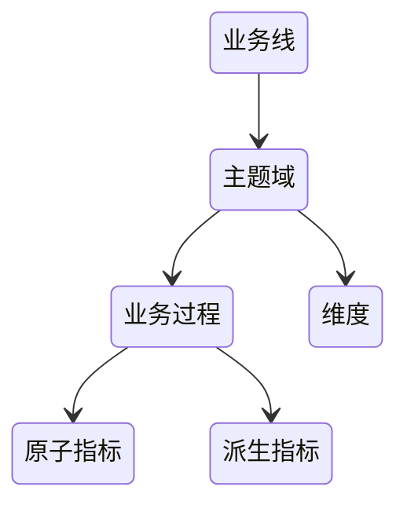
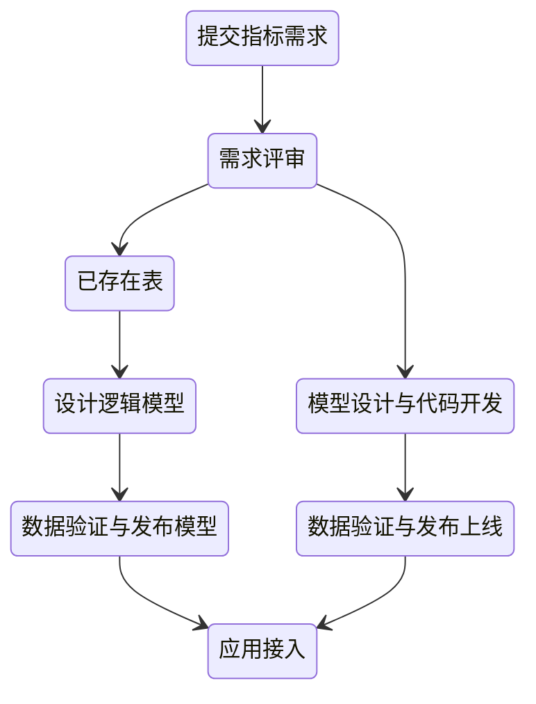

# 数据中台

数据中台的核心，是避免数据的重复计算，通过数据服务化，提高数据的共享能力，赋能数据应用

## 解决的问题

1. 指标口径不一致
2. 数据重复建设，需求响应时间长
3. 取数效率低
4. 数据质量差
5. 成本线性增长

解决这些问题的出路就是同一数据只被加工一次，只有一个出口，由于只有一个出口，就对质量提出更高的要求，需要使用监控手段，及时发现解决数据问题，同时有了中台，成本的问题也就解决了，毕竟节省了资源

数据中台本身不创造价值，只有数据应用使用了中台的数据，才会产生价值

## 建设

### 方法论

- OneData 所有数据只加工一次
- OneService 数据即服务，强调数据中台中的数据应该是通过 API 的方式被使用

### 支撑技术

1. 大数据基础设施
2. 大数据平台
3. 数据治理
4. 数据服务
5. 数据应用

### 组织架构

中台团队既要独立业务线，又要深入业务

## 元数据中心

- 数据字典：描述的是数据的结构信息 库、表、列...
- 数据血缘：指一个表是直接通过哪些表加工而来
- 数据特征：主要是指数据的属性信息 标签、热度、存储空间...

基于元数据中心可以构建数据地图，对于提高数据发现的效率，实现非技术人员自助取数有重要作用

### 开源方案

- Metacat：直连数据源拉取元数据信息
- Apache Atlas：通过静态或者动态分析SQL，得到SQL的输入表和输出表

## 指标管理

### 混乱问题

- 相同指标名称，实际定义不同
- 实际定义一样，指标名称不同
- 不同限定词，描述相同事实过程的两个指标，相同事实定义不一样
- 指标定义描述不清晰、错误
- 指标名称难理解

### 规范化

- 派生指标 = 统计周期 + 统计粒度 + 业务限定 + 原子指标

命名：

- 原子指标：动作 + 度量
- 派生指标：修饰词_原子指标_时间周期

关联应用与可分析维度：指标被哪些应用使用、指标有哪些维度

分级管理：一级指标由中台产出负责、二级指标由数据应用根据原子指标进行派生

### 指标新建

### 已有指标梳理

1. 指标治理小组
2. 指标梳理时间计划
3. 盘点还在使用的数据报表和数据应用
4. 收集使用中的报表和应用的指标
   1. 指标展示名称
   2. 指标标识
   3. 业务定义
   4. 数据来源
   5. 分析维度
   6. 数据应用
   7. 计算逻辑
5. 评审指标的业务口径、对相同的进行去重合并
6. 根据业务口径明确主题域、业务过程
7. 拆分指标类型、录入指标系统

## 模型设计

### 好模型的衡量

- 完善度：底层数据被上层数据引用的数量，汇总数据能直接满足多少查询需求
- 复用度：模型引用系数：一个模型被读取，直接产出下游模型的平均数量，系数越高复用越好
- 规范度：命名规范、定义一致

### 建设

1. 接管底层数据源，控制源头，只能在数据中台保持一份
2. 划分主题域，加入一个主题域，不影响已经划分的主题域的表
3. 构建一致性维度，需要区分公共维度，特有维度，根据维度需求不同，分成不同的维度表
4. 事实表整合，统计粒度必须保持一致，不同统计粒度的数据不能出现在同一个事实表中
5. 模型开发，即开发跑数据的ETL，需要注意的一些点：管理好任务依赖、及时删除临时表、管理好数据的生命周期...
6. 应用迁移，意数据的比对，确保数据的完全一致，然后进行应用迁移，删除老的数据表
