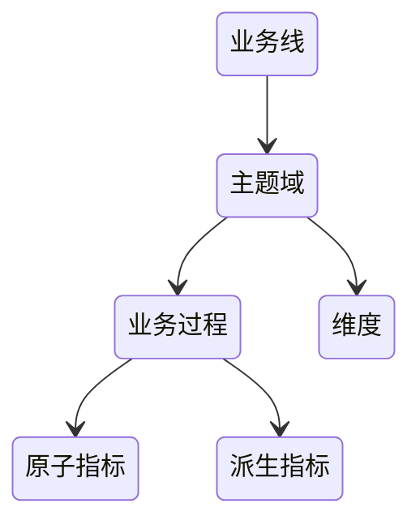
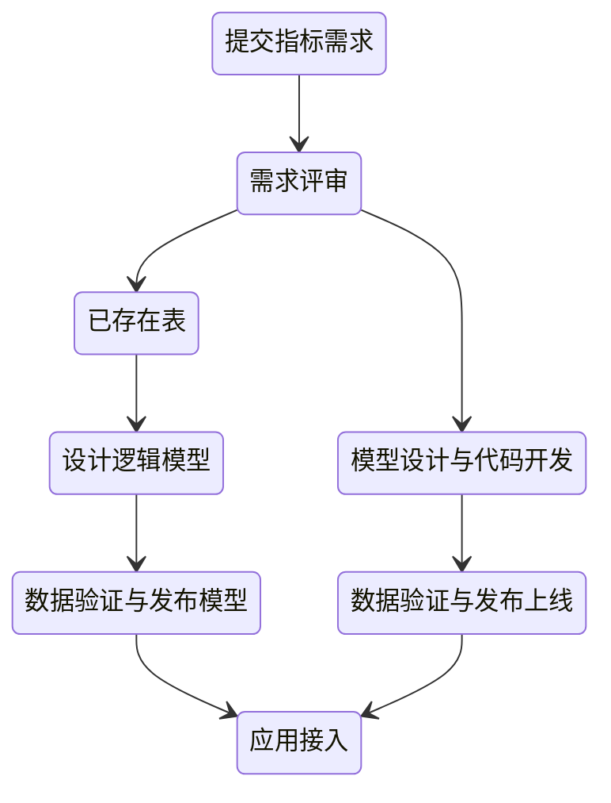

# 数据中台

数据中台的核心，是避免数据的重复计算，通过数据服务化，提高数据的共享能力，赋能数据应用

## 解决的问题

1. 指标口径不一致
2. 数据重复建设，需求响应时间长
3. 取数效率低
4. 数据质量差
5. 成本线性增长

解决这些问题的出路就是同一数据只被加工一次，只有一个出口，由于只有一个出口，就对质量提出更高的要求，需要使用监控手段，及时发现解决数据问题，同时有了中台，成本的问题也就解决了，毕竟节省了资源

数据中台本身不创造价值，只有数据应用使用了中台的数据，才会产生价值

## 建设

### 方法论

- OneData 所有数据只加工一次
- OneService 数据即服务，强调数据中台中的数据应该是通过 API 的方式被使用

### 支撑技术

1. 大数据基础设施
2. 大数据平台
3. 数据治理
4. 数据服务
5. 数据应用

### 组织架构

中台团队既要独立业务线，又要深入业务

## 元数据中心

- 数据字典：描述的是数据的结构信息 库、表、列...
- 数据血缘：指一个表是直接通过哪些表加工而来
- 数据特征：主要是指数据的属性信息 标签、热度、存储空间...

基于元数据中心可以构建数据地图，对于提高数据发现的效率，实现非技术人员自助取数有重要作用

### 开源方案

- Metacat：直连数据源拉取元数据信息
- Apache Atlas：通过静态或者动态分析SQL，得到SQL的输入表和输出表

## 指标管理

### 混乱问题

- 相同指标名称，实际定义不同
- 实际定义一样，指标名称不同
- 不同限定词，描述相同事实过程的两个指标，相同事实定义不一样
- 指标定义描述不清晰、错误
- 指标名称难理解

### 规范化

- 派生指标 = 统计周期 + 统计粒度 + 业务限定 + 原子指标

命名：

- 原子指标：动作 + 度量
- 派生指标：修饰词_原子指标_时间周期

关联应用与可分析维度：指标被哪些应用使用、指标有哪些维度

分级管理：一级指标由中台产出负责、二级指标由数据应用根据原子指标进行派生

### 指标新建

### 已有指标梳理

1. 指标治理小组
2. 指标梳理时间计划
3. 盘点还在使用的数据报表和数据应用
4. 收集使用中的报表和应用的指标
   1. 指标展示名称
   2. 指标标识
   3. 业务定义
   4. 数据来源
   5. 分析维度
   6. 数据应用
   7. 计算逻辑
5. 评审指标的业务口径、对相同的进行去重合并
6. 根据业务口径明确主题域、业务过程
7. 拆分指标类型、录入指标系统

## 模型设计

### 好模型的衡量

- 完善度：底层数据被上层数据引用的数量，汇总数据能直接满足多少查询需求
- 复用度：模型引用系数：一个模型被读取，直接产出下游模型的平均数量，系数越高复用越好
- 规范度：命名规范、定义一致

### 建设

1. 接管底层数据源，控制源头，只能在数据中台保持一份
2. 划分主题域，加入一个主题域，不影响已经划分的主题域的表
3. 构建一致性维度，需要区分公共维度，特有维度，根据维度需求不同，分成不同的维度表
4. 事实表整合，统计粒度必须保持一致，不同统计粒度的数据不能出现在同一个事实表中
5. 模型开发，即开发跑数据的ETL，需要注意的一些点：管理好任务依赖、及时删除临时表、管理好数据的生命周期...
6. 应用迁移，意数据的比对，确保数据的完全一致，然后进行应用迁移，删除老的数据表

## 数据质量

### 问题根源

- 源系统数据格式、表结构变更、格式异常
- 数据任务本身有问题
- 资源不足、基础设施不稳定

### 提高质量

1. 通过检查任务，定时核查数据正确性、延迟
2. 通过监控保证按时产出
3. 规范化管理

### 质量度量

- 任务产出完成率
- 表级别的质量分数
- 告警次数
- 数据产品SLA

## 成本

### 成本陷阱

- 没有使用，但一直在消耗成本
- 低价值产出
- 高成本

### 成本管理

#### 资产盘点

建立全链路数据资产试图，核算成本、核算价值

#### 发现问题

通过使用率、价值衡量发现有成本陷阱的数据

#### 治理优化

下线掉无人使用的数据，对于高成本的数据，进行计算与存储优化

#### 评估

成本计算：计算成本 + 存储成本 / 数据带来的价值

## 数据服务

要让数据服务成为数据的唯一出口

### 解决的问题

- 接入效率低，同样的数据，提供给不同的数据应用，可能就需要不同的存储
- 由于数据应用对数据的需求不同，数据也很难复用
- 无法追溯数据的使用情况
- 底层数据的变更影响到数据应用

### 功能

- 规范化接口定义：对各个数据应用屏蔽了不同的中间存储，提供的是统一的 API
- 数据网关：要实现鉴权、限流、监控
- 全链路打通：如果某些应用真的需要直接使用数据表，要通过审核、打标签关联，这样才可以追溯数据的使用
- 推拉交付：不仅提供拉的接口，也可以提供诸如消息队列的推数据接口
- 中间存储：提前做好常见的存储支持，如Redis、ES，满足不同的性能需求
- 逻辑模型：类似于数据库的视图，在查询时动态拼接，一个模型就能给多方使用，提高数据的利用率
- API 市场：应用开发者可以直接在 API 集市发现已有的数据接口，直接申请该接口的 API 权限，即可访问该数据，不需要重复开发

### 架构设计

- 云原生：高可用、服务隔离、动态扩缩容之类的特性对于服务接口都是必须的
- 逻辑模型：服务接到查询请求后，根据逻辑模型和物理模型字段的映射关系，将逻辑执行计划拆解为面向物理模型的物理执行计划，并下发多个物理模型上去执行，最后对执行的结果进行聚合
- 数据自动导出：每次调度产出任务结束，就会触发数据导出服务，将数据导出到中间存储中，此时 API 接口就可以查询到最新的数据

## 数据安全

- 备份与恢复
- 垃圾回收：防误删
- 权限管理
- 操作审计
- 开发与生产环境隔离

## 数据应用

- 初级阶段：报表
- 发展阶段：根据数据持续监控业务过程，发现问题、诊断分析，并给出决策建议，最后需要一键执行决策
- 高级阶段：自助取数，让每个人都能基于数据去做分析和决策

## 数据研发流程

### 需求

提出指标需求 -> 评审指标需求 -> 产出指标业务定义、数据来源、计算逻辑

### 研发

基于主题域、分层进行设计模型 -> 同步数据 -> 编写对应任务的代码 -> 进行数据测试以验证是否符合预期以及是否正确 -> 代码静态检查、配置相关监控手段以保证符合质量

### 交付

数据被抽取到中间件上或者暴露接口对外提供数据服务

### 运维

数据任务出现异常，有完善的报警机制召唤先关负责人，保证问题被及时处理

## 流程协作

### 数据分析流程

#### 认识数据

通过指标系统以及数据地图帮助分析师知道有哪些数据可以用

#### 探索式分析

通过数据帮助分析师找到问题

#### 可视化呈现

基于数据，可视化分析结果

#### 固化流程

将问题分析解决思路固化到产品中，自动生成决策建议，解放人力

### 资产管理流程

- 成本管理：下线掉无用、低价值的产品，需要打通管理员与数据负责人信息通道，实现通知、一键下线
- 与数据权限的审批流程、模型和任务发布上线的审批流程打通，根据不同的资产等级，需要不同级别的角色来完成审批
