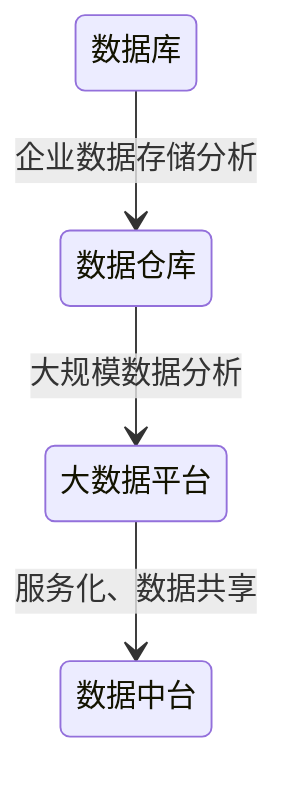
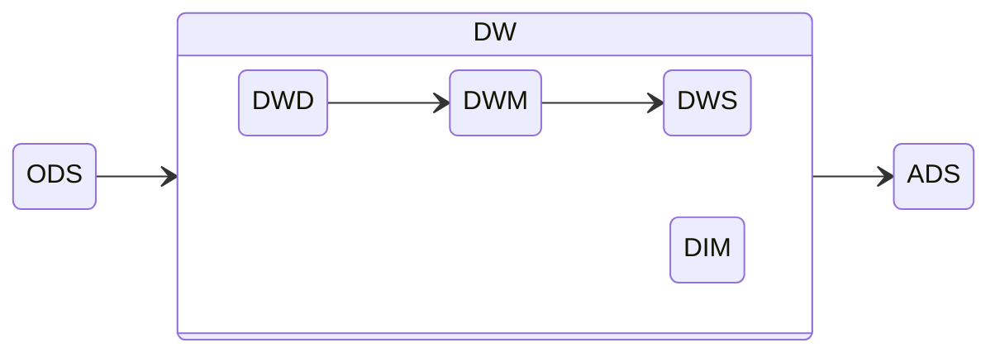

# 数据仓库

技术发展：

一个将从多个数据源中收集来的信息以统一模式存储在单个站点上的仓储

认识数据仓库的角度：

- 怎么从数据源收集数据
- 使用什么schema
- 怎么做数据转换与清理
- 数据更新如何通知数据仓库
- 存储哪些数据

数据仓库的能力：数据存储、数据管理、数据分析计算

## 建模

数据模型就是数据组织和存储方法，它强调从业务、数据存取和使用角度合理存储数据，建模即找到合适的数据模型，良好的数据模型的评价标准：

- 高性能：快速查询所需要的数据
- 低成本：减少重复计算，实现计算结果的复用，降低计算成本
- 高效率：改善用户使用数据的体验，提高使用数据的效率
- 高质量：改善数据统计口径的混乱，减少计算错误的可能性

数据仓库典型的数据模型大都是为数据分析而设计，如一张事实表，多张维度表的星型模式，以及维度表又有维度表的雪花型模式

列存储在数据仓库中用的比较多，主要还是因为数据分析更多地是在相同的属性上进行分析

### 维度建模

将复杂的业务通过事实和维度两个概念进行呈现，重点解决用户如何更快速完成分析需求，同时还有较好的大规模复杂查询的响应性能

根据业务过程创建事实表，保证事实表所要统计的指标粒度相同，应尽可能选择最细粒度，以灵活应对未来的需求。后在事实表中尽量多地选择能作为维度的字段，要确保维度表中不能出现重复数据，应使维度主键唯一。最后选择业务过程的度量值作为事实表的字段

#### 事实表

- 对应业务过程发生的一个度量事件，其包含与该业务过程有关的维度引用（维度表外键）以及该业务过程的度量（通常是可累加的数字类型字段），事实表列较少，但行较多，且行的增速快

事实的类型：

1. 可加事实：可以按照与事实表相关的所有维度进行累加
2. 半可加事实：指只能按照与事实表相关的一部分维度进行累加，如周期快照事实表中按照时间累加无意义
2. 不可加事实：例如比率型事实，通常需要转化为可加事实，例如比率可转化为分子和分母

事务事实表：表示发生在某个时间点上的一个业务最细粒度的操作事件，一个业务过程一张表，如果发生一个事件，则在表中新增一行，由于其保存了最细粒度的记录，可以提供最大限度的灵活性。由于保存了最细粒度的数据，对于某些特定类型的需求，如聚合或者关联大量数据得到一个指标的场景，其逻辑会比较复杂，或者效率会比较低

周期快照事实表：每隔一段时间就插入一行数据的快照，保存某一时刻数据的状态。这种事实表的粒度由采样周期 + 维度确定，事实则是需要度量的值，如周期是每天，维度是仓库跟商品，即每行的内容就是（日期，仓库，商品，数量），数量就是事实。

累积快照事实表：一个拥有长生命周期的事件独属一行，如果事件状态发生变化，则直接更新其该行对应的状态。选择一个业务流程中需要关联分析的多个关键业务过程，定义每行数据表示的是什么，如（用户，注册日期，首单日期），当用户发生注册过程后，更新注册日期，发生首次下单过程后，更新首单日期。最后可以跟事务事实表一样，加上粒度与事实

#### 维度表

- 描述与业务过程发生时相关的环境（谁、什么、哪里...），维度是数据分析的入口点

设计过程：

1. 确定维度表：设计事实表时，已经确定了与每个事实表相关的维度，理论上每个相关维度均需对应一张维度表，可能存在多个事实表与同一个维度都相关的情况，这种情况需保证维度的唯一性。如果某些维度表的维度属性很少，可不创建该维度表，而把该表的维度属性直接增加到与之相关的事实表中，这个操作称为**维度退化**
2. 确定主维表和相关维表，从业务系统找到与该维度相关的表，通常情况下粒度最小的就是主维表
3. 确定维度属性：维度属性主要来自于业务系统中与该维度对应的主维表和相关维表。维度属性可直接从主维表或相关维表中选择，也可通过进一步加工得到
   1. 保证维度属性尽量丰富，越丰富越能支持灵活的查询
   2. 尽量不使用编码，而使用明确的文字说明以方便查询
   3. 沉淀出通用的维度属性，避免在每次查询都要重复进行逻辑处理

设计要点：

1. 反规范化增加数据冗余，减少join操作，提高查询性能
2. 维度属性通常会随时间变化，数据仓库的一个重要特点就是反映历史的变化
   1. 可以每天保存一份全量的维度数据，缺点是浪费空间，如果需要某个历史的维度对应的事实，直接使用某一天的历史的维度表去join事实表
   2. 拉链表：记录每条信息的生命周期（起始时间、结束时间），一旦信息发生变化，就更新结束时间，并插入一条新记录，适用于缓慢变化维。可以根据起始时间跟结束时间查询得到历史维度表
3. 多值维度：事实表有些维度可能会对应维度表的多条记录，这是由于事实表的粒度选择过粗导致的。另外一种解决多值维度的方案可以通过采用多字段保存多个维度值，每个字段保存一个维度id
4. 多值属性：维度表中的某个属性同时有多个值，一种方案是将多值属性放到一个字段，该字段内容为key1:value1，key2:value2的形式。另外一种方案将多值属性放到多个字段，每个字段对应一个属性。这种方案只适用于多值属性个数固定的情况

## 层次结构

### 数据运营层ODS

最接近数据源中数据的一层，数据源中的数据，经过ETL之后，装入ODS层

### 数据仓库层DW

- 细节数据层DWD：保持和ODS层一样的数据粒度，对ODS数据层做一些数据清洗和规范化的操作
- 数据中间层DWM：在DWD层的数据基础上，对数据做一些轻微的聚合操作，生成一些列的中间结果表，提升公共指标的复用性
- 数据服务层DWS：基于DWM或者DWD的数据，整合汇总成分析某一个主题域的服务数据层，该层的数据表会相对较少；一张表会涵盖比较多的业务内容，由于其字段较多，因此一般也会称该层的表为宽表
- 公共维度层DIM：存放维度表，保存一致性的维度信息

### 数据服务层ADS

提供数据产品和数据分析所需要的数据

## 构建流程

