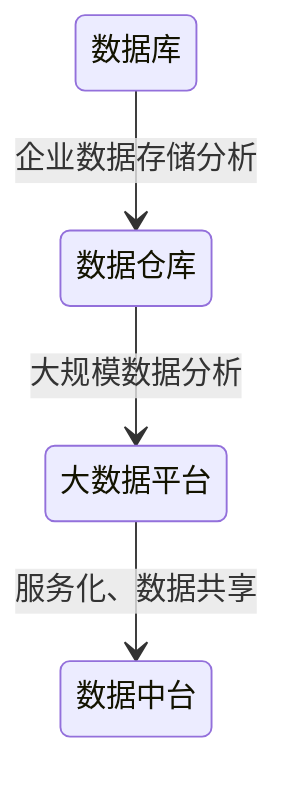
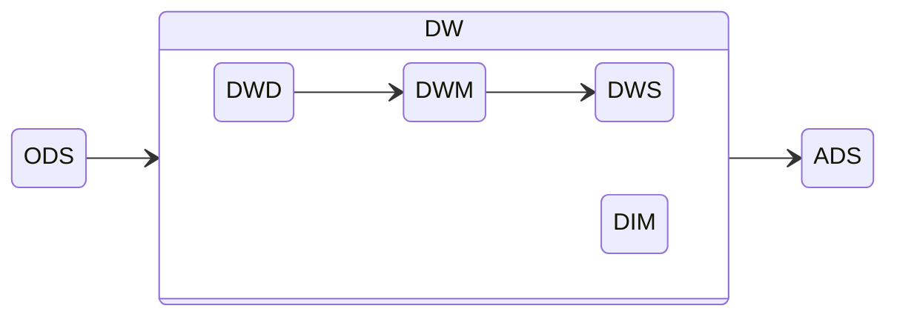

# 数据仓库

技术发展：

一个将从多个数据源中收集来的信息以统一模式存储在单个站点上的仓储

认识数据仓库的角度：

- 怎么从数据源收集数据
- 使用什么schema
- 怎么做数据转换与清理
- 数据更新如何通知数据仓库
- 存储哪些数据

数据仓库的能力：数据存储、数据管理、数据分析计算

## 建模

数据模型就是数据组织和存储方法，它强调从业务、数据存取和使用角度合理存储数据，建模即找到合适的数据模型，良好的数据模型的评价标准：

- 高性能：快速查询所需要的数据
- 低成本：减少重复计算，实现计算结果的复用，降低计算成本
- 高效率：改善用户使用数据的体验，提高使用数据的效率
- 高质量：改善数据统计口径的混乱，减少计算错误的可能性

数据仓库典型的数据模型大都是为数据分析而设计，如一张事实表，多张维度表的星型模式，以及维度表又有维度表的雪花型模式

列存储在数据仓库中用的比较多，主要还是因为数据分析更多地是在相同的属性上进行分析

### 维度建模

将复杂的业务通过事实和维度两个概念进行呈现，重点解决用户如何更快速完成分析需求，同时还有较好的大规模复杂查询的响应性能

根据业务过程创建事实表，保证事实表所要统计的指标粒度相同，后在事实表中选择能作为维度的字段，要确保维度表中不能出现重复数据，应使维度主键唯一

#### 事实表

- 对应业务过程发生的一个度量事件，其包含与该业务过程有关的维度引用（维度表外键）以及该业务过程的度量（通常是可累加的数字类型字段），事实表列较少，但行较多，且行的增速快
  
事务事实表：表示发生在某个时间点上的一个业务最细粒度的操作事件，一个业务过程一张表，如果发生一个事件，则在表中新增一行，由于其保存了最细粒度的记录，可以提供最大限度的灵活性

周期快照事实表：间隔一段时间，插入一行对数据建立一个快照，保存某一时刻数据的状态

累积快照事实表：一个拥有长生命周期的事件独属一行，如果事件状态发生变化，则直接更新其该行状态

#### 维度表

- 描述与业务过程发生时相关的环境（谁、什么、哪里...），维度是数据分析的入口点

## 层次结构

### 数据运营层ODS

最接近数据源中数据的一层，数据源中的数据，经过ETL之后，装入ODS层

### 数据仓库层DW

- 细节数据层DWD：保持和ODS层一样的数据粒度，对ODS数据层做一些数据清洗和规范化的操作
- 数据中间层DWM：在DWD层的数据基础上，对数据做一些轻微的聚合操作，生成一些列的中间结果表，提升公共指标的复用性
- 数据服务层DWS：基于DWM的数据，整合汇总成分析某一个主题域的服务数据层，该层的数据表会相对较少；一张表会涵盖比较多的业务内容，由于其字段较多，因此一般也会称该层的表为宽表

### 数据服务层ADS

提供数据产品和数据分析所需要的数据
