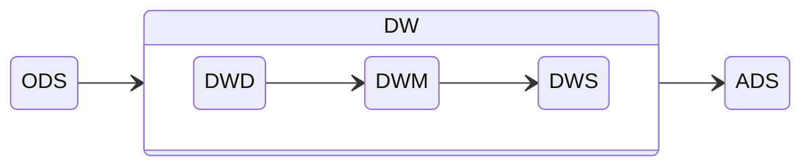

# 数据仓库

一个将从多个数据源中收集来的信息以统一模式存储在单个站点上的仓储

认识数据仓库的角度：

- 怎么从数据源收集数据
- 使用什么schema
- 怎么做数据转换与清理
- 数据更新如何通知数据仓库
- 存储哪些数据

## 建模

数据仓库典型的数据模式大都是为数据分析而设计，如一张事实表，多张维度表的星型模式，以及维度表又有维度表的雪花型模式

列存储在数据仓库中用的比较多，主要还是因为数据分析更多地是在相同的属性上进行分析

### 维度建模

重点解决用户如何更快速完成分析需求，同时还有较好的大规模复杂查询的响应性能

根据业务过程创建事实表，保证事实表所要统计的指标粒度相同，后在事实表中选择能作为维度的字段，要确保维度表中不能出现重复数据，应使维度主键唯一

## 层次结构

数据流向：

### 数据运营层ODS

最接近数据源中数据的一层，数据源中的数据，经过ETL之后，装入ODS层

### 数据仓库层DW

- 细节数据层DWD：保持和ODS层一样的数据粒度，对ODS数据层做一些数据清洗和规范化的操作
- 数据中间层DWM：在DWD层的数据基础上，对数据做一些轻微的聚合操作，生成一些列的中间结果表，提升公共指标的复用性
- 数据服务层DWS：基于DWM的数据，整合汇总成分析某一个主题域的服务数据层，该层的数据表会相对较少；一张表会涵盖比较多的业务内容，由于其字段较多，因此一般也会称该层的表为宽表

### 数据服务层ADS

提供数据产品和数据分析使用的数据
