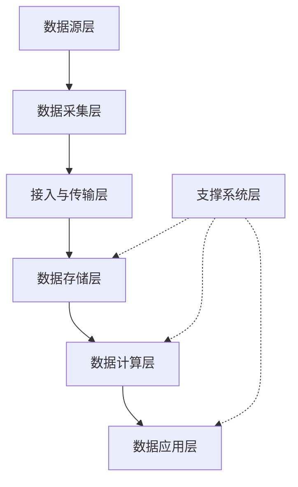
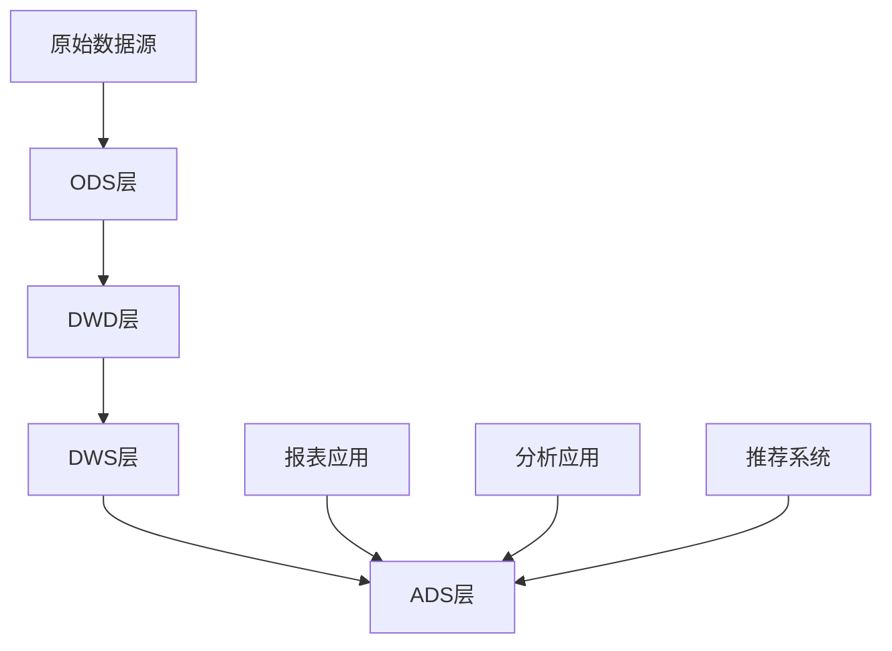
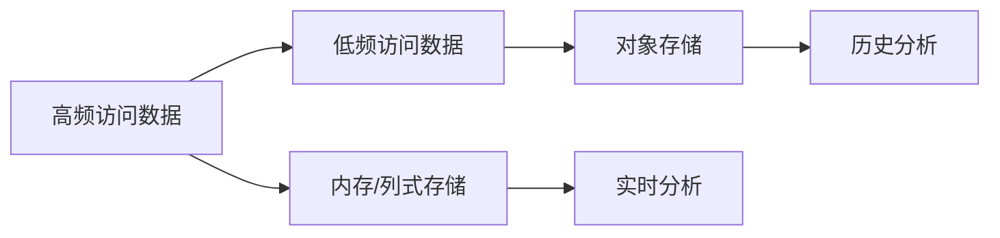
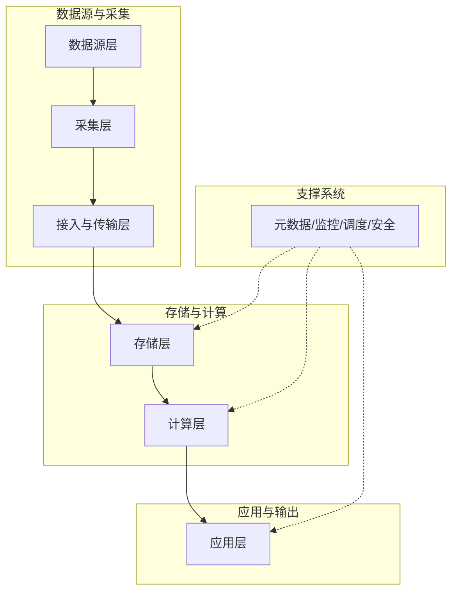

# 数据分层

## 1. 概述（Overview）

数据分层是企业数据治理体系的核心组成部分，与**元数据管理**共同构成数据资产化的底层结构。

* **元数据管理**（描述系统）：描述数据的结构、语义、流动、规则，提供统一认知，回答“是什么”“为什么”。
* **数据分层**（组织系统）：组织数据的生产流程、各阶段形态、复用方式与质量控制，回答“在哪里”“如何组织”。

> 比喻：元数据是图书馆的索引卡片，数据分层是图书的分类系统。无索引和分类，再多的数据也无法高效使用。

数据分层的目标是将数据从混乱状态转向有序体系，实现规范化管理、高复用性和一致性保障。

---

## 2. 本质（Essence）

**数据分层的核心本质**：

> 按照加工程度和使用目的，将数据组织成不同层次，实现规范化管理、复用性提升和一致性保证。

**核心价值**：

| 价值点      | 描述                     |
| -------- | ---------------------- |
| 降低资源冗余   | 避免重复计算与存储，提高系统效率       |
| 保证数据一致性  | 统一计算口径与定义，确保数据准确性      |
| 提升开发效率   | 可复用已有数据层，减少重复开发        |
| 降低维护成本   | 屏蔽底层变化对上层影响，实现变更隔离     |
| 构建有序数据体系 | 将企业数据从混沌走向有序，提高管理和决策能力 |

---

## 3. 模型（Model）

### 3.1 数据架构逻辑分层模型

| 层级     | 功能      | 说明                      |
| ------ | ------- | ----------------------- |
| 数据源层   | 数据输入    | 包括结构化、半结构化、非结构化数据       |
| 数据采集层  | 数据接入    | 日志代理、API抓取、消息队列等        |
| 接入与传输层 | 数据清洗与传输 | 初步清洗和转换，Kafka/Pulsar等   |
| 数据存储层  | 数据持久化   | 离线(HDFS/对象存储)、实时(KV/内存) |
| 数据计算层  | 数据加工与聚合 | 批处理、流处理、流批一体            |
| 数据应用层  | 数据输出    | 报表、BI、OpenAPI、AI接口      |
| 支撑系统层  | 元数据、监控等 | 元数据、调度、监控、告警、安全审计       |

### 3.2 经典数据仓库分层模型

| 层级  | 全称                     | 功能     | 特点          |
| --- | ---------------------- | ------ | ----------- |
| ODS | Operational Data Store | 原始数据存储 | 保持原貌，基础清洗   |
| DWD | Data Warehouse Detail  | 明细层    | 按模型清洗、规范化整合 |
| DWS | Data Warehouse Summary | 汇总层    | 轻度汇总，生成常用指标 |
| ADS | Application Data Store | 应用层    | 面向具体场景，直接使用 |

### 3.3 模型分层原则

* 明细层：保留最细粒度数据
* 服务层：面向需求设计，实现逻辑复用
* 分层设计降低耦合，提高系统容量评估与追踪能力

---

## 4. 能力体系（Capability System）

### 4.1 核心能力

| 能力      | 描述             |
| ------- | -------------- |
| 数据规范化管理 | 按预定义模型组织数据     |
| 数据复用    | 分层设计实现逻辑与数据复用  |
| 一致性保障   | 统一计算口径，避免不一致结果 |
| 依赖管理    | 管理层级间依赖关系      |
| 变更隔离    | 屏蔽底层变化对上层影响    |
| 质量控制    | 分层实施数据质量校验     |

### 4.2 协同能力（与元数据管理）

* 分层信息元数据化：表所属层、依赖关系、数据流路径
* 自动化驱动能力：基于元数据自动生成ETL代码
* 血缘追踪能力：追溯数据流转路径，保障治理可观测性

---

## 5. 架构模型（Architecture Model）

### 5.1 分层存储架构

* 高频数据：内存/列式存储，快速访问
* 低频数据：对象存储，低成本
* 目标：性能与成本平衡

### 5.2 分层计算架构

* 底层计算：处理原始数据生成明细层
* 中间层计算：生成汇总指标
* 顶层计算：生成应用数据

---

## 6. 类型体系（Taxonomy）

| 分类维度   | 类型  | 描述           |
| ------ | --- | ------------ |
| 数据加工层次 | 原始层 | 原始数据基础清洗     |
|        | 明细层 | 结构化处理，保留详细信息 |
|        | 汇总层 | 聚合计算，生成指标    |
|        | 应用层 | 高度定制化，面向特定应用 |
| 数据存储方式 | 热数据 | 高频访问，高性能存储   |
|        | 温数据 | 中频访问         |
|        | 冷数据 | 低频访问，低成本     |
| 业务用途   | 共享层 | 跨业务公共数据      |
|        | 领域层 | 特定业务域数据      |
|        | 应用层 | 面向具体应用       |

---

## 7. 边界与生态（Boundary & Ecosystem）

* 每层责任边界清晰：定义输入输出、依赖关系、处理规范
* 支撑系统生态：元数据、监控、调度、告警、安全审计
* 生态协同：分层设计与元数据管理形成闭环

---

## 8. 治理体系（Governance System）

### 8.1 分层治理原则

* 高内聚低耦合
* 数据复用性
* 逐层加工
* 变更隔离
* 统一口径

### 8.2 分层治理实践

* 制定分层规范
* 管理依赖关系
* 质量监控与校验
* 变更审批与影响分析

---

## 9. 演进趋势（Evolution）

| 方向   | 描述                           |
| ---- | ---------------------------- |
| 智能化  | 手工定义→智能推荐，静态→动态自适应，规则驱动→模型驱动 |
| 实时融合 | 批处理→流批一体，离线→实时，静态架构→动态架构     |
| 标准化  | 企业标准→行业标准，技术导向→业务导向，静态→可配置   |

---

## 10. 选型方法论（Selection Framework）

* **分层存储选型**：冷热数据分离策略，性能成本权衡
* **计算架构选型**：批处理、流处理、流批一体架构选择
* **自动化工具**：ETL生成、血缘追踪、元数据管理平台选型
* **实施优先级**：核心业务数据优先分层，低敏感或低价值数据可延后
* **评估指标**：复用率、一致性率、处理延迟、成本效率

---

## 11. 总结（Conclusion）

1. 数据分层是数据治理的基础，与元数据管理构成数据资产化底层结构。
2. 分层设计需遵循高内聚低耦合、数据复用、逐层加工、变更隔离、统一口径等原则。
3. 分层与元数据管理密切协同，实现自动化、血缘追踪与可观测治理。
4. 分层架构需适应业务实时性需求，兼顾性能与复杂度。
5. 通过规范化分层设计，企业可构建有序数据体系，实现高复用性、一致性与低维护成本。

---

### 附：核心架构全景图示意（Mermaid）

## 关联内容（自动生成）

- [/数据技术/数据治理.md](/数据技术/数据治理.md) 数据治理与数据分层是企业数据管理体系的两个核心组成部分，数据分层为数据治理提供组织结构基础，数据治理为分层数据提供质量与合规保障
- [/数据技术/元数据管理.md](/数据技术/元数据管理.md) 元数据管理与数据分层共同构成数据资产化的底层结构，元数据描述数据的结构、语义和流动，而数据分层组织数据的生产流程和各阶段形态
- [/数据技术/数据仓库.md](/数据技术/数据仓库.md) 数据仓库中的ODS、DWD、DWS、ADS分层模型是数据分层的经典实践，体现了按加工程度和使用目的组织数据的核心思想
- [/数据技术/数据架构.md](/数据技术/数据架构.md) 数据架构包含了数据分层的逻辑分层模型，数据分层是数据架构中实现数据从混乱状态转向有序体系的关键方法
- [/数据技术/数据工程.md](/数据技术/数据工程.md) 数据工程实践需要依赖规范的数据分层来组织数据生产流程，数据分层为数据工程提供了标准化的数据处理路径
- [/数据技术/数据中台.md](/数据技术/数据中台.md) 数据中台的建设需要基于清晰的数据分层模型，将原始数据逐步加工为面向业务的服务化数据资产
- [/数据技术/埋点设计.md](/数据技术/埋点设计.md) 埋点设计产生的原始数据需要通过数据分层进行规范化处理，从原始数据逐步加工为业务可用的指标数据
- [/数据技术/数据网格.md](/数据技术/数据网格.md) 数据网格作为一种去中心化的数据架构，其数据产品同样需要遵循分层原则，实现从原始数据到服务化数据的加工处理
