# 数据处理

## 数据集成

首先要有可靠、完整的数据流，后续才能谈得上在上层对这些数据进行存储、可视化、分析

- ETL：提取 (Extract)——转换 (Transform)——加载 (Load)，在数据源抽取后首先进行转换，然后将转换的结果写入目的地
- ELT：提取 (Extract)——加载 (Load)——变换 (Transform)，在抽取后将结果先写入目的地，然后利用数据库的聚合分析能力或者外部计算框架在最后对数据做转换

ELT相比ETL，因为转换是在目的地，所以可以根据后续使用的情况做调整，比较灵活

### 数据清洗

需要一些清洗规则帮助确保数据质量和一致性，减少数据中的错误、不完整、重复等问题，使得数据标准、干净、连续

### 数据变换

- 数据变换是[数据分析](/数据技术/数据分析.md)必须的预处理步骤

1. 数据平滑：去除数据中的噪声，将连续数据离散化
2. 数据聚集：对数据进行汇总
3. 数据概化：将数据由较低的概念抽象成为较高的概念，减少数据复杂度，即用更高的概念替代更低的概念。比如说上海、杭州、深圳、北京可以概化为中国
4. 数据规范化：使属性数据按比例缩放，这样就将原来的数值映射到一个新的特定区域中
   1. Min-max 规范化：将原始数据变换到[0,1]的空间中
   2. Z-Score 规范化：新数值 =（原数值 - 均值）/ 标准差
   3. 小数定标规范化：移动小数点的位置来进行规范化。小数点移动多少位取决于属性 A 的取值中的最大绝对值
5. 属性构造：构造出新的属性并添加到属性集中

## 批处理

- 输入数据是有界且不可变的
- 除了输出 其他操作都没有副作用

#### UNIX的管道

#### [MapReduce](/数据技术/Hadoop.md#MapReduce)的不足

- 抽象层次不足，太原始
- 维护成本：每一步的 MapReduce 都有可能出错，为了这些异常处理，就需要协调系统，协调系统又是一个复杂度的来源
- 时间性能：对 MapReduce 的配置细节不理解，难以发挥其高性能，每一步计算都要进行硬盘的读取和写入
- 只支持批处理

需要的：

1. 一种技术抽象让多步骤数据处理变得易于维护
2. 不要复杂的配置，需要能自动进行性能优化
3. 要能把数据处理的描述语言，与背后的运行引擎解耦合开来
4. 要统一批处理和流处理的编程模型
5. 要在架构层面提供异常处理和数据监控的能力

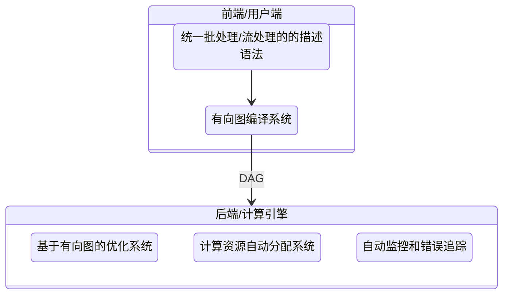

#### 分布式批处理需要解决的问题

1. 如何将输入数据分区
2. 容错：任务可能随时会失败

## 流处理

- 复杂事件处理（CEP）：存储一个搜索模式，在流数据流经时判断是否符合这样的模式
- 流分析：对一定窗口期内的数据进行计算、分析
- 通过流来进行RPC

### [消息系统](/中间件/消息队列/消息队列.md)

早期使用消息队列来实现流处理：

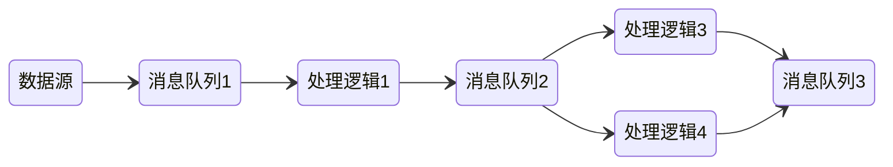

消息系统与传统的数据库有着本质的区别：数据临时与永久之分

分区日志消息系统：结合了传统消息系统与数据库：既是流，又能存


### 流与数据库

- 数据库的变更通过流与系统异构存储保持同步
- 变更数据捕获（CDC）：初始快照 + 后续变更操作
- 事件溯源：回放所有日志得到数据的最终状态

本质上就是[状态复制机](/软件工程/架构/系统设计/分布式/分布式数据.md#复制)的实现

本质上数据库的日志就是流，数据库里的数据就是当前流重放的快照

### DataFlow模型

核心概念：

- ParDo，地位相当于 MapReduce 里的 Map 阶段。所有的输入数据，都会被一个 DoFn，也就是处理函数处理
- GroupByKey，地位则是 MapReduce 里的 Shuffle 操作。把相同的 Key 汇总到一起，然后再通过一个 ParDo 下的 DoFn 进行处理


### 时间问题

流处理依赖于本地时间戳，时钟是不可靠的，同时考虑消息堆积、软件错误等问题，基于时间戳的流分析可能不准

### 窗口类型

1. 轮转窗口：固定长度，相互之间没有重叠且紧邻 [1,3] [4,6]
2. 跳跃窗口：固定长度，允许之间重叠以进行平滑过度 [1,3] [2,4]
3. 滑动窗口
4. 会话窗口：没有固定时间，将同一用户的事件组合在一起

### 容错

- 微批处理：将流切成固定大小的块，如果这个块发生错误，则丢弃这个块的所有输出
- 校验点：定期生成检查点，如果流处理发生错误，就回到上一个检查点重新跑

这需要消费端保证幂等性，否则为了容错会输出不止一次导致副作用

## 特征工程

利用工程手段从“用户信息”“物品信息”“场景信息”中提取特征的过程，在已有的、可获得的数据基础上，“尽量”保留有用信息是现实中构建特征工程的原则

### 常用特征

1. 用户行为数据：区分隐式反馈与显式反馈，对用户行为数据的采集与使用与业务强相关
2. 用户关系数据：人与人之间连接的记录，区分强关系（主动建立连接）与弱关系（间接的关系导致的连接）
3. 属性、标签类数据：物品属性、人口属性、主动打的标签等
4. 内容类数据：描述型文字、图片，甚至视频，需要进一步通过NLP、图像识别等转为结构化信息才能作为特征使用
5. 场景信息：描述的是用户所处的客观的推荐环境，常见的有所处于什么时空

### 特征处理

进行特征处理的目的，是把所有的特征全部转换成一个数值型的特征向量

类别特征处理：

One-hot 编码（也被称为独热编码），它是将类别、ID 型特征转换成数值向量的一种最典型的编码方式。它通过把所有其他维度置为 0，单独将当前类别或者 ID 对应的维度置为 1 的方式生成特征向量

```
周二 => [0,1,0,0,0,0,0] -- 将一周7天视为7个维度，将周二所在的维度设为1
```

数值类特征处理：

1. [归一化](/数学/概率论与数理统计.md#特征变化)
2. 分桶：将样本按照某特征的值从高到低排序，然后按照桶的数量找到分位数，将样本分到各自的桶中，再用桶 ID 作为特征值

```
分桶：
[1,1,1,1,1,1,5,8,10] => [(1,5),(5,10)]
```

### Embedding

用一个数值向量“表示”一个对象（Object）的方法

词 Embedding：


在通过神经网络训练得到模型，一个词就可以通过模型推断，转为向量

图 Embedding：

1. Deep Walk：在由物品组成的图结构上进行随机游走，产生大量物品序列，然后将这些物品序列作为训练样本输入 Word2vec 进行训练，最终得到物品的 Embedding
2. Node2vec：通过调整随机游走跳转概率的方法，让 Graph Embedding 的结果在网络的同质性（Homophily）和结构性（Structural Equivalence）中进行权衡。同质性指的是距离相近节点的 Embedding 应该尽量近似，结构性指的是结构上相似的节点的 Embedding 应该尽量接近
   1. 为了使 Graph Embedding 的结果能够表达网络的“结构性”，在随机游走的过程中，需要让游走的过程更倾向于 BFS（Breadth First Search，广度优先搜索），因为 BFS 会更多地在当前节点的邻域中进行游走遍历，相当于对当前节点周边的网络结构进行一次“微观扫描”。当前节点是“局部中心节点”，还是“边缘节点”，亦或是“连接性节点”，其生成的序列包含的节点数量和顺序必然是不同的，从而让最终的 Embedding 抓取到更多结构性信息
   2. 而为了表达“同质性”，随机游走要更倾向于 DFS（Depth First Search，深度优先搜索）才行，因为 DFS 更有可能通过多次跳转，游走到远方的节点上。但无论怎样，DFS 的游走更大概率会在一个大的集团内部进行，这就使得一个集团或者社区内部节点的 Embedding 更为相似，从而更多地表达网络的“同质性”

Embedding 可以直接使用，在到 Embedding 向量之后，直接利用 Embedding 向量的相似性实现某些推荐系统的功能。也可以预先训练好物品和用户的 Embedding 之后，不直接应用，而是把这些 Embedding 向量作为特征向量的一部分，跟其余的特征向量拼接起来，作为推荐模型的输入参与训练。最后是一种 E2E 的应用，即不预先训练 Embedding，而是把 Embedding 的训练与深度学习推荐模型结合起来，采用统一的、端到端的方式一起训练，直接得到包含 Embedding 层的推荐模型。

#### 非负矩阵因式分解

输入多个样本数据，每个样本数据都是一个m维数值向量，首先把我们的数据集用矩阵的形式写出来，每一列是一个数据，而每一行是这些数据对应维度的数值。于是我们就有了一个大小为m*n的输入矩阵。而算法的目标就是将这个矩阵分解为另外两个非负矩阵的积

## 模式

### Workflow

#### 复制模式

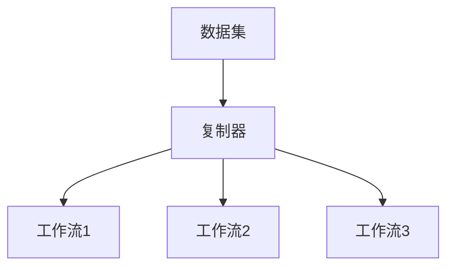

#### 过滤模式

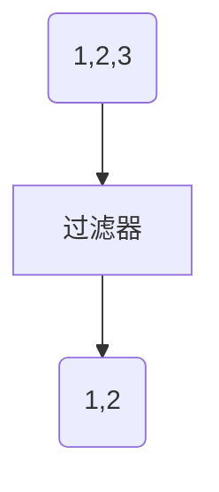

#### 分离模式

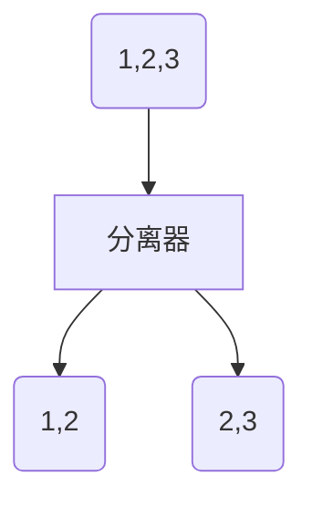

#### 合并模式

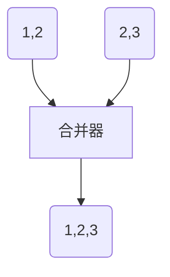

### [发布订阅](/软件工程/设计模式/行为模式.md#观察者)

## 架构

### Lambda

完整的数据集 = λ (实时数据) * λ (历史数据)

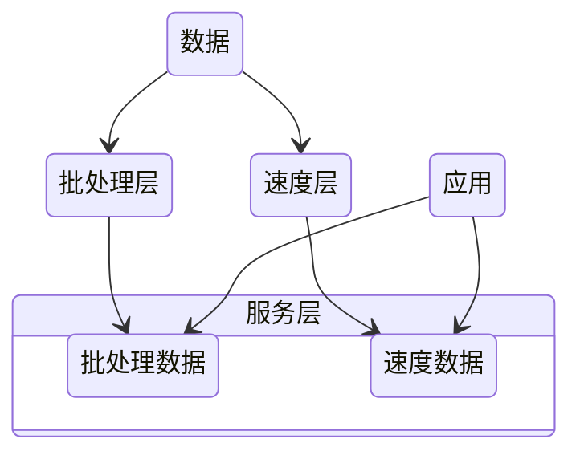

- 批处理层通过处理所有的已有历史数据来实现数据的准确性，是基于完整的数据集来重新计算的
- 速度层通过流处理，提供最新数据的实时视图来最小化延迟
- 应用在使用数据时，需要合并批处理层及速度层的数据，以此获得数据的完整视图


这种架构的最大缺点在于需要维护两套代码分别进行批处理与流处理，由此可能会产生的两个层的数据不一致、没有足够的时间进行批处理等问题

### Kappa

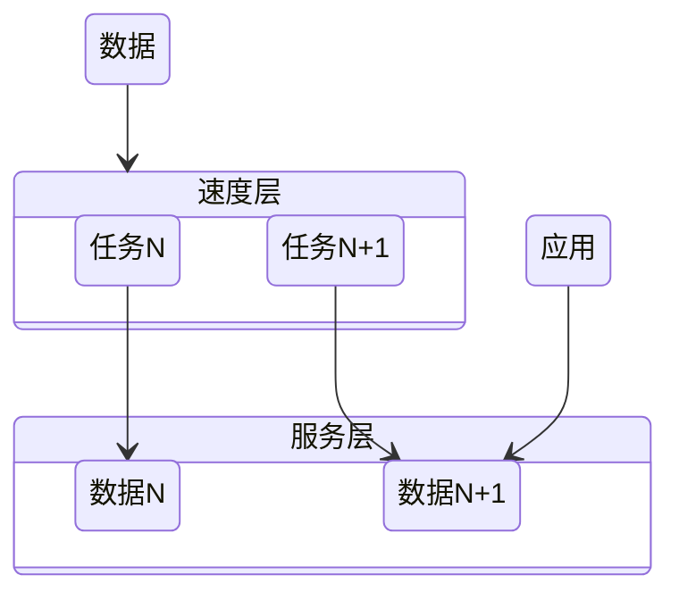

- 一个可以重跑历史数据的消息队列

kappa 则是通过只支持流处理来避免 Lambda 架构的复杂性，当计算逻辑发生变更时，就可以将 offset 回拨，重新生成数据，当新的数据追赶上了旧数据，应用便可以切换到新数据读取数据

这种架构的缺点在于很难对历史数据进行重新处理。

## Spark

- Spark SQL 主要用于结构化数据的处理：支持以SQL语法查询各种数据源
- Spark Streaming：微批处理 达到类流处理
- MLlib：机器学习库
- Graphx：用于图形计算和图形并行计算的新组件

Spark 比 MapReduce 快的原因：更为简单的 RDD 编程模型减少了作业调度次数，以及优先使用内存


1. SparkContext 启动 DAGScheduler 构造执行的 DAG 图，拆分成计算任务
2. Driver 向 Cluster Manager 请求计算资源，分配 Worker
3. Worker 向 Driver 注册并下载代码执行

### RDD

- 弹性分布式数据集（Resilient Distributed Dataset）

分区：同一个 RDD 包含的数据被存储在系统的不同节点中，需要读取时根据ID 和分区的 index 可以唯一确定对应数据块的编号，从而通过底层存储层的接口中提取到数据进行处理

不可变：一个 RDD 都是只读的，只可以对现有的 RDD 进行转换（Transformation）操作，得到新的 RDD 作为中间计算的结果

并行：由于上面两个特性，就可以并行对 RDD 进行操作

#### 结构

SparkContext：所有 Spark 功能的入口，它代表了与 Spark 节点的连接，一个线程只有一个 SparkContext

SparkConf： 一些参数配置信息

Partitions：数据的逻辑结构，每个 Partition 会映射到某个节点内存或硬盘的一个数据块

Partitioner：定义了划分数据分片的分区规则，如按哈希取模或是按区间划分等

Dependencies：每一步产生的 RDD 里都会存储它的依赖关系，即它是通过哪个 RDD 经过哪个转换操作得到的

窄依赖，父 RDD 的分区可以一一对应到子 RDD 的分区

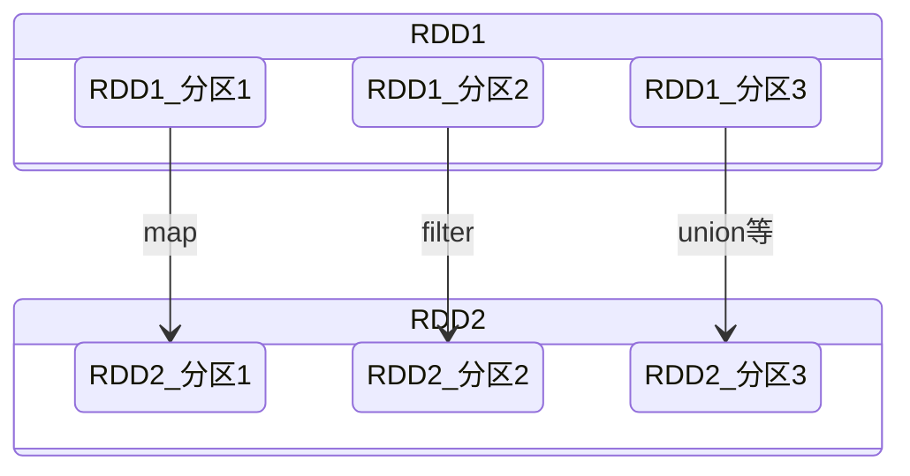

宽依赖，父 RDD 的每个分区可以被多个子 RDD 的分区使用

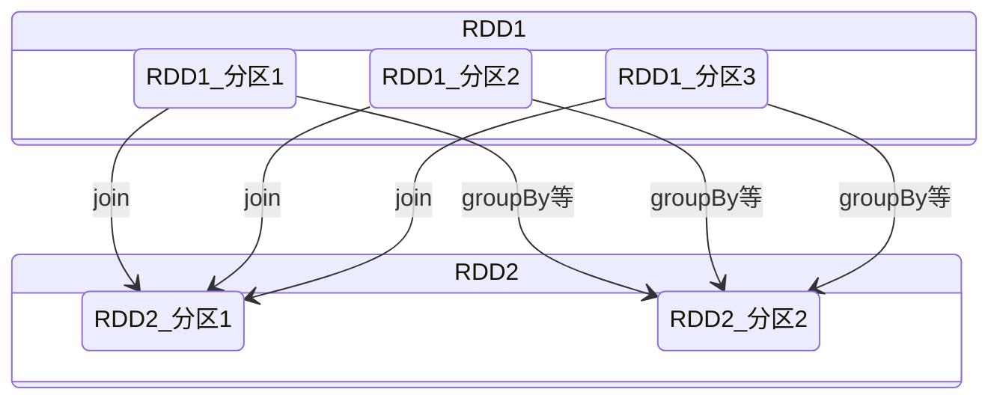

窄依赖允许子 RDD 的每个分区可以被并行处理产生，而宽依赖则必须等父 RDD 的所有分区都被计算好之后才能开始处理

Checkpoint：对于一些计算过程比较耗时的 RDD，可以进行持久化，标记这个 RDD 有被检查点处理过，并且清空它的所有依赖关系，这样在进行崩溃恢复的时候就不用在向前向父 RDD 回溯

Storage Level：记录 RDD 持久化时的存储级别，内存或内存硬盘 或在分区节点上内存、内存硬盘

Iterator：迭代函数，Compute：计算函数 都是用来表示 RDD 怎样通过父 RDD 计算得到的

preferredLocations：本着计算向数据移动原则，会优先将task任务部署在其将要处理的数据所在的节点上

#### 数据操作

大部分操作跟[Stream](/编程语言/JAVA/高级/Stream流.md)差不多

- 转换（Transformation）：把一个 RDD 转换成另一个 RDD map、filter、mapPartitions，groupByKey
- 动作（Action）：通过计算返回一个结果 collect、reduce、count，countByKey

Spark 的 Shuffle 操作跟 MapReduce 是一样的，其通过生产与消费 Shuffle 中间文件的方式，来完成集群范围内的数据交换


Map 阶段产生中间文件：

- 对于分片中的数据记录，逐一计算其目标分区，并将其填充到 PartitionedPairBuffer
- PartitionedPairBuffer 填满后，如果分片中还有未处理的数据记录，就对 Buffer 中的数据记录按（目标分区 ID，Key）进行排序，将所有数据溢出到临时文件，同时清空缓存
- 重复以上步骤直到分片中所有的数据记录都被处理
- 对所有临时文件和 PartitionedPairBuffer 归并排序，最终生成数据文件和索引文件

Reduce 阶段分发数据：

Reduce Task 将拉取到的数据块填充到读缓冲区，然后按照任务的计算逻辑不停地消费、处理缓冲区中的数据记录

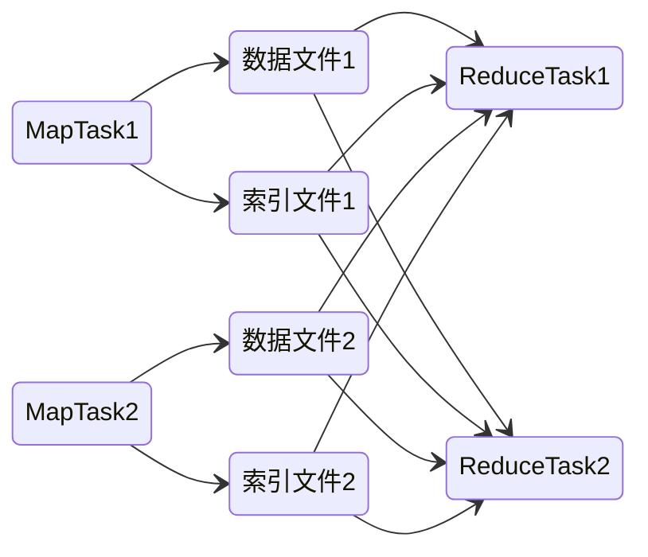

shuffle 的过程带来的开销不仅有 Map 阶段后的内存与磁盘方面，也有 Reduce 阶段数据分发的网络开销

#### DAG

在 Spark 开发下，对一个 RDD 上调用算子、封装计算逻辑，这个过程会衍生新的子 RDD，在子 RDD 之上，开发者还会继续调用其他算子，衍生出新的 RDD，如此往复便有了 DAG

而 DAG 的多个节点，会根据 Action 操作，并以 shuffle 为边界，形成多个 Stage。在同一 Stage 内部，所有算子融合为一个函数，Stage 的输出结果由这个函数一次性作用在输入数据集而产生，同一 Stage 内部的计算，都是在内存中进行的，同时由于将多个算子或操作融合为一个函数，所以也不会产生多份内存数据

### 调度系统

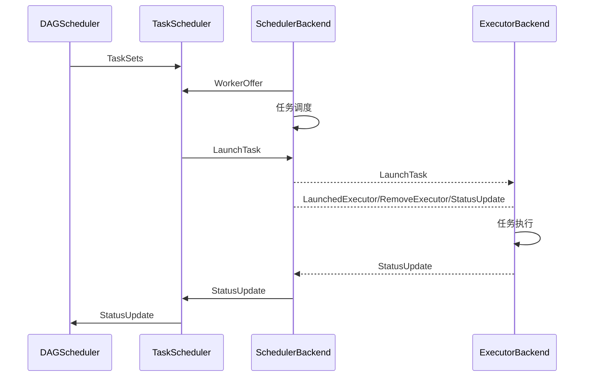

1. DAGScheduler 以 Shuffle 为边界，将开发者设计的计算图 DAG 拆分为多个执行阶段 Stages，然后为每个 Stage 创建任务集 TaskSet
2. SchedulerBackend 通过与 Executors 中的 ExecutorBackend 的交互来实时地获取集群中可用的计算资源，并将这些信息记录到 ExecutorDataMap 数据结构
3. 与此同时，SchedulerBackend 根据 ExecutorDataMap 中可用资源创建 WorkerOffer，以 WorkerOffer 为粒度提供计算资源
4. 对于给定 WorkerOffer，TaskScheduler 结合 TaskSet 中任务的本地性倾向，按照 PROCESS_LOCAL、NODE_LOCAL、RACK_LOCAL 和 ANY 的顺序，依次对 TaskSet 中的任务进行遍历，优先调度本地性倾向要求苛刻的 Task，尽量使计算向数据移动
5. 被选中的 Task 由 TaskScheduler 传递给 SchedulerBackend，再由 SchedulerBackend 分发到 Executors 中的 ExecutorBackend。Executors 接收到 Task 之后，即调用本地线程池来执行分布式任务。

### 存储系统

存储系统用于存储 RDD 缓存、Shuffle 中间文件、广播变量

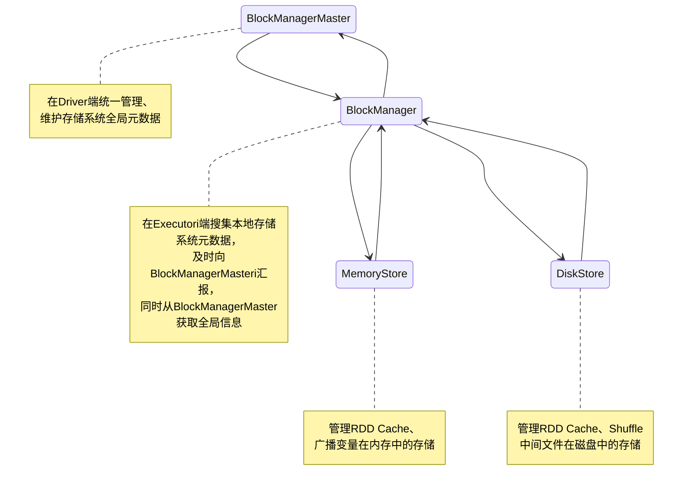

MemoryStore 同时支持存储对象值和字节数组这两种不同的数据形式，并且统一采用 MemoryEntry 数据抽象对它们进行封装，其内部会使用 LinkedHashMap 存储数据，以实现LRU算法

而 DiskStor 也会记录逻辑数据块 Block 与磁盘文件系统中物理文件的对应关系，每个 Block 都对应一个磁盘文件

### 内存管理

内存的区域划分：

- Execution Memory：用于执行分布式任务，如 Shuffle、Sort 和 Aggregate 等操作
- Storage Memory：用于缓存 RDD 和广播变量等数据
- User Memory：用于存储开发者自定义数据结构
- Reserved Memory：用来存储各种 Spark 内部对象，例如存储系统中的 BlockManager、DiskBlockManager 等

1.6 版本之后，Spark 推出了统一内存管理模式， Execution Memory 和 Storage Memory 之间可以相互转化

1. 如果对方的内存空间有空闲，双方就都可以抢占
2. 对于 RDD 缓存任务抢占的执行内存，当执行任务有内存需要时，RDD 缓存任务必须立即归还抢占的内存，涉及的 RDD 缓存数据要么落盘、要么清除
3. 对于分布式计算任务抢占的 Storage Memory 内存空间，即便 RDD 缓存任务有收回内存的需要，也要等到任务执行完毕才能释放

#### 广播变量

一种分发机制，它一次性封装目标数据结构，以 Executors 为粒度去做数据分发

当有两个数据集需要 join 时，可以利用广播变量将较小的数据集进行广播，避免 shuffle

### SparkSQL


#### DataSet

DataSet 所描述的数据都被组织到有名字的列中，就像关系型数据库中的表一样


#### DataFrame

可以被看作是一种特殊的 DataSet，但是它的每一列并不存储类型信息，所以在编译时并不能发现类型错误

从数据表示（Data Representation）的角度来看，是否携带 Schema 是 DataFrame 与 RDD 唯一的区别，RDD 算子多是高阶函数，这些算子允许开发者灵活地实现业务逻辑，表达能力极强

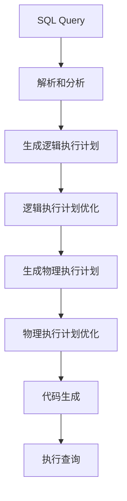

Catalyst 执行过程优化

- 逻辑执行计划生成（Logical Plan Generation）：在这一步骤中，Spark SQL 将解析和分析后的查询转换为逻辑执行计划。逻辑执行计划是一个抽象的表示，描述了查询的逻辑结构，但不包含具体的物理执行细节。
- 逻辑执行计划优化（Logical Plan Optimization）：一旦生成了逻辑执行计划，Spark SQL 引擎会执行一系列的逻辑优化操作，以改进查询的执行效率。这些优化操作包括谓词下推、列裁剪、表达式简化等。核心思想都是用尽一切办法，减少需要扫描和处理的数据量，降低后续计算的负载
- 物理执行计划生成（Physical Plan Generation）：在逻辑执行计划优化完成后，Spark SQL 引擎将逻辑执行计划转换为物理执行计划。物理执行计划描述了如何在分布式环境下执行查询，包括数据的分区、数据的分发和执行算子的顺序等。
- 物理执行计划优化（Physical Plan Optimization）：一旦生成了物理执行计划，Spark SQL 引擎会执行一些物理优化操作，以进一步改进查询的执行性能。这些操作包括数据本地化、并行执行、流水线处理等

### SparkStreaming

Spark Streaming 用时间片拆分了无限的数据流，然后对每一个数据片用类似于批处理的方法进行处理，输出的数据也是一块一块的，通过提供了一个对于流数据的抽象 DStream 来描述数据流，底层 DStream 也是由很多个序列化的 RDD 构成，按时间片（比如一秒）切分成的每个数据单位都是一个 RDD


主要缺点是实时计算延迟较高，这是由于 Spark Streaming 不支持太小的批处理的时间间隔

### StructuredStreaming

输入的数据流按照时间间隔（以一秒为例）划分成数据段。每一秒都会把新输入的数据添加到表中，Spark 也会每秒更新输出结果。输出结果也是表的形式，输出表可以写入硬盘或者 HDFS。


Structured Streaming 提供一个 level 更高的 API，这样的数据抽象可以让开发者用一套统一的方案去处理批处理和流处理

相比 SparkStreaming，StructuredStreaming可以支持更小的时间间隔，2.3 也引入了连续处理模式，同时也有对事件时间的支持

### 优化

3.0 引入了 Project Tungsten：

1. 在数据结构方面，Tungsten 自定义了紧凑的二进制格式，计算、内存效率比 Java 对象高
2. 利用 JVM 堆外内存来规避 GC 的开销
3. 用全阶段代码生成（Whol Stage Code Generation）取代火山迭代模型，不仅减少了虚函数调用和降低内存访问频率，还提升了 CPU cache 命中率

AQE（Adaptive Query Execution），可以在 Spark SQL 优化的过程中动态地调整执行计划：

1. 自动分区合并：当 shuffle 的 reduce 阶段产生了小分区后，这些小分区会被合并成一个较大的分区，减少调度开销
2. 自动数据倾斜处理：如果 AQE 发现某张表存在倾斜的数据分片，就会自动对它做加盐处理
3. ...

shuffle 优化：

1. 减少 shuffle 的数据量
2. 避免 shuffle，如果无法避免，则尽可能拖到最后再去 shuffle，这样也能减少 shuffle 的数据量

## Flink

### 架构


### 核心模型

最核心的数据结构是 Stream，它代表一个运行在多个分区上的并行流

当一个 Flink 程序被执行的时候，它会被映射为 Streaming Dataflow：


程序天生是并行和分布式的。一个 Stream 可以包含多个分区（Stream Partitions），一个操作符可以被分成多个操作符子任务，每一个子任务是在不同的线程或者不同的机器节点中独立执行的：


## Beam

一个适配流处理、批处理的中间层

### 编程模型

- 窗口：将无边界数据根据事件时间分成了一个个有限的数据集
- 水位线：来表示与数据事件时间相关联的输入完整性的概念，用来测量数据进度
- 触发器：指的是表示在具体什么时候，数据处理逻辑会真正地触发窗口中的数据被计算
- 累加模式：如果在同一窗口中得到多个运算结果，我们应该如何处理这些运算结果

### PCollection

- Parallel Collection，意思是可并行计算的数据集

特性：

- 需要编码器：需要将你的数据序列化/反序列化以在网络上传输
- 无序：以个 PCollection 被分配到不同的机器上执行，那么为了保证最大的处理输出，不同机器都是独立运行的，它的执行顺序就无从得知了
- 无界：Beam 要统一表达有界数据和无界数据，所以没有限制它的容量
- 不可变

### Transform

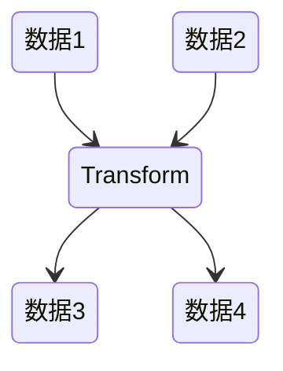

常见的 Transform 接口：

- ParDo：类似于flatMap
- GroupByKey：把一个 Key/Value 的数据集按 Key 归并

### Pipeline

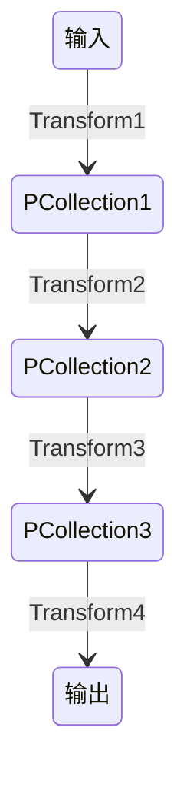

分布式环境下，整个数据流水线会启动 N 个 Workers 来同时处理 PCollection，在具体处理某一个特定 Transform 的时候，数据流水线会将这个 Transform 的输入数据集 PCollection 里面的元素分割成不同的 Bundle，将这些 Bundle 分发给不同的 Worker 来处理

在单个 Transfrom中，如果某一个 Bundle 里面的元素因为任意原因导致处理失败了，则这整个 Bundle 里的元素都必须重新处理

在多步骤的 Transform 上，如果处理的一个 Bundle 元素发生错误了，则这个元素所在的整个 Bundle 以及与这个 Bundle 有关联的所有 Bundle 都必须重新处理

### IO

- XXIO.read()
- XXIO.write()

## StreamingSQL

```sql
/* 窗口：最近10个温度的平均值 */
Select bid, avg(t) as T From BoilerStream WINDOW HOPPING (SIZE 10, ADVANCE BY 1);
/* join */
from TempStream[temp > 30.0]#window.time(1 min) as T
  join RegulatorStream[isOn == false]#window.length(1) as R
  on T.roomNo == R.roomNo
select T.roomNo, R.deviceID, 'start' as action
insert into RegulatorActionStream; // Siddhi Streaming SQL
/*  某个模式有没有在特定的时间段内发生 */
from every( e1=TempStream ) -> e2=TempStream[ e1.roomNo == roomNo and (e1.temp + 5) <= temp ]
    within 10 min
select e1.roomNo, e1.temp as initialTemp, e2.temp as finalTemp
insert into AlertStream;
```
