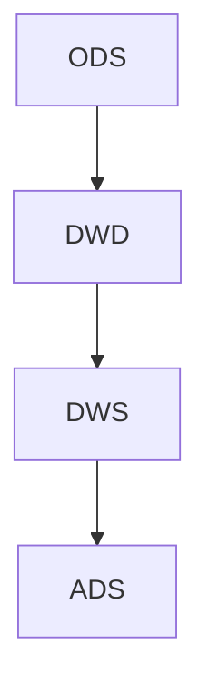

# 数据建模

## 概述（Overview）

数据建模（Data Modeling）是将业务世界的数据结构化、规则化并可实现化的过程，是数据治理、数据架构、数据仓库建设及各类数据产品的核心底层基础。
其价值在于：

* 将“业务逻辑”转化为“数据结构”
* 让企业的数据具备一致性、可理解性、可扩展性
* 为后续的数据存储、加工、分析、产品化提供统一框架

没有数据建模，企业的业务数据将陷入混乱：冗余、冲突、结构不可维护、跨系统无法对齐、指标无法统一。
优秀的数据模型让数据分析“轻如羽毛”，糟糕的数据模型让简单需求“举步维艰”。

---

## 本质（Essence）

数据建模的本质可总结为三个核心：

### 结构化表达的本质

以数据结构（实体、属性、关系）描述现实世界，提供**统一的抽象层**。
→ 解决业务描述模糊、阻断沟通的问题。

### 一致性保障的本质

使跨系统、跨业务的逻辑定义统一。
→ 同一个"用户"在所有系统里被同等理解。

### 未来可演进性的本质

模型不是仅满足当下，而是为未来演进保留结构冗余与扩展路径。
→ 使模型不因业务扩展而崩溃（如故事中的多端游戏公司案例）。

数据建模连接了“业务语言”和“数据语言”，是两者之间的翻译器。

---

## 模型（Model）

数据模型分为三层结构，它们构成信息从理解到技术实现的演化链：

### 概念模型（Conceptual Model）

* 描述核心业务实体及关系
* 统一业务概念
* 回答：“有什么？之间是什么关系？”

### 逻辑模型（Logical Model）

* 定义详细属性、结构及约束
* 独立于具体数据库
* 回答：“长什么样？”

### 物理模型（Physical Model）

* 在具体数据库中的落地
* 包含分区、索引、数据类型
* 回答：“怎么存？”

三层递进，缺一不可。

---

## 能力体系（Capability System）

数据建模作为一门工程体系，包含以下能力：

### 业务抽象能力

从需求中识别实体、事件、关系、约束。

### 结构设计能力

根据场景选择 ER、维度建模、宽表建模等合适方法。

### 粒度定义能力

正确确定记录的粒度，是建模成败的关键。

### 数据分层能力

基于 ODS/DWD/DWS/ADS 层次设计结构化模型。

### 性能优化能力

基于存储引擎、索引、分区、冗余策略等做物理优化。

### 数据一致性能力

保证跨表、跨域、跨系统的业务语义一致。

### 文档与治理能力

保证模型可维护、可追溯、可沟通。

这些能力构成了企业数据工程师与数据架构师的核心竞争力。

---

## 架构模型（Architecture Model）

结合数据平台实践，数据建模在数据分层体系中呈现清晰结构：

### ODS 层（原始数据层）

* 模型变化少
* 保留源系统结构
* 只做轻度清洗

### DWD 层（明细数据层）

* 核心建模层
* 使用“范式建模 + 宽表”并存策略
* 重点构建实体表、事务表、关系表

### DWS 层（汇总分析层）

* 使用维度建模
* 提供事实+维度的分析模型
* 时间窗口 & 汇总是关键设计点

### ADS 层（应用数据层）

* 以终为始
* 完全为场景服务（报表、推荐、实时应用等）

每层使用不同建模方法，形成完整的数据体系架构。

---

## 类型体系（Taxonomy）

数据建模主流类型如下：

### 范式建模（E-R 模型）

适合 OLTP，一致性强、冗余小。
实体、属性、关系三要素清晰。

### 维度建模

适合 OLAP，性能强、易理解，保留分析友好型结构。

### 宽表建模

适合大数据查询分布式场景，避免关联，高性能但牺牲一致性。

### 图模型

实体即节点，关系即边，适合关联密集型，如风控、推荐。

### 搜索引擎建模

反范式化、高冗余、为查询优化服务。

这些建模方法不是互斥，而是按层、按用途混合使用。

---

## 边界与生态（Boundary & Ecosystem）

### 和数据治理体系的关系

数据建模是数据治理的“结构层”，负责：

* 统一业务概念（元数据定义）
* 提供数据资产地图（实体、关系）
* 支撑数据质量规则（约束、主键、唯一性）
* 提供数据血缘的基础（字段、表结构）

### 与数据架构的关系

建模为数据架构提供“静态结构”，而数据架构处理“动态流动”。

### 与数据质量体系的关系

建模定义质量规则的数据结构（约束、关系、依赖）。

### 与元数据管理的关系

数据模型本身即元数据的关键组成部分。

模型是生态的中心节点。

---

## 治理体系（Governance System）

企业级的数据建模治理体系通常包括：

### 建模规范

命名规则、属性命名、主键格式、编码规则。

### 审核机制

模型上线前需经过数据架构师评审。

### 一致性管理

跨系统业务概念对齐（如统一的 user_id、product_id）。

### 文档体系

ER 图、字段说明、变更记录、版本管理。

### 变更治理

保障模型演进可控，避免破坏性更新。

---

## 演进趋势（Evolution）

数据建模正在从“结构化表示”进化为“智能化模型生成”：

### 从手工建模 → 半自动化建模

AI 基于元数据、查询日志、业务文档可自动生成概念/逻辑模型。

### 从静态结构 → 动态自调整模型

随业务变化自动推荐字段、表结构优化。

### 从单一模型 → 多模态数据模型

图、向量、结构化同时存在，模型需兼容多模态数据结构。

### 从规范化 → 性能导向优化

分布式计算促使反范式化、宽表模型继续普及。

---

## 选型方法论（Selection Framework）

可使用以下矩阵选择建模方法：

| 场景           | 优先模型   | 理由           |
| ------------ | ------ | ------------ |
| OLTP 系统      | 范式建模   | 强一致性、更新频繁    |
| 数据仓库 DWS     | 维度建模   | 易理解、高性能、分析友好 |
| 行为日志、大数据明细   | 宽表建模   | 避免 JOIN、查询快  |
| 强关系分析（风控/社交） | 图模型    | 关系密集         |
| 搜索与检索场景      | 搜索引擎建模 | 高并发索引查询      |

额外决策因素：

* 模型是否面向增长型业务
* 数据是否大量累积
* 查询模式是否固定
* 更新 vs 查询的权衡
* 业务未来是否有多端、多产品扩展风险

---

## 总结（Conclusion）

数据建模不是“画几张表”，而是一套系统工程：
它将业务的“真实世界结构”映射为“可计算结构”，形成企业数据体系的稳定地基。

优秀的数据建模能：

* 让数据一致、干净、可用
* 让分析简单、产品高效
* 让企业的复杂业务变得可控
* 让未来的扩展不再痛苦

数据建模是连接业务、工程、治理的核心桥梁，也是企业数字化能力最重要的底层基础设施之一。

## 关联内容（自动生成）

- [/数据技术/数据治理.md](/数据技术/数据治理.md) 数据治理与数据建模密切相关，数据建模是数据治理体系的核心组成部分，负责统一业务概念、提供数据资产地图、支撑数据质量规则和数据血缘关系
- [/数据技术/数据仓库.md](/数据技术/数据仓库.md) 数据仓库建设与数据建模密不可分，数据建模为数据仓库提供理论基础和方法论指导，数据仓库的分层架构（ODS/DWD/DWS/ADS）体现了数据建模的分层思想
- [/数据技术/数据架构.md](/数据技术/数据架构.md) 数据架构为数据建模提供结构化载体，数据建模是数据架构中数据组织和存储的核心方法，两者共同构成数据体系的静态结构与组织方式
- [/数据技术/元数据管理.md](/数据技术/元数据管理.md) 元数据管理与数据建模相互依存，数据建模结果是元数据的重要组成部分，元数据管理为数据模型提供描述、组织和治理能力，确保模型的可理解性和可管理性
- [/数据技术/数据分层.md](/数据技术/数据分层.md) 数据分层与数据建模共同构成数据资产化的底层结构，数据建模定义数据的结构和语义，数据分层组织数据的生产流程和各阶段形态，回答数据"是什么"与"如何组织"的问题
- [/数据技术/数据工程.md](/数据技术/数据工程.md) 数据工程实践需要基于规范的数据建模来组织数据生产流程，数据建模为数据工程提供标准化的数据处理路径，确保数据的一致性和可复用性
- [/数据技术/数据存储.md](/数据技术/数据存储.md) 数据建模的设计决策直接影响数据存储方案的选择，不同模型（如维度模型、范式模型）对存储结构（列式、行式、对象存储等）有不同要求，存储方案需与模型设计相匹配
- [/数据技术/数据集成.md](/数据技术/数据集成.md) 数据集成过程中需要遵循数据建模定义的标准和规范，数据建模为数据集成提供统一的数据结构和语义定义，确保跨系统数据的一致性和准确性
- [/数据技术/数据中台.md](/数据技术/数据中台.md) 数据中台建设依赖于清晰的数据建模，数据建模为中台提供统一的数据模型和指标体系，OneData方法论强调所有数据只加工一次，基于统一模型实现
- [/数据技术/数据网格.md](/数据技术/数据网格.md) 数据网格中的数据产品需要遵循良好的数据建模原则，每个数据产品都应包含结构化的数据模型，数据建模是实现数据产品可发现、可理解、可信赖的基础
- [/数据技术/数据分析.md](/数据技术/数据分析.md) 数据分析依赖数据建模提供的指标体系和维度模型，数据建模为分析提供标准化的数据基础，确保分析口径统一和数据可信，是数据分析质量的保障
- [/数据技术/流处理.md](/数据技术/流处理.md) 流处理场景中的数据模型设计有其特殊性，需要考虑实时性要求和数据的时变特性，数据建模在流处理中体现为对事件时间、水位线和窗口化处理的建模
- [/数据技术/任务调度系统.md](/数据技术/任务调度系统.md) 任务调度系统中的工作流（Workflow）本质上是一种控制流建模，与数据建模中的DAG（有向无环图）概念相通，两者都涉及依赖关系和执行顺序的建模与管理
