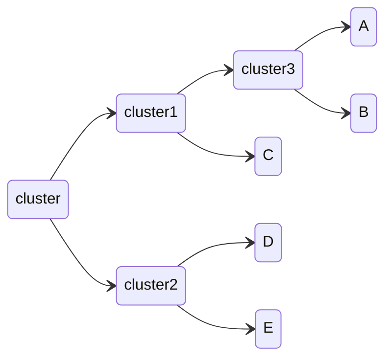
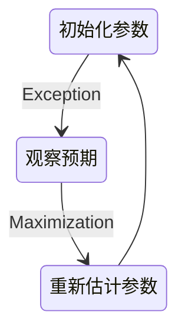
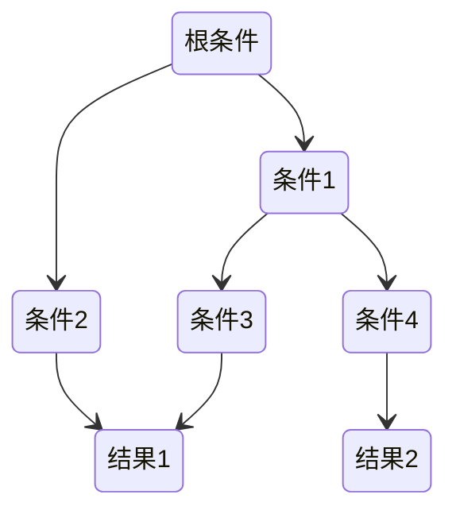

# 数据挖掘

## 基本流程

商业理解是数据挖掘项目成功的关键之一，因为这有助于确保项目从一开始就是针对商业目标而设计的。

数据理解和数据准备是数据挖掘的重要前提，因为数据质量对于最终的模型效果至关重要。

模型建立和模型评估是数据挖掘的核心步骤，这是构建和测试模型的关键阶段。

上线发布是数据挖掘项目的最终目标，因为这意味着模型已经被应用到商业实践中，并且提供了有价值的商业洞察。

监控和维护是确保数据挖掘结果持续有效的关键步骤，因为数据和商业需求都在不断变化，需要定期评估和更新模型

数据挖掘背后的数学原理：

- 概率论与数理统计：提供了数据建模和推断的理论基础
- 线性代数：特别是矩阵与向量
- 图论：来描述数据的结构关系
- 最优化方法：解决优化问题的工具

## 数据挖掘的任务

- 分类（Classification）：分类是将数据划分到不同的类别或标签中的任务。它通常用于有标记的数据，即每个数据都有一个预先定义好的标签。分类的目标是构建一个模型，该模型可以根据数据中的特征将未标记的数据分配到正确的类别中。
- 聚类（Clustering）：聚类是将数据划分为具有相似特征的组或簇的任务。聚类是一种无监督学习，即数据没有预先定义的标签或类别。聚类的目标是在数据中发现内在的结构或模式，并将数据分组为具有相似特征的组。
- 预测（Prediction）：预测是使用历史数据中的模式和关系来预测未来数据的任务。预测通常用于连续型数据，即数值型数据，而不是分类数据。预测的目标是构建一个模型，该模型可以使用历史数据来预测未来数据。
- 关联分析（Association Analysis）：关联分析是发现数据之间关系的任务。它通常用于交易数据，例如购物篮数据。关联分析的目标是发现数据中的频繁项集和关联规则，这些规则可以揭示数据之间的关系和模式。

## 关联规则挖掘

关联规则挖掘可以从数据集中发现项与项（item 与item）之间的关系

### 支持度

指一组频繁模式的出现概率，表示项集{X,Y}在总项集里出现的概率。表示A和B同时在总数I 中发生的概率

$$
Support(X,Y) = P(XY) = \frac{number(X,Y)}{number(总样本)}
$$

### 置信度

衡量频繁模式内部的关联关系，体现了一个数据出现后，另一个数据出现的概率

$$
Confidence(X ⇐ Y) = P(X|Y) = \frac{P(X|Y)}{P(Y)}
$$

### 提升度

表示含有X的条件下，同时含有Y的概率，与只看Y发生的概率之比。提升度反映了关联规则中的X与Y的相关性，提升度>1且越高表明正相关性越高，提升度<1且越低表明负相关性越高，提升度=1表明没有相关性，即相互独立

$$
Lift(X → Y) = \frac{P(Y|X)}{P(Y)}
$$

### Apriori 算法

如果 123 是频繁组合，则 12、13、23 也是频繁组合；若 12 是非频繁组合，则 123 也是非频繁组合

### FP-Growth 算法

创建了一棵 FP 树来存储频繁项集。在创建前对不满足最小支持度的项进行删除，减少了存储空间，整个生成过程只遍历数据集 2 次

## 聚类

### 分级聚类

不断将最为相似的群组两两合并

使用树状图来可视化聚类结果，通过路径长度来体现各元素的相似度：

### K-均值聚类

1. 随机确定k个中心位置
2. 将各个数据项分配个最近的中心点
3. 将中心点移动到各个节点的平均位置
4. 重复2-3 直到不再变化

如果某个点比较倒霉，初始被分配到的地方找不到与其最近的点，那一般就会把这个聚类去掉，变成 K - 1 个聚类

所以，代价函数是

$$
J =\frac{1}{m}\sum_{i=1}^{m}\|x^{(i)}-\mu_{c^{(i)}}\|^{2}
$$

如果代价函数值增加了，一定是实现出了问题

选择初始点：

1. K要小于训练数据数量
2. 随机从训练数据中挑选 K 个点作为初始点
3. 这种随机初始化有可能找到的是局部最优解，所以需要多轮随机选择，选择代价函数最小的初始点

选择K：

1. 一种办法是尝试不同的K，使用代价函数较小，K也合适的，这会导致算法偏向于更大的K
2. 另外一种选择K的办法是K应该是要跟解决的问题相关，要根据业务来决定

### EM聚类

EM 算法相当于一个框架，你可以采用不同的模型来进行聚类，比如 GMM（高斯混合模型），或者 HMM（隐马尔科夫模型）来进行聚类

### AdaBoost

通过训练多个弱分类器，将它们组合成一个强分类器

假设弱分类器为 Gi​(x)，它在强分类器中的权重 αi​，那么就可以得出强分类器 f(x)：

$$
f(x)=\sum_{i=1}^n\alpha_iG_i(x)
$$

如果弱分类器的分类效果好，那么权重应该比较大，如果弱分类器的分类效果一般，权重应该降低

## 优化

- 随机优化：对拥有大量题解的一个问题，选取一个可优化的题解进行优化

### 蒙特卡洛算法和拉斯维加斯算法

- 两类算法的统称，利用随机的方法来简化整体的算法过程

蒙特卡罗算法原理：每次计算都尽量尝试找更好的结果路径，但不保证是最好的结果路径。用这样寻找结果的方法，无论何时都会有结果出来，而且给的时间越多、尝试越多，最终会越近似最优解

拉斯维加斯算法原理：就是每次计算都尝试找到最好的答案，但不保证这次计算就能找到最好的答案，尝试次数越多，越有机会找到最优解

### 成本函数

用一个值代表方案的好坏程度 值越大代表方案越差，对于一个问题，会有多种变量，则需要对这些变量进行归一化计算，从而确定哪些变量更重要

若果可能，让最优解的成本函数为0，这样子当找到最优解后就可以停止后续的查找

### 随机搜索

生成一定范围内的随机题解，代入成本函数，也许可以得到一个可以接受的题解

### 爬山法

随机选取一个题解，在这个题解临近的解题空间内寻找成本更低的题解

这种方式问题是得到题解的可能只是局部最优而非全局最优

### 模拟退火算法

随机选取一个题解，然后也会跟爬山法一样尝试寻找成本更低的解

区别在于如果发现新的题解比老的题解花费的成本更高，这个题解可能也会被接收（随机），但随着迭代次数不断增加（温度下降），这种花费成本更高的题解被接受的概率会越来越小

### 遗传算法

随机选取一组题解，对这些题解的成本函数进行排序

选取成本函数最小的一部分顶端题解，称之为**精英选拔**，创建新种群，新种群的其他题解都是根据这些精英演变而来的

演变的方式有两种：

- 变异：对题解的某一个变量做一个微小的调整
- 配对：调两个题解按某种方式进行交叉结合

## 分类

- 纯度：数据集中的样本全部属于同一类别，即数据集完全“纯”的程度
- 熵：集合的混乱程度越高，熵越高，熵为0时，代表集合绝对有序，熵的计算： $H(p_{1})=-p_1log_2(p_1)-(1-p_1)log_2(1-p_1)$，$p_1$代表某一类在集合中的概率

### 决策树

需要对结构化的数据进行预测，在结果为某种分类时，适合使用。决策树尝试得到训练数据的多棵决策树，从中选择一个效果最好的

1. 根条件的选择：选择能将左右分支两个集合的熵划分的最小的条件
2. 何时停止划分
   1. 节点下的集合都属于同一个分类
   2. 树已经达到了最大深度，继续划分只会变得过拟合
   3. 划分带来的纯度提升小于设定阈值
   4. 节点下集合项小于设定阈值

使用信息增益衡量每次划分减少了多少熵，结果越大代表减少的熵越多：

$$
H(p_1^{root}-\left(w^{left}H\left(p_1^{left}\right)+w^{right}H\left(p_1^{right}\right)\right)
$$

对于取指不止两个的特征，可以采取 one-hot 编码，如果一个特征有 k 个取指，那就可以把它转换成 k 个只能取0 1 的特征

对于拥有连续值的特征，则需要多次尝试不同的取值，使得以该值划分的两类集合获得的信息增益最高

#### 剪枝

训练出来的决策树可能会对训练数据**过拟合**，所以需要在合适的情况下停止拆分决策树的子节点

预剪枝：在构造的过程中对节点进行评估，如果对某个节点进行划分，在验证集中不能带来准确性的提升，就不对其进行拆分

后剪枝：构造完决策树之后，逐层向上对每个节点进行评估。如果剪掉这个节点子树，与保留该节点子树在分类准确性上差别不大，或者剪掉该节点子树，能在验证集中带来准确性的提升，那么就可以把该节点子树进行剪枝。方法是：用这个节点子树的叶子节点来替代该节点，类标记为这个节点子树中最频繁的那个类

#### ID3算法

计算的是信息增益，就是划分可以带来纯度的提高，倾向于选择取值比较多的属性，但这个属性可能对于分类并没有太大作用

#### C4.5算法

- 采用信息增益率的方式来选择属性。信息增益率 = 信息增益 / 属性熵
- 悲观剪枝：递归估算每个内部节点的分类错误率，比较剪枝前后这个节点的分类错误率来决定是否对其进行剪枝
- 对于连续属性的处理是通过将连续属性离散化来实现，选择具有最高信息增益的划分所对应的阈值
- 对于缺失值所在的样本，将其划分到各个子集中，并计算其对应的信息增益，最终选择信息增益最大的子集进行划分

#### CART算法

- Classification And Regression Tree，分类回归树

分类树处理离散数据，输出样本类别；回归树处理连续数据，输出回归预测

基尼系数是一种衡量纯度的方法：随机选取两个样本，其类别不一致的概率，这个概率越低则样本最稳定

CART 分类树算法中，基于基尼系数对特征属性进行二元分裂

CART 回归树算法中，根据样本的混乱程度，也就是样本的离散程度来评价“不纯度”

剪枝：采用的是代价复杂度剪枝方法

#### 随机森林

一个包含多个决策树的分类器，每一个子分类器都是一棵 CART 分类回归树

为了随机构造多棵树，需要使用采样替换技术：每次随机抽取一条训练数据记录，放回，重新抽取并重复这个过程，这样可以生成多份随机的训练，并使用这些随机的训练数据去生成多颗决策树

做分类的时候，输出结果是每个子分类器的分类结果中最多的那个，做回归的时候，输出结果是每棵 CART 树的回归结果的平均值

#### XGBoost

#### 时间序列预测

- Auto Regressive：自回归模型。这个算法的思想比较简单，它认为过去若干时刻的点通过线性组合，再加上白噪声就可以预测未来某个时刻的点
- Moving Average：滑动平均模型。它与 AR 模型大同小异，AR 模型是历史时序值的线性组合，MA 是通过历史白噪声进行线性组合来影响当前时刻点
- Auto Regressive Moving Average：自回归滑动平均模型，也就是 AR 模型和 MA 模型的混合
- Auto Regressive Integrated Moving Average：相比于 ARMA，ARIMA 多了一个差分的过程，作用是对不平稳数据进行差分平稳，在差分平稳后再进行建模

#### 回归树

每一片叶子都输出一个预测值。预测值一般是该片叶子所含训练集元素输出的均值

回归树中每个节点选择那个特征，都遵循划分使得一个节点下所有值的方差最小的原则，这点跟使用信息增益来分裂节点原理一样

### KNN

找出k个与当前元素相似的元素，对这些元素求均值，从而做出对当前元素的预测

过多或过少的k都会导致结果不准

如果 K 值比较小，就相当于未分类物体与它的邻居非常接近才行。这样产生的一个问题就是，如果邻居点是个噪声点，那么未分类物体的分类也会产生误差，这样 KNN 分类就会产生过拟合。

如果 K 值比较大，相当于距离过远的点也会对未知物体的分类产生影响，虽然这种情况的好处是鲁棒性强，但是不足也很明显，会产生欠拟合情况，也就是没有把未分类物体真正分类出来。一般采用交叉验证的方式选取 K 值

### 近邻权重

将相似度（距离）转为权重

- 反函数：距离的导数
- 减法函数：使用一个常量减去距离，如果为正数，则权重就是为该正数，否则权重为0
- 高斯函数：在距离为0时权重为1，随着距离增加无限接近0

### 加权K-最近邻

- 每个元素的值需要乘以权重

### 线性分类

- 构造分类中所有数据的平均值为中心点，新的数据根据距离离中心点的距离判断是哪类

### 核技法

### 支持向量机SVM

常见的一种分类方法，在机器学习中，SVM 是有监督的学习模型

SVM 就是帮我们找到一个超平面，这个超平面能将不同的样本划分开，同时使得样本集中的点到这个分类超平面的最小距离（即分类间隔）最大化，SVM 就是求解最大分类间隔的过程

硬间隔指的就是完全分类准确，不能存在分类错误的情况。软间隔，就是允许一定量的样本分类错误

非线性SVM：有些数据样本没法通过线性函数划分，就引入核函数将样本从原始空间映射到一个更高维的特质空间中，使得样本在新的空间中线性可分

多分类问题：SVM 本身是一个二值分类器，最初是为二分类问题设计的，可以将多个二分类器组合起来形成一个多分类器：

1. 一对多：把其中的一类作为分类 1，其他类统一归为分类 2
2. 一对一：在任意两类样本之间构造一个 SVM，每一个分类器都会有一个分类结果，得票多者胜

### 费舍尔方法

## 模型评估

### 离线评估

Holdout 检验：将原始的样本集合随机划分为训练集和测试集两部分，评估的结果有一定随机性

交叉校验：为了消除 Holdout 检验的随机性，将全部样本划分成 k 个大小相等的样本子集，然后依次遍历这 k 个子集，每次把当前遍历到的子集作为验证集，其余所有的子集作为训练集，这样依次进行 k 次模型的训练和评估，再将所有 k 次评估指标的平均值作为最终的评估指标

自助法：对于总数为 n 的样本集合，先进行 n 次有放回地随机抽样，得到大小为 n 的训练集。在 n 次采样过程中，有的样本会被重复采样，有的样本没有被抽出过，再将这些没有被抽出的样本作为验证集进行模型验证

时间切割：将时间序列数据分为训练集和测试集，在某一个时间点之前的数据用作训练集，之后的数据用作验证集，防止模型在训练和评估过程中引入未来信息

离线 Replay：根据数据生成时间对测试样本进行排序，并根据模型的更新时间点，逐步更新模型并评估模型在更新前后的性能，以更准确地反映模型在生产环境中的表现

#### 评估指标

- 正样本：即属于某一类的样本
- 负样本：即不属于某一类的样本

对比项 | 正类 | 负类
-|-|-
被检索	|True Positive|	False Positive
未检索|	False Negative|	True Negative

- 准确率(Accuracy)：指分类正确的样本占总样本个数的比例 $(TP + TN) / ALL$
- 查准率（Precision）：被正确检索的样本数 与 被检索到样本总数之比 $TP / (TP + FP)$
- 查全率（Recall）：被正确检索的样本数 与 应当被检索到的样本数之比 $TP / (TP + FN)$

宁愿漏掉，不可错杀：Precision 将是一个被侧重关心的指标。宁愿错杀，不可漏掉：Recall 将是一个被侧重关心的指标。当两个数字都很高时，表示模型有很好的效果

F-Score，用来综合考虑 Precision 与 Recall，$\beta$是用来调整 Precision 与 Recall 二者的权重，这个分数越高代表 Precision 与 Recall 更平衡：

$$
FS=\left(1+\beta^2\right)\cdot\frac{Precision\cdot Recall}{\beta^2\cdot(Precision+Recall)}
$$

对数损失：

$$
\begin{aligned}-\frac{1}{N}\sum_{i=1}^{N}\left(y_i\log P_1+(1-y_i)\log\left(1-P_i\right)\right)\end{aligned}
$$

（二分类对数损失函数）

yi​ 是输入实例 xi​ 的真实类别, pi​ 是预测输入实例 xi​ 是正样本的概率，N 是样本总数

（多分类对数损失函数）

$$
\text{Multi-LogLoss }=-\frac1n\sum_{i=1}^n\sum_{j=1}^my_{i,j}\log{(p_{i,j})}
$$

均方根误差：用来评估预测连续值的模型的效果

$$
\mathrm{RMSE}=\sqrt{\frac{\sum_{i=1}^n\left(y_i-\hat{y}_l\right)^2}n}
$$

yi​ 是第 i 个样本点的真实值，y^​l​ 是第 i 个样本点的预测值，n 是样本点的个数。那么均方根误差越小，就证明这个回归模型预测越精确

P-R曲线：横轴是召回率，纵轴是精确率，可以用来对比不同模型在固定召回率或精确率的情况，另外一个指标怎样

ROC曲线：横坐标是 False Positive Rate（FPR，假阳性率），纵坐标是 True Positive Rate （TPR，真阳性率）

平均精度均值：
