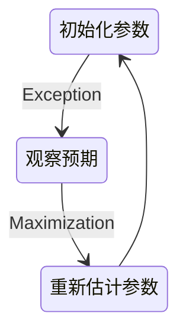
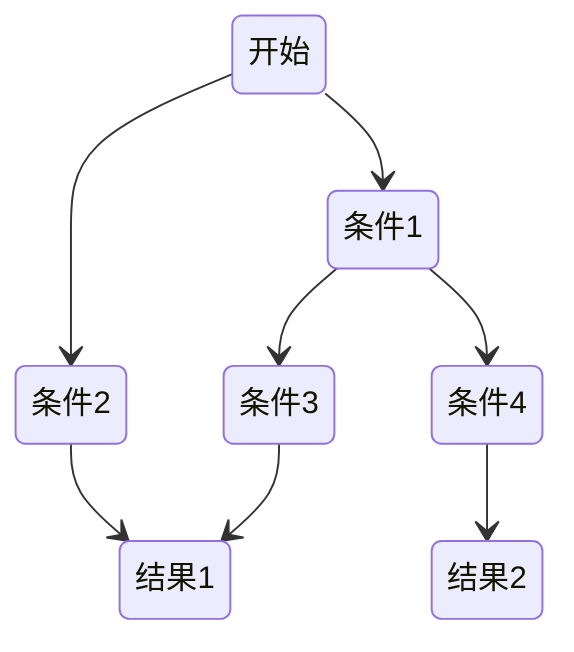

# 数据挖掘

## 基本流程

商业理解是数据挖掘项目成功的关键之一，因为这有助于确保项目从一开始就是针对商业目标而设计的。

数据理解和数据准备是数据挖掘的重要前提，因为数据质量对于最终的模型效果至关重要。

模型建立和模型评估是数据挖掘的核心步骤，这是构建和测试模型的关键阶段。

上线发布是数据挖掘项目的最终目标，因为这意味着模型已经被应用到商业实践中，并且提供了有价值的商业洞察。

监控和维护是确保数据挖掘结果持续有效的关键步骤，因为数据和商业需求都在不断变化，需要定期评估和更新模型

数据挖掘背后的数学原理：

- 概率论与数理统计：提供了数据建模和推断的理论基础
- 线性代数：特别是矩阵与向量
- 图论：来描述数据的结构关系
- 最优化方法：解决优化问题的工具

数据挖掘的任务：

- 分类（Classification）：分类是将数据划分到不同的类别或标签中的任务。它通常用于有标记的数据，即每个数据都有一个预先定义好的标签。分类的目标是构建一个模型，该模型可以根据数据中的特征将未标记的数据分配到正确的类别中。
- 聚类（Clustering）：聚类是将数据划分为具有相似特征的组或簇的任务。聚类是一种无监督学习，即数据没有预先定义的标签或类别。聚类的目标是在数据中发现内在的结构或模式，并将数据分组为具有相似特征的组。
- 预测（Prediction）：预测是使用历史数据中的模式和关系来预测未来数据的任务。预测通常用于连续型数据，即数值型数据，而不是分类数据。预测的目标是构建一个模型，该模型可以使用历史数据来预测未来数据。
- 关联分析（Association Analysis）：关联分析是发现数据之间关系的任务。它通常用于交易数据，例如购物篮数据。关联分析的目标是发现数据中的频繁项集和关联规则，这些规则可以揭示数据之间的关系和模式。

## 数据集成

- ETL：提取 (Extract)——转换 (Transform)——加载 (Load)，在数据源抽取后首先进行转换，然后将转换的结果写入目的地
- ELT：提取 (Extract)——加载 (Load)——变换 (Transform)，在抽取后将结果先写入目的地，然后利用数据库的聚合分析能力或者外部计算框架在最后对数据做转换

ELT相比ETL，因为转换是在目的地，所以可以根据后续使用的情况做调整，比较灵活

### 数据清洗

需要一些清洗规则帮助确保数据质量和一致性，减少数据中的错误、不完整、重复等问题，使得数据标准、干净、连续

### 数据变换

- 数据变换在数据分析中的角色

1. 数据平滑：去除数据中的噪声，将连续数据离散化
2. 数据聚集：对数据进行汇总
3. 数据概化：将数据由较低的概念抽象成为较高的概念，减少数据复杂度，即用更高的概念替代更低的概念。比如说上海、杭州、深圳、北京可以概化为中国
4. 数据规范化：使属性数据按比例缩放，这样就将原来的数值映射到一个新的特定区域中
   1. Min-max 规范化：将原始数据变换到[0,1]的空间中
   2. Z-Score 规范化：新数值 =（原数值 - 均值）/ 标准差
   3. 小数定标规范化：移动小数点的位置来进行规范化。小数点移动多少位取决于属性 A 的取值中的最大绝对值
5. 属性构造：构造出新的属性并添加到属性集中

## 推荐

协作型算法：对一大群人进行搜索，找到与该用户相近的用户

- 基于用户的协作型过滤 为用户计算与其他用户的相似度
- 基于物品的协作型过滤 为物品计算与其他物品的相似度 需要提前计算好物品的相似集合

### 收集偏好

不管偏好是评价何物品 最终都需要一种方法将其对应到数字：

使用这一的一个item表示某一用户的偏好：

```py
'Toby': {'Snakes on a Plane': 4.5, 'You, Me and Dupree': 1.0, 'Superman Returns': 4.0}
```

### 寻找相似的用户

#### 欧几里得距离评价


通过将用户转换为坐标中的点 计算点之间的距离 距离越近越相似

```py
def sim_distance(prefs, person1, person2):
    # 得到shared_items的列表
    si = {}
    for item in prefs[person1]:
        if item in prefs[person2]:
            si[item] = 1

    # 如果两者没有共同之处，则返回0
    if len(si) == 0:
        return 0

    # 计算所有差值的平方和
    sum_of_squares = 0
    for item in si.keys():
        # 这里所做的就是等同于在计算二维中x y 的差值
        sum_of_squares = sum_of_squares + pow(prefs[person1][item] - prefs[person2][item], 2)

    return 1 / (1 + sqrt(sum_of_squares))
```

#### 皮尔逊相关度评价

判断两组数据与某一直线拟合程度的度量


```py
def sim_pearson(prefs, p1, p2):
    # 得到双方都曾评价过的物品列表
    si = {}
    for item in prefs[p1]:
        if item in prefs[p2]:
            si[item] = 1

    # 如果两者没有共同之处，则返回0
    if len(si) == 0:
        return 0

    # 得到列表元素的个数
    n = len(si)

    # 对所有偏好求和
    sum1 = sum([prefs[p1][it] for it in si])
    sum2 = sum([prefs[p2][it] for it in si])

    # 求平方和
    sum1Sq = sum([pow(prefs[p1][it], 2) for it in si])
    sum2Sq = sum([pow(prefs[p2][it], 2) for it in si])

    # 求乘积之和
    pSum = sum([prefs[p1][it] * prefs[p2][it] for it in si])

    # 计算皮尔逊评价值
    num = pSum - (sum1 * sum2 / n)
    den = sqrt((sum1Sq - pow(sum1, 2) / n) * (sum2Sq - pow(sum2, 2) / n))
    if den == 0:
        return 0

    r = num / den

    return r
```

### 为某一用户找出与其相似的用户

```py
def topMatches(prefs, person, n=5, similarity=sim_pearson):
    scores = [(similarity(prefs, person, other), other)
              for other in prefs if other != person]
    scores.sort()
    scores.reverse()
    return scores[0:n]
```

### 根据相似用户推荐物品

```py
def getRecommendations(prefs, person, similarity=sim_pearson):
    totals = {}
    simSums = {}
    for other in prefs:
        # 不和自己比较
        if other == person:
            continue
        sim = similarity(prefs, person, other)

        # 忽略相似度小于等于0的用户
        if sim <= 0: continue
        for item in prefs[other]:
            # 只对自己还未评价过的电影推荐
            if item not in prefs[person] or prefs[person][item] == 0:
                # 计算某部影片的分值
                totals.setdefault(item, 0)
                totals[item] += prefs[other][item] * sim
                # 每部影片的评价人相似度总和
                simSums.setdefault(item, 0)
                simSums[item] += sim

    # 计算一个归一化列表
    rankings = [(total / simSums[item], item) for item, total in totals.items()]

    # Return the sorted list
    rankings.sort()
    rankings.reverse()
    return rankings
```

### 匹配物品

通过将物品与人交换 可以使用查找相似的用户的算法来查找相似的物品

```py
def transformPrefs(prefs):
    result = {}
    for person in prefs:
        for item in prefs[person]:
            result.setdefault(item, {})

            # Flip item and person
            result[item][person] = prefs[person][item]
    return result
```

### 构造物品相似集合

```py
def calculateSimilarItems(prefs, n=10):
    # 建立一个key为物品 value为与其相似相近物品的的字典
    result = {}

    # 反转物品与人
    itemPrefs = transformPrefs(prefs)
    c = 0
    for item in itemPrefs:
        # 针对大数据更新状态变量
        c += 1
        if c % 100 == 0:
            print("%d / %d" % (c, len(itemPrefs)))
        # 寻找最为相近的物品
        scores = topMatches(itemPrefs, item, n=n, similarity=sim_distance)
        result[item] = scores
    return result
```

### 使用提前构造好的数据集获得推荐

```py
def getRecommendedItems(prefs, itemMatch, user):
    userRatings = prefs[user]
    scores = {}
    totalSim = {}
    # 遍历当前用户评价过的物品
    for (item, rating) in userRatings.items():

        # 遍历与当前物品相近的物品
        for (similarity, item2) in itemMatch[item]:

            # 忽略已经被评价过的物品
            if item2 in userRatings: continue
            # 分数是通过相似度*评分
            scores.setdefault(item2, 0)
            scores[item2] += similarity * rating
            # Sum of all the similarities
            totalSim.setdefault(item2, 0)
            totalSim[item2] += similarity

    # Divide each total score by total weighting to get an average
    rankings = [(score / totalSim[item], item) for item, score in scores.items()]

    # Return the rankings from highest to lowest
    rankings.sort()
    rankings.reverse()
    return rankings
```

## 关联分析

- 支持度：指一组频繁模式的出现概率

$$
Support(X,Y) = P(XY) = \frac{number(X,Y)}{number(总样本)}
$$

- 置信度：衡量频繁模式内部的关联关系，体现了一个数据出现后，另一个数据出现的概率

$$
Confidence(X ⇐ Y) = P(X|Y) = \frac{P(X|Y)}{P(Y)}
$$

Apriori 算法：经典的频繁项集的挖掘算法


## 群组

- 监督学习：利用样本和期望输出来学习如何预测
- 无监督学习：在一组数据中寻找某种结构

### 分级聚类

不断将最为相似的群组两两合并


使用树状图来可视化聚类结果：


通过距离来体现各元素的相似度

计算两个数字列表的相关度：

```py
def pearson(v1, v2):
    # 简单求和
    sum1 = sum(v1)
    sum2 = sum(v2)

    # 平方根和
    sum1Sq = sum([pow(v, 2) for v in v1])
    sum2Sq = sum([pow(v, 2) for v in v2])

    # 乘积之和
    pSum = sum([v1[i] * v2[i] for i in range(len(v1))])

    # Calculate r (Pearson score)
    num = pSum - (sum1 * sum2 / len(v1))
    den = sqrt((sum1Sq - pow(sum1, 2) / len(v1)) * (sum2Sq - pow(sum2, 2) / len(v1)))
    if den == 0: return 0

    return 1.0 - num / den
```

代表一个聚类节点：

```py
class bicluster:
    def __init__(self, vec, left=None, right=None, distance=0.0, id=None):
        self.left = left
        self.right = right
        self.vec = vec
        self.id = id
        self.distance = distance
```

### 列聚类

将矩阵转置

```py
def rotatematrix(data):
    newdata = []
    for i in range(len(data[0])):
        newrow = [data[j][i] for j in range(len(data))]
        newdata.append(newrow)
    return newdata
```

可以得到单词的聚类结果

### K-均值聚类

1. 随机确定k个中心位置
2. 将各个数据项分配个最近的中心点
3. 将中心点移动到各个节点的平均位置
4. 重复2-3 直到不再变化

```py
def kcluster(rows, distance=pearson, k=4):
    # 确定每个点的最大最小值
    ranges = [(min([row[i] for row in rows]), max([row[i] for row in rows]))
              for i in range(len(rows[0]))]

    # 随机创建k个中心点
    clusters = [[random.random() * (ranges[i][1] - ranges[i][0]) + ranges[i][0]
                 for i in range(len(rows[0]))] for j in range(k)]

    lastmatches = None

    for t in range(100):
        dis_sum = 0
        print('Iteration %d' % t)
        bestmatches = [[] for i in range(k)]

        # 在每一行中寻找距离最近的中心点
        for j in range(len(rows)):
            row = rows[j]
            bestmatch = 0
            for i in range(k):
                d = distance(clusters[i], row)
                if d < distance(clusters[bestmatch], row):
                    bestmatch = i
            dis_sum += d
            bestmatches[bestmatch].append(j)

        # 如果与上次结果相同 则结束
        if bestmatches == lastmatches:
            break
        lastmatches = bestmatches

        # 把中心移到其所有成员的平均位置处
        for i in range(k):
            avgs = [0.0] * len(rows[0])
            if len(bestmatches[i]) > 0:
                for rowid in bestmatches[i]:
                    for m in range(len(rows[rowid])):
                        avgs[m] += rows[rowid][m]
                for j in range(len(avgs)):
                    avgs[j] /= len(bestmatches[i])
                clusters[i] = avgs

    return bestmatches, dis_sum
```

### 二维形式展示

在一个二维平面 通过不同数据项的距离来计算得到一个二维平面图

```py
def scaledown(data, distance=pearson, rate=0.01):
    n = len(data)

    # 每一对数据项之间的距离
    realdist = [[distance(data[i], data[j]) for j in range(n)]
                for i in range(0, n)]

    # 随机初始化节点再二维空间的起始位置
    loc = [[random.random(), random.random()] for i in range(n)]
    fakedist = [[0.0 for j in range(n)] for i in range(n)]

    lasterror = None
    for m in range(0, 1000):
        # 寻找投影后的距离
        for i in range(n):
            for j in range(n):
                fakedist[i][j] = sqrt(sum([pow(loc[i][x] - loc[j][x], 2)
                                           for x in range(len(loc[i]))]))

        # 移动节点
        grad = [[0.0, 0.0] for i in range(n)]

        totalerror = 0
        for k in range(n):
            for j in range(n):
                if j == k: continue
                # The error is percent difference between the distances
                errorterm = (fakedist[j][k] - realdist[j][k]) / realdist[j][k]

                # Each point needs to be moved away from or towards the other
                # point in proportion to how much error it has
                grad[k][0] += ((loc[k][0] - loc[j][0]) / fakedist[j][k]) * errorterm
                grad[k][1] += ((loc[k][1] - loc[j][1]) / fakedist[j][k]) * errorterm

                # Keep track of the total error
                totalerror += abs(errorterm)
        print(totalerror)

        # If the answer got worse by moving the points, we are done
        if lasterror and lasterror < totalerror: break
        lasterror = totalerror

        # Move each of the points by the learning rate times the gradient
        for k in range(n):
            loc[k][0] -= rate * grad[k][0]
            loc[k][1] -= rate * grad[k][1]

    return loc
```

### EM聚类



EM 算法相当于一个框架，你可以采用不同的模型来进行聚类，比如 GMM（高斯混合模型），或者 HMM（隐马尔科夫模型）来进行聚类

### AdaBoost

通过训练多个弱分类器，将它们组合成一个强分类器

假设弱分类器为 Gi​(x)，它在强分类器中的权重 αi​，那么就可以得出强分类器 f(x)：

$$
f(x)=\sum_{i=1}^n\alpha_iG_i(x)
$$

如果弱分类器的分类效果好，那么权重应该比较大，如果弱分类器的分类效果一般，权重应该降低

## 搜索与排名

### 建立索引


### 分词

从html结构中获取文本节点，对其分词

```py
def gettextonly(self, soup):
    v = soup.string
    if len(v) == 0:
        c = soup.contents
        resulttext = ''
        for t in c:
            subtext = self.gettextonly(t)
            resulttext += subtext + '\n'
        return resulttext
    else:
        return v.strip()

# 使用正则表达式进行分词
@staticmethod
def separatewords(self, text):
    splitter = re.compile('\\W*')
    return [s.lower() for s in splitter.split(text) if s != '']
```

### 查询

1. 进行分词
2. 查找分出的词的响应ID
3. 根据这些词来查找相关url

```py
def getmatchrows(self, q):
    # 构造sql查询条件字符串
    fieldlist = 'w0.urlid'
    tablelist = ''
    clauselist = ''
    wordids = []
    # 分词
    words = q.split(' ')
    tablenumber = 0
    for word in words:
        # 获取单词的ID
        wordrow = self.con.execute(
            "select rowid from wordlist where word='%s'" % word).fetchone()
        if wordrow is not None:
            wordid = wordrow[0]
            wordids.append(wordid)
            if tablenumber > 0:
                tablelist += ','
                clauselist += ' and '
                clauselist += 'w%d.urlid=w%d.urlid and ' % (tablenumber - 1, tablenumber)
            fieldlist += ',w%d.location' % tablenumber
            tablelist += 'wordlocation w%d' % tablenumber
            clauselist += 'w%d.wordid=%d' % (tablenumber, wordid)
            tablenumber += 1
    # 根据条件进行查询
    fullquery = 'select %s from %s where %s' % (fieldlist, tablelist, clauselist)
    print(fullquery)
    cur = self.con.execute(fullquery)
    rows = [row for row in cur]
    return rows, wordids
```

### 基于内容的排名

使用一个归一化函数将结果映射到0-1之间：

```py
def normalizescores(self, scores, smallIsBetter=0):
    vsmall = 0.00001  # 避免除0
    if smallIsBetter:
        minscore = min(scores.values())
        return dict([(u, float(minscore) / max(vsmall, l)) for (u, l) in scores.items()])
    else:
        maxscore = max(scores.values())
        if maxscore == 0: maxscore = vsmall
        return dict([(u, float(c) / maxscore) for (u, c) in scores.items()])
```

#### 单词频度

根据单词在网页中出现的次数对网页进行评价

```py
def frequencyscore(self, rows):
    counts = dict([(row[0], 0) for row in rows])
    for row in rows: counts[row[0]] += 1
    return self.normalizescores(counts)
```

#### 文档位置

根据单词离文档首部的距离进行评价

```py
def locationscore(self, rows):
    locations = dict([(row[0], 1000000) for row in rows])
    for row in rows:
        loc = sum(row[1:])
        if loc < locations[row[0]]: locations[row[0]] = loc
    return self.normalizescores(locations, smallIsBetter=1)
```

#### 单词距离

单词间距更近 得分越高

```py
def distancescore(self, rows):
    # 只有一个单词 则得分一样
    if len(rows[0]) <= 2: return dict([(row[0], 1.0) for row in rows])
    # 初始化分数 很大
    mindistance = dict([(row[0], 1000000) for row in rows])
for row in rows:
        dist = sum([abs(row[i] - row[i - 1]) for i in range(2, len(row))])
        if dist < mindistance[row[0]]: mindistance[row[0]] = dist
    return self.normalizescores(mindistance, smallIsBetter=1)
```

### 使用外部回指链接

#### 简单计数

统计其他网页链接本网页的个数 个数越多 评分越高

```py
def inboundlinkscore(self, rows):
    uniqueurls = dict([(row[0], 1) for row in rows])
    inboundcount = dict(
        [(u, self.con.execute('select count(*) from link where toid=%d' % u).fetchone()[0]) for u in uniqueurls])
    return self.normalizescores(inboundcount)
```

#### PageRank

为所有的网页设置一个默认PR值 ，每个网页的PR值计算公式：


PR(A) = 0.15 + 0.85 * (PR(B)/links(B) + PR(C)/links(C) + PR(D)/links(D))

#### 使用链接文本

根据指向网页的链接文本来评价该网页

```py
def linktextscore(self, rows, wordids):
    linkscores = dict([(row[0], 0) for row in rows])
    for wordid in wordids:
        cur = self.con.execute(
            'select link.fromid,link.toid from linkwords,link where wordid=%d and linkwords.linkid=link.rowid' % wordid)
        for (fromid, toid) in cur:
            if toid in linkscores:
                pr = self.con.execute('select score from pagerank where urlid=%d' % fromid).fetchone()[0]
                linkscores[toid] += pr
    maxscore = max(linkscores.values())
    if maxscore == 0:
        maxscore = 0.00001
    normalizedscores = dict([(u, float(l) / maxscore) for (u, l) in linkscores.items()])
    return normalizedscores
```

## 优化

- 随机优化：对拥有大量题解的一个问题，选取一个可优化的题解进行优化

### 成本函数

用一个值代表方案的好坏程度 值越大代表方案越差，对于一个问题，会有多种变量，则需要对这些变量进行归一化计算，从而确定哪些变量更重要

若果可能，让最优解的成本函数为0，这样子当找到最优解后就可以停止后续的查找

### 随机搜索

生成一定范围内的随机题解，代入成本函数，也许可以得到一个可以接受的题解

### 爬山法

随机选取一个题解，在这个题解临近的解题空间内寻找成本更低的题解

这种方式问题是得到题解的可能只是局部最优而非全局最优

### 模拟退火算法

随机选取一个题解，然后也会跟爬山法一样尝试寻找成本更低的解

区别在于如果发现新的题解比老的题解花费的成本更高，这个题解可能也会被接收（随机），但随着迭代次数不断增加（温度下降），这种花费成本更高的题解被接受的概率会越来越小

### 遗传算法

随机选取一组题解，对这些题解的成本函数进行排序

选取成本函数最小的一部分顶端题解，称之为**精英选拔**，创建新种群，新种群的其他题解都是根据这些精英演变而来的

演变的方式有两种：

- 变异：对题解的某一个变量做一个微小的调整
- 配对：调两个题解按某种方式进行交叉结合

## 文档过滤

### 分类器

收集并分类各个单词属于各个分类的次数

```json
{
    "buy": {"good": 3, "bad": 9},
    "java": {"good": 9, "bad": 1},
}
```

### 概率计算

- P(buy|good) = 3 / (9+3)

单词buy所在的文章属于好文章的概率为 3/(9+3)

### 朴素贝叶斯分类器

- P(good|buy) = P(buy|good) * P(good) * P(buy)

一篇文章在出现buy的情况下是好文章的概率 = xxx

P(good) = 好文章总数/总文章数

P(buy) = buy出现的概率

#### 分类选择

对坏文章设定一个最低阈值，例如为3

若要将一篇文章分类为好文章，则其属于好文章的概率要大于 3倍的其属于坏文章的概率

### 费舍尔方法

#### 针对特征的分类概率

考虑不同分类出现的频率不一样

所以需要针对出现频次高的分类得分较低 出现频次低的分类得分较高

#### 概率组合

一篇文章是由多个单词组成的，需要组合多个概率

所有概率相乘，然后取自然对数，最后乘以-2

## 决策树

在结果为某种分类时，适合使用



### 纯度

数据集中的样本全部属于同一类别，即数据集完全“纯”的程度

### 熵

集合的混乱程度越高，熵越高，熵为0时，代表集合绝对有序

### 剪枝

训练出来的决策树可能会变得过于针对训练数据，**过拟合**

需要在合适的情况下停止拆分决策树的子节点

预剪枝：在构造的过程中对节点进行评估，如果对某个节点进行划分，在验证集中不能带来准确性的提升，就不对其进行拆分

后剪枝：构造完决策树之后，逐层向上对每个节点进行评估。如果剪掉这个节点子树，与保留该节点子树在分类准确性上差别不大，或者剪掉该节点子树，能在验证集中带来准确性的提升，那么就可以把该节点子树进行剪枝。方法是：用这个节点子树的叶子节点来替代该节点，类标记为这个节点子树中最频繁的那个类

### ID3算法

计算的是信息增益，就是划分可以带来纯度的提高，倾向于选择取值比较多的属性，但这个属性可能对于分类并没有太大作用

### C4.5算法

- 采用信息增益率的方式来选择属性。信息增益率 = 信息增益 / 属性熵
- 悲观剪枝：递归估算每个内部节点的分类错误率，比较剪枝前后这个节点的分类错误率来决定是否对其进行剪枝
- 对于连续属性的处理是通过将连续属性离散化来实现，选择具有最高信息增益的划分所对应的阈值
- 对于缺失值所在的样本，将其划分到各个子集中，并计算其对应的信息增益，最终选择信息增益最大的子集进行划分

### CART算法

- Classification And Regression Tree，分类回归树

分类树处理离散数据，输出样本类别；回归树处理连续数据，输出回归预测

基尼系数是一种衡量纯度的方法：随机选取两个样本，其类别不一致的概率，这个概率越低则样本最稳定

CART 分类树算法中，基于基尼系数对特征属性进行二元分裂

CART 回归树算法中，根据样本的混乱程度，也就是样本的离散程度来评价“不纯度”

剪枝：采用的是代价复杂度剪枝方法

### K折交叉验证

为了得到模型的准确率

- 将数据集平均分割成 K 个等份
- 使用 1 份数据作为测试数据，其余作为训练数据
- 计算测试准确率
- 使用不同的测试集，重复 2、3 步骤

### 随机森林

一个包含多个决策树的分类器，每一个子分类器都是一棵 CART 分类回归树

做分类的时候，输出结果是每个子分类器的分类结果中最多的那个，做回归的时候，输出结果是每棵 CART 树的回归结果的平均值

### 时间序列预测

- Auto Regressive：自回归模型。这个算法的思想比较简单，它认为过去若干时刻的点通过线性组合，再加上白噪声就可以预测未来某个时刻的点
- Moving Average：滑动平均模型。它与 AR 模型大同小异，AR 模型是历史时序值的线性组合，MA 是通过历史白噪声进行线性组合来影响当前时刻点
- Auto Regressive Moving Average：自回归滑动平均模型，也就是 AR 模型和 MA 模型的混合
- Auto Regressive Integrated Moving Average：相比于 ARMA，ARIMA 多了一个差分的过程，作用是对不平稳数据进行差分平稳，在差分平稳后再进行建模

## 价格模型

### K-最近邻算法

找出k个与当前元素相似的元素，对这些元素求均值，从而做出对当前元素的预测

过多或过少的k都会导致结果不准

如果 K 值比较小，就相当于未分类物体与它的邻居非常接近才行。这样产生的一个问题就是，如果邻居点是个噪声点，那么未分类物体的分类也会产生误差，这样 KNN 分类就会产生过拟合。
如果 K 值比较大，相当于距离过远的点也会对未知物体的分类产生影响，虽然这种情况的好处是鲁棒性强，但是不足也很明显，会产生欠拟合情况，也就是没有把未分类物体真正分类出来。一般采用交叉验证的方式选取 K 值

### 近邻权重

将相似度（距离）转为权重

- 反函数：距离的导数
- 减法函数：使用一个常量减去距离，如果为正数，则权重就是为该正数，否则权重为0
- 高斯函数：在距离为0时权重为1，随着距离增加无限接近0

### 加权K-最近邻

- 每个元素的值需要乘以权重

### 交叉验证

通过将算法得到值与正确答案进行比对，一般都是通过结果的绝对值，绝对值越大，则代表准确率越差

### 缩放

对于某些变量，数值是比较大的，需要对比其他变量，将其缩放到一个合理的维度

## 高阶分类

### 线性分类

- 构造分类中所有数据的平均值为中心点，新的数据根据距离离中心点的距离判断是哪类

### 核技法

### 支持向量机SVM

常见的一种分类方法，在机器学习中，SVM 是有监督的学习模型

SVM 就是帮我们找到一个超平面，这个超平面能将不同的样本划分开，同时使得样本集中的点到这个分类超平面的最小距离（即分类间隔）最大化，SVM 就是求解最大分类间隔的过程

硬间隔指的就是完全分类准确，不能存在分类错误的情况。软间隔，就是允许一定量的样本分类错误

非线性SVM：有些数据样本没法通过线性函数划分，就引入核函数将样本从原始空间映射到一个更高维的特质空间中，使得样本在新的空间中线性可分

多分类问题：SVM 本身是一个二值分类器，最初是为二分类问题设计的，可以将多个二分类器组合起来形成一个多分类器：

1. 一对多：把其中的一类作为分类 1，其他类统一归为分类 2
2. 一对一：在任意两类样本之间构造一个 SVM，每一个分类器都会有一个分类结果，得票多者胜

## 特征识别

- 非负矩阵因式分解
