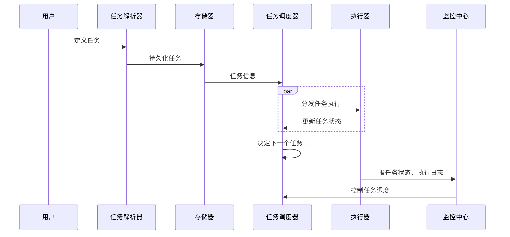

# 数据架构

从数据存储模式、时效性和分布模式三个架构设计和数据建模视角

## 数据存储

### [数据库](/中间件/数据库/数据库.md)

### [数据仓库](/数据技术/数据仓库.md)

### 数据湖

一个集中式存储库，允许以任意规模存储所有结构化和非结构化数据

常见的实现形式为表格式，只负责依照某种格式存储到存储系统中，再由独立的查询引擎实现读取数据查询

### 湖仓一体

业界主流有两种做法：

1. 将数据仓库构建在数据湖之上
2. 数据仓库与数据湖独立，二者通过消息通道进行数据同步

### [分布式存储](/软件工程/架构/系统设计/分布式/分布式数据.md)

### 区块链

## 数据计算

简单来说，批处理吞吐量大、时效性低、准确性高。而流处理的缺点在于为了保证实时性，可能会牺牲掉一定的准确性

### [批处理](/数据技术/数据处理.md#批处理)

### [流处理](/数据技术/数据处理.md#流处理)

### 流批一体

1. 计算一体：同一套计算逻辑可以同时应用于流处理与批处理两种模式，且在最终结果上一致。
2. 存储一体：流处理与批处理过程中全程数据存储在同一介质，即不管采用何种处理模式，数据的流转及存储都在同一介质中完成

## 数据应用

### 任务调度

任务调度通常用于调度ETL（Extract, Transform, Load）作业、数据处理作业、数据分析作业等

调度类型：

- 定时调度
- 事件触发调度触发等。
- 依赖关系调度
- 动态调度：根据系统负载、资源可用性等动态调整任务的执行时间

### BI

通过收集、分析和呈现数据来提供商业洞察的技术和工具

通常包括以下功能：

1. 数据可视化： 将数据转化为图表、仪表盘、报表等形式，以便用户直观地理解数据。
2. 数据分析： 提供各种分析功能，包括查询、筛选、排序、聚合等，以便用户对数据进行深入的分析和探索。
3. 报告和仪表盘： 支持定制化报告和仪表盘的生成，以满足不同用户和业务部门的需求。
4. 数据挖掘： 使用数据挖掘算法和模型来发现数据中的隐藏模式、关联和趋势，从而提供更深入的洞察和预测。
5. 实时监控和警报： 提供实时监控功能，监测业务指标的变化和异常情况，并及时发出警报

### 报表

报表与 BI 的区别在于 BI 更加灵活，且 BI 覆盖更广泛的功能。同时 BI 能够支持实时数据的查询和分析

### [数据分析](/数据技术/数据分析.md)

#### [数据可视化](/数据技术/数据分析.md#数据可视化)

### [机器学习](/数据技术/机器学习.md)

## [安全与隐私]((/计算机网络/网络安全/安全性.md))

### 数据权限

- 访问权限
- 操作权限
- 范围权限
- 行级权限
- 字段权限
