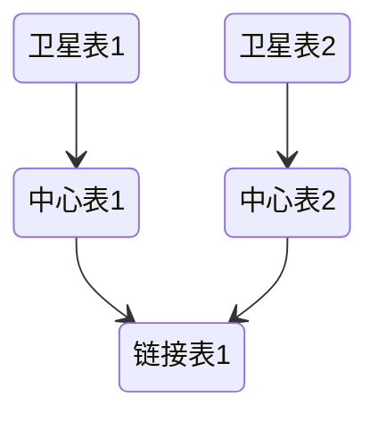

# 数据治理

## 数据资产管理

对组织内部的数据资产进行管理，包括数据集、数据表、数据文件等。提供数据目录功能，帮助用户了解和查找组织中可用的数据资产

## 主数据管理

一种全面的方法，旨在确保组织的关键业务数据（即“主数据”）在整个企业内的准确性、一致性和可用性。主数据包括客户、供应商、产品、地点和其他核心业务实体的数据，这些数据在企业的多个系统和应用中使用

## 数据建模

数据模型代表了数据与现实世界的联系方式。它反映了数据需要如何结构化和标准化才能最好地反映组织的流程、定义、工作流和逻辑

- 数据流建模

数据建模的演进路径：

1. 概念模型：包含业务逻辑和规则，描述系统数据结构的模型
2. 逻辑模型：通过添加更多的细节来详细说明概念模型在实践中如何实现
3. 物理模型：定义了逻辑模型如何在数据库系统中实现

建模的一些原则：

1. 模型分层：基于不同的设计目标进行分层。明细层保留最细粒度的数据，服务层面向需求而设计。分层的设计不仅可以做到模型复用，也能有效降低数据处理各阶段的耦合，同时能更好地评估、分析、追踪不同阶段的系统容量
2. 层级间禁止逆向依赖
3. 模型可扩展：要基于业务而非需求进行建模
4. 历史业务场景可追溯：随着业务场景发生变化，要保证模型满足对于历史业务数据的追溯，以确保满足各种需求

### 批数据建模

#### [ER建模](/中间件/数据库/数据库系统/数据库设计.md#ER模型)
#### [维度建模](/数据技术/数据仓库.md#维度建模)

#### DataVault建模

一个Data Vault模型由三种主要类型的表组成：

1. 中心表：存储业务实体的唯一列表，例如客户、产品或交易。它们是对业务实体的简单描述，没有任何业务规则或逻辑
2. 链接表：用于描述业务实体之间的关系。它们充当中间表，记录了不同实体之间的连接
3. 卫星表：包含与中心表或链接表相关的详细信息。这些表可以包含任意数量的属性，并且通常包含有效期、加载日期等与跟踪数据变化相关的信息

#### 宽表

一种高度去范式化的数据表，通常用于列式数据库中，包含大量字段和稀疏的数据。字段可以包含单一值或嵌套数据，而数据则按照一个或多个键组织，与数据的粒度紧密相关

宽表优点：简化模式，适应变化频繁的环境，并提升查询性能。

宽表缺点：可能丢失业务逻辑，更新性能较差，并且数据一致性可能成问题

### [图建模](/中间件/数据库/图数据库.md#数据建模)

### 标签体系

> 标签是根据业务场景的需求，通过对目标对象（含静态、动态特性）运用抽象、归纳、
推理等算法得到的高度精练的特征标识，用于差异化管理与决策

1. 标签定义：根据业务场景或建模目标，确定需要的标签。标签通常用来描述数据的某种特征或状态，例如用户行为、产品类别、地理位置等
2. 标签分类：标签体系可以分层次、多维度构建
    - 基础标签：如年龄、性别、地区等基本属性。
    - 行为标签：如购买频率、浏览时长、访问次数等用户行为。
    - 衍生标签：基于基础或行为数据进一步挖掘出的标签，如用户忠诚度、产品偏好等
3. 标签规则定义，将某个标签应用于对象
    - 规则式打标签：根据预设的业务规则或逻辑打标签。例如，购买频次超过5次的用户打上“高活跃用户”的标签。
    - 模型式打标签：利用已有的分类模型或聚类算法对数据对象打标签。例如，使用聚类算法将客户分为不同的细分群体。
    - 专家标注：通过业务专家的经验手动为数据对象打标签，这种方式在一些无法量化的场景中常用
4. 标签更新机制
    - 实时打标签：某些标签需要在数据变化时立即更新，例如实时监测用户行为后立即更新用户活跃度标签。
    - 定期打标签：对于一些标签，可以定期批量更新，如每周或每月更新一次用户忠诚度或风险评分等

### [指标体系](/数据技术/数据分析.md#数据指标体系)

## 质量管理

在数据生命周期的各个阶段，通过一系列的策略、流程和工具，确保数据的准确性、一致性、完整性、可靠性和及时性的过程

### 规范化与标准化

- 命名规范
- 数据格式规范
- 统一的单位
- 数据值域约束
- 数据字典

## 数据血缘

数据血缘包括数据源、数据转换器、数据目的地和数据流程，它们之间的关系是数据源提供原始数据，经过数据转换器处理后，将数据传递到数据目的地进行存储或进一步处理。数据流程记录了数据在整个流程中的来源、流向和变换过程，而数据血缘则由多个数据流程组成
