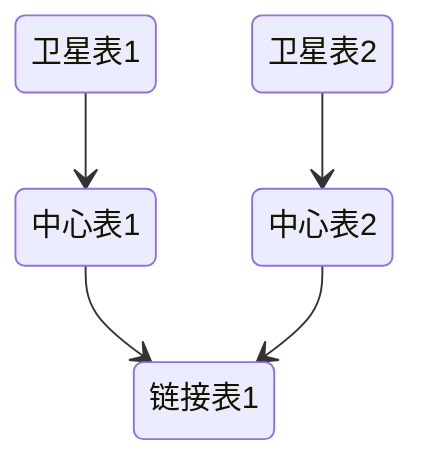
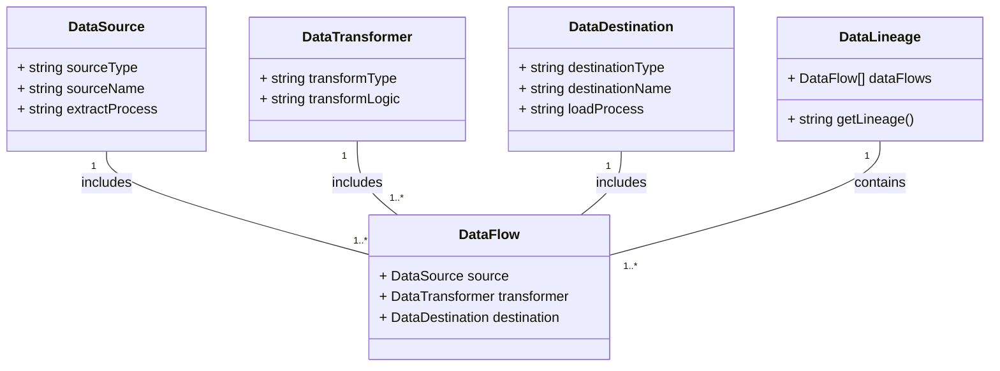

# 数据治理

## 数据资产管理

对组织内部的数据资产进行管理，包括数据集、数据表、数据文件等。提供数据目录功能，帮助用户了解和查找组织中可用的数据资产

## 主数据管理

一种全面的方法，旨在确保组织的关键业务数据（即“主数据”）在整个企业内的准确性、一致性和可用性。主数据包括客户、供应商、产品、地点和其他核心业务实体的数据，这些数据在企业的多个系统和应用中使用

## 数据建模

数据模型代表了数据与现实世界的联系方式。它反映了数据需要如何结构化和标准化才能最好地反映组织的流程、定义、工作流和逻辑

- 数据流建模

数据建模的演进路径：

1. 概念模型：包含业务逻辑和规则，描述系统数据结构的模型
2. 逻辑模型：通过添加更多的细节来详细说明概念模型在实践中如何实现
3. 物理模型：定义了逻辑模型如何在数据库系统中实现

建模的一些原则：

1. 模型分层：基于不同的设计目标进行分层。明细层保留最细粒度的数据，服务层面向需求而设计。分层的设计不仅可以做到模型复用，也能有效降低数据处理各阶段的耦合，同时能更好地评估、分析、追踪不同阶段的系统容量
2. 层级间禁止逆向依赖
3. 模型可扩展：要基于业务而非需求进行建模
4. 历史业务场景可追溯：随着业务场景发生变化，要保证模型满足对于历史业务数据的追溯，以确保满足各种需求

### 批数据建模

#### [ER建模](/中间件/数据库/数据库系统/数据库设计.md#ER模型)
#### [维度建模](/数据技术/数据仓库.md#维度建模)

#### DataVault建模

一个Data Vault模型由三种主要类型的表组成：

1. 中心表：存储业务实体的唯一列表，例如客户、产品或交易。它们是对业务实体的简单描述，没有任何业务规则或逻辑
2. 链接表：用于描述业务实体之间的关系。它们充当中间表，记录了不同实体之间的连接
3. 卫星表：包含与中心表或链接表相关的详细信息。这些表可以包含任意数量的属性，并且通常包含有效期、加载日期等与跟踪数据变化相关的信息

#### 宽表

一种高度去范式化的数据表，通常用于列式数据库中，包含大量字段和稀疏的数据。字段可以包含单一值或嵌套数据，而数据则按照一个或多个键组织，与数据的粒度紧密相关

宽表优点：简化模式，适应变化频繁的环境，并提升查询性能。

宽表缺点：可能丢失业务逻辑，更新性能较差，并且数据一致性可能成问题

## 质量管理

在数据生命周期的各个阶段，通过一系列的策略、流程和工具，确保数据的准确性、一致性、完整性、可靠性和及时性的过程

### 规范化与标准化

- 命名规范
- 数据格式规范
- 统一的单位
- 数据值域约束
- 数据字典

## 元数据管理

- 数据发现和数据理解： 元数据提供了对数据内容和结构的描述，帮助用户理解数据的含义、来源和用途。通过元数据，用户可以快速发现并理解可用数据资源，提高数据的可发现性和可用性。
- 数据集成和数据血缘追踪： 元数据记录了数据之间的关系和依赖，包括数据源、数据流程、数据转换等信息。这些信息可以帮助用户了解数据的血缘关系，追踪数据的来源和流向，支持数据集成和数据治理

分类：

- 技术元数据：描述数据的物理特性和技术属性，例如数据表结构、字段类型、索引信息等，用于支持数据存储、数据管理和数据处理的技术需求。
- 业务元数据：描述数据的业务含义和业务规则，例如数据所有者、数据用途、业务规则等，用于帮助用户理解数据的含义、用途和价值，支持业务决策和业务创新。
- 操作元数据：描述数据的操作历史和操作行为，例如数据提取、转换、加载（ETL）过程、数据访问记录等，用于追踪和监控数据的操作流程和数据处理过程，支持数据治理和数据质量管理。
- 管理元数据：描述数据的管理信息和管理策略，例如数据分类、数据权限、数据保留期限等，用于管理数据资源的分配、使用和维护，支持数据治理和数据安全管理

## 数据血缘

数据血缘包括数据源、数据转换器、数据目的地和数据流程，它们之间的关系是数据源提供原始数据，经过数据转换器处理后，将数据传递到数据目的地进行存储或进一步处理。数据流程记录了数据在整个流程中的来源、流向和变换过程，而数据血缘则由多个数据流程组成
