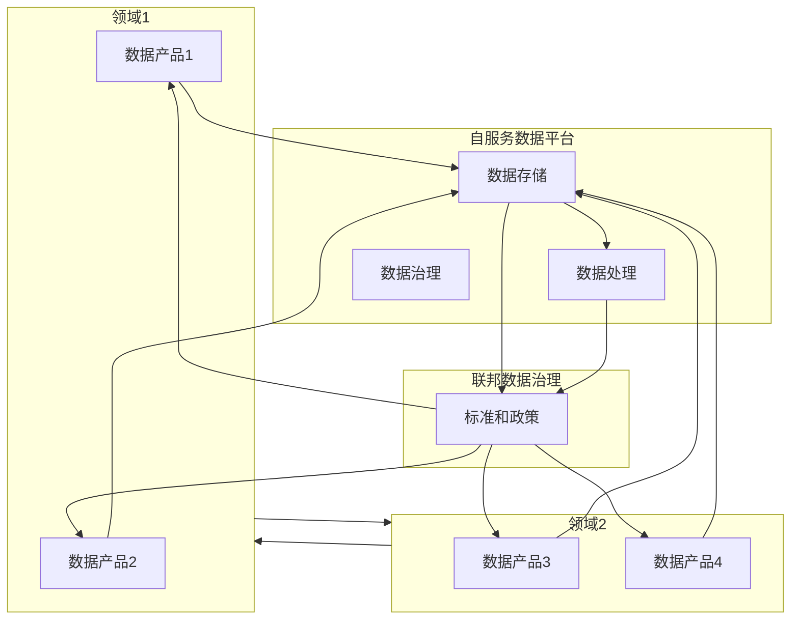
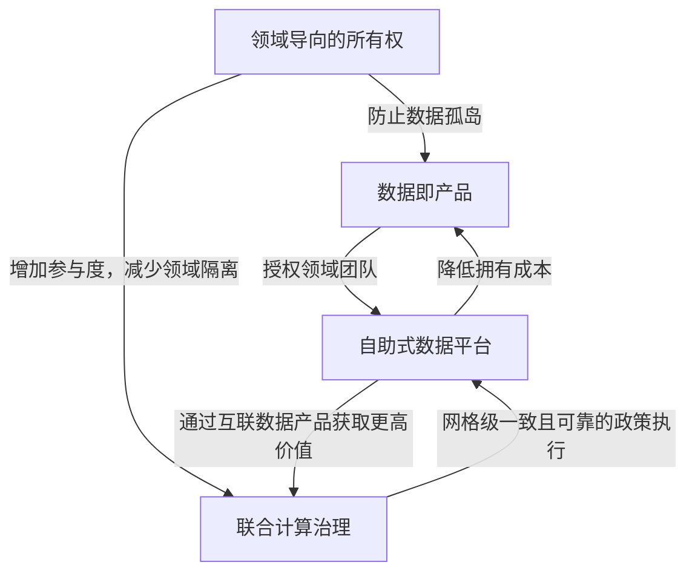

# 数据网格

一种数据架构和组织方法。它旨在解决大规模数据管理中的挑战，通过去中心化的数据管理和以业务领域为中心的自服务数据基础设施，促进数据的共享和使用

与先前数据架构组织对比：

- 组织方面：从由专门技术人员集中管理数据平台技术，转变为去中心化的数据所有权模式，将数据的所有权和责任推回到产生或使用数据的业务领域
- 架构方面：从在单一的数据仓库和数据湖中收集数据，转变为通过分布式的数据产品网格连接数据，并通过标准化协议进行访问
- 技术方面：从将数据视为运行管道代码的副产品的技术解决方案，转变为将数据和维护数据的代码视为一个活跃的自主单元的解决方案
- 操作方面：从自上而下的集中运营模式的人为干预数据治理，转变为在网格节点上嵌入计算策略的联合模式。
- 原则方面：：从将数据视为需要收集的资产的价值体系，转变为将数据视为产品和为用户服务（包括组织内部和外部）的产品的价值体系
- 基础设施方面：从为数据和分析以及应用和操作系统提供两套分散的点对点集成的基础设施服务，转变为为操作系统和数据系统提供一套良好集成的基础设施

- 去中心化数据所有权和治理：将数据的所有权和治理职责分配给具体的业务领域（Domain），每个领域对自己的数据负责。
- 按领域划分的数据产品：数据被视为产品，每个领域的数据团队负责创建、管理和维护自己的数据产品，确保数据的质量、可访问性和可用性。
- 自服务数据平台：提供统一的数据基础设施和工具，使每个领域能够独立地管理和操作其数据，支持数据的生产和消费。
- 联邦数据治理：通过标准化的协议和政策，实现跨领域的数据治理，确保数据的一致性、安全性和合规性。

## 原则

### 领域导向所有权原则

数据网格核心在于数据责任的去中心化和分布化，让最接近数据的人负责数据管理。为了找到数据分解的边界，数据网格遵循组织单元的分割线，与业务责任一致，而不是技术解决方案或功能线（如数据湖、数据仓库、数据团队等）

使用 DDD 实现领域导向的所有权：

1. 领域分解和所有权：将数据的责任分配给最了解这些数据的领域团队。每个领域团队负责生成、处理和维护他们领域内的数据
2. 界定边界上下文：为每个领域创建独立的模型和数据产品。这意味着每个领域团队可以独立管理和发展其数据模型，而不需要与其他团队共享统一的模式
3. 上下文映射：明确不同领域间的关系和数据交互方式。这有助于领域间的数据整合和协作
4. 端到端的数据责任：每个领域团队不仅要负责生成数据，还要确保数据的高质量、长期保存和分析视图
5. 构建领域数据产品：领域团队需要创建和维护自己的数据产品，这些产品包括数据及其模型，并对其进行所有权管理
6. 数据需求驱动组织结构：根据数据需求重新组织团队和领域，创建专注于数据管理的新领域和团队，以提供准确和有价值的数据表示

不同领域的数据类型：

1. 源对齐领域数据（Source-Aligned Domain Data）：直接反映业务事实，由系统生成。它捕获的是与业务系统紧密关联的数据，表示业务的现实情况，是最贴近数据的原始生成点
2. 聚合领域数据（Aggregate Domain Data）：是多个上游领域数据的聚合，表示业务概念的综合视图，来源过多与复杂的聚合数据模型会使得管理与应用变得困难
3. 消费者对齐领域数据（Consumer-Aligned Domain Data）：为了满足一个或多个特定用例而被转换和调整的数据，以适应特定应用的需求

### 数据即产品原则

让数据本身作为产品提供给用户，数据作为产品应具有如下特征：

- 可发现性（Discoverable）：数据产品应该易于被用户发现和搜索。需要提供有关数据产品的来源、所有者、运行时信息、质量指标、样本数据等信息，以便用户探索和获得使用信心。
- 可寻址性（Addressable）：数据产品必须提供一个永久和唯一的地址，便于用户以编程或手动方式访问。这个地址系统应该能够应对数据产品的动态变化，同时确保使用的连续性。
- 可理解性（Understandable）：数据产品应该提供语义一致的数据，帮助用户理解数据的含义、关系和使用方式。应提供正式的语义表示、数据序列化方式、访问和查询方法，以及示例数据集和示例代码。
- 可信赖性和真实性（Trustworthy and Truthful）：数据产品应保证并传达服务水平目标（SLOs），如变更间隔、及时性、完整性、数据形态、数据沿袭、精度和准确性等，以建立用户对数据的信任。
- 本地可访问性（Natively Accessible）：数据产品应支持各种用户的本地访问方式，满足不同数据用户的访问需求。可以通过多种读取适配器或多语言数据存储来实现。
- 互操作性（Interoperable）：数据产品应遵循标准和规范，便于在不同领域之间关联和组合数据。应标准化字段类型、全局标识符、数据产品地址、元数据字段、模式链接和数据链接。
- 自身有价值（Valuable on Its Own）：数据产品应该具备独立的价值，而不需要与其他数据产品联合使用才能体现价值。如果一个数据产品本身没有意义或价值，就不应该存在。
- 安全性（Secure）：数据产品应确保用户能够安全且尊重机密性地访问。访问控制策略应在数据产品运行时动态验证，并且可以随时变更。这些策略可以作为代码描述、测试、维护和执行。

### 自助式数据平台原则

数据网格数据平台与其他数据架构平台的区别：

- 团队结构：数据网格服务于自治的、面向领域的团队。这些团队独立负责各自领域的数据产品。其他架构则服务于集中化的数据团队，负责所有领域的数据管理
- 数据管理方式：数据网格管理自治的、可互操作的数据产品，将代码、数据和策略作为一个整体单元来管理。其他架构分别管理数据、数据管道、代码和策略
- 平台整合：数据网格提供操作和分析能力的集成平台，支持数据的全生命周期管理。
其他架构业务系统和数据分析系统分成两个独立的技术栈，依赖点对点的集成。
- 用户设计：数据网格为大多数通才（即广泛的用户群体）设计，提供易于使用的数据访问方式。其他架构为大多数专家（即特定的专业用户）设计，需要专门的技能和知识来操作。
- 技术选择：数据网格倾向于使用去中心化的技术，支持独立的团队进行创新和优化。其他架构倾向于使用集中化的技术，便于集中控制和管理。
- 领域意识：与领域无关，允许跨领域的数据互操作和组合。其他架构具有领域意识，通常根据领域特定的需求进行数据管理和优化。

优点与价值：

1. 增强团队自主性：数据网格平台支持自治团队在无需依赖其他团队的情况下独立获取和使用数据，从而减少协调成本并提高工作效率。
2. 简化技术复杂性：通过隐藏底层技术和基础设施的复杂性，数据网格平台降低了领域团队的认知负担，使他们能够专注于创建和分享数据产品。
3. 加速价值交换：数据网格平台通过自动化流程和减少手动干预，显著加快了数据产品的开发和使用过程，提升了整体工作效率。
4. 支持数据共享的扩展性：数据网格平台设计上考虑了跨多个平台的安全数据共享能力，解决了大规模数据共享中的互操作性问题，支持跨组织的数据交换。
5. 促进嵌入式创新文化：通过移除不必要的手动工作和简化工作流程，数据网格平台促进了数据驱动的创新，支持团队迅速进行实验和迭代。
6. 数据产品互操作性：数据网格平台通过标准化的数据产品识别、连接和读取方式，实现了数据产品的无缝关联和组合，生成更高层次的价值。

要从其他数据架构平台过渡到自助式的数据网格平台，需要首先设计API和协议，确保普通开发者能够轻松使用，简化现有技术栈，引入高级别API以管理数据产品，注重用户体验，从最简单的基础开始逐步演进平台，并将其视为一个不断发展的内部产品

### 联邦计算治理原则

