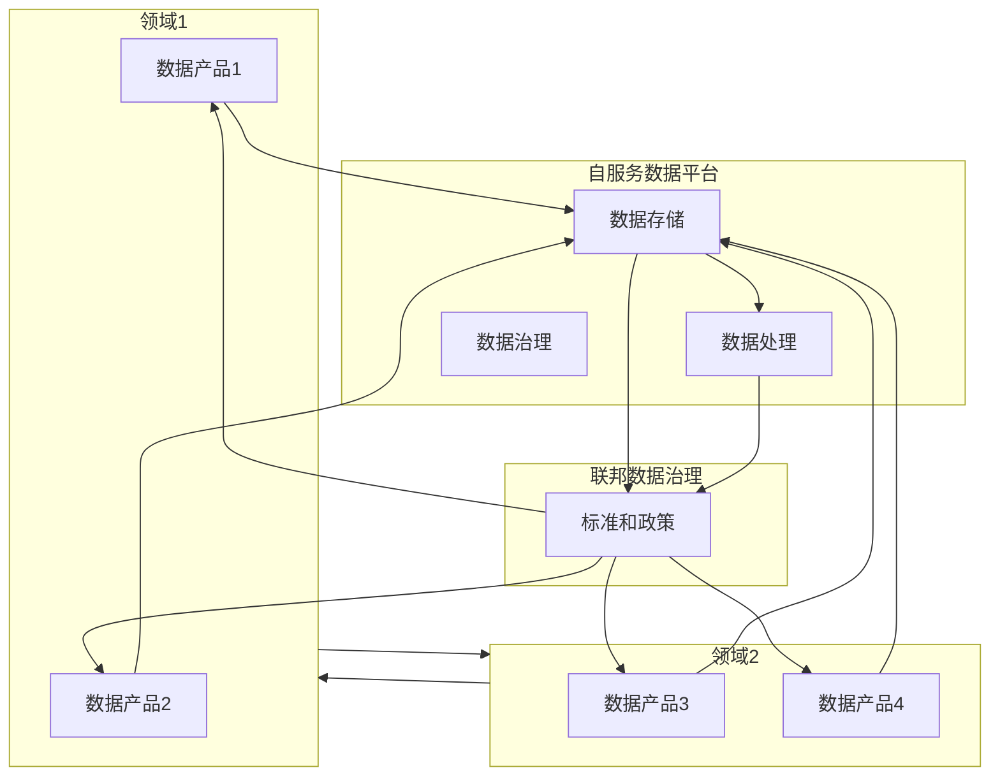
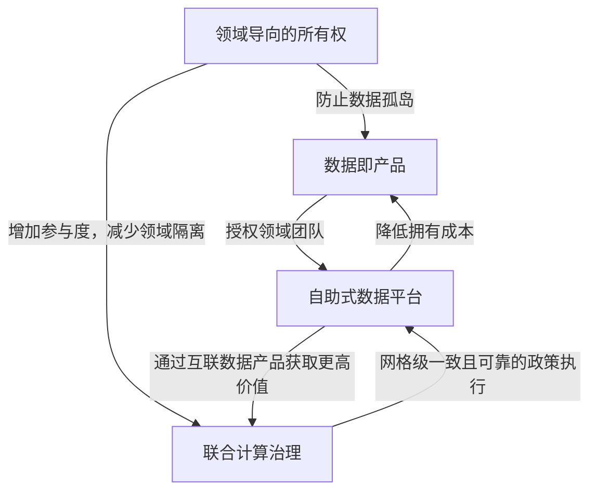

# 数据网格

一种数据架构和组织方法。它旨在解决大规模数据管理中的挑战，通过去中心化的数据管理和以业务领域为中心的自服务数据基础设施，促进数据的共享和使用

与先前数据架构组织对比：

- 组织方面：从由专门技术人员集中管理数据平台技术，转变为去中心化的数据所有权模式，将数据的所有权和责任推回到产生或使用数据的业务领域
- 架构方面：从在单一的数据仓库和数据湖中收集数据，转变为通过分布式的数据产品网格连接数据，并通过标准化协议进行访问
- 技术方面：从将数据视为运行管道代码的副产品的技术解决方案，转变为将数据和维护数据的代码视为一个活跃的自主单元的解决方案
- 操作方面：从自上而下的集中运营模式的人为干预数据治理，转变为在网格节点上嵌入计算策略的联合模式。
- 原则方面：：从将数据视为需要收集的资产的价值体系，转变为将数据视为产品和为用户服务（包括组织内部和外部）的产品的价值体系
- 基础设施方面：从为数据和分析以及应用和操作系统提供两套分散的点对点集成的基础设施服务，转变为为操作系统和数据系统提供一套良好集成的基础设施

- 去中心化数据所有权和治理：将数据的所有权和治理职责分配给具体的业务领域（Domain），每个领域对自己的数据负责。
- 按领域划分的数据产品：数据被视为产品，每个领域的数据团队负责创建、管理和维护自己的数据产品，确保数据的质量、可访问性和可用性。
- 自服务数据平台：提供统一的数据基础设施和工具，使每个领域能够独立地管理和操作其数据，支持数据的生产和消费。
- 联邦数据治理：通过标准化的协议和政策，实现跨领域的数据治理，确保数据的一致性、安全性和合规性。

## 原则

### 领域导向所有权原则

### 数据即产品原则

### 自助式数据平台原则

### 联邦计算治理原则
