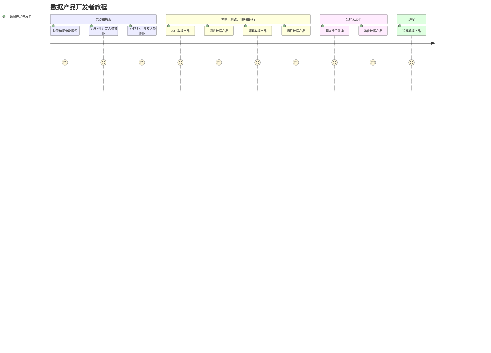
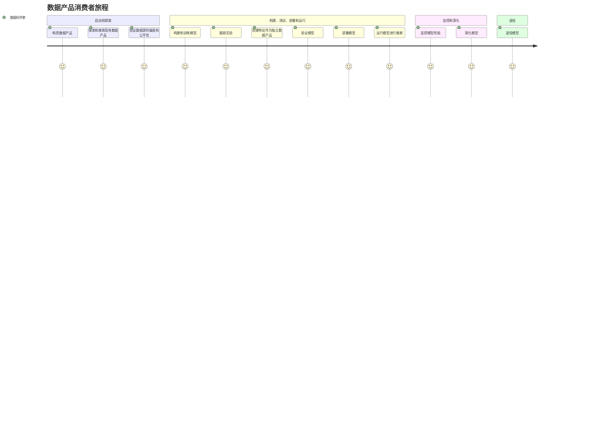

# 数据网格

一种数据架构和组织方法。它旨在解决大规模数据管理中的挑战，通过去中心化的数据管理和以业务领域为中心的自服务数据基础设施，促进数据的共享和使用

与先前数据架构组织对比：

- 组织方面：从由专门技术人员集中管理数据平台技术，转变为去中心化的数据所有权模式，将数据的所有权和责任推回到产生或使用数据的业务领域
- 架构方面：从在单一的数据仓库和数据湖中收集数据，转变为通过分布式的数据产品网格连接数据，并通过标准化协议进行访问
- 技术方面：从将数据视为运行管道代码的副产品的技术解决方案，转变为将数据和维护数据的代码视为一个活跃的自主单元的解决方案
- 操作方面：从自上而下的集中运营模式的人为干预数据治理，转变为在网格节点上嵌入计算策略的联合模式。
- 原则方面：：从将数据视为需要收集的资产的价值体系，转变为将数据视为产品和为用户服务（包括组织内部和外部）的产品的价值体系
- 基础设施方面：从为数据和分析以及应用和操作系统提供两套分散的点对点集成的基础设施服务，转变为为操作系统和数据系统提供一套良好集成的基础设施

- 去中心化数据所有权和治理：将数据的所有权和治理职责分配给具体的业务领域（Domain），每个领域对自己的数据负责。
- 按领域划分的数据产品：数据被视为产品，每个领域的数据团队负责创建、管理和维护自己的数据产品，确保数据的质量、可访问性和可用性。
- 自服务数据平台：提供统一的数据基础设施和工具，使每个领域能够独立地管理和操作其数据，支持数据的生产和消费。
- 联邦数据治理：通过标准化的协议和策略，实现跨领域的数据治理，确保数据的一致性、安全性和合规性。

## 原则

### 领域导向所有权原则

数据网格核心在于数据责任的去中心化和分布化，让最接近数据的人负责数据管理。为了找到数据分解的边界，数据网格遵循组织单元的分割线，与业务责任一致，而不是技术解决方案或功能线（如数据湖、数据仓库、数据团队等）

使用 DDD 实现领域导向的所有权：

1. 领域分解和所有权：将数据的责任分配给最了解这些数据的领域团队。每个领域团队负责生成、处理和维护他们领域内的数据
2. 界定边界上下文：为每个领域创建独立的模型和数据产品。这意味着每个领域团队可以独立管理和发展其数据模型，而不需要与其他团队共享统一的模式
3. 上下文映射：明确不同领域间的关系和数据交互方式。这有助于领域间的数据整合和协作
4. 端到端的数据责任：每个领域团队不仅要负责生成数据，还要确保数据的高质量、长期保存和分析视图
5. 构建领域数据产品：领域团队需要创建和维护自己的数据产品，这些产品包括数据及其模型，并对其进行所有权管理
6. 数据需求驱动组织结构：根据数据需求重新组织团队和领域，创建专注于数据管理的新领域和团队，以提供准确和有价值的数据表示

不同领域的数据类型：

1. 源对齐领域数据（Source-Aligned Domain Data）：直接反映业务事实，由系统生成。它捕获的是与业务系统紧密关联的数据，表示业务的现实情况，是最贴近数据的原始生成点
2. 聚合领域数据（Aggregate Domain Data）：是多个上游领域数据的聚合，表示业务概念的综合视图，来源过多与复杂的聚合数据模型会使得管理与应用变得困难
3. 消费者对齐领域数据（Consumer-Aligned Domain Data）：为了满足一个或多个特定用例而被转换和调整的数据，以适应特定应用的需求

### 数据即产品原则

让数据本身作为产品提供给用户，数据作为产品应具有如下特征：

- 可发现性（Discoverable）：数据产品应该易于被用户发现和搜索。需要提供有关数据产品的来源、所有者、运行时信息、质量指标、样本数据等信息，以便用户探索和获得使用信心。
- 可寻址性（Addressable）：数据产品必须提供一个永久和唯一的地址，便于用户以编程或手动方式访问。这个地址系统应该能够应对数据产品的动态变化，同时确保使用的连续性。
- 可理解性（Understandable）：数据产品应该提供语义一致的数据，帮助用户理解数据的含义、关系和使用方式。应提供正式的语义表示、数据序列化方式、访问和查询方法，以及示例数据集和示例代码。
- 可信赖性和真实性（Trustworthy and Truthful）：数据产品应保证并传达服务水平目标（SLOs），如变更间隔、及时性、完整性、数据形态、数据沿袭、精度和准确性等，以建立用户对数据的信任。
- 本地可访问性（Natively Accessible）：数据产品应支持各种用户的本地访问方式，满足不同数据用户的访问需求。可以通过多种读取适配器或多语言数据存储来实现。
- 互操作性（Interoperable）：数据产品应遵循标准和规范，便于在不同领域之间关联和组合数据。应标准化字段类型、全局标识符、数据产品地址、元数据字段、模式链接和数据链接。
- 自身有价值（Valuable on Its Own）：数据产品应该具备独立的价值，而不需要与其他数据产品联合使用才能体现价值。如果一个数据产品本身没有意义或价值，就不应该存在。
- 安全性（Secure）：数据产品应确保用户能够安全且尊重机密性地访问。访问控制策略应在数据产品运行时动态验证，并且可以随时变更。这些策略可以作为代码描述、测试、维护和执行。

### 自助式数据平台原则

数据网格数据平台与其他数据架构平台的区别：

- 团队结构：数据网格服务于自治的、面向领域的团队。这些团队独立负责各自领域的数据产品。其他架构则服务于集中化的数据团队，负责所有领域的数据管理
- 数据管理方式：数据网格管理自治的、可互操作的数据产品，将代码、数据和策略作为一个整体单元来管理。其他架构分别管理数据、数据管道、代码和策略
- 平台整合：数据网格提供操作和分析能力的集成平台，支持数据的全生命周期管理。
其他架构业务系统和数据分析系统分成两个独立的技术栈，依赖点对点的集成。
- 用户设计：数据网格为大多数通才（即广泛的用户群体）设计，提供易于使用的数据访问方式。其他架构为大多数专家（即特定的专业用户）设计，需要专门的技能和知识来操作。
- 技术选择：数据网格倾向于使用去中心化的技术，支持独立的团队进行创新和优化。其他架构倾向于使用集中化的技术，便于集中控制和管理。
- 领域意识：与领域无关，允许跨领域的数据互操作和组合。其他架构具有领域意识，通常根据领域特定的需求进行数据管理和优化。

优点与价值：

1. 增强团队自主性：数据网格平台支持自治团队在无需依赖其他团队的情况下独立获取和使用数据，从而减少协调成本并提高工作效率。
2. 简化技术复杂性：通过隐藏底层技术和基础设施的复杂性，数据网格平台降低了领域团队的认知负担，使他们能够专注于创建和分享数据产品。
3. 加速价值交换：数据网格平台通过自动化流程和减少手动干预，显著加快了数据产品的开发和使用过程，提升了整体工作效率。
4. 支持数据共享的扩展性：数据网格平台设计上考虑了跨多个平台的安全数据共享能力，解决了大规模数据共享中的互操作性问题，支持跨组织的数据交换。
5. 促进嵌入式创新文化：通过移除不必要的手动工作和简化工作流程，数据网格平台促进了数据驱动的创新，支持团队迅速进行实验和迭代。
6. 数据产品互操作性：数据网格平台通过标准化的数据产品识别、连接和读取方式，实现了数据产品的无缝关联和组合，生成更高层次的价值。

要从其他数据架构平台过渡到自助式的数据网格平台，需要首先设计API和协议，确保普通开发者能够轻松使用，简化现有技术栈，引入高级别API以管理数据产品，注重用户体验，从最简单的基础开始逐步演进平台，并将其视为一个不断发展的内部产品

### 联邦计算治理原则

- 系统思维：在数据产品和团队的复杂系统中，保持集中化和去中心化之间的平衡
- 计算策略：负责执行、监控和恢复等操作。通过平台自动化的方式，程序化地管理和执行数据产品生命周期中的各个阶段的策略，如维护全局性的数据策略、自动化地测试与监控数据产品
- 联邦运营模型：包含领域专家、平台专家等，负责各个域的管理。通过联邦决策机制，将治理职责分散到各个数据域，同时保留一定的全局标准和策略

系统思维向“计算策略 (Computational Policies)”和“联邦运营模型 (Federated Operating Model)”提供杠杆点和反馈回路。计算策略向“联邦运营模型”提供策略和标准，同时接收来自“联邦运营模型”的度量

杠杆点是系统中一个小变化可以导致行为大幅改变的地方。通过调整杠杆点，可以对系统行为进行有效的干预和优化。反馈回路是系统结构中的一个机制，用于平衡或加强系统状态的变化。反馈回路可以帮助系统在动态平衡状态下自我调整和优化

## 逻辑架构

数据接口和数据产品构成了数据网格的基本单元，多平面数据平台为这些单元提供了不同层次的管理和操作支持，而嵌入式的计算策略确保了数据产品在这些层次中的一致性和治理能力

### 领域所有的数据接口

领域数据的组织：将数据按领域划分，每个领域负责自己的数据，包括操作数据和分析数据。领域的接口不仅包含操作能力，还要共享领域生成和拥有的分析数据。

扩展领域接口：每个领域除了已有的操作接口（如应用API）外，还需要管理和控制其分析数据共享API。操作接口是业务行为产生的事实数据，而分析数据接口则是用于类似数仓OLAP的接口。

支持领域团队的自主性：架构需要支持领域团队在发布和部署其操作应用和分析数据产品方面的自主性。

设计操作接口：领域通过一组接口为用户提供服务（系统或人，内部或外部）。例如，一个微服务实现的领域功能，其接口可以包括GraphQL、REST、gRPC等API。
操作接口主要处理较小体量的数据，提供系统已知状态的近实时快照。

设计分析数据接口：这些接口用来获取、理解、观察和共享数据。可以将客户端重定向到底层数据存储，如定位到消息队列、RDBMS 等底层数据源

处理领域间的数据依赖：每个领域可以依赖其他领域的操作和分析数据接口。数据产品明确定义其对上游源的数据依赖，并控制其数据来源和消费方式。

### 数据产品作为架构最小单位

独立部署与管理：数据产品是架构中最小的、可以独立部署和管理的单元。

包含所有必要的结构组件：数据产品具备所有执行其功能所需的结构组件，包括数据处理代码、数据、元数据、治理数据的策略以及对基础设施的依赖。

代码控制生命周期：数据产品不仅仅是数据，它还包含用于生成和共享数据的所有代码，并在其计算环境中运行这些代码。这种方式区别于传统数据管道，数据产品的转换代码由数据产品内部实现并控制其生命周期。

数据处理代码：数据产品包含用于接收和转换数据的代码，例如从上游系统接收数据进行分析计算，并共享结果。传统架构中，转换代码通常是独立的管道配置，而数据产品将其内部化，并在数据产品的执行上下文中运行。

接口即代码：数据产品通过其接口（API）提供对数据的访问、发现信息、可用性文档、可观察性指标等。这些接口根据定义的 SLA 执行，接口代码也包括在数据产品的实现中。

策略即代码：数据产品包含配置和执行各种行为和结构策略的代码，如加密、访问控制、数据质量和合规性。这些策略代码由平台提供，但在数据产品的读写功能中调用。

数据和元数据管理：数据产品负责其域数据的生命周期管理，并根据需要提供多种模式的访问（文件、表格、列式等）。数据产品还生成和管理与数据相关的信息（元数据），如数据文档、语义和语法声明、服务水平目标（SLO）等。

平台依赖：平台支持数据产品的构建、部署和运行，提供必要的基础设施资源。数据产品定义并控制其对平台的依赖，例如数据保留时间、访问模式等。

数据共享交互：数据产品主要通过其输出数据端口（API）与其他数据产品或操作系统共享数据。输入数据端口用于从多个来源接收数据，输出数据端口则提供对数据产品数据的外部访问。

### 多平面数据平台

- 数据基础设施平面（Data Infrastructure Plane）：该平面负责管理构建和运行数据网格所需的底层基础设施资源，如存储、计算和身份系统。它与数字应用基础设施集成，共享资源，为其他平面的操作提供基础支持。
- 数据产品体验平面（Data Product Experience Plane）：该平面提供构建、维护和消费数据产品的高层抽象接口，支持数据产品开发者管理数据产品的生命周期（如构建、部署），并支持数据产品消费者订阅和读取数据产品。
- 网格体验平面（Mesh Experience Plane）：该平面提供操作多个数据产品的网格级别能力，如搜索数据产品和遍历数据产品之间的谱系，汇总和依赖于数据产品体验平面的接口，支持跨数据产品的操作和数据共享。

#### 架构

涉及角色：

数据产品开发人员（Data Product Developers）：包括广泛技能集的开发人员，从一般编程技能的开发人员到精通分析数据处理技术的专业数据工程师。

数据产品消费者（Data Product Consumers）：需要访问和使用数据完成工作的人，包括：
- 数据科学家（用于训练或推断机器学习模型）
- 数据分析师（用于开发报告和仪表板）
- 数据产品开发人员（用于开发消耗现有数据产品的新数据产品）
- 应用程序开发人员（用于构建操作域中的数据驱动服务和应用程序）
- 数据产品负责人（Data Product Owners）：负责其特定领域数据产品的交付和推广，确保数据产品的采用和价值传递，并符合更广泛的政策和与其他数据产品的互操作性

数据治理成员（Data Governance Members）：由多个角色组成，确保数据平台的最佳和安全运行，包括安全和法律问题的主题专家以及具有特定职责的数据产品负责人。

数据平台产品负责人（Data Platform Product Owner）：负责将平台服务作为产品交付，提供最佳用户体验，并根据平台用户的需求和限制优先提供服务。

数据平台开发人员（Data Platform Developers）：构建和运营数据平台，并使用它们。他们的技能和需求对平台服务的设计至关重要。

### 嵌入式的计算策略

1. 数据产品Sidecar：这是一个独立的进程，用于在数据产品的运行时上下文中执行策略和其他需要在整个网格中标准化的方面。它注入到数据产品容器中，负责执行访问控制、加密等策略，并提供标准化的API来确保数据产品的互操作性。
2. 数据产品计算容器：这是一个封装所有数据产品结构元素（如sidecar、策略配置、数据转换代码、数据共享接口等）的容器，使数据产品可以自治地使用，并且在整个网格中一致地提供实现。
3. 控制端口：这是一个接口，暴露一组API来配置每个数据产品的策略，并执行一小部分高权限操作以满足治理要求。控制端口支持本地和集中配置的策略共存，并设计为可扩展以支持新的策略类型

## 数据产品架构

数据产品的主要工作是使用其输入数据端口从上游来源消费数据，转换数据，并通过其输出数据端口将结果作为永久可访问的数据对外提供服务

设计数据产品时，通过关注接口与用户的交互关系，确保其能够响应变化并逐步扩展；实现自治和松耦合以支持网格扩展，避免集中化瓶颈；以最小摩擦为用户提供价值，并通过简单的局部规则实现复杂系统的自适应行为，避免中央控制，保持互操作性和一致性

### 数据服务

通过其输出数据端口（接口）向多样化的分析消费者提供面向领域的数据。这些端口有明确定义的契约和API

特点：

1. 多模态数据：数据产品应以多种格式（如列文件、关系数据库表、事件等）提供数据，以满足不同用户的需求
2. 不可变数据：保证数据用户可以重复分析，确保数据的一致性和可重复性
3. 双时间数据：每个数据记录两个时间戳：“实际发生时间”和“处理时间”。双时间数据的特点决定了需要通过流处理来解决数据回撤、处理时间与事件时间偏差、窗口处理等问题

### 数据消费

数据来源：

1. 业务系统
2. 其他数据产品
3. 自身的数据：某些情况下，数据产品的本地计算可以作为数据来源，例如本地转换或机器学习模型推断生成的新数据

数据输入端口：输入数据端口定义并执行数据产品的源数据消耗机制，包括连接数据源、执行查询和接收数据。其规格配置声明数据的来源和消耗方式。异步输入端口在数据可用时调用转换代码，例如订阅事件流；同步输入端口则从源中拉取数据并处理，如定期同步。远程查询允许在源上执行查询以减少冗余数据获取

### 数据转换

转换类型：

1. 声明式或编程式的数据处理转换
2. 基于数据流的转换，常用于数据管道设计
3. 机器学习转换，如机器学习模型作为数据产品的一部分，进行预测并生成推荐结果
4. 时变转换：数据输入端口机制跟踪每个源的处理时间，转换代码根据源数据的计算生成输出的实际时间

设计要素：

1. 转换工件：定义转换的代码、配置、声明或模型。
2. 转换运行环境：转换在特定配置下调用并执行，要求计算环境由底层平台提供。
3. 临时存储：转换步骤可能需要访问跨不同阶段的持久化状态，由底层平台提供
