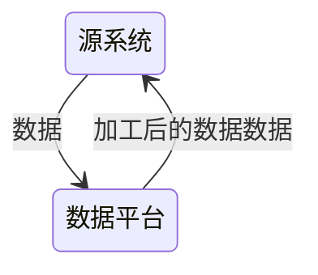

# 数据集成

将来自不同数据源的数据整合到一个统一的数据存储中，以便于数据分析、业务报告和决策支持。一般为 ETL 或者 ELT

首先要有可靠、完整的数据流，后续才能谈得上在上层对这些数据进行存储、可视化、分析

- ETL：提取 (Extract)——转换 (Transform)——加载 (Load)，在数据源抽取后首先进行转换，然后将转换的结果写入目的地
- ELT：提取 (Extract)——加载 (Load)——变换 (Transform)，在抽取后将结果先写入目的地，然后利用数据库的聚合分析能力或者外部计算框架在最后对数据做转换

ELT相比ETL，因为转换是在目的地，所以可以根据后续使用的情况做调整，比较灵活

## 关注内容

数据集成的前期阶段，关注：

1. 数据质量探查：一方面可以在数据接入前期了解数据的整体质量情况，另一方面可以反过来验证对于业务的理解是否完全正确
2. 数据时效与频率保障：要基于需求的时效性诉求结合数据源来确定数据接入的频率
3. 保留时长：基于法律法规和企业的监管要求，来决定待接入数据需要保存的时长
4. 数据安全规范：除了传输与存储安全，还要了解数据要如何处理才能满足法律及监管要求

基于以下原则来确保数据的时效性和完整性：

1. 监控业务系统变化的能力：当上游系统发生变化时，需要及时识别并告警，变化情况包括但不限于网络不稳定、业务系统宕机、采集通道异常、数据格式改变等
2. 保证数据完整性：采集过程难免遇到各种问题，当问题修复后，需要确保待采集的数据依然可以被正常有序地采集，从而确保后续处理数据的完
整性
3. 在存储和监管满足的前提下，尽量保存每一次的快照：除了做到数据的可追溯性，还能再需求发生变化时，利用这些数据重新初始化模型数据
4. 不进行业务逻辑处理

## ETL

### 批量数据抽取

- 增量抽取：只抽取源系统中发生变化的数据，常用的方法包括使用增量更新标志或游标等
- 全量抽取：在某些情况下需要确保数据的完整性和一致性的做法

### 流式数据抽取

- 实时数据源订阅接入
- 窗口化的抽取

### 批量数据转换

- 清洗数据：去除重复数据、处理缺失值、解决数据不一致性等，以确保数据质量
- 格式转换：将数据从源系统的格式转换为目标系统的格式，如日期格式转换、文本编码转换等
- 字段映射：将源系统中的字段映射到目标系统中的字段，包括字段重命名、字段类型转换等
- 计算衍生字段：根据现有字段计算新的字段，如计算总和、平均值、百分比等
- 数据合并：将来自多个数据源的数据进行合并或连接，以获得更完整的数据视图

### 流式数据转换

- 除了有常规批处理的操作外
- 最重要的是基于窗口的计算，如滑动窗口、固定窗口、会话窗口等

### 批量数据加载

### 流式数据加载

## 数据清洗

需要一些清洗规则帮助确保数据质量和一致性，减少数据中的错误、不完整、重复等问题，使得数据标准、干净、连续

## 数据变换

- 数据变换是[数据分析](/数据技术/数据分析.md)必须的预处理步骤

1. 数据平滑：去除数据中的噪声，将连续数据离散化
2. 数据聚集：对数据进行汇总
3. 数据概化：将数据由较低的概念抽象成为较高的概念，减少数据复杂度，即用更高的概念替代更低的概念。比如说上海、杭州、深圳、北京可以概化为中国
4. 数据规范化：使属性数据按比例缩放，这样就将原来的数值映射到一个新的特定区域中
   1. Min-max 规范化：将原始数据变换到[0,1]的空间中
   2. Z-Score 规范化：新数值 =（原数值 - 均值）/ 标准差
   3. 小数定标规范化：移动小数点的位置来进行规范化。小数点移动多少位取决于属性 A 的取值中的最大绝对值
5. 属性构造：构造出新的属性并添加到属性集中

## 反向 ETL

## 错误处理

最重要的错误处理可能就是需要保证抽取过程的数据一致性，一种方式是引入事务机制保证原子性落库，另外一种则是引入死信队列，用来保存出错的数据
