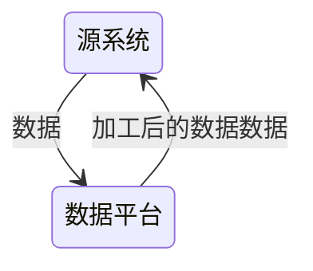

# 数据集成

将来自不同数据源的数据整合到一个统一的数据存储中，以便于数据分析、业务报告和决策支持。一般为 ETL 或者 ELT

首先要有可靠、完整的数据流，后续才能谈得上在上层对这些数据进行存储、可视化、分析

- ETL：提取 (Extract)——转换 (Transform)——加载 (Load)，在数据源抽取后首先进行转换，然后将转换的结果写入目的地
- ELT：提取 (Extract)——加载 (Load)——变换 (Transform)，在抽取后将结果先写入目的地，然后利用数据库的聚合分析能力或者外部计算框架在最后对数据做转换

ELT相比ETL，因为转换是在目的地，所以可以根据后续使用的情况做调整，比较灵活

## 关注内容

数据集成的前期阶段，关注：

1. 数据质量探查：一方面可以在数据接入前期了解数据的整体质量情况，另一方面可以反过来验证对于业务的理解是否完全正确
2. 数据时效与频率保障：要基于需求的时效性诉求结合数据源来确定数据接入的频率
3. 保留时长：基于法律法规和企业的监管要求，来决定待接入数据需要保存的时长
4. 数据安全规范：除了传输与存储安全，还要了解数据要如何处理才能满足法律及监管要求

基于以下原则来确保数据的时效性和完整性：

1. 监控业务系统变化的能力：当上游系统发生变化时，需要及时识别并告警，变化情况包括但不限于网络不稳定、业务系统宕机、采集通道异常、数据格式改变等
2. 保证数据完整性：采集过程难免遇到各种问题，当问题修复后，需要确保待采集的数据依然可以被正常有序地采集，从而确保后续处理数据的完
整性
3. 在存储和监管满足的前提下，尽量保存每一次的快照：除了做到数据的可追溯性，还能再需求发生变化时，利用这些数据重新初始化模型数据
4. 不进行业务逻辑处理
5. 做好任务编排，数据集成是任务的第一步，第一步失败了，后续的流程都做不了

### 需要考虑的工程因素

- 是有边界数据还是无边界数据
- 数据的抽取频率
- 同步获取还是异步获取，在同步获取的情况下，数据源、获取过程和写入目标有复杂的依赖关系并且是紧密耦合的
- 序列化与反序列化处理
- 吞吐量与可扩展性，数据抽取不应成为系统瓶颈，但在实践中，它常常是瓶颈，特别是随着数据量和需求的增长，因此设计可扩展且具备缓存机制的系统并利用托管服务处理突发数据获取是至关重要的
- 可靠性与持久性，需要确保系统的高正常运行时间、适当的故障转移和数据不丢失，但必须评估并平衡这些要求的成本与收益
- 数据的形态、大小、模式、数据类型
- 数据是推，还是拉

## 数据来源

- 数据库直连
- CDC
  - 基于批处理的变更捕获：使用包含 updated_at 字段的数据表可以通过查询自指定时间以来的更新行来实现增量数据捕获，但这种批处理方式无法获取每行的全部变化，建议采用仅插入模式记录每个变化
  - 监听binlog
- API
- 消息队列与事件流平台
- 托管的数据连接器：一套标准连接器的平台或服务，简化数据获取和同步管理，避免数据工程师自建复杂管道，通过设置源和目标、权限和更新频率等来自动管理和监控数据同步
- 对象存储
- 电子数据交换：一些数据源由于IT系统过于老旧或人类过程限制，不支持更现代的数据传输手段。通过建立自动化来自动同步数据
- 数据库直接导出文件
- 命令行：通过执行命令获取数据的接口
- SSH：用于增强其他数据获取策略的安全性和隔离性，常用于与SCP结合进行文件传输和通过SSH隧道安全连接到数据库
- FTP/SFTP
- WebHook
- 网络接口
- 网络爬虫
- ...

## ETL

### 批量数据抽取

1. 基于时间间隔的批量抽取：这种模式通常每天在非工作时间（也可以按其他频率）处理一次数据
2. 基于数据量大小的批量抽取：可以根据不同标准（比如事件总数的字节大小）将数据分成不同批次进行处理

当用户尝试执行大量小批量操作而不是少量大操作时，批处理系统通常性能不佳，例如，在某些列式数据库中，一次插入一行操作会导致系统创建许多小文件，而了解数据库或数据存储的更新模式以及专门为高写入速率设计的技术可以帮助解决此类问题

数据迁移到新的数据库或环境通常需要以批量方式进行，涉及大量数据规模和系统的迁移，需要考虑模式管理和合适的数据管道连接，同时也建议探索自动化迁移工具以应对大型和复杂的迁移挑战

批量数据抽取模式：

- 全量抽取与增量抽取：增量只抽取源系统中发生变化的数据，常用的方法包括使用增量更新标志或游标等，全量是在某些情况下需要确保数据的完整性和一致性的做法
- 基于文件的导出与抽取：由源系统控制数据的导出和预处理，并通过对象存储、SFTP、EDI或SCP等方法提供给目标系统，相较于数据库直连更安全

### 流式数据抽取

抽取模式：

- 实时数据源订阅接入
- 窗口化的抽取

需要考虑的问题：

1. 数据模式演进：处理事件数据时，模式演进是常见的，可能导致字段添加、删除或值类型变化等变化，对数据管道和目标存储产生意想不到的影响，建议使用模式注册表进行版本管理、设置死信队列以检查未处理事件，并与上游利益相关者定期沟通和主动解决潜在的模式变化
2. 数据延迟
3. 数据乱序与重复
4. 数据重放如何处理
5. 流数据要保存多久
6. 消息的大小
7. 如何进行错误处理及使用死信队列
8. 消费者端拉还是推
9. 消费者部署的节点位置

### 批量数据转换

- 清洗数据：去除重复数据、处理缺失值、解决数据不一致性等，以确保数据质量
- 格式转换：将数据从源系统的格式转换为目标系统的格式，如日期格式转换、文本编码转换等
- 字段映射：将源系统中的字段映射到目标系统中的字段，包括字段重命名、字段类型转换等
- 计算衍生字段：根据现有字段计算新的字段，如计算总和、平均值、百分比等
- 数据合并：将来自多个数据源的数据进行合并或连接，以获得更完整的数据视图

### 流式数据转换

- 除了有常规批处理的操作外
- 最重要的是基于窗口的计算，如滑动窗口、固定窗口、会话窗口等

### 批量数据加载

### 流式数据加载

## 数据清洗

需要一些清洗规则帮助确保数据质量和一致性，减少数据中的错误、不完整、重复等问题，使得数据标准、干净、连续

## 数据变换

- 数据变换是[数据分析](/数据技术/数据分析.md)必须的预处理步骤

1. 数据平滑：去除数据中的噪声，将连续数据离散化
2. 数据聚集：对数据进行汇总
3. 数据概化：将数据由较低的概念抽象成为较高的概念，减少数据复杂度，即用更高的概念替代更低的概念。比如说上海、杭州、深圳、北京可以概化为中国
4. 数据规范化：使属性数据按比例缩放，这样就将原来的数值映射到一个新的特定区域中
   1. Min-max 规范化：将原始数据变换到[0,1]的空间中
   2. Z-Score 规范化：新数值 =（原数值 - 均值）/ 标准差
   3. 小数定标规范化：移动小数点的位置来进行规范化。小数点移动多少位取决于属性 A 的取值中的最大绝对值
5. 属性构造：构造出新的属性并添加到属性集中

## 反向 ETL

## 数据管理

数据管理自然地从数据获取开始。这是数据血缘和数据目录的起点，所以需要考虑模式变化、道德、隐私和合规

## 错误处理

最重要的错误处理可能就是需要保证抽取过程的数据一致性，一种方式是引入事务机制保证原子性落库，另外一种则是引入死信队列，用来保存出错的数据
