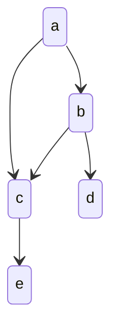

# 机器学习

频率视角下的机器学习：认为模型待估计的参数是固定不变的常量，用来估计参数的数据是随机的变量，需要我们通过某种手段（比如极大似然法）利用数据找到最优参数，损失函数（loss function）直接定义了模型性能的度量方式，其数学期望被称为风险（risk），风险最小化就是参数估计的依据和准则，用训练数据的经验分布替换掉原始表达式中数据的真实分布，借此找到最优参数

贝叶斯视角下的机器学习：将待估计的参数视为随机变量，用来估计的数据反过来是确定的常数，结合参数自身的分布特性，找到最可能产生观测数据的那个参数的过程，贝叶斯学习的输出是关于参数的概率分布

可被机器学习解决的问题：

1. 解决的问题会包含某些显式或者隐式的模式
2. 无法通过数值计算解决
3. 要有大量的可用数据

监督学习适用于预测任务，无监督学习适用于描述任务

- 批量学习：一口气对整个数据集进行建模与学习，并得到最佳假设
- 在线学习：算法根据数据的不断馈入而动态地更新
- 主动学习：有选择地询问无标签数据的标签来实现迭代式的学习

计算学习理论：关于通过”计算“来进行学习的理论，即关于机器学习的理论基础
目的：分析学习任务的困难本质，为学习算法提供理论保证，指导算法设计

## 监督学习

利用样本和期望输出来学习如何预测

- 回归问题：输出的结果是一个连续的值
- 分类问题：输出的结果是离散有限集合

## 无监督学习

在一组数据中寻找某种结构或模式

## 集成学习

使用多个个体学习器来获得比每个单独学习器更好的预测性能

每个组中的个体学习器如果属于同一类型（比如都是线性回归或者都是决策树），形成的就是同质集成；相应地，由不同类型学习器得到的集成则称为异质集成

- 个体学习器间存在强依赖关系因而必须串行生成的序列化方法：提升（Boosting），对所有训练数据进行多次重复应用，每次应用前需要对样本的概率分布做出调整，以达到不同的训练效果
- 个体学习器之间不存在强依赖关系因而可以同时生成的并行化方法：打包（Bagging），将原始的训练数据集拆分成若干互不交叠的子集，再根据每个子集独立地训练出不同的个体学习器

## 深度学习

### 深度前馈网络

一种经典的神经网络结构，这种网络通常由多层神经元组成，层与层之间是单向传递信号的结构，因此称为“前馈”，意味着信息从输入层流向输出层，不会存在反馈连接。典型的深度前馈神经网络包括输入层、若干隐藏层和输出层。每个神经元会接收来自前一层神经元的输入，将其进行加权求和并通过激活函数处理后输出给下一层

网络架构的建立、损失函数的选择、输出单元和隐藏单元的设计、训练误差的处理等问题是深度前馈网络设计中的一系列核心问题

### 自编码器

自编码器是包含若干隐藏层的深度前馈神经网络，其独特之处是输入层和输出层的单元数目相等

将编码映射记作 ϕ，解码映射记作 ψ，自编码器的作用就是将输入 X 改写为 (ψ∘ϕ)(X)

如果以均方误差作为网络训练中的损失函数，自编码器的目的就是找到使均方误差最小的编解码映射的组合

$$
\phi,\psi=\arg\min_{\phi,\psi}||\mathbf{X}-(\phi\circ\psi)(\mathbf{X})||^2
$$

从信息论的角度看，编码映射可以看成是对输入信源 X 的有损压缩，学习的作用就是习得在训练数据集上更加精确的映射，并希望这样的映射在测试数据上同样表现良好，也就是使自编码器具有较好的泛化性能

### 优化

优化问题：

- 病态矩阵：数值精度导致的不可避免的舍入误差可能会给输出带来巨大的偏离，病态矩阵对输入的敏感性会导致很小的更新步长也会增加代价函数，使学习的速度变得异常缓
- 局部极小值：在神经网络，尤其是深度模型中，代价函数甚至会具有不可列无限多个局部极小值，这显然会妨碍对全局最小值的寻找
- 鞍点：梯度为 0 的临界点，但它既不是极大值也不是极小值

随机梯度下降法（stochastic gradient descent）就是在传统机器学习和深度神经网络中都能发挥作用的经典算法，就是每走一步就换个方向。为了节省每次迭代的计算成本，随机梯度下降在每一次迭代中都使用训练数据集的一个较小子集来求解梯度的均值

随机梯度下降会受到噪声的影响。当学习率固定时，噪声会阻止算法的收敛；而当学习率逐渐衰减时，噪声也会将收敛速度压低到次线性水平，降噪的方法有动态采样、梯度聚合和迭代平均三类。为了提升梯度下降的性能，可以通过使用二阶导数近似方法

除此之外，还有动量方法（momentum）、加速下降方法（accelerated gradient descent）和坐标下降方法（coordinate descent）等方法来进行改进梯度下降

## 模型

- 参数模型：待求解的概率分布或者数量关系可以用一组有限且固定数目的参数完全刻画，最典型的是线性回归
- 非参数模型：认为存在一个未知的映射 f()˙​，输入通过这个映射转为输出，学习的对象也是这个映射

参数模型与非参数下模型的区别体现的是可解释性和精确性的区别

1. 模型拟合（model fitting）：利用训练数据集（training set）对模型的普通参数进行拟合
2. 模型选择（model selection）：利用验证数据集（validation set）对模型的超参数进行调整，筛选出性能最好的模型
3. 模型评价（model assessment）：利用测试数据集（test set）来估计筛选出的模型在未知数据上的真实性能

## 实验

实验设计的任务是观察一个或多个因子对实验结果的影响，因此包括算法类型、超参数、数据集等

- 一次一因子（控制变量法）：为所有因子都设定一个基线值，再在其他因子保持在基线水平的前提下令单个因子波动，观察它对学习性能的影响
- 全因子实验（full factorial experiment）：每个因子都有有限个离散的取值，实验则覆盖了所有因子所有取值的所有可能组合
- 连续实验（sequential experimentation）：首先执行全因子实验，但只给每个因子赋予较少的可能取值，确定哪些是对学习结果影响较大的活跃因子并保留下来，剩下的不活跃的因子就会被放弃
- 响应面方法（response surface methodology）：通过二次曲面的拟合寻找可变因子的最佳取值

## [特征工程](/数据技术/数据处理.md#特征工程)

异常点会导致数据的有偏分布，如果异常点是由于采集出错，需要剔除这些异常点。如果异常点本身没有问题，除了剔除异常点之外，除了可以对所有特征值采取对数变化降低数值外，还能使用空间标识把异常点拉成正常

对于缺失的特征值，可以用 k 近邻方法和线性回归对特征的缺失值进行人为赋值

如果某个特征在绝大多数数据中的取值都是相同的，那这个特征就没有存在的意义，因为它体现不出对于不同分类结果的区分度，可以把这个特征去掉

- 特征选择：从现有特征集合中提取一部分作为特征
- 特征提取：对现有特征进行变化，组合得到新的特征，主成分分析将原始的共线性特征转化为新的正交特征，从而实现特征提取

## 向量化运算

可以充分利用GPU进行大规模并行

```py
x = np.array([1,2,3])
y = np.array([3,2,1])
np.dot(x,y) # = for i in n: x[i] * y[i]
```

## 统计机器学习

### 线性回归模型

线性模型具有较强的可解释性

简单线性回归输出的因变量只与单个的输入自变量存在线性关系，而多元线性回归因变量由多个自变量共同决定

单变量线性回归模型：

$$
f(\mathbf{x})=w x + b = 模型(输入特征) = 输出结果
$$

多变量线性回归模型，使用向量表示多个特征及多个参数：

$$
f(\mathbf{\vec{x}})=\vec{w}\cdot \vec{x} + b = \sum_{i=0}^{n}w_i\cdot x_i + b
$$

x 为自变量，w跟b被称为模型的参数，为了找出这两个参数，需要定义一个平方误差代价函数：

$$
J(w,b) = \frac{1}{2m}\sum_{i=1}^m(f(x^{(i)}) - y^{(i)})^2
$$

代价函数就是衡量模型预测值与训练集实际值之间的偏差，找出合适的 w 和 b，使得这个偏差最小，即 $\underset{w,b}{\text{minimize}} J(w,b)$


```py
# 使用sickit-learn 预测日志数据增长量
from sklearn import linear_model

# 训练数据
# 距离第一天的天数, 是否是周末，数据总量
train_data = [
[1	,0, 54],
[2	,0, 108],
  ...
[22	,0, 80968],
]
# 测试数据
test_data = [
  [76,	1,	148550],
  ...
  [42,	1,	109554],
]
reg = linear_model.LinearRegression()
train_feats = list(map(lambda x: x[0: len(x) - 1],train_data))
train_val = list(map(lambda x: x[-1],train_data))
reg.fit(train_feats, train_val)

print('模型参数 ' + str(reg.coef_))
```

### 梯度下降

梯度下降适用所有代价函数

梯度下降背后的思想是：开始时我们随机选择一个参数的组合，计算代价函数，然后我们寻找下一个能让代价函数值下降最多的参数组合。我们持续这么做直到到到一个局部最小值（local minimum），因为我们并没有尝试完所有的参数组合，所以不能确定我们得到的局部最小值是否便是全局最小值（global minimum），选择不同的初始参数组合，可能会找到不同的局部最小值，但线性回归的代价函数只会有一个最小值


梯度下降算法：

$$
tempw = w - \alpha\frac{\partial}{\partial{w}}J(w,b) 
= w - \frac{1}{m}\sum_{i=1}^{m}(f(x^{(i)}) - y^{(i)})x_j^{(i)}
$$
$$
tempb = b - \alpha\frac{\partial}{\partial{b}}J(w,b)
$$
```python
w = tempw
b = tempb
```

对于多变量的线性回归模型，需要额外对所有的参数进行梯度下降：

$$
w_1 = w_1 - \alpha\frac{\partial}{\partial{w}}J(\vec{w},b)
$$
$$
w_2 = w_2 - \alpha\frac{\partial}{\partial{w}}J(\vec{w},b)
$$
$$
w_3 = w_3 - \alpha\frac{\partial}{\partial{w}}J(\vec{w},b)
$$
$$
[w_1,w_2,w_3,...] = \vec{w}
$$

$\alpha$是学习率（learning rate），决定了沿着能让代价函数下降程度最大的方向向下迈出的步子有多大，学习率如果大小了，需要很多步才能到达全局最低点，学习率太大了，可能会越过最低点，甚至可能无法收敛

$\alpha$后面对代价函数的偏导数表示了代价函数在当前取值处的斜率，如果是正斜率，就能得出一个正数，如果是负斜率，就得出负数，这可以使得w，b参数值会向代价函数的最小值的参数值逼近

一个运行良好的梯度下降算法代价函数值应该会随着迭代次数的增加不断收敛到接近局部最小值


当计算的参数值不再变化时，就代表找到了局部最小值

#### 特征缩放

在面对多维特征问题的时候，要保证这些特征都具有相近的尺度，如所有特征的取值都在0-1之间，这将帮助梯度下降算法更快地收敛

### 多项式回归

使用线性回归的思路，关键在于为数据添加新的特征，而这些新的特征是原有的特征的多项式组合

### 逻辑回归

为了对分类问题 $f(\vec{x}) = \vec{w}\cdot\vec{x} + b$ 进行拟合，引入sigmoid函数 $g(z) = \frac{1}{1+e^{-z}}$ 如果把分类问题的参数作为sigmoid函数的参数，就能得到一个输出0 - 1 函数

$$
f(\vec{x}) = \frac{1}{1+e^{-(\vec{w}\cdot\vec{x} + b)}}
$$

当$\vec{w}\cdot\vec{x} + b = 0$时，这条线就是决策边界


通过找出决策边界，大于这个决策边界的被认为真，否则认为假

逻辑回归使用如下代价函数

$$
J(\vec{w},b) = \frac{1}{m}\sum_{i=1}^m L(f(\vec{x}^{(i)},y^{(i)}))
$$

$$
L=\begin{cases}\quad-\log\left(f(\vec{x}^{(i)})\right)&\quad\text{if }y^{(i)}=1\\-\log\left(1-f(\vec{x}^{(i)})\right)&\quad\text{if }y^{(i)}=0&\end{cases}
$$

损失函数如果预期结果为0 但实际结果为1 则会输出1 否则输出0，也就是充分体现实际结果与预期结果的不同，使得代价函数最小

代价函数都是通过最大似然方法统计数据得出

### Softmax回归

Softmax回归是逻辑回归的概括

$$
\begin{array}{rl}{a_{1}=\frac{e^{z_{1}}}{e^{z_{1}}+e^{z_{2}}+\cdots+e^{z_{N}}}}&{{}=P(y=1|\vec{x})}\\{\vdots}\\{a_{N}=\frac{e^{z_{N}}}{e^{z_{1}}+e^{z_{2}}+\cdots+e^{z_{N}}}}&{{}=P(y=N|\vec{x})}\\\end{array}
$$
$$
loss(a_1,...,a_N,y)=\begin{cases}-\log a_1&\mathrm{if}y=1\\-\log a_2&\mathrm{if}y=2\\\vdots\\-\log a_N&\mathrm{if}y=N\end{cases}
$$

## 过拟合

解决过拟合：

1. 加入更多的训练数据
2. 进行特征选择
3. 正则化

### 正则化

- 基于训练数据（data）的正则化：在训练数据集上施加变换，从而产生新的训练数据集。通过生成更多的数据来训练以对抗过拟合。如数据增强及dropout
- 基于网络架构（network architecture）的正则化：简化关于从输入到输出的映射的假设，再让网络架构逐步逼近简化后的映射。如参数共享（weight sharing）以及对传递函数的正则化（activation regularization）
- 基于误差函数（error function）的正则化
- 基于正则化项（the regularization term）的正则化：会把正则化项添加到模型的损失函数中，正则化项的作用是惩罚模型的复杂度，鼓励模型选择简单的参数设置
- 基于最优化过程（optimization）的正则化

基于误差函数的正则化：

$$
J(w,b) = \frac{1}{2m}\sum_{i=1}^m(f(x^{(i)}) - y^{(i)})^2
+\frac{\lambda}{2m}\sum_{j=1}^nw_j^2
$$

使得参数 w 越大，代价就越高，这样梯度下降算法就会选择较小的 w ，改善过拟合

如果选择的正则化参数$\lambda$过大，则会把所有的参数都最小化了，但若$\lambda$过小，那就只能得到一条斜率为0的直线

## 神经网络


layer1 是输入层，每个节点就是一个特征值

layer2 是隐藏层，每个节点是一个逻辑回归神经元，每个神经元接收上一层的1个或多个特征，产生一个新特征，输出给下一层，接收特征的输入被称为激活，接收特征的输入被称为激活函数，逻辑回归神经元的激活函数是sigmoid函数

layer3 是输出层，其根据上一层输出的所有特征，再输出一个特征值

从左向右每个特征被计算成新特征，这个过程称之为前向传播，Tensorflow使用反向传播算法来替代梯度下降计算出参数

隐藏层中每个神经元处理数据的方式，计算什么特征，都是根据训练数据统计所决定的，而非人工指定

神经网络每一层输出的特征值都比上一层的特征更高级，所以也就能更好地预测数据

```py
# 手动实现前向传播过程
x = np.array([220,200,17])

# 第一层第一个神经元
w1_1 = np.array([1,2])
b1_1 = np.array([-1])
z1_1 = np.dot(w1_1, x) + b1_1
a1_1 = sigmoid(z1_1)
# 第一层第二个神经元
w1_2 = np.array([-3,4])
b1_2 = np.array([-1])
z1_2 = np.dot(w1_2, x) + b1_2
a1_2 = sigmoid(z1_2)
# 第一层第三个神经元
w1_3 = np.array([5,-6])
b1_3 = np.array([-1])
z1_3 = np.dot(w1_3, x) + b1_3
a1_3 = sigmoid(z1_3)
# 第二层
w2_1 = np.array([-7,8,9])
b2_1 = np.array([3])
z2_1 = np.dot(w2_1,a1)+b2_1
a2_1 = sigmoid(z2_1)

结果 = a2_1
```

### 激活函数

如果没有激活函数，也就是使用线性激活函数，那么整个神经网络就跟线性回归一样，解决不了更复杂的问题

不同的激活函数会导致神经元输出的模式也不一样

- sigmoid
- 线性激活函数：输入什么就输出什么，等于没有激活函数
- ReLu: 小于0输出0，大于0，输出输入本身

对于输出层，如果解决的是二分类问题，那就需要使用sigmoid，如果解决的是回归问题，输出有负数，选择线性激活函数，输出没有负数，选择ReLu

对于隐藏层，大多数情况下使用的都是ReLu，因为它梯度下降比sigmoid更快

### 优化算法

- Adam：相比传统的梯度下降算法，这种优化算法使得学习率$a$不是固定的，而是会根据运行情况调大会调小以优化性能

### 卷积层

卷积层的每个神经单元不会接受上一层的全部特征输入，而是有选择的选择一部分特征，不同神经元选择的特征集合会重叠

可以通过不同的核函数来提取不同的特征

### 卷积神经网络

一个卷积神经网络的工作流程：

输入层将待处理的图像转化为一个或者多个像素矩阵，卷积层利用一个或多个卷积核从像素矩阵中提取特征，得到的特征映射经过非线性函数处理后被送入池化层，由池化层执行降维操作。卷积层和池化层的交替使用可以使卷积神经网络提取出不同层次上的图像特征。最后得到的特征作为全连接层的输入，由全连接层的分类器输出分类结果

### 深度信念网络

一种概率生成模型，能够建立输入数据和输出类别的联合概率分布

深度信念网络可以看成由若干简单的学习单元构成的整体，而构成它的基本单元就是受限玻尔兹曼机，受限玻尔兹曼机的模型非常简单，就是一个两层的神经网络，包括一个可见层和一个隐藏层

### 感知机模型

一种二分类的监督学习算法，能够决定由向量表示的输入是否属于某个特定类别

1. 初始化权重 $w(0)$ 和阈值，其中权重可以初始化为 0 或较小的随机数
2. 对训练集中的第 $j$ 个样本，将其输入向量 $x_j$​ 送入已初始化的感知器，得到输出 $y_j(t)$
3. 根据 $y_j​(t)$ 和样本 $j$ 的给定输出结果 $d_j$​，按以下规则更新权重向量

$$
w_i(t+1)=w_i(t)+\eta[d_j-y_j(t)]\cdot x_{j,i}
$$

即找出合适的 $W$ 使得训练样本的预测值与实际值的差别最小

感知机以所有误分类点到超平面的总距离作为损失函数，用随机梯度下降法不断使损失函数下降，直到得到正确的分类结果

### 径向基神经网络

包含三层：一个输入层、一个隐藏层和一个输出层。其中隐藏层是径向基网络的核心结构

每个隐藏神经元都选择径向基函数作为传递函数

训练过程：

1. 通过一些方法选择隐藏层中的中心点。常见的方法包括使用样本数据的子集或者通过聚类算法确定中心点
2. 对于每个径向基函数，需要确定其宽度参数，决定了径向基函数在输入空间中的影响范围
3.  对于每个样本，计算其与每个中心点的距离，并将距离作为径向基函数的输入，得到隐藏层的输出
4.  输出层训练：使用类似于其他神经网络的方法，通过反向传播算法来调整输出层的权重，以最小化训练误差

### 自组织特征映射

能够将高维的输入数据映射到低维空间之上（通常是二维空间），采用的是竞争性学习

自组织映射的结构是，一张一维或者二维的网格，网格中的每个节点都代表一个神经元，神经元的权重系数则是和输入数据的维度相同的向量，距离较近的神经元能够处理模式相似的数据，训练过程就是在空间上对神经元进行有序排列的过程

### 模糊神经网络

将常规的神经网络赋予模糊输入信号和模糊权值，其作用在于利用神经网络结构来实现模糊逻辑推理

构成模糊神经网络的基本单元是模糊化的神经元。模糊神经元的输入信号和权重系数都是模糊数，传递函数也需要对模糊集合上的加权结果进行处理，模糊数就是只有取值范围而没有精确数值的数

为了训练网络，如果保持学习率参数不变，误差函数就难以快速收敛。即使收敛也可能陷入局部最小值上，在不同的学习率参数下得到不同的局部最小值。为了处理这个问题，模糊神经网络引入了一种叫做共轭梯度（conjugate gradient）的机制

### 循环神经网络

引入了时间的维度，因而适用于处理时间序列类型的数据

$$
\mathbf{h}_t=f(\mathbf{W}\mathbf{x}_t+\mathbf{U}\mathbf{h}_{t-1})
$$

当前时刻的状态与先前的状态有关

普通的循环神经网络中，记忆只会涉及到过去的状态。如果想让循环神经网络利用来自未来的信息，就要让当前的状态和以后时刻的状态同样建立起联系，得到的就是双向循环神经网络

### 递归神经网络

循环神经网络的特点是在时间维度上共享参数，从而展开处理序列。如果换一种展开方式，将序列数据展开成树状结构，用到的就是递归神经网络

### 生成式对抗网络

- 生成器（generator）：从随机噪声中模拟真实数据样本的潜在分布
- 判别器（discriminator）：判断输入是真实数据还是模拟的数据

对网络的训练就是让判别器区分真实数据和伪造数据的准确率最大化，让生成器生成的数据被判别器发现的概率最小化

$$
\arg\min_g\max_D-\dfrac12\int_x[p_{aata}(x)\log(D(x))+p_g(x)\log(1-D(x))]\mathrm{d}x
$$

### 长短期记忆网络

长短期记忆的基本单元的作用在需要时取出并聚焦记忆，通常包括四个功能不同的隐藏层：记忆模块（memory cell）、输入门（input gate）、输出门（output gate）和遗忘门（forget gate）

首先，遗忘门根据当前输入和前一步隐藏状态，决定哪些信息要从细胞状态中遗忘。

然后，输入门根据当前输入和前一步隐藏状态，确定更新细胞状态的新信息，并结合遗忘门的结果更新细胞状态。

最后，输出门根据当前的细胞状态和输入，计算并输出当前时刻的隐藏状态

## 评估模型

数据集被划分为训练集跟测试集，一般是七三分

对于回归模型：通过比较不同模型测试集的预测误差的大小，越大代表对未知数据性能越差

预测误差的计算就是原理同线性回归的代价函数：

$$
J(w,b) = \frac{1}{2m}\sum_{i=1}^m(f(x^{(i)}) - y^{(i)})^2
$$

即数据集的预测值与目标值的差累加

更一般的，是把数据集被划分为训练集跟交叉验证集、测试集，一般是六二二分

通过比较不同模型对于验证集的预测误差，选择一个在验证集效果最好的模型，当最终决定使用哪个后模型，使用测试集来展示模型对未知数据的性能

### 偏差与方差

偏差的含义是模型预测值的期望和真实结果之间的区别，如果偏差为 0，模型给出的估计的就是无偏估计，方差的含义则是模型预测值的方差，也就是预测值本身的波动程度，方差越小意味着模型越有效。

模型的设计追求低偏差，即准确度高，低方差，即比较简单的模型。高偏差意味着过拟合，高方差意味着欠拟合，理想情况下应该选择低偏差与低方差的模型，即在过拟合与欠拟合直接选择

偏差使用训练集计算得到，即对于训练集使用代价函数计算，代价越小，则偏差越高

方差使用验证集计算得到，即对于验证集使用代价函数计算，代价越小，则方差越低

模型验证的任务就是确定模型的复杂度以避免过拟合的发生，选择数据集基本的原则就是确保训练集、验证集和测试集三者两两互不相交，同时保证三个数据集中正例和负例的比例应该大致一致，避免在数据集之间出现不平衡，再在这些数据集上使用Holdout检验或者交叉校验


正则化可以用来防止过拟合，如果选择的正则化参数$\lambda$过大，则会把所有的参数都最小化了，这会使得模型欠拟合，而$\lambda$越小，模型就越过拟合


使用学习曲线可以决定是否能通过增加训练数据提升模型效果


在过拟合的情况下，添加更多的数据能提升模型效果，但在欠拟合的情况下，模型压根就设计的不对，添加再多的数据也无益

- 获得更多的训练样本——解决高方差
- 尝试减少特征的数量——解决高方差
- 尝试获得更多的特征——解决高偏差
- 尝试增加多项式特征——解决高偏差
- 尝试减少正则化程度λ——解决高偏差
- 尝试增加正则化程度λ——解决高方差

较小的神经网络，参数比较少，容易欠拟合。而更大的神经网络，偏差相对会较低，即过拟合，使用正则化可以减少过拟合，但计算代价会越来越高，所以中大型神经网络一般要解决的是高方差的问题，针对不同隐藏层层数的神经网络训练神经网络， 然后选择验证集代价最小的神经网络

## 增加训练数据

- 数据增强：对已有训练数据进行合理变换，产生新数据
- 数据合成：如通过计算机生成的图像来当做模型的训练数据

## 迁移学习

如果要解决的问题没有足够多的训练数据，可以找一个相同任务类型的神经网络，利用其已经训练完成的隐藏层参数，根据需要修改输出层，并输入我们自己的训练数据，对模型进行微调，这样可以有效利用别人已经预训练好的模型来解决我们的问题


- 基于样本的迁移学习：通过调整源域中原始样本的权重系数，使之和目标域匹配，进而应用在目标域中
- 基于特征的迁移学习：通过特征变换使得源域数据与目标域数据处在同一个特征空间之上，再在这个公共空间上进行学习
- 基于模型的迁移学习：假设源任务和目标任务共享一些参数或者一些先验分布，将在训练数据上训练好的成熟模型应用到目标域上解决问题
- 基于关系的迁移学习：如果源域和目标域之间共享了某种相似关系，那就可以将源域上的逻辑关系网络应用到目标域上

## 异常检测

给定数据集 X，我们假使数据集是正常的，我们希望知道新的数据  是不是异常的，即这个测试数据不属于X的几率如何


这种方法称为密度估计

$$
if\quad p(x)\begin{cases}<\varepsilon&anomaly\\>=\varepsilon&normal&\end{cases}
$$

可以用高斯分布来确定已知$x^{(i)}$，求其概率：


高斯分布由两个参数计算确定：

$$
\mu=\frac1m\sum_{i=1}^mx^{(i)}\\
\sigma^2=\frac1m\sum_{i=1}^m(x^{(i)}-\mu)^2
$$

计算一个特征向量出现的概率：

$$
p(\vec{\mathrm{x}})=p(x_1;\mu_1,\sigma_1^2)*p(x_2;\mu_2,\sigma_2^2)*p(x_3;\mu_3,\sigma_3^2)*\cdots*p(x_n;\mu_n,\sigma_n^2)\\
=\prod_{j=1}^np(x_j;\mu_j,\sigma_j^2)
$$

每一个特征都需要计算自己的高斯分布，即自己的$\mu$ $\sigma^2$：

$$
\mu_{j}=\frac{1}{m}\sum_{i=1}^{m}x_{j}^{(i)}\\
\sigma_{j}^{2}=\frac{1}{m}\sum_{i=1}^{m}(x_{j}^{(i)}-\mu_{j})^{2}
$$

由于异常检测是无监督学习，所以是通过训练集构建密度估计函数，再通过验证集（大量正常数据，少量异常数据）选择合适的$\epsilon$

对比项|异常检测|	监督学习
-|-|-
训练数据特征|非常少量的正向类（异常数据 y = 1）, 大量的负向类（y = 0）	|同时有大量的正向类和负向类
正向数据占比|许多不同种类的异常，非常难。根据非常少量的异常数据来训练算法。|	有足够多的正向类实例，足够用于训练 算法，未来遇到的正向类实例可能与训练集中的非常近似。
挖掘模式|未来遇到的异常可能与已掌握的异常、非常的不同。	 | 找出已存在于训练数据中的模式
场景|欺诈行为检测 生产（例如飞机引擎）检测数据中心的计算机运行状况	|邮件过滤器 天气预报 肿瘤分类

异常检测假设特征符合高斯分布，如果数据的分布不是高斯分布，异常检测算法也能够工作，但是最好还是将数据转换成高斯分布，例如使用对数函数 $x = log(x + c)$ 或者 $x = x^c$

我们通常可以通过将一些相关的特征进行组合，来获得一些新的更好的特征（异常数据的该特征值异常地大或小

## 强化学习

不必告诉算法 每个输入 x 的正确输出 y 是什么，而是要指定一个奖励函数，告诉它何时表现良好，何时表现不佳。 算法的工作是自动弄清楚如何选择好的动作

要解决的问题要多种状态$S(s_1,s2,..,s_n)$ 每个状态都有属于它的奖励$r$，奖励通过奖励函数计算得到：$R(s_i) = r_i$。算法需要根据一个策略$\pi$ 求解当前所处状态应该采取什么行动$a$，即$\pi(s_n) = a$，算法所能最终得到的回报是与折扣因子$\gamma$有关，即最终回报 = $r_1 + \gamma r_2 + \gamma^2 r_3 + ...$

### 状态操作值函数

$Q(s,a)$返回在状态s下，使用a行动，能获取到的最大回报，并且通过这个行动跟这个状态，后续也是最优解

贝尔曼方程：

$$
Q(s,a)=R(s)+\gamma\max_{a^{\prime}}Q(s^{\prime},a^{\prime})
$$

- $s^{\prime}$ 是采取行动$a$后达到的状态
- $a^{\prime}$ 是要到达$s^{\prime}$所要采取的行动

方程的第一部分也被称为即时奖励，第二部分是从当前状态开始，能得到的最大奖励

这样可以通过贝尔曼方程来创建神经网络的训练数据：

$$
x = (s,a) \\
y = R(s)+\gamma\max_{a^{\prime}}Q(s^{\prime},a^{\prime})
$$

让神经网络算出最优的Q函数，这样就可以在当前状态$s$下，应该采取什么行动$a$


### ϵ-贪婪策略

前期收集训练数据时，我们并不知道采取什么行动比较好，一种方式是不管当前状态如何，都采取随机行动。

一种被称为$\epsilon$贪婪策略的方法，定义一个参数$\epsilon$，每次，你有$1-\epsilon$的几率总是选择使得$Q(s,a)$最大的$a$，同时，另外$\epsilon$的几率就是随机做出行动$a$

### 随机环境

对于某些问题，下一个状态可能是随机的，此时强化学习的目标就从选择最大回报变成使得预期的回报尽可能大

### 连续状态空间

有些问题的状态取值可能不是离散的，而是一个有连续值的向量

## 小批量梯度下降

如果训练集数据很多，按照正常的梯度下降，每轮都会把所有训练数据丢到代价函数计算一遍，小批量梯度下降的思想是，每轮梯度下降只取训练数据的一部分，这样可以有效减少计算量。

但这也会导致梯度下降收敛的速度比正常的慢。

## 软更新

在梯度下降中，为了防止参数更新发生较大变化，我们每次只取一部分新的参数跟大部分老的参数，即

$$
w = 0.01w_{new} + 0.99w\\
b = 0.01b_{new} + 0.99b
$$

## 概率图模型

用图论表现随机变量之间的条件依赖关系的建模方法

### 贝叶斯网络



$$
p(A,B,C,D,E)=p(A)\cdot p(B|A) \cdot p(C|B,A)\cdot p(D|B)\cdot p(E|C)
$$

### 马尔可夫随机场

无向图模型，它的每个顶点表示一个随机变量，每条边则表示随机变量之间的依赖关系

## 集群智能

由众多简单个体组成的群体能够通过相互之间的简单合作来实现某些功能，完成某些任务

当构成一个系统的基本单元数量极为庞大时，将这些个体看作一个整体，就会有一些全新的属性、规律或模式自发地冒出来，这种现象就称为“涌现”（emergence）

蚁群算法：

- 信息素的更新： 蚂蚁在路径上释放信息素，路径上信息素浓度高低表示路径的优劣。经过的蚂蚁会根据路径上信息素浓度对路径进行评估和选择。
- 路径选择： 蚂蚁在搜索过程中遵循两个基本规则
  - 正向规则（Exploitation）： 蚂蚁倾向于选择信息素浓度高的路径，因为这些路径可能是更优的选择。
  - 反向规则（Exploration）： 为了保证搜索的广度和多样性，蚂蚁也会随机选择路径，有时会选择信息素浓度低的路径。
- 信息素挥发： 信息素在时间上会逐渐挥发。这样做是为了保证蚂蚁能够重新探索路径，不会陷入局部最优解

## 知识图谱

由大量的概念实体以及它们之间的关系共同构成的语义网络

知识图谱可以根据已有实体的概念、属性和关系为新的概念自动生成属性；也可以明确不同新实体之间的关系

知识推理可以分为归纳和演绎两类
