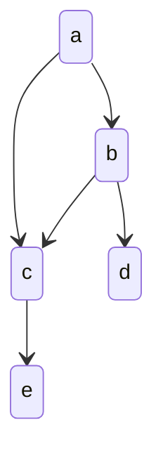

# 机器学习

频率视角下的机器学习：认为模型待估计的参数是固定不变的常量，用来估计参数的数据是随机的变量，需要我们通过某种手段（比如极大似然法）利用数据找到最优参数，损失函数（loss function）直接定义了模型性能的度量方式，其数学期望被称为风险（risk），风险最小化就是参数估计的依据和准则，用训练数据的经验分布替换掉原始表达式中数据的真实分布，借此找到最优参数

贝叶斯视角下的机器学习：将待估计的参数视为随机变量，用来估计的数据反过来是确定的常数，结合参数自身的分布特性，找到最可能产生观测数据的那个参数的过程，贝叶斯学习的输出是关于参数的概率分布

可被机器学习解决的问题：

1. 解决的问题会包含某些显式或者隐式的模式
2. 无法通过数值计算解决
3. 要有大量的可用数据

监督学习适用于预测任务，无监督学习适用于描述任务

- 批量学习：一口气对整个数据集进行建模与学习，并得到最佳假设
- 在线学习：算法根据数据的不断馈入而动态地更新
- 主动学习：有选择地询问无标签数据的标签来实现迭代式的学习

计算学习理论：关于通过”计算“来进行学习的理论，即关于机器学习的理论基础

目的：分析学习任务的困难本质，为学习算法提供理论保证，指导算法设计

## 集成学习

使用多个个体学习器来获得比每个单独学习器更好的预测性能

每个组中的个体学习器如果属于同一类型（比如都是线性回归或者都是决策树），形成的就是同质集成；相应地，由不同类型学习器得到的集成则称为异质集成

- 个体学习器间存在强依赖关系因而必须串行生成的序列化方法：提升（Boosting），对所有训练数据进行多次重复应用，每次应用前需要对样本的概率分布做出调整，以达到不同的训练效果
- 个体学习器之间不存在强依赖关系因而可以同时生成的并行化方法：打包（Bagging），将原始的训练数据集拆分成若干互不交叠的子集，再根据每个子集独立地训练出不同的个体学习器

## 模型

- 参数模型：待求解的概率分布或者数量关系可以用一组有限且固定数目的参数完全刻画，最典型的是线性回归
- 非参数模型：认为存在一个未知的映射 f()˙​，输入通过这个映射转为输出，学习的对象也是这个映射

参数模型与非参数下模型的区别体现的是可解释性和精确性的区别

1. 模型拟合（model fitting）：利用训练数据集（training set）对模型的普通参数进行拟合
2. 模型选择（model selection）：利用验证数据集（validation set）对模型的超参数进行调整，筛选出性能最好的模型
3. 模型评价（model assessment）：利用测试数据集（test set）来估计筛选出的模型在未知数据上的真实性能

## 实验

实验设计的任务是观察一个或多个因子对实验结果的影响，因此包括算法类型、超参数、数据集等

- 一次一因子（控制变量法）：为所有因子都设定一个基线值，再在其他因子保持在基线水平的前提下令单个因子波动，观察它对学习性能的影响
- 全因子实验（full factorial experiment）：每个因子都有有限个离散的取值，实验则覆盖了所有因子所有取值的所有可能组合
- 连续实验（sequential experimentation）：首先执行全因子实验，但只给每个因子赋予较少的可能取值，确定哪些是对学习结果影响较大的活跃因子并保留下来，剩下的不活跃的因子就会被放弃
- 响应面方法（response surface methodology）：通过二次曲面的拟合寻找可变因子的最佳取值

## [特征工程](/数据技术/数据处理.md#特征工程)

异常点会导致数据的有偏分布，如果异常点是由于采集出错，需要剔除这些异常点。如果异常点本身没有问题，除了剔除异常点之外，除了可以对所有特征值采取对数变化降低数值外，还能使用空间标识把异常点拉成正常

对于缺失的特征值，可以用 k 近邻方法和线性回归对特征的缺失值进行人为赋值

如果某个特征在绝大多数数据中的取值都是相同的，那这个特征就没有存在的意义，因为它体现不出对于不同分类结果的区分度，可以把这个特征去掉

- 特征选择：从现有特征集合中提取一部分作为特征
- 特征提取：对现有特征进行变化，组合得到新的特征，主成分分析将原始的共线性特征转化为新的正交特征，从而实现特征提取

## 向量化运算

可以充分利用GPU进行大规模并行

```py
x = np.array([1,2,3])
y = np.array([3,2,1])
np.dot(x,y) # = for i in n: x[i] * y[i]
```

## 优化

- 随机优化：对拥有大量题解的一个问题，选取一个可优化的题解进行优化

### 成本函数(代价函数)

用一个值代表方案的好坏程度 值越大代表方案越差，对于一个问题，会有多种变量，则需要对这些变量进行归一化计算，从而确定哪些变量更重要

若果可能，让最优解的成本函数为0，这样子当找到最优解后就可以停止后续的查找

### 梯度下降

梯度下降适用所有代价函数

梯度下降背后的思想是：开始时我们随机选择一个参数的组合，计算代价函数，然后我们寻找下一个能让代价函数值下降最多的参数组合。我们持续这么做直到到到一个局部最小值（local minimum），因为我们并没有尝试完所有的参数组合，所以不能确定我们得到的局部最小值是否便是全局最小值（global minimum），选择不同的初始参数组合，可能会找到不同的局部最小值，但线性回归的代价函数只会有一个最小值


梯度下降算法：

$$
tempw = w - \alpha\frac{\partial}{\partial{w}}J(w,b) 
= w - \frac{1}{m}\sum_{i=1}^{m}(f(x^{(i)}) - y^{(i)})x_j^{(i)}
$$
$$
tempb = b - \alpha\frac{\partial}{\partial{b}}J(w,b)
$$
```python
w = tempw
b = tempb
```

对于多变量的线性回归模型，需要额外对所有的参数进行梯度下降：

$$
w_1 = w_1 - \alpha\frac{\partial}{\partial{w}}J(\vec{w},b)
$$
$$
w_2 = w_2 - \alpha\frac{\partial}{\partial{w}}J(\vec{w},b)
$$
$$
w_3 = w_3 - \alpha\frac{\partial}{\partial{w}}J(\vec{w},b)
$$
$$
[w_1,w_2,w_3,...] = \vec{w}
$$

$\alpha$是学习率（learning rate），决定了沿着能让代价函数下降程度最大的方向向下迈出的步子有多大，学习率如果大小了，需要很多步才能到达全局最低点，学习率太大了，可能会越过最低点，甚至可能无法收敛

$\alpha$后面对代价函数的偏导数表示了代价函数在当前取值处的斜率，如果是正斜率，就能得出一个正数，如果是负斜率，就得出负数，这可以使得w，b参数值会向代价函数的最小值的参数值逼近

一个运行良好的梯度下降算法代价函数值应该会随着迭代次数的增加不断收敛到接近局部最小值


当计算的参数值不再变化时，就代表找到了局部最小值

#### 软更新

在梯度下降中，为了防止参数更新发生较大变化，我们每次只取一部分新的参数跟大部分老的参数，即

$$
w = 0.01w_{new} + 0.99w\\
b = 0.01b_{new} + 0.99b
$$

#### 特征缩放

在面对多维特征问题的时候，要保证这些特征都具有相近的尺度，如所有特征的取值都在0-1之间，这将帮助梯度下降算法更快地收敛

#### 小批量梯度下降

如果训练集数据很多，按照正常的梯度下降，每轮都会把所有训练数据丢到代价函数计算一遍，小批量梯度下降的思想是，每轮梯度下降只取训练数据的一部分，这样可以有效减少计算量。

但这也会导致梯度下降收敛的速度比正常的慢。

### 过拟合

解决过拟合：

1. 加入更多的训练数据
2. 进行特征选择
3. 正则化

#### 正则化

- 基于训练数据（data）的正则化：在训练数据集上施加变换，从而产生新的训练数据集。通过生成更多的数据来训练以对抗过拟合。如数据增强及dropout
- 基于网络架构（network architecture）的正则化：简化关于从输入到输出的映射的假设，再让网络架构逐步逼近简化后的映射。如参数共享（weight sharing）以及对传递函数的正则化（activation regularization）
- 基于误差函数（error function）的正则化
- 基于正则化项（the regularization term）的正则化：会把正则化项添加到模型的损失函数中，正则化项的作用是惩罚模型的复杂度，鼓励模型选择简单的参数设置
- 基于最优化过程（optimization）的正则化

基于误差函数的正则化：

$$
J(w,b) = \frac{1}{2m}\sum_{i=1}^m(f(x^{(i)}) - y^{(i)})^2
+\frac{\lambda}{2m}\sum_{j=1}^nw_j^2
$$

使得参数 w 越大，代价就越高，这样梯度下降算法就会选择较小的 w ，改善过拟合

如果选择的正则化参数$\lambda$过大，则会把所有的参数都最小化了，但若$\lambda$过小，那就只能得到一条斜率为0的直线

### 蒙特卡洛算法和拉斯维加斯算法

- 两类算法的统称，利用随机的方法来简化整体的算法过程

蒙特卡罗算法原理：每次计算都尽量尝试找更好的结果路径，但不保证是最好的结果路径。用这样寻找结果的方法，无论何时都会有结果出来，而且给的时间越多、尝试越多，最终会越近似最优解

拉斯维加斯算法原理：就是每次计算都尝试找到最好的答案，但不保证这次计算就能找到最好的答案，尝试次数越多，越有机会找到最优解

### 随机搜索

生成一定范围内的随机题解，代入成本函数，也许可以得到一个可以接受的题解

### 爬山法

随机选取一个题解，在这个题解临近的解题空间内寻找成本更低的题解

这种方式问题是得到题解的可能只是局部最优而非全局最优

### 模拟退火算法

随机选取一个题解，然后也会跟爬山法一样尝试寻找成本更低的解

区别在于如果发现新的题解比老的题解花费的成本更高，这个题解可能也会被接收（随机），但随着迭代次数不断增加（温度下降），这种花费成本更高的题解被接受的概率会越来越小

### 遗传算法

随机选取一组题解，对这些题解的成本函数进行排序

选取成本函数最小的一部分顶端题解，称之为**精英选拔**，创建新种群，新种群的其他题解都是根据这些精英演变而来的

演变的方式有两种：

- 变异：对题解的某一个变量做一个微小的调整
- 配对：调两个题解按某种方式进行交叉结合

## 评估模型

数据集被划分为训练集跟测试集，一般是七三分

对于回归模型：通过比较不同模型测试集的预测误差的大小，越大代表对未知数据性能越差

预测误差的计算就是原理同线性回归的代价函数：

$$
J(w,b) = \frac{1}{2m}\sum_{i=1}^m(f(x^{(i)}) - y^{(i)})^2
$$

即数据集的预测值与目标值的差累加

更一般的，是把数据集被划分为训练集跟交叉验证集、测试集，一般是六二二分

通过比较不同模型对于验证集的预测误差，选择一个在验证集效果最好的模型，当最终决定使用哪个后模型，使用测试集来展示模型对未知数据的性能

总结一下，划分数据的方法有如下：

- Holdout 检验：将原始的样本集合随机划分为训练集和测试集两部分，评估的结果有一定随机性
- 交叉校验：为了消除 Holdout 检验的随机性，将全部样本划分成 k 个大小相等的样本子集，然后依次遍历这 k 个子集，每次把当前遍历到的子集作为验证集，其余所有的子集作为训练集，这样依次进行 k 次模型的训练和评估，再将所有 k 次评估指标的平均值作为最终的评估指标
- 自助法：对于总数为 n 的样本集合，先进行 n 次有放回地随机抽样，得到大小为 n 的训练集。在 n 次采样过程中，有的样本会被重复采样，有的样本没有被抽出过，再将这些没有被抽出的样本作为验证集进行模型验证
- 时间切割：将时间序列数据分为训练集和测试集，在某一个时间点之前的数据用作训练集，之后的数据用作验证集，防止模型在训练和评估过程中引入未来信息
- 离线 Replay：根据数据生成时间对测试样本进行排序，并根据模型的更新时间点，逐步更新模型并评估模型在更新前后的性能，以更准确地反映模型在生产环境中的表现

### 偏差与方差

偏差的含义是模型预测值的期望和真实结果之间的区别，如果偏差为 0，模型给出的估计的就是无偏估计，方差的含义则是模型预测值的方差，也就是预测值本身的波动程度，方差越小意味着模型越有效。

模型的设计追求低偏差，即准确度高，低方差，即比较简单的模型。高偏差意味着过拟合，高方差意味着欠拟合，理想情况下应该选择低偏差与低方差的模型，即在过拟合与欠拟合直接选择

偏差使用训练集计算得到，即对于训练集使用代价函数计算，代价越小，则偏差越高

方差使用验证集计算得到，即对于验证集使用代价函数计算，代价越小，则方差越低

模型验证的任务就是确定模型的复杂度以避免过拟合的发生，选择数据集基本的原则就是确保训练集、验证集和测试集三者两两互不相交，同时保证三个数据集中正例和负例的比例应该大致一致，避免在数据集之间出现不平衡，再在这些数据集上使用Holdout检验或者交叉校验


正则化可以用来防止过拟合，如果选择的正则化参数$\lambda$过大，则会把所有的参数都最小化了，这会使得模型欠拟合，而$\lambda$越小，模型就越过拟合


使用学习曲线可以决定是否能通过增加训练数据提升模型效果


在过拟合的情况下，添加更多的数据能提升模型效果，但在欠拟合的情况下，模型压根就设计的不对，添加再多的数据也无益

- 获得更多的训练样本——解决高方差
- 尝试减少特征的数量——解决高方差
- 尝试获得更多的特征——解决高偏差
- 尝试增加多项式特征——解决高偏差
- 尝试减少正则化程度λ——解决高偏差
- 尝试增加正则化程度λ——解决高方差

较小的神经网络，参数比较少，容易欠拟合。而更大的神经网络，偏差相对会较低，即过拟合，使用正则化可以减少过拟合，但计算代价会越来越高，所以中大型神经网络一般要解决的是高方差的问题，针对不同隐藏层层数的神经网络训练神经网络， 然后选择验证集代价最小的神经网络

### 评估指标

- 正样本：即属于某一类的样本
- 负样本：即不属于某一类的样本

对比项 | 正类 | 负类
-|-|-
被检索	|True Positive|	False Positive
未检索|	False Negative|	True Negative

- 准确率(Accuracy)：指分类正确的样本占总样本个数的比例 $(TP + TN) / ALL$
- 查准率（Precision）：被正确检索的样本数 与 被检索到样本总数之比 $TP / (TP + FP)$
- 查全率（Recall）：被正确检索的样本数 与 应当被检索到的样本数之比 $TP / (TP + FN)$

宁愿漏掉，不可错杀：Precision 将是一个被侧重关心的指标。宁愿错杀，不可漏掉：Recall 将是一个被侧重关心的指标。当两个数字都很高时，表示模型有很好的效果

F-Score，用来综合考虑 Precision 与 Recall，$\beta$是用来调整 Precision 与 Recall 二者的权重，这个分数越高代表 Precision 与 Recall 更平衡：

$$
FS=\left(1+\beta^2\right)\cdot\frac{Precision\cdot Recall}{\beta^2\cdot(Precision+Recall)}
$$

对数损失：

$$
\begin{aligned}-\frac{1}{N}\sum_{i=1}^{N}\left(y_i\log P_1+(1-y_i)\log\left(1-P_i\right)\right)\end{aligned}
$$

（二分类对数损失函数）

yi​ 是输入实例 xi​ 的真实类别, pi​ 是预测输入实例 xi​ 是正样本的概率，N 是样本总数

（多分类对数损失函数）

$$
\text{Multi-LogLoss }=-\frac1n\sum_{i=1}^n\sum_{j=1}^my_{i,j}\log{(p_{i,j})}
$$

均方根误差：用来评估预测连续值的模型的效果

$$
\mathrm{RMSE}=\sqrt{\frac{\sum_{i=1}^n\left(y_i-\hat{y}_l\right)^2}n}
$$

yi​ 是第 i 个样本点的真实值，y^​l​ 是第 i 个样本点的预测值，n 是样本点的个数。那么均方根误差越小，就证明这个回归模型预测越精确

P-R曲线：横轴是召回率，纵轴是精确率，可以用来对比不同模型在固定召回率或精确率的情况，另外一个指标怎样

ROC曲线：横坐标是 False Positive Rate（FPR，假阳性率），纵坐标是 True Positive Rate （TPR，真阳性率）

平均精度均值：

## 增加训练数据

- 数据增强：对已有训练数据进行合理变换，产生新数据
- 数据合成：如通过计算机生成的图像来当做模型的训练数据

## 迁移学习

如果要解决的问题没有足够多的训练数据，可以找一个相同任务类型的神经网络，利用其已经训练完成的隐藏层参数，根据需要修改输出层，并输入我们自己的训练数据，对模型进行微调，这样可以有效利用别人已经预训练好的模型来解决我们的问题


- 基于样本的迁移学习：通过调整源域中原始样本的权重系数，使之和目标域匹配，进而应用在目标域中
- 基于特征的迁移学习：通过特征变换使得源域数据与目标域数据处在同一个特征空间之上，再在这个公共空间上进行学习
- 基于模型的迁移学习：假设源任务和目标任务共享一些参数或者一些先验分布，将在训练数据上训练好的成熟模型应用到目标域上解决问题
- 基于关系的迁移学习：如果源域和目标域之间共享了某种相似关系，那就可以将源域上的逻辑关系网络应用到目标域上

## 强化学习

不必告诉算法 每个输入 x 的正确输出 y 是什么，而是要指定一个奖励函数，告诉它何时表现良好，何时表现不佳。 算法的工作是自动弄清楚如何选择好的动作

要解决的问题要多种状态$S(s_1,s2,..,s_n)$ 每个状态都有属于它的奖励$r$，奖励通过奖励函数计算得到：$R(s_i) = r_i$。算法需要根据一个策略$\pi$ 求解当前所处状态应该采取什么行动$a$，即$\pi(s_n) = a$，算法所能最终得到的回报是与折扣因子$\gamma$有关，即最终回报 = $r_1 + \gamma r_2 + \gamma^2 r_3 + ...$

### 状态操作值函数

$Q(s,a)$返回在状态s下，使用a行动，能获取到的最大回报，并且通过这个行动跟这个状态，后续也是最优解

贝尔曼方程：

$$
Q(s,a)=R(s)+\gamma\max_{a^{\prime}}Q(s^{\prime},a^{\prime})
$$

- $s^{\prime}$ 是采取行动$a$后达到的状态
- $a^{\prime}$ 是要到达$s^{\prime}$所要采取的行动

方程的第一部分也被称为即时奖励，第二部分是从当前状态开始，能得到的最大奖励

这样可以通过贝尔曼方程来创建神经网络的训练数据：

$$
x = (s,a) \\
y = R(s)+\gamma\max_{a^{\prime}}Q(s^{\prime},a^{\prime})
$$

让神经网络算出最优的Q函数，这样就可以在当前状态$s$下，应该采取什么行动$a$


### ϵ-贪婪策略

前期收集训练数据时，我们并不知道采取什么行动比较好，一种方式是不管当前状态如何，都采取随机行动。

一种被称为$\epsilon$贪婪策略的方法，定义一个参数$\epsilon$，每次，你有$1-\epsilon$的几率总是选择使得$Q(s,a)$最大的$a$，同时，另外$\epsilon$的几率就是随机做出行动$a$

### 随机环境

对于某些问题，下一个状态可能是随机的，此时强化学习的目标就从选择最大回报变成使得预期的回报尽可能大

### 连续状态空间

有些问题的状态取值可能不是离散的，而是一个有连续值的向量

## 概率图模型

用图论表现随机变量之间的条件依赖关系的建模方法

### 贝叶斯网络



$$
p(A,B,C,D,E)=p(A)\cdot p(B|A) \cdot p(C|B,A)\cdot p(D|B)\cdot p(E|C)
$$

### 马尔可夫随机场

无向图模型，它的每个顶点表示一个随机变量，每条边则表示随机变量之间的依赖关系

## 集群智能

由众多简单个体组成的群体能够通过相互之间的简单合作来实现某些功能，完成某些任务

当构成一个系统的基本单元数量极为庞大时，将这些个体看作一个整体，就会有一些全新的属性、规律或模式自发地冒出来，这种现象就称为“涌现”（emergence）

蚁群算法：

- 信息素的更新： 蚂蚁在路径上释放信息素，路径上信息素浓度高低表示路径的优劣。经过的蚂蚁会根据路径上信息素浓度对路径进行评估和选择。
- 路径选择： 蚂蚁在搜索过程中遵循两个基本规则
  - 正向规则（Exploitation）： 蚂蚁倾向于选择信息素浓度高的路径，因为这些路径可能是更优的选择。
  - 反向规则（Exploration）： 为了保证搜索的广度和多样性，蚂蚁也会随机选择路径，有时会选择信息素浓度低的路径。
- 信息素挥发： 信息素在时间上会逐渐挥发。这样做是为了保证蚂蚁能够重新探索路径，不会陷入局部最优解

## 知识图谱

由大量的概念实体以及它们之间的关系共同构成的语义网络

知识图谱可以根据已有实体的概念、属性和关系为新的概念自动生成属性；也可以明确不同新实体之间的关系

知识推理可以分为归纳和演绎两类

## 流形学习

用于处理高维数据的降维和可视化。这类方法的目标是在保持数据的局部结构和流形特性的同时，将高维数据映射到一个低维空间，从而揭示数据的内在结构

## 数据挖掘

### 基本流程

商业理解是数据挖掘项目成功的关键之一，因为这有助于确保项目从一开始就是针对商业目标而设计的。

数据理解和数据准备是数据挖掘的重要前提，因为数据质量对于最终的模型效果至关重要。

模型建立和模型评估是数据挖掘的核心步骤，这是构建和测试模型的关键阶段。

上线发布是数据挖掘项目的最终目标，因为这意味着模型已经被应用到商业实践中，并且提供了有价值的商业洞察。

监控和维护是确保数据挖掘结果持续有效的关键步骤，因为数据和商业需求都在不断变化，需要定期评估和更新模型

数据挖掘背后的数学原理：

- 概率论与数理统计：提供了数据建模和推断的理论基础
- 线性代数：特别是矩阵与向量
- 图论：来描述数据的结构关系
- 最优化方法：解决优化问题的工具

### 数据挖掘的任务

- 分类（Classification）：分类是将数据划分到不同的类别或标签中的任务。它通常用于有标记的数据，即每个数据都有一个预先定义好的标签。分类的目标是构建一个模型，该模型可以根据数据中的特征将未标记的数据分配到正确的类别中。
- 聚类（Clustering）：聚类是将数据划分为具有相似特征的组或簇的任务。聚类是一种无监督学习，即数据没有预先定义的标签或类别。聚类的目标是在数据中发现内在的结构或模式，并将数据分组为具有相似特征的组。
- 预测（Prediction）：预测是使用历史数据中的模式和关系来预测未来数据的任务。预测通常用于连续型数据，即数值型数据，而不是分类数据。预测的目标是构建一个模型，该模型可以使用历史数据来预测未来数据。
- 关联分析（Association Analysis）：关联分析是发现数据之间关系的任务。它通常用于交易数据，例如购物篮数据。关联分析的目标是发现数据中的频繁项集和关联规则，这些规则可以揭示数据之间的关系和模式。
