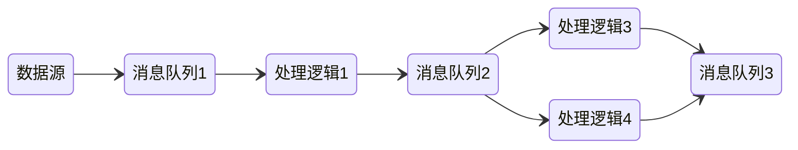
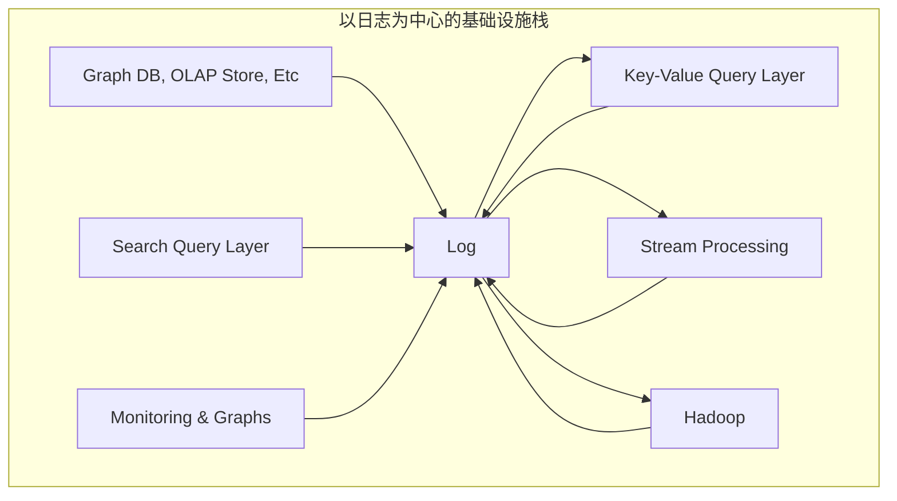
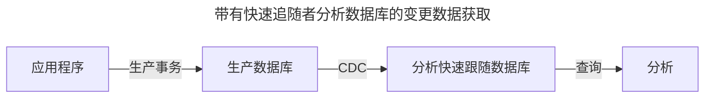
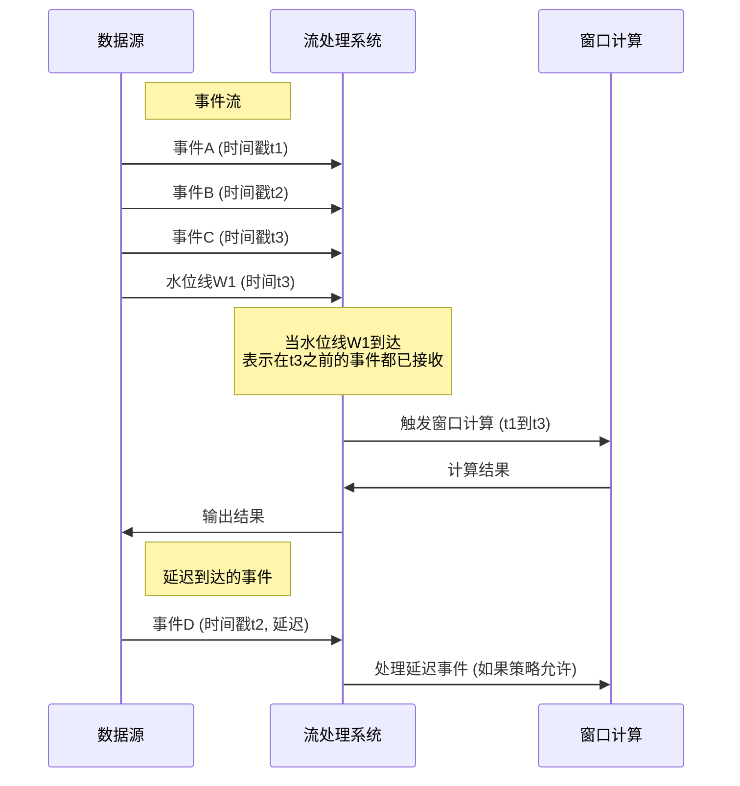
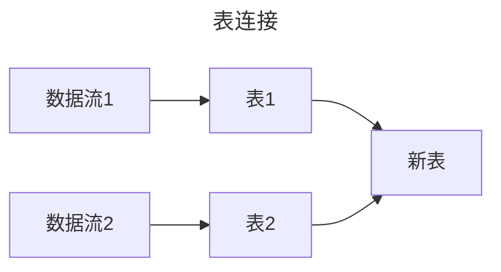
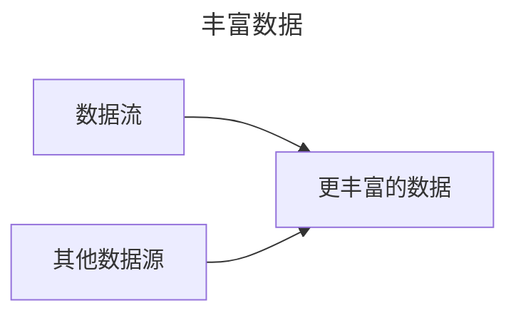
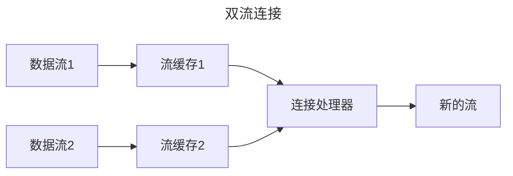

# 流处理

- 复杂事件处理（CEP）：存储一个搜索模式，在流数据流经时判断是否符合这样的模式
- 流分析：对一定窗口期内的数据进行计算、分析
- 通过流来进行RPC

## [消息系统](/中间件/消息队列/消息队列.md)

早期使用消息队列来实现流处理：

消息系统与传统的数据库有着本质的区别：数据临时与永久之分

分区日志消息系统：结合了传统消息系统与数据库：既是流，又能存

## 流与数据库

- 数据库的变更通过流与系统异构存储保持同步
- 变更数据捕获（CDC）：初始快照 + 后续变更操作
- 事件溯源：回放所有日志得到数据的最终状态

本质上就是[状态复制机](/软件工程/架构/系统设计/分布式/分布式数据.md#复制)的实现

本质上数据库的日志就是流，数据库里的数据就是当前流重放的快照

这种模式通过实时数据同步优化性能和数据分析，但增加了系统复杂性和维护成本

## DataFlow模型

核心概念：

- ParDo，地位相当于 MapReduce 里的 Map 阶段。所有的输入数据，都会被一个 DoFn，也就是处理函数处理
- GroupByKey，地位则是 MapReduce 里的 Shuffle 操作。把相同的 Key 汇总到一起，然后再通过一个 ParDo 下的 DoFn 进行处理

## 时间问题

流处理依赖于本地时间戳，时钟是不可靠的，同时考虑消息堆积、软件错误等问题，基于时间戳的流分析可能不准

水位线用于追踪和管理事件时间进度，帮助系统处理乱序事件，确保计算结果的及时性和准确性。它是一个时间标记，表示在此时间点之前的所有事件都已经到达，系统可以基于这个时间点进行窗口计算、触发输出等操作

流处理中有两种时间：

- 事件时间：代表了事件在数据源中实际发生的时间。事件时间通常由数据生产者（如传感器、日志系统等）记录，并嵌入到数据中
- 处理时间：由流处理框架记录的时间，反映了数据进入系统并被处理时的系统时间

## 数据处理模式

### 时间无关

这类流数据处理由于不涉及到时间，所以较简单，延迟也更低

### 窗口化处理

窗口类型：

1. 固定窗口：固定长度，相互之间没有重叠且紧邻 [1,3] [4,6]
2. 滑动窗口：固定长度，允许之间重叠以进行平滑过度 [1,3] [2,4]
3. 会话窗口：没有固定时间，将同一用户的事件组合在一起，并过滤掉没有事件发生的非活动期

窗口的划分跟时间是强相关的，如果使用处理时间进行窗口划分，实现简单，不用对数据进行排序及缓存，适用于对实时性要求高但对时间顺序不敏感的场景，如实时监控和报警系统

而基于事件时间进行窗口划分，需要对数据进行排序和缓存，即根据数据生成时的时间戳将数据分配到相应的窗口中，适用于需要严格按照数据发生时间进行统计分析的场景，如金融交易分析、用户行为分析等

## 触发器

用来控制窗口何时进行计算和输出结果的机制。触发器决定了窗口何时触发执行其聚合函数，并产生结果数据

### Repeated update triggers

允许在窗口尚未完全关闭的情况下多次触发计算，每次触发都会输出当前的计算结果。这种触发器的特点就是更新频繁、延迟低、但代价也大。

### Completeness triggers

会在确认窗口中的所有数据都已到达后，才触发窗口计算和输出。这通常通过检测Watermarks（水位线）或特定的业务逻辑条件来实现

- 水位线触发器：水位线是一个时间戳，通过根据事件时间周期性地生成水位线，当水位线达到窗口的结束时间时，此时认为这个窗口所有数据已到达，不再等待，触发窗口的计算
  - 完美水位线：在完全了解所有输入数据的情况下，没有迟到的数据；所有数据都是提前或按时到达的
  - 启发式水位线：使用关于输入的任何可用信息（分区、分区内的排序（如果有的话）、文件的增长率等）来提供尽可能准确的进度估计

### 时间触发器

- 过早触发器：会定期触发计算，直到水位线通过窗口的末尾
- 准时触发器：在水位线越过窗口后就认为数据已经完整了，此时触发窗口的计算
- 延迟触发器：在水位线越过窗口后，还会定期地去触发窗口计算

## 垃圾回收

流处理的窗口计算势必会需要再内存中缓存一些数据，所以需要清理掉过期的窗口数据

## 累加模式

如何处理多个窗口的聚合结果

### 丢弃模式

系统仅保留最新一个窗口的聚合结果，丢弃其他窗口的聚合结果

### 累加模式

累加多个窗口的聚合结果

### 累加并撤销

系统不仅保留所有的聚合结果，还能够撤销先前发出的聚合结果。当新事件导致聚合结果变化时，系统会撤销之前计算过的结果，并用新的结果替换掉它们

## 容错

- 微批处理：将流切成固定大小的块，如果这个块发生错误，则丢弃这个块的所有输出
- 校验点：定期生成检查点，如果流处理发生错误，就回到上一个检查点重新跑

这需要消费端保证幂等性，否则为了容错会输出不止一次导致副作用

## 流连接

