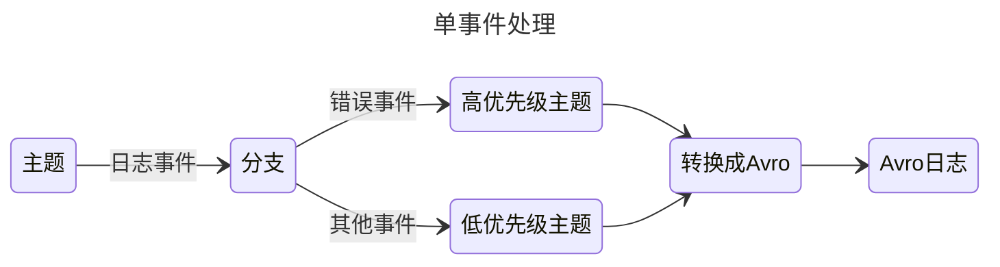
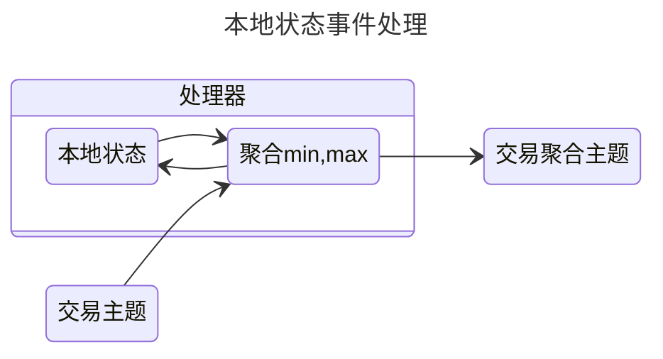
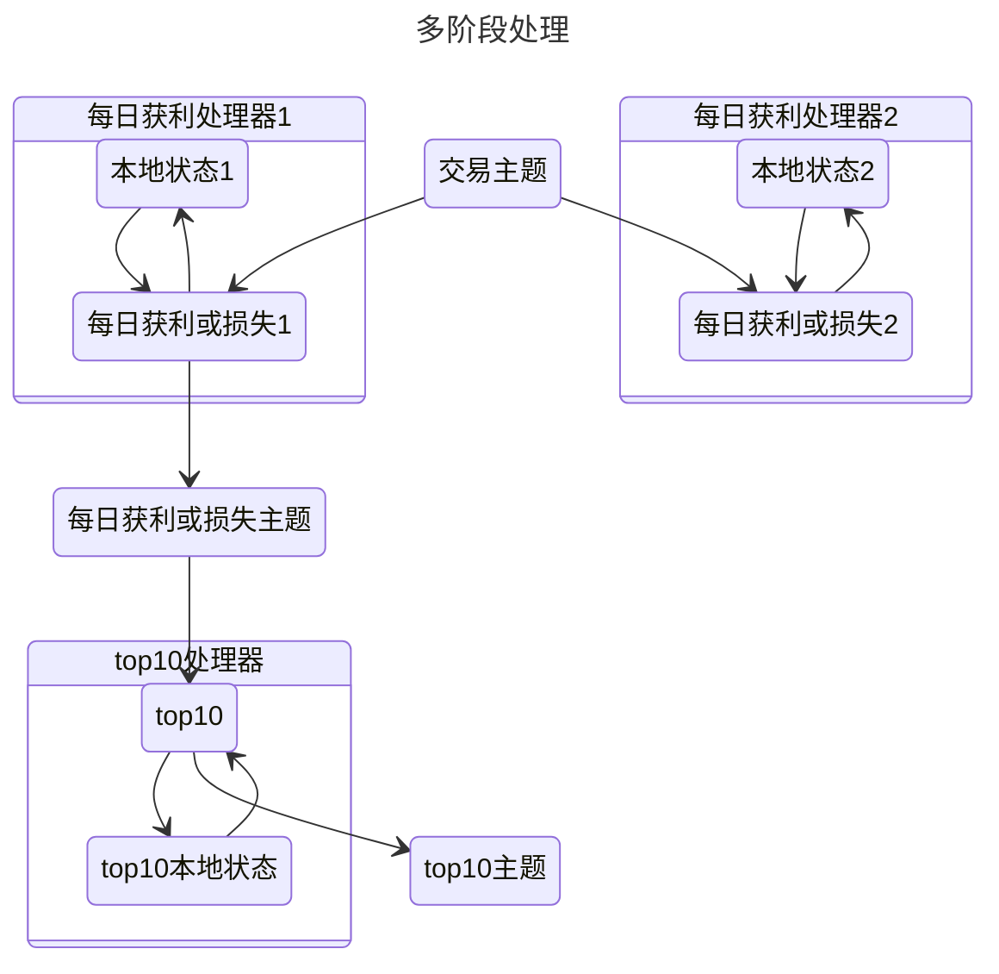
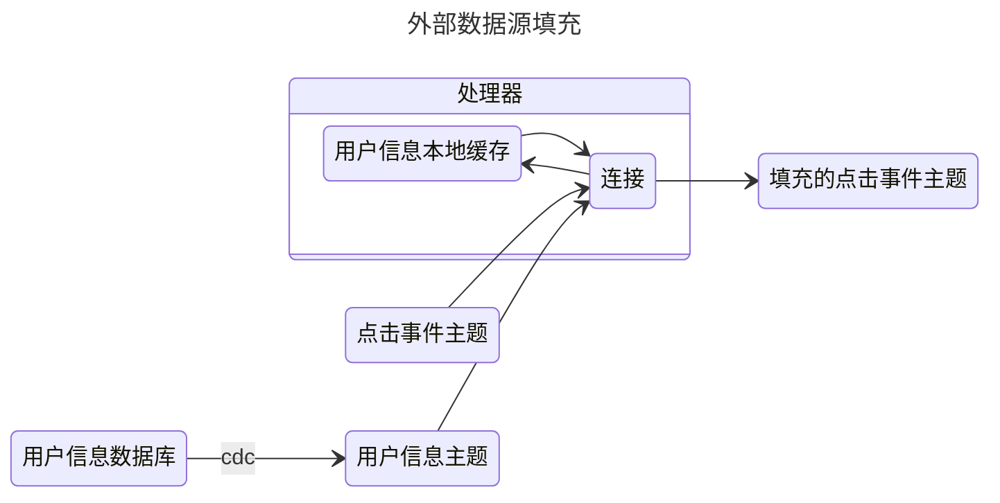
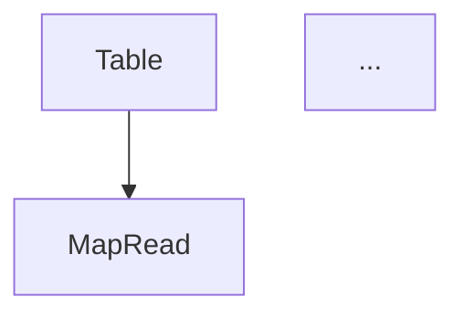

# 流处理（Stream Processing）

流处理是一种以**连续数据流**为核心的数据处理范式，强调对"实时产生、实时传递、实时计算"的数据进行持续响应。它不仅是一种计算模型，也是一种用于构建实时应用、实时分析系统、实时数据集成平台的**架构方法论**。

本篇文档从本质模型、关键概念、设计模式、时间语义、容错模型到 Streaming SQL 与流表关系进行系统性升维整理，为理解现代流式系统（Kafka Stream / Flink / Beam / Spark Streaming）的统一认知框架提供参考。

---

## 流处理的本质

流处理从根本上解决的是以下问题：

1. **如何处理无界数据（Unbounded Data）？**
   即永不停止增长的数据序列。

2. **如何保持系统在时间上的一致性与准确性？**
   包含事件时间、乱序处理、水位线、触发器、延迟处理等。

3. **如何管理跨时间演化的状态？**
   包含本地状态、长久状态、快照、回放、容错机制等。

4. **如何让计算逻辑在分布式环境下具备可恢复性、可扩展性与精确一次性语义？**

5. **如何抽象流与表之间的关系？**
   包含 CDC、事件溯源、流表双向转换、流式 Join 等。

流处理本质上是一种 **“带状态的事件驱动系统”**，在无限事件流上做有限时间窗内的滑动计算，并具备可恢复、可重复、可重放的能力。

---

## 流处理的应用类型

流处理的典型能力可归纳为三类：

#### 复杂事件处理（CEP）

根据定义好的**事件模式**检测数据流中是否发生模式事件（如“连续三次失败登录”）。本质是对事件序列进行实时图灵识别。

#### 流分析（窗口分析）

在**时间窗口**内执行聚合计算，如 5 秒平均、10 分钟 UV、1 小时滑动累计等。

#### 流式 RPC（Streaming RPC）

使用流作为通信方式，实现持续响应的交互模式，如“观察模式”“增量更新模式”“实时订阅”。

---

## 消息系统与流处理

### 演进：从消息队列到分区日志

早期流处理常通过 MQ 级联方式实现：


传统 MQ 存在两个限制：

* 数据是**暂存的**，不会长期保留
* 无法支撑**回放、重建下游状态、历史重算**

### 分区日志消息系统：消息系统与数据库的融合

Kafka/Kinesis/Pulsar 等“分区日志系统”使流可以像数据库日志那样存储，并通过偏移量实现回放、重算。这是现代流平台的关键基石。


日志成为系统“中枢神经”：


这形成了“**Log-Centric Architecture**”。

---

## 流处理设计模式（Patterns）

### 单事件分类处理



用于事件分流、路由、格式转换。

---

### 本地状态聚合



单处理器内部维护可累积的局部状态，如 min/max/count。

---

### 多阶段流水线处理



多阶段计算串联是构建实时指标体系的核心架构。

---

### 外部数据补全（Enrichment）



典型场景：用户画像、商品信息补全。

---

## 流处理与数据库

流和数据库的关系可用统一视角描述：

* 数据库日志就是一种“流”
* 数据库表是“流重放后的快照”

也就是“**流是表的增量，表是流的累积**”。

### CDC：数据库 → 流


CDC 是现代实时数据平台的核心。

---

## DataFlow 模型（Beam 模型）

DataFlow / Beam 在抽象层面定义了流式计算的关键操作：

* **ParDo**：相当于 Map
* **GroupByKey**：相当于 Shuffle


其强项在于统一批与流模型。

---

## 时间语义：事件时间、处理时间、水位线

### 为什么时间很重要？

流处理是“在时间上分布的数据”，而时间本身可能乱序、延迟或缺失，因此必须保证“语义正确”。

#### 两种时间

* **事件时间（Event Time）**：事件生成的真实时间
* **处理时间（Processing Time）**：事件被系统处理的时间


事件时间更准确，处理时间更实时。

---

### 水位线（Watermark）

水位线用于推断“事件时间已经前进到某个点，可以执行窗口计算”。

```mermaid
sequenceDiagram
    participant Source as 数据源
    participant System as 流处理系统
    participant Window as 窗口计算
    ...
```

（水位线图保持原样，此处省略描述）

水位线核心作用：

* 判断窗口是否完成
* 控制乱序事件处理
* 决定触发器是否执行

完美水位线几乎不存在，现代系统均使用**启发式水位线**。

---

## 数据处理模式

### 时间无关模式

无需窗口，延迟最小。


---

### 窗口化处理（Windowing）

三大窗口：

1. **固定窗口**
2. **滑动窗口**
3. **会话窗口**


事件时间窗口 = 正确但需要缓存
处理时间窗口 = 实时但不稳定


---

## 触发器（Triggers）

决定**窗口何时输出结果**。

类型包括：

* Repeated Update（频繁、多次更新）
* Completeness（数据齐全时触发）
* Early / On-time / Late （基于水位线）

这是现代流系统输出的核心机制。

---

## 精确一次性（Exactly once）

包含：

* 对内部状态的精确一次处理
* 对外部系统副作用的精确一次执行（更难）

方法包括：

* 状态快照（Checkpoint + WAL）
* 幂等写入
* 去重（唯一 ID）

---

## 容错与状态管理

### 微批处理

小批作为容错单元（Spark Streaming）。

### 校验点（Checkpoint）

系统恢复的基本能力（Flink、Beam）。

### 状态类型

#### 隐式状态

仅依赖执行顺序，不可持久化。

#### 广义状态

Flink/Beam 提供的可持久、可并行的结构化状态。

---

## Streaming SQL

实现“用 SQL 处理流”。

关键思想：

* SQL 以表为中心
* Beam 以流为中心
* 通过物化视图实现流式视图更新

两种模型最终都支持实时计算，但抽象不同。

---

## 流式连接（Stream Join）

支持：

* Inner / Left / Right / Full
* Semi / Anti
* 流-表连接（Enrichment）
* 流-流连接（典型需要缓存）

保留原图：

```mermaid
---
title: 表连接
---
...
```

---

## 流与表的统一模型

流与表是可相互转换的：

* **流 → 表**：聚合、累积
* **表 → 流**：CDC、事件溯源

可用于统一批与流：



---

## 完整总结：流处理的统一认知框架

1. **流是无限，表是有限。流是增量，表是快照。**
2. **事件时间是语义正确的时间，处理时间是执行时间。**
3. **水位线解决乱序事件，触发器解决何时输出。**
4. **状态是流处理的灵魂，日志是系统的记忆。**
5. **容错依赖快照 + 回放。**
6. **流与表通过 CDC / 聚合 / 事件溯源等机制双向转换。**
7. **DataFlow 统一了批处理与流处理。**
8. **Streaming SQL 将流视为表的持续计算。**

## 关联内容（自动生成）

- [/数据技术/数据处理.md](/数据技术/数据处理.md) 该文档详细介绍了主流计算引擎（包括Flink、Spark Streaming）的特点，与流处理中提到的计算框架直接相关
- [/数据技术/数据架构.md](/数据技术/数据架构.md) 涵盖了批处理与流处理架构的对比，与流处理文档中的架构设计模式高度相关
- [/数据技术/数据集成.md](/数据技术/数据集成.md) 涉及流式数据处理的技术栈（Kafka+Flink），与流处理文档中的消息系统与流处理部分密切相关
- [/数据技术/大数据.md](/数据技术/大数据.md) 介绍了流处理框架（Storm、Spark Streaming、Flink Streaming）和Kappa架构，与流处理文档内容高度重合
- [/数据技术/数据建模.md](/数据技术/数据建模.md) 专门提到流处理场景中的数据模型设计，与文档中流表二元性概念直接相关
- [/数据技术/数据存储.md](/数据技术/数据存储.md) 涉及Kafka等流式场景存储系统，与流处理文档中消息系统部分相关
- [/数据技术/数据分层.md](/数据技术/数据分层.md) 提到流处理在数据计算层的应用，与流处理文档中的架构应用相关
- [/数据技术/元数据管理.md](/数据技术/元数据管理.md) 涉及流数据处理技术栈（Kafka/Flink），与流处理文档中的技术实现相关
- [/数据技术/任务调度系统.md](/数据技术/任务调度系统.md) 涉及Flink等流处理框架的调度机制和容错，与流处理文档中的容错模型相关
- [/数据技术/埋点设计.md](/数据技术/埋点设计.md) 涉及Kafka和Flink等流处理技术，与流处理文档中的数据采集和传输部分相关
- [/数据技术/数据网格.md](/数据技术/数据网格.md) 提到双时间数据处理和流处理，与流处理文档中的事件时间和处理时间概念相关
- [/中间件/消息队列/Kafka/Kafka.md](/中间件/消息队列/Kafka/Kafka.md) 详细介绍了Kafka流处理能力，与文档中分区日志消息系统部分直接相关
- [/中间件/消息队列/消息队列.md](/中间件/消息队列/消息队列.md) 涵盖了Exactly Once语义，与流处理文档中的精确一次性概念相关
- [/软件工程/架构模式/响应式架构.md](/软件工程/架构模式/响应式架构.md) 涉及流处理技术作为响应式架构的核心组件，与流处理文档的应用场景相关
- [/编程语言/编程范式/响应式编程.md](/编程语言/编程范式/响应式编程.md) 涉及事件流处理概念，与流处理文档中的事件驱动系统相关
- [/软件工程/架构/系统设计/分布式/分布式系统.md](/软件工程/架构/系统设计/分布式/分布式系统.md) 提到流处理系统（Storm、Flink）和消息系统，与文档中的分布式流处理相关
- [/编程语言/并发模型.md](/编程语言/并发模型.md) 涉及Kappa架构和实时流处理，与文档中的架构模式相关
- [/软件工程/架构/数据系统.md](/软件工程/架构/数据系统.md) 涉及流处理系统的定义，与文档核心概念相关
- [/数据技术/Hadoop.md](/数据技术/Hadoop.md) 涉及Checkpoint机制，与流处理文档中的容错机制相关
- [/软件工程/架构/系统设计/广告平台.md](/软件工程/架构/系统设计/广告平台.md) 涉及Flink/Spark Streaming实时特征更新，与文档中的流处理应用相关
