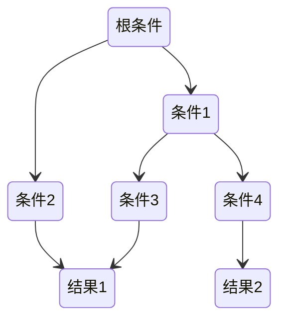

# 监督学习

利用样本和期望输出来学习如何预测

- 回归问题：输出的结果是一个连续的值
- 分类问题：输出的结果是离散有限集合
  - 纯度：数据集中的样本全部属于同一类别，即数据集完全“纯”的程度
  - 熵：集合的混乱程度越高，熵越高，熵为0时，代表集合绝对有序，熵的计算： $H(p_{1})=-p_1log_2(p_1)-(1-p_1)log_2(1-p_1)$，$p_1$代表某一类在集合中的概率

## 线性回归

线性模型具有较强的可解释性

简单线性回归输出的因变量只与单个的输入自变量存在线性关系，而多元线性回归因变量由多个自变量共同决定

单变量线性回归模型：

$$
f(\mathbf{x})=w x + b = 模型(输入特征) = 输出结果
$$

多变量线性回归模型，使用向量表示多个特征及多个参数：

$$
f(\mathbf{\vec{x}})=\vec{w}\cdot \vec{x} + b = \sum_{i=0}^{n}w_i\cdot x_i + b
$$

x 为自变量，w跟b被称为模型的参数，为了找出这两个参数，需要定义一个平方误差代价函数：

$$
J(w,b) = \frac{1}{2m}\sum_{i=1}^m(f(x^{(i)}) - y^{(i)})^2
$$

代价函数就是衡量模型预测值与训练集实际值之间的偏差，找出合适的 w 和 b，使得这个偏差最小，即 $\underset{w,b}{\text{minimize}} J(w,b)$


```py
# 使用sickit-learn 预测日志数据增长量
from sklearn import linear_model

# 训练数据
# 距离第一天的天数, 是否是周末，数据总量
train_data = [
[1	,0, 54],
[2	,0, 108],
  ...
[22	,0, 80968],
]
# 测试数据
test_data = [
  [76,	1,	148550],
  ...
  [42,	1,	109554],
]
reg = linear_model.LinearRegression()
train_feats = list(map(lambda x: x[0: len(x) - 1],train_data))
train_val = list(map(lambda x: x[-1],train_data))
reg.fit(train_feats, train_val)

print('模型参数 ' + str(reg.coef_))
```

## 多项式回归

使用线性回归的思路，关键在于为数据添加新的特征，而这些新的特征是原有的特征的多项式组合

## 逻辑回归

为了对分类问题 $f(\vec{x}) = \vec{w}\cdot\vec{x} + b$ 进行拟合，引入sigmoid函数 $g(z) = \frac{1}{1+e^{-z}}$ 如果把分类问题的参数作为sigmoid函数的参数，就能得到一个输出0 - 1 函数

$$
f(\vec{x}) = \frac{1}{1+e^{-(\vec{w}\cdot\vec{x} + b)}}
$$

当$\vec{w}\cdot\vec{x} + b = 0$时，这条线就是决策边界


通过找出决策边界，大于这个决策边界的被认为真，否则认为假

逻辑回归使用如下代价函数

$$
J(\vec{w},b) = \frac{1}{m}\sum_{i=1}^m L(f(\vec{x}^{(i)},y^{(i)}))
$$

$$
L=\begin{cases}\quad-\log\left(f(\vec{x}^{(i)})\right)&\quad\text{if }y^{(i)}=1\\-\log\left(1-f(\vec{x}^{(i)})\right)&\quad\text{if }y^{(i)}=0&\end{cases}
$$

损失函数如果预期结果为0 但实际结果为1 则会输出1 否则输出0，也就是充分体现实际结果与预期结果的不同，使得代价函数最小

代价函数都是通过最大似然方法统计数据得出

## Softmax回归

Softmax回归是逻辑回归的概括

$$
\begin{array}{rl}{a_{1}=\frac{e^{z_{1}}}{e^{z_{1}}+e^{z_{2}}+\cdots+e^{z_{N}}}}&{{}=P(y=1|\vec{x})}\\{\vdots}\\{a_{N}=\frac{e^{z_{N}}}{e^{z_{1}}+e^{z_{2}}+\cdots+e^{z_{N}}}}&{{}=P(y=N|\vec{x})}\\\end{array}
$$
$$
loss(a_1,...,a_N,y)=\begin{cases}-\log a_1&\mathrm{if}y=1\\-\log a_2&\mathrm{if}y=2\\\vdots\\-\log a_N&\mathrm{if}y=N\end{cases}
$$

硬输出是对数据的分类边界进行建模。实现硬输出的函数，也就是将输入数据映射为输出类别的函数叫作判别函数（discriminant）

而软输出是根据回归值和似然性的关系输出样本属于某个类别的概率

$$
y(\mathbf{x})=g^{-1}(\mathbf{w}^T\mathbf{x}+b)
$$

g 是联系函数，$g^{-1}$ 是激活函数

## 线性判别分析

LDA 的主要目标是将数据投影到一个低维空间，同时最大化不同类别之间的类内方差，最小化同一类别内部的方差

## 广义线性模型

线性模型的扩展，允许因变量的分布不必满足正态分布的假设

## 支持向量机SVM

常见的一种分类方法，在机器学习中，SVM 是有监督的学习模型

SVM 就是帮我们找到一个超平面，这个超平面能将不同的样本划分开，同时使得样本集中的点到这个分类超平面的最小距离（即分类间隔）最大化，SVM 就是求解最大分类间隔的过程


硬间隔指的就是完全分类准确，不能存在分类错误的情况。软间隔，就是允许一定量的样本分类错误

非线性SVM：有些数据样本没法通过线性函数划分，就引入核函数将样本从原始空间映射到一个更高维的特质空间中，使得样本在新的空间中线性可分

多分类问题：SVM 本身是一个二值分类器，最初是为二分类问题设计的，可以将多个二分类器组合起来形成一个多分类器：

1. 一对多：把其中的一类作为分类 1，其他类统一归为分类 2
2. 一对一：在任意两类样本之间构造一个 SVM，每一个分类器都会有一个分类结果，得票多者胜

### 核技巧

核函数（kernel function）用于将数据从原始空间映射到一个更高维的特征空间

核函数的数学表达

$$
k(\mathbf{x},\mathbf{x}')=\phi(\mathbf{x})^T\phi(\mathbf{x}')
$$

核技巧（kernerl trick）表示的是通过间接定义特征映射来直接计算内积的运算方法

核方法（kernel method）表示的是将低维空间中的线性不可分问题通常可以转化为高维空间中的线性可分问题的思路

## 决策树

需要对结构化的数据进行预测，在结果为某种分类时，适合使用。决策树尝试得到训练数据的多棵决策树，从中选择一个效果最好的



1. 根条件的选择：选择能将左右分支两个集合的熵划分的最小的条件
2. 何时停止划分
   1. 节点下的集合都属于同一个分类
   2. 树已经达到了最大深度，继续划分只会变得过拟合
   3. 划分带来的纯度提升小于设定阈值
   4. 节点下集合项小于设定阈值

使用信息增益衡量每次划分减少了多少熵，结果越大代表减少的熵越多：

$$
H(p_1^{root}-\left(w^{left}H\left(p_1^{left}\right)+w^{right}H\left(p_1^{right}\right)\right)
$$

对于取指不止两个的特征，可以采取 one-hot 编码，如果一个特征有 k 个取指，那就可以把它转换成 k 个只能取0 1 的特征

对于拥有连续值的特征，则需要多次尝试不同的取值，使得以该值划分的两类集合获得的信息增益最高

### 剪枝

训练出来的决策树可能会对训练数据**过拟合**，所以需要在合适的情况下停止拆分决策树的子节点

预剪枝：在构造的过程中对节点进行评估，如果对某个节点进行划分，在验证集中不能带来准确性的提升，就不对其进行拆分

后剪枝：构造完决策树之后，逐层向上对每个节点进行评估。如果剪掉这个节点子树，与保留该节点子树在分类准确性上差别不大，或者剪掉该节点子树，能在验证集中带来准确性的提升，那么就可以把该节点子树进行剪枝。方法是：用这个节点子树的叶子节点来替代该节点，类标记为这个节点子树中最频繁的那个类

### ID3算法

计算的是信息增益，就是划分可以带来纯度的提高，倾向于选择取值比较多的属性，但这个属性可能对于分类并没有太大作用

### C4.5算法

- 采用信息增益率的方式来选择属性。信息增益率 = 信息增益 / 属性熵
- 悲观剪枝：递归估算每个内部节点的分类错误率，比较剪枝前后这个节点的分类错误率来决定是否对其进行剪枝
- 对于连续属性的处理是通过将连续属性离散化来实现，选择具有最高信息增益的划分所对应的阈值
- 对于缺失值所在的样本，将其划分到各个子集中，并计算其对应的信息增益，最终选择信息增益最大的子集进行划分

### CART算法

- Classification And Regression Tree，分类回归树

分类树处理离散数据，输出样本类别；回归树处理连续数据，输出回归预测

基尼系数是一种衡量纯度的方法：随机选取两个样本，其类别不一致的概率，这个概率越低则样本最稳定

CART 分类树算法中，基于基尼系数对特征属性进行二元分裂

CART 回归树算法中，根据样本的混乱程度，也就是样本的离散程度来评价“不纯度”

剪枝：采用的是代价复杂度剪枝方法

### 随机森林

一个包含多个决策树的分类器，每一个子分类器都是一棵 CART 分类回归树

为了随机构造多棵树，需要使用采样替换技术：每次随机抽取一条训练数据记录，放回，重新抽取并重复这个过程，这样可以生成多份随机的训练，并使用这些随机的训练数据去生成多颗决策树

做分类的时候，输出结果是每个子分类器的分类结果中最多的那个，做回归的时候，输出结果是每棵 CART 树的回归结果的平均值

## XGBoost

## 时间序列预测

- Auto Regressive：自回归模型。这个算法的思想比较简单，它认为过去若干时刻的点通过线性组合，再加上白噪声就可以预测未来某个时刻的点
- Moving Average：滑动平均模型。它与 AR 模型大同小异，AR 模型是历史时序值的线性组合，MA 是通过历史白噪声进行线性组合来影响当前时刻点
- Auto Regressive Moving Average：自回归滑动平均模型，也就是 AR 模型和 MA 模型的混合
- Auto Regressive Integrated Moving Average：相比于 ARMA，ARIMA 多了一个差分的过程，作用是对不平稳数据进行差分平稳，在差分平稳后再进行建模

## 回归树

每一片叶子都输出一个预测值。预测值一般是该片叶子所含训练集元素输出的均值

回归树中每个节点选择那个特征，都遵循划分使得一个节点下所有值的方差最小的原则，这点跟使用信息增益来分裂节点原理一样

## KNN

找出k个与当前元素相似的元素，对这些元素求均值，从而做出对当前元素的预测

过多或过少的k都会导致结果不准

如果 K 值比较小，就相当于未分类物体与它的邻居非常接近才行。这样产生的一个问题就是，如果邻居点是个噪声点，那么未分类物体的分类也会产生误差，这样 KNN 分类就会产生过拟合。

如果 K 值比较大，相当于距离过远的点也会对未知物体的分类产生影响，虽然这种情况的好处是鲁棒性强，但是不足也很明显，会产生欠拟合情况，也就是没有把未分类物体真正分类出来。一般采用交叉验证的方式选取 K 值

### 近邻权重

将相似度（距离）转为权重，即不同点贡献的权重不一样，加权KNN在进行预测时，不同邻居的贡献被赋予不同的权重

- 反函数：距离的导数
- 减法函数：使用一个常量减去距离，如果为正数，则权重就是为该正数，否则权重为0
- 高斯函数：在距离为0时权重为1，随着距离增加无限接近0

### 费舍尔方法

一种用于处理多类别分类问题的线性分类方法，所谓线性分类，即构造分类中所有数据的平均值为中心点，新的数据根据距离离中心点的距离判断是哪类，SVM 就是一种线性分类
