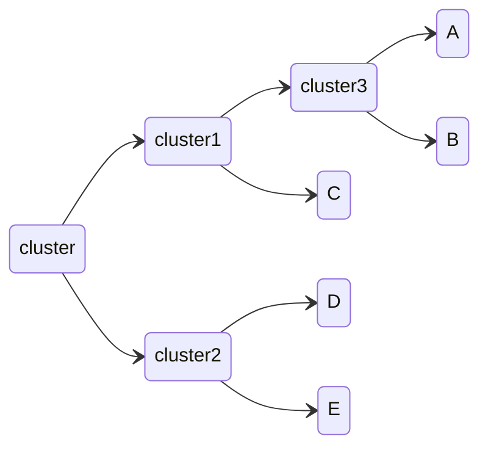
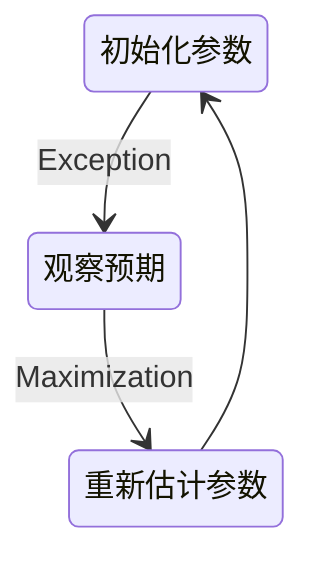

# 非监督学习

在一组数据中寻找某种结构或模式

## 关联规则挖掘

关联规则挖掘可以从数据集中发现项与项（item 与item）之间的关系

### 支持度

指一组频繁模式的出现概率，表示项集{X,Y}在总项集里出现的概率。表示A和B同时在总数I 中发生的概率

$$
Support(X,Y) = P(XY) = \frac{number(X,Y)}{number(总样本)}
$$

### 置信度

衡量频繁模式内部的关联关系，体现了一个数据出现后，另一个数据出现的概率

$$
Confidence(X ⇐ Y) = P(X|Y) = \frac{P(X|Y)}{P(Y)}
$$

### 提升度

表示含有X的条件下，同时含有Y的概率，与只看Y发生的概率之比。提升度反映了关联规则中的X与Y的相关性，提升度>1且越高表明正相关性越高，提升度<1且越低表明负相关性越高，提升度=1表明没有相关性，即相互独立

$$
Lift(X → Y) = \frac{P(Y|X)}{P(Y)}
$$

### Apriori 算法

如果 123 是频繁组合，则 12、13、23 也是频繁组合；若 12 是非频繁组合，则 123 也是非频繁组合

### FP-Growth 算法

创建了一棵 FP 树来存储频繁项集。在创建前对不满足最小支持度的项进行删除，减少了存储空间，整个生成过程只遍历数据集 2 次

## 聚类

根据形成聚类方式的不同，聚类算法可以分为：

1. 层次聚类：以一种层次化的方式组织数据，逐步合并或分裂聚类，形成一个层次结构。可以是自下而上（凝聚性聚类）或自上而下（分裂性聚类）的方式
2. 原型聚类：基于原型或中心点的概念，将数据划分为若干个类别。每个类别由其代表性的原型来描述，比如K均值聚类
3. 分布聚类：假设数据符合某种概率分布，例如高斯混合模型（Gaussian Mixture Models，GMM）。试图拟合数据的分布，以确定聚类
4. 密度聚类：考虑数据点的密度，将高密度区域视为一个聚类簇，并通过密度低的区域将聚类簇分隔开，比如DBSCAN算法

### 层次聚类

不断将最为相似的群组两两合并

使用树状图来可视化聚类结果，通过路径长度来体现各元素的相似度：

### K均值聚类

1. 随机确定k个中心位置
2. 将各个数据项分配个最近的中心点
3. 将中心点移动到各个节点的平均位置
4. 重复2-3 直到不再变化

如果某个点比较倒霉，初始被分配到的地方找不到与其最近的点，那一般就会把这个聚类去掉，变成 K - 1 个聚类

所以，代价函数是

$$
J =\frac{1}{m}\sum_{i=1}^{m}\|x^{(i)}-\mu_{c^{(i)}}\|^{2}
$$

如果代价函数值增加了，一定是实现出了问题

选择初始点：

1. K要小于训练数据数量
2. 随机从训练数据中挑选 K 个点作为初始点
3. 这种随机初始化有可能找到的是局部最优解，所以需要多轮随机选择，选择代价函数最小的初始点

选择K：

1. 一种办法是尝试不同的K，使用代价函数较小，K也合适的，这会导致算法偏向于更大的K
2. 另外一种选择K的办法是K应该是要跟解决的问题相关，要根据业务来决定

### EM聚类

EM 算法相当于一个框架，可以采用不同的模型来进行聚类，比如 GMM（高斯混合模型），或者 HMM（隐马尔科夫模型）来进行聚类

## 异常检测

给定数据集 X，我们假使数据集是正常的，我们希望知道新的数据  是不是异常的，即这个测试数据不属于X的几率如何

这种方法称为密度估计

$$
if\quad p(x)\begin{cases}<\varepsilon&anomaly\\>=\varepsilon&normal&\end{cases}
$$

可以用高斯分布来确定已知$x^{(i)}$，求其概率：

高斯分布由两个参数计算确定：

$$
\mu=\frac1m\sum_{i=1}^mx^{(i)}\\
\sigma^2=\frac1m\sum_{i=1}^m(x^{(i)}-\mu)^2
$$

计算一个特征向量出现的概率：

$$
p(\vec{\mathrm{x}})=p(x_1;\mu_1,\sigma_1^2)*p(x_2;\mu_2,\sigma_2^2)*p(x_3;\mu_3,\sigma_3^2)*\cdots*p(x_n;\mu_n,\sigma_n^2)\\
=\prod_{j=1}^np(x_j;\mu_j,\sigma_j^2)
$$

每一个特征都需要计算自己的高斯分布，即自己的$\mu$ $\sigma^2$：

$$
\mu_{j}=\frac{1}{m}\sum_{i=1}^{m}x_{j}^{(i)}\\
\sigma_{j}^{2}=\frac{1}{m}\sum_{i=1}^{m}(x_{j}^{(i)}-\mu_{j})^{2}
$$

由于异常检测是无监督学习，所以是通过训练集构建密度估计函数，再通过验证集（大量正常数据，少量异常数据）选择合适的$\epsilon$

对比项|异常检测|	监督学习
-|-|-
训练数据特征|非常少量的正向类（异常数据 y = 1）, 大量的负向类（y = 0）	|同时有大量的正向类和负向类
正向数据占比|许多不同种类的异常，非常难。根据非常少量的异常数据来训练算法。|	有足够多的正向类实例，足够用于训练 算法，未来遇到的正向类实例可能与训练集中的非常近似。
挖掘模式|未来遇到的异常可能与已掌握的异常、非常的不同。	 | 找出已存在于训练数据中的模式
场景|欺诈行为检测 生产（例如飞机引擎）检测数据中心的计算机运行状况	|邮件过滤器 天气预报 肿瘤分类

异常检测假设特征符合高斯分布，如果数据的分布不是高斯分布，异常检测算法也能够工作，但是最好还是将数据转换成高斯分布，例如使用对数函数 $x = log(x + c)$ 或者 $x = x^c$

我们通常可以通过将一些相关的特征进行组合，来获得一些新的更好的特征（异常数据的该特征值异常地大或小
