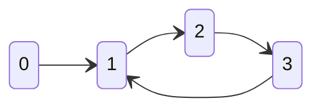
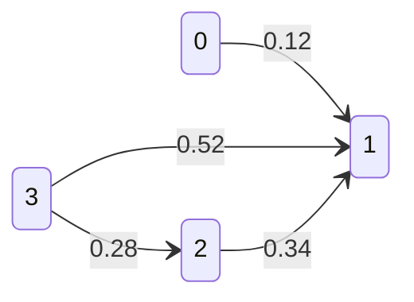

# 图

一个图（一般记作G）由两类元素构成，分别称为**顶点**（或节点、结点）和**边**。每条边有两个顶点作为其端点，我们称这条边“连接”了它的两个端点

顶点相连接的边的条数叫做度，度分为入度（In-degree）和出度（Out-degree），入度表示有多少条边指向这个顶点，出度表示有多少条边是以这个顶点为起点指向其他顶点

**分类**

- 有向图与无向图
- 有权图与无权图

## 表示方法

### 邻接矩阵



```js
[[0,1,0,0],
[0,0,1,0],
[0,0,0,1],
[0,1,0,0]]
```

```java
boolean[][] g;
// n代表顶点的数量，v代表边的数量
int n, m;
// 判断两个顶点是否存在边
boolean hasEdge(int v, int w) {
    return g[v][w];
}
// 给两个顶点增加一条边
void addEdge(int v, int w) {
    if (hasEdge(v, w)) {
        return;
    }
    g[v][w] = true;
    if (!directed) {
        g[w][v] = true;
    }
    m++;
}
// 
```

邻接矩阵对于稀疏图而言，比较浪费存储空间，但邻接矩阵的存储方式简单、直接，因为基于数组，所以在获取两个顶点的关系时非常高效。用邻接矩阵的方式存储图，可以将很多图的运算转换成矩阵之间的运算

### 邻接表


```js
[
    [1], // 0 连接 1
    [2], // 1 连接 2
    [3], // 2 连接 3
    [1] // 3 连接 1
]
```

```java
List<List<Integer>> g;
void addEdge(int v, int w) {
    g.get(v).add(w);
    if (!directed && v != w) {
        g.get(w).add(v);
    }
    m++;
}
boolean hasEdge(int v, int w) {
    for (int i = 0; i < g.get(v).size(); i++) {
        if (g.get(v).get(i).equals(w)) {
            return true;
        }
    }
    return false;
}
```

邻接表适合表示稀疏的图，如果邻接表使用的是链表或者其他非连续结构，由于存储空间不连续，对缓存不友好，在邻接表中查询两个顶点之间的关系就没那么高效了

### 边表

每一条边通常由两个顶点组成。边表只包含边的信息，而不包含关于顶点的额外信息

节点 | 连接该节点的节点
-|-
A | B
A | C
C | D
D | B

## 搜索

两个算法的不同之处只在于获取下一个节点的方式不一样

- 广度优先下一个节点是最早加入的节点
- 深度优先下一个节点是最晚加入的节点

在搜索空间很大，但已知搜索路径不会特别长的情况下，DFS 可能会比 BFS 要慢很多，但如果要通过搜索算法求最短路径，只能选择BFS

两者的时间复杂度都是O(顶点数)，深度优先虽然没有广度优先使用一个显式的queue来存储节点，但是其最深的函数调用栈就是描述一条经过了所有节点的路径

广度优先搜索和深度优先搜索是最基本的搜索算法，没有什么优化，是暴力搜索算法

### 深度优先

从一个点开始 如果这个点没有被访问过 则选择该点的某个连接点进行深度优先搜索 直到所有能访问的顶点都被访问过

```java
for (int i = 0; i < graph.V(); i++) {
    // 对每个节点进行深度优先遍历
    if (!visited[i]) {
        dfs(i);
    }
}
void dfs(int v) {
    visited[v] = true;
    id[v] = count;
    // 对传进来的节点所连接的节点再进行DFS
    GraphIterator iterator = graph.iterator(v);
    for (int i = iterator.begin(); !iterator.end(); i = iterator.next()) {
        if (!visited[i]) {
            dfs(i);
        }
    }
}
```

从起点出发递归遍历图，通过结果集判重，保证重复的节点不会被递归两次，从而每条边只会被遍历一次，整体时间复杂度为 O(边数)

### 广度优先

```java
void bfs(int v) {
    if (visited[v]) return;
    visited[v] = true;
    while(!queue.isEmpty()) {
        v = queue.poll();
        for(var w : neighbor(v)) queue.offer(w);
    }
}
```

从一个点开始 逐个遍历与该点连接的所有顶点 在遍历某节点时 将该节点的所有连接点入队，队列 FIFO 的特性保证了，下一层的元素一定会比上层的元素更晚出现 每次进行广度搜索的节点就从队列里面拿

所有顶点入队一次、出队一次，每条边都会在边起点出队的时候被遍历一次，所以整体的时间复杂度为 O(顶点数+边数)

## 连通分量

>无向图G的极大连通子图称为G的连通分量

## 有向图

### 表示

同样也是使用邻接表表示

### 可达性

DFS 与　BFS　同样适用于有向图

### 环

> 拓扑排序：将所有顶点排序，使得所有的有向边均从排在前面的元素指向后面的元素，在有循环依赖的图中，是没法进行拓扑排序的

#### Khan 算法

- 基于BFS

先把没有其他节点连接的节点加入可达节点，然后从剩下的节点中选出可以从可达节点到达的节点，按这样的顺序反复进行

#### 基于DFS

优先找出没有后继节点的节点，把它作为最终节点

### 强连通性

如果两个顶点互相可达，则称它们是强连通的

## 有权图

### 表示



- 邻接矩阵

```js
[
    [0, 0.12, 0, 0],
    [0, 0, 0, 0],
    [0, 0.34, 0, 0],
    [0, 0.52, 0.28, 0]
]
```

- 邻接表

```js
[
    [{to: 1, w: 0.12}],
    [],
    [{to: 1, w: 0.34}],
    [{to: 1, w: 0.52}, {to: 2, w: 0.28}]
]
```

一副连通加权无向图中一棵权值最小的生成树

## 最小生成树

- 贪心算法

>找到最小生成树的一条边，不断重复，直到找到所有最小生成树的所有边

### Prim算法

每次将一个与树节点连接但不在树中且权值最小的边加入树，直至边数达到节点数-1


### kruskal算法

每次将权值最小的且不会构成环的边加入生成树，直至边数达到节点数-1


- 如何判断环

当边加入之后，使用union find判断从某一节点是否连接它自己，如果是，则就是有环

## 最短路径

找到从一个顶点到另一个顶点成本最小的路径

### Floyd算法

核心思想是，在两个顶点之间插入一个或一个以上的中转点，比较经过与不经过中转点的距离哪个更短

```c
for(k=0;k<n;k++)//中转站0~k
    for(i=0;i<n;i++) //i为起点
        for(j=0;j<n;j++) //j为终点
            if(d[i][j]>d[i][k]+d[k][j])//松弛操作 
                d[i][j]=d[i][k]+d[k][j]; 
```

### Dijkstra算法

用来求解单源最短路径

- 前提：图中不能存在负权边

引入了一种叫做最短路径树的构造方法。基于贪心的思想逐步找出距源点 s 最近、次近的点，就能得到一个 G 的子图，里面包含了 s 及所有从 s 出发能到达的节点，它们以 s 为根一起构成了一颗树，就是最短路径树


### A*算法

- 快速找出一条接近于最短路线的次优路线

是一种启发式搜索算法，通过选择启发函数来影响搜索的方向，如果启发函数能够准确地估计到目标节点的距离，那么A*算法可以找到最短路径