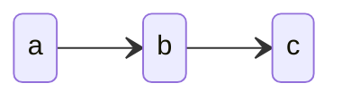
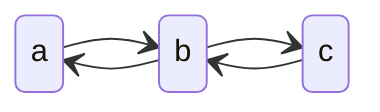
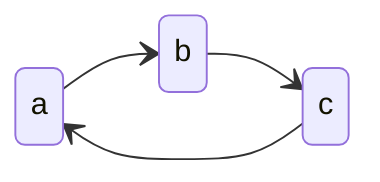

# 基本数据结构

数据结构的使用要根据场景及数据量来决定

## 线性结构

### 线性表

n个数据元素的有限序列。可以看做数组

- Java的[ArrayList](/编程语言/JAVA/高级/集合/List.md#ArrayList)
- C++的vector

使用三个变量来描述线性表的使用

扩容的设计：当插入新元素后发现预留容量不够了，就需要申请一块新的内存，并将现有的数据复制过去，每次扩容的大小为原来的2倍是比较合适的

当删除了大量的元素，可以进行缩容，ArrayList并没有实现自动缩容，而是提供了一个trimToSize() 的方法可以让使用者手动缩容，自动很难把控，缩容的时机和容量很难确定，取决于业务

如果在存储空间占比低于一半的时候就缩容，会导致反复插入删除，一种较好的实现是当实际使用量为总容量的1/4时，缩为原来的一半

使用场景：需要经常查询、变更，但是很少插入 / 删除

### 链表

单向链表

双向链表，可以双向遍历链表，拥有了在遍历中回退的能力

循环链表

哑结点：用于标记这整个循环链表的首尾连接处，既是整个链表的开始，也是整个链表的结尾

链表，相比于数组，有更好的灵活性和更低的插入、删除的复杂度，更加适用于查询索引较少、遍历、插入、删除操作较多的场景

#### 跳表

- O(N) 的空间复杂度，O(logN) 的插入、查询、删除的时间复杂度

查找时，从上层开始查找，找到对应的区间后再到下一层继续查找，类似于二分查找

这种查找数据结构跟红黑树相比：

- 插入非常快，因为不需要在插入后进行旋转
- 实现容易
- 支持无锁操作

完美跳表：所用的存储空间和查询过程，应该和二叉树是非常像的，要求每一层都包含下一层一半的节点，且同一层指针跨越的节点数量是一样的，第 k 级索引的结点个数是第 k-1 级索引的结点个数的 1/2，第 k级索引结点的个数就是 $\frac{n}{2^k}$

但随着元素不断增减，很难维护这样的完美跳表，在插入元素时可以引入随机性：通过随机函数来决定将将结点插入到哪一层索引中，来维护索引和原始链表大小的平衡，避免退化为链表的查找效率

### 栈

先进后出（LIFO） 结构

应用：

- 函数调用栈
- 表达式求值
- 括号匹配

### 队列

先进先出（FIFO）的线性表，只允许在表的一段进行插入，另一端删除

循环队列：基于数组或链表实现的队列数据结构，与普通队列不同之处在于，当队列尾部指针（rear）指向数组的最后一个位置时，如果再有元素入队，将循环回到数组的第一个位置

双端队列：两端都支持 FIFO 插入删除操作的队列，工作窃取算法就是当本进程消费的队列数据完成时，从其他工作队列的尾部去窃取数据来进行消费，从尾部取数据可以有效避免竞争

链表实现
