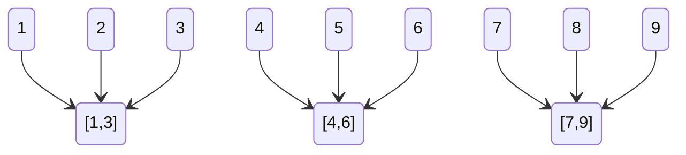

# 排序

O(N^2)的排序算法是其他算法的基础，编码简单，可以作为子过程，用于改进复杂的排序算法

对于相等的元素，在排序后，相对位置没有发生改变

排序算法   | 平均时间复杂度  | 最坏时间复杂度  | 最好时间复杂度  | 空间复杂度    | 稳定性
------ | -------- | -------- | -------- | -------- | ---
冒泡排序   | O(n²)    | O(n²)    | O(n)     | O(1)     | 稳定
直接选择排序 | O(n²)    | O(n²)    | O(n)     | O(1)     | 不稳定
直接插入排序 | O(n²)    | O(n²)    | O(n)     | O(1)     | 稳定
快速排序   | O(nlogn) | O(n²)    | O(nlogn) | O(nlogn) | 不稳定
堆排序    | O(nlogn) | O(nlogn) | O(nlogn) | O(1)     | 不稳定
希尔排序   | O(nlogn) | O(ns)    | O(n)     | O(1)     | 不稳定
归并排序   | O(nlogn) | O(nlogn) | O(nlogn) | O(n)     | 稳定
桶排序   | O(n+k)   | O(n+k)   | $O(n^2)$   | O(n+k)   | 稳定
计数排序   | O(n+k)   | O(n+k)   | O(n+k)   | O(n+k)   | 稳定
基数排序   | `O(N*M)` | O`(N*M)` | O(N*M)   | O(M)     | 稳定

分析排序算法的执行效率

- 最好情况、最坏情况、平均情况时间复杂度
- 对于规模较小的数据，时间复杂度的系数、常数 、低阶等也需要考虑
- 分析比较次数和交换次数
- 排序算法的稳定性也是需要考虑的一点，对于相同的值，经过稳定的排序算法，它们的相对位置不会发生变化

$$
\text{有序度}=\sum_{i<j}\delta(A[i]<A[j])\\
\delta(A[i]<A[j])=\begin{cases}1,&\text{if}A[i]<A[j]\\0,&\text{otherwise}\end{cases}
$$

完全有序的数组的有序度叫作满有序度，逆序度 = 满有序度 - 有序度。排序的过程就是一种增加有序度，减少逆序度的过程

## 选择排序


每一轮循环找到数组中最小的元素，第一次找到的最小元素将它与第一个元素交换位置，第二次找到的最小元素交换将它与第二个位置交换，以此类推

```java
for (int i = 0; i < arr.length; i++) {
    // 寻找[i,n)里的最小值
    int min = i;
    for (int j = i + 1; j < arr.length; j++) {
        if (less(arr[j],arr[min])) {
            min = j;
        }
    }
    swap(arr, i, min);
}
```

## 插入排序


插入排序是从后往前扫描的

第一次从后到前逐个扫描下标1-0的元素，如果发现后面一个比前面小，则两个交换位置，否则就开始下一次扫描

第二次从后到前逐个扫描下标2-0的元素，如果发现后面一个比前面小，则两个交换位置 ，否则就开始下一次扫描

依此类推

- 插入排序对近乎有序的数组性能很强

```java
for (int i = 1; i < a.length; i++) {
    // 从右到左扫描，如果右值小于左值，则交换，否则跳出本轮循环
    for (int j = i; j > 0; j--) {
        if (less(a[j], a[j - 1])) {
            swap(a, j, j - 1);
        }else {
            break;
        }
    }
}

// 改进后的插入排序
for (int i = 1; i < a.length; i++) {
    var e = a[i];
    int j;
    for (j = i; j > 0 && greater(a[j - 1], e); j--) {
        // 将
        a[j]=a[j-1];
    }
    a[j]=e;
}
```

## 冒泡排序


第一次扫描下标为0的元素到最后一个元素

第二次扫描下标为0的元素到倒数第二个元素

每次扫描如果发现右边比左边小 则两个交换位置

以此类推

```java
for (int i = 1; i < a.length; i++) {
    for (int j = 0; j < a.length - i; j++) {
        if (less(a[i],a[j])){
            swap(a,i,j);
        }
    }
}
// 改进的冒泡排序
for (int i = 1; i < a.length; i++) {
    int lastSwap = 1;
    for (int j = 0; j < a.length - i && j < lastSwap; j++) {
        if (less(a[i], a[j])) {
            swap(a, i, j);
            // 记录最后一次交换的位置，该位置后的元素在下一轮扫描后不会被扫描
            lastSwap = j;
        }
    }
}
```

## 希尔排序


希尔排序是将插入排序中的交换相邻元素改为交换不相邻元素

- 选择一个增量序列t1，t2，…，tk
- 按增量序列个数k，对序列进行k 趟排序

```java
int h = 1;
// 计算增长序列，1,4，13,40...
while (h < a.length / 3) {
    h = 3 * h + 1;
}
while (h>=1){
    for (int i = h; i < a.length; i++) {
        // 对第i,i-h,i-2*h,i-3*h进行插入排序
        var e = a[i];
        int j;
        for (j = i; j > h && less(a[j - h], e); j-=h) {
            a[j]=a[j-h];
        }
        a[j]=e;
    }
    h/=3;
}
```

## 归并排序


- 把长度为n的输入序列分成两个长度为n/2的子序列；
- 对这两个子序列分别采用归并排序；
- 将两个排序好的子序列合并成一个最终的排序序列

对两个有序子序列进行合并，得到一个更大的有序子序列，以此类推，直到只剩下一个序列

- 但是一个缺点是需要额外的O(N)空间

```java
private void mergeSort(Comparable<?>[] a, int l, int r) {
    if (l >= r) {
        return;
    }
    int mid = (l + r) / 2;
    mergeSort(a, l, mid); // 对左边排序
    mergeSort(a, mid + 1, r); // 对右边排序
    merge(a, l, mid, r); // 对两个数组进行归并
}
private void merge(Comparable<?>[] a, int l, int mid, int r) {
    // 开辟一块新空间给l-r之间的元素
    Comparable<?>[] aux = new Comparable<?>[r - l + 1];
    for (int i = l; i <= r; i++) {
        aux[i - l] = a[i];
    }

    int i = l, j = mid + 1;
    // 对l到r之间的元素进行扫描，将它们放到指定位置
    for (int k = l; k <= r; k++) {
        if (i > mid) { // 如果左指针已经跑过了mid，那此时让右指针去跑
            a[k] = aux[j - l];
            j++;
        } else if (j > r) { // 如果右指针已经跑完了，则此时让左指针去跑
            a[k] = aux[i - l];
            i++;
        } else if (less(aux[i - l], aux[j - l])) { // 否则就比较左右两指针谁的值比较小，谁小就把谁的值复制到结果里，然后该指针往后移动
            a[k] = aux[i - l];
            i++;
        } else {
            a[k] = aux[j - l];
            j++;
        }
    }
}
```

### 优化

当mid+1位置的元素大于mid位置的元素时，就没有必要进行归并了

```java
if (greater(a[mid],a[mid+1])){
    merge(a, l, mid, r);
}
```

也可以当被归并排序的数组数量小于某一数量级时，使用其他排序算法，来提高性能

### 自底向上的归并排序

```java
// 每次归并的数组大小依次为1 2 4 ...
for (int sz = 1; sz <= a.length; sz += sz) {
    for (int i = 0; i < a.length; i += sz + sz) {
        // 归并a[i...i+size-1] 与 a[i+size...i+2*size-1]
        if (i + sz < a.length) { // 只有左数组长度小于整个排序数组长度使（代表目前没有右数组），才进行归并（否则数组就是有序的了）
            merge(a, i, i + sz - 1, min(i + sz + sz - 1, a.length - 1));
        }
    }
}
```

### 外部归并排序

对于大数据量，超过内存容量的数据，归并排序可以利用外存来进行排序


归并的层数越多，需要进行的IO次数也就越多，可以通过增加每次同时的归并文件数量，比如每次不是两辆归并，而是五五归并，减少归并层数以此来减少IO

## 快速排序


选定一个元素，将比该元素小的元素放其左边，比它大的放在其右边，并递归地对它左右两边的子序列进行排序

- 快速排序在最差的情况下，会退化为O(N^2)

```java
private void quickSort(Comparable<?>[] a, int l, int r) {
    if (l >= r) {
        return;
    }
    int p = partition(a, l, r);
    quickSort(a, l, p - 1);
    quickSort(a, p + 1, r);
}

/**
 * 返回一个p，使得a[l...p-1] < a[p] 并且 a[p+1...r] > a[p]
 */
private int partition(Comparable<?>[] a, int l, int r) {
    var v = a[l];
    int j = l;
    // 从左到右扫描（一）
    for (int i = l + 1; i <= r; i++) {
        //如果扫描的元素小于v，则将该元素跟大数组的第一个元素交换，同时，小数组的位置扩张1（二）
        if (less(a[i], v)) {
            swap(a, j + 1, i);
            j++;
        }
    }
    // 最后，将v与小数组的最后一个元素交换位置（三）
    swap(a, l, j);
    return j;
}
```

**一**


**二**


**三**


### 优化

当数组里有大量相同的元素，快速排序的时间复杂度为退化到N^2,解决方法是在两侧使用双指针向中间扫描


- 双路快速排序

```java
private int partition(Comparable<?>[] a, int l, int r) {
    var v = a[l];
    // i:a[l+1...i] <=v  j:[j...r] >=v
    int i = l + 1, j = r;
    while (true) {
        while (i <= r && less(a[i], v)) i++;
        while (j >= l + 1 && greater(a[j], v)) j--;
        if (i > j) {
            break;
        } else {
            swap(a, i, j);
            i++;j--;
        }
    }
    swap(a,l,j);
    return j;
}
```

- 三路快速排序

```java
private void quickSort(Comparable[] a, int l, int r) {
    if (l >= r) {
        return;
    }

    // partition
    var v = a[l];

    int lt = l; // a[l+1...lt] < v
    int gt = r + 1; // a[gt...r] > v
    int i = l + 1; // a[lt+1...i) == v
    while (i < gt) {
        if (a[i].compareTo(v) < 0) {
            swap(a, i, lt + 1);
            lt++;
            i++;
        } else if (a[i].compareTo(v) > 0) {
            swap(a, i, gt - 1);
            gt--;
        }else {
            i++;
        }
    }
    swap(a,i,lt);

    quickSort(a, l, lt - 1);
    quickSort(a, gt, r);
}
```

归并排序与快速排序两个算法都使用了分治算法

## 桶排序

将要排序的数据分到几个有序的桶里，每个桶里的数据再单独进行排序。桶内排完序之后，再把每个桶里的数据按照顺序依次取出，组成的序列就是有序的



同排序对数据的分布是有要求的，如果数据在各个桶内分布不均匀，桶内数据排序的时间复杂度就不是常量级

## 计数排序

当要排序的 n 个数据，所处的范围并不大的时候，比如最大值是 k，就可以把数据划分成 k 个桶

统计待排序数组中每个元素出现的次数，然后根据每个元素出现的次数将其放置到输出数组的正确位置上，从而实现排序

```js
[2 5 3 0 2 3 0 3] => [2,0,2,3,0,1] // 0出现了2次
[2,0,2,3,0,1] => [2,2,4,7,7,8] // 小于等于1的有两个 小于等于5的有8个
// 从后往前扫描 [2 5 3 0 2 3 0 3]
1: [0,0,0,0,0,0,0,3,0] // 小于等于3的有7个，所以把第一个3放在下标6，并把小于等于3的数量-1
2: [0,0,0,0,0,0,0,3,0] // 小于等于0的有2个，所以把第一个0放在下标1
3: [0,0,0,0,0,0,3,3,0] // 小于等于3的有6个, 所以把第二个3放在下标5
...
```

计数排序只能用在数据范围不大的场景中，而且计数排序只能给非负整数排序

## 基数排序

将待排序的元素按照个位、十位、百位等位数进行排序，从最低位开始，依次对每一位进行计数排序或桶排序

```js
hke          iba        hac         hac
iba          hac        iba         hke
hzg  ->      hke  ->    hke    ->   hzg
ikf          ikf        ikf         iba
hac          hzg        hzg         ikf
```

基数排序需要可以分割出独立的“位”来比较，而且位之间有递进的关系，每一位的数据范围不能太大，要可以用线性排序算法来排序

## 猴子排序

```py
def is_sorted(arr):
    return all(arr[i] <= arr[i + 1] for i in range(len(arr) - 1))

def monkey_sort(arr):
    while not is_sorted(arr):
        random.shuffle(arr)
```

## 睡眠排序

```py
def sleep_sort(arr):
    def worker(num):
        time.sleep(num)
        print(num)

    threads = []
    for num in arr:
        t = threading.Thread(target=worker, args=(num,))
        threads.append(t)
        t.start()

    for t in threads:
        t.join()
```

## 洗牌算法

### Fisher-Yates Shuffle

每次选择的时候从剩余可选的元素中随机选择一个

```cpp

void Fisher_Yates_Shuffle(vector<int>& arr,vector<int>& res) {
     int k;
     int n = arr.size();
     for (int i=0;i<n;i++) {
       k=rand()%arr.size();
       res.push_back(arr[k]);
       arr.erase(arr.begin()+k);
     }
}
```

- 整体的时间复杂度是 O(n^2)，空间复杂度是O(n)

### Knuth-Durstenfeld Shuffle

第 i 位元素和第 i～n-1 位元素中的任意一个元素交换

```cpp
void shuffle(vector<int>& arr) {
    for (int i = 0; i < n; i++) {
        int tmp;
        int target = i + rand() % (n - i);
        tmp = arr[i];
        arr[i] = arr[target];
        arr[target] = tmp;
    }
}
```
