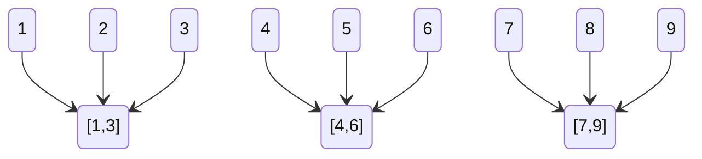

# 排序算法

## 一、排序的第一性原理

### 1. 排序的本质

**排序 = 将一个无序集合，转换为满足某种全序关系的序列。**

从信息视角看，排序解决的是：

* 元素之间**相对顺序不确定**的问题
* 系统如何通过操作逐步**消除不确定性**

---

### 2. 有序度与逆序度模型

$$
\text{有序度} = \sum_{i<j}\delta(A[i] < A[j])
$$

* **满有序度**：完全有序时的有序度
* **逆序度** = 满有序度 − 当前有序度

> **排序过程的本质：不断减少逆序对的过程。**

不同排序算法的区别，不在于“是否排序”，而在于：

* 如何发现逆序
* 如何消除逆序
* 一次消除多少逆序

---

### 3. 排序算法的两种信息来源

| 类型    | 核心思想       | 代价与约束       |
| ----- | ---------- | ----------- |
| 比较排序  | 通过比较逐步获取信息 | 下界 O(nlogn) |
| 非比较排序 | 利用数值分布直接映射 | 对数据分布有前提    |

---

## 二、排序算法的认知结构树

```
排序算法
├── 比较排序
│   ├── 插入型（插入、希尔）
│   ├── 交换型（冒泡、快速）
│   ├── 选择型（选择、堆）
│   └── 分治型（归并、快速）
└── 非比较排序
    ├── 计数（计数排序）
    ├── 映射（桶排序）
    └── 位分解（基数排序）
```

> 分类的目的不是记忆，而是理解**算法之间的血缘关系**。

---

## 三、排序算法的评价维度（设计代价）

| 维度    | 本质含义          |
| ----- | ------------- |
| 时间复杂度 | 消除逆序所需的操作数量   |
| 空间复杂度 | 是否用空间换信息      |
| 稳定性   | 是否破坏等值元素的相对顺序 |
| 原地性   | 是否允许额外存储结构    |

**稳定性本质**：

> 稳定排序 = 不跨越相等元素

---

## 四、基础比较排序（O(n²) 的意义）

> O(n²) 排序不是“低级算法”，而是：
>
> * 小规模最优解
> * 复杂排序的子过程
> * 有序度敏感算法

### 1. 选择排序（选择型）


**核心思想**：

* 每一轮选择“当前最小值”
* 直接放入最终位置

**哲学代价**：

* 交换次数少
* 不关心已有顺序 → 不稳定

---

### 2. 插入排序（插入型）


**核心思想**：

* 假设前缀有序
* 将新元素插入正确位置

**本质优势**：

* 对逆序度敏感
* 近乎有序时接近 O(n)

---

### 3. 冒泡排序（交换型）


**核心思想**：

* 相邻比较
* 将最大（最小）值逐步“冒”到边界

**本质问题**：

* 只能消除局部逆序
* 信息利用率低

---

## 五、插入思想的跃迁：希尔排序


**本质创新**：

> 用“间隔插入”提前消除远距离逆序。

* 插入排序的加速版
* 通过增量序列逐步逼近完全有序

**代价**：

* 理论复杂度难以精确分析
* 不稳定

---

## 六、分治范式的两种极端

### 1. 归并排序（稳定 + 空间换时间）


**本质模型**：

* 分解问题规模
* 合并局部有序结构

**哲学取舍**：

* 用 O(n) 空间换取稳定的 O(nlogn)

#### 外部归并排序


> 面向磁盘与 IO 的排序范式。

---

### 2. 快速排序（局部性最优解）


**本质模型**：

* 通过 partition 建立局部有序
* 递归放大局部优势

**风险**：

* 极端情况下退化为 O(n²)

#### 双路 / 三路快排

> 本质是：**控制等值元素导致的结构退化**。

---

## 七、突破比较下界：线性排序

### 1. 桶排序（分布假设）



**本质前提**：

* 数据分布近似均匀

---

### 2. 计数排序（值到位置的映射）

**核心思想**：

* 用下标直接表示“位置”
* 完全消除比较

**约束**：

* 非负整数
* 范围有限

---

### 3. 基数排序（位分解）

```text
hke          iba        hac         hac
iba          hac        iba         hke
hzg  ->      hke  ->    hke    ->   hzg
ikf          ikf        ikf         iba
hac          hzg        hzg         ikf
```

**本质模型**：

> 将复杂比较，分解为多轮稳定的简单排序。

---

## 八、特殊排序的认知定位

### 猴子排序 / 睡眠排序

> 不是工程算法，而是：

* 概率
* 并发
* 随机性思想的极端展示

---

## 九、洗牌算法（排序的对偶问题）

### Fisher-Yates / Knuth-Durstenfeld

> 排序：消除不确定性
> 洗牌：制造不确定性

二者在概率模型上是对偶问题。

---

## 十、工程选型决策模型

| 场景   | 推荐算法    | 原因    |
| ---- | ------- | ----- |
| 小规模  | 插入排序    | 常数低   |
| 近乎有序 | 插入 / 希尔 | 逆序少   |
| 稳定要求 | 归并 / 计数 | 顺序保持  |
| 内存受限 | 堆排序     | 原地    |
| 海量数据 | 外部归并    | IO 友好 |

---

## 结语

> **排序算法不是技巧集合，而是工程世界中"秩序建立"的思想样本。**

理解排序，本质是在理解：

* 信息如何被逐步确认
* 系统如何在约束下达成有序
* 工程设计中的权衡哲学

## 关联内容（自动生成）

- [/算法与数据结构/算法策略.md](/算法与数据结构/算法策略.md) 排序算法体现了多种算法策略，如分治策略（归并排序、快速排序）、贪心策略（选择排序）等
- [/算法与数据结构/查找.md](/算法与数据结构/查找.md) 排序与查找密切相关，有序数据可以使用二分查找等高效算法
- [/中间件/数据库/数据库.md](/中间件/数据库/数据库.md) 数据库中的外部排序归并算法是处理大规模数据排序的重要方法
- [/中间件/数据库/redis/数据结构.md](/中间件/数据库/redis/数据结构.md) Redis中的有序集合等数据结构与排序算法有密切关系
- [/操作系统/内存管理.md](/操作系统/内存管理.md) 操作系统中的页面置换算法（如LRU、FIFO等）与排序算法在思想上有相似之处
- [/计算机网络/链路层.md](/计算机网络/链路层.md) 链路层协议中使用的各种算法与排序算法一样，都需要考虑时间复杂度和效率
- [/编程语言/JAVA/高级/集合/Map.md](/编程语言/JAVA/高级/集合/Map.md) Java集合框架中的排序功能和TreeMap等数据结构与排序算法密切相关
- [/算法与数据结构/基本数据结构.md](/算法与数据结构/基本数据结构.md) 排序算法通常作用于基本数据结构（如数组、链表）之上，理解数据结构是理解排序算法的基础
- [/算法与数据结构/图.md](/算法与数据结构/图.md) 图算法中的拓扑排序是排序思想在图结构上的应用
- [/中间件/数据库/索引.md](/中间件/数据库/索引.md) 数据库索引的构建和维护与排序算法密切相关，B+树等结构依赖于有序性
