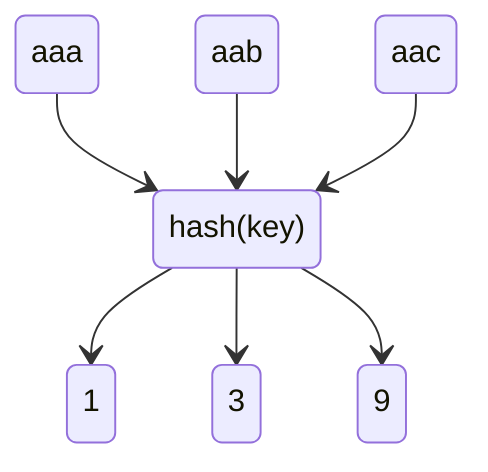

# 散列表

根据键（Key）而直接访问在内存存储位置的数据结构,也就是说，它通过计算一个关于键值的函数，将所需查询的数据映射到表中一个位置来访问记录，这加快了查找速度

## 散列函数

这个过程会将键转化为数组的索引

把任意长度的输入（又叫做预映射pre-image）通过散列算法变换成固定长度的输出，该输出就是散列值

### 设计散列函数

1. 要保证散列函数输出的数值是一个非负整数，因为这个整数将是散列表底层数组的下标
2. 在使用有限数组空间的前提下，导致的哈希冲突尽量少
3. 不宜过于复杂，避免过多计算开销

## 装载因子

装载因子被用来描述散列表 已用槽数 / 总槽数 比值，当这个值过大，会加剧散列冲突，当值过小，会浪费存储空间

## 散列冲突

当不同的输入得到相同的hash值时，称为散列冲突，理想的散列函数：如果 key1 ≠ key2，那 hash(key1) ≠ hash(key2)，但这很难

不管采用哪种探测方法，当散列表中空闲位置不多的时候，散列冲突的概率就会大大提高

### 拉链法

当发生碰撞的时候，拉链法是将碰撞的元素串成一个链表

比较适合存储大对象、大数据量的散列表，而且，比起线性探测，它更加灵活，支持更多的优化策略，比如用[红黑树代替链表](/编程语言/JAVA/高级/集合/Map.md#HashMap)

### 线性探测

当发生碰撞的时候，直接检查散列表中的下Ｎ个位置（Ｎ可正可负）

- 在查找的时候，如插入一样一直进行线性探测，直至碰到一个键为空的槽

这种方法删除数据的时候比较麻烦，需要特殊标记已经删除掉的数据。而且所有的数据都存储在一个数组中，比起拉链法来说，冲突的代价更高

### 二次探测

二次探测探测的下标序列是 $hash(key)+0$，$hash(key)+1^2$，$hash(key)+2^2$……

### 双重散列

使用一组散列函数 hash1(key)，hash2(key)，hash3(key)……先用第一个散列函数，如果计算得到的存储位置已经被占用，再用第二个散列函数，依次类推

## 删除

删除的时候，不能简单地将槽置为空，需要将与该键同散列值的键都往前移动，填补因为该键被删除而造成的空缺

## 调整大小

当数组大小发生改变，不能直接位置一对一迁移，而是需要对先前的每个元素，重新计算散列(rehash)，重新放入槽

当散列表过大时，一次性扩容会耗费更多时间，一种优化手段是[渐进式扩容](/中间件/数据库/redis/数据结构.md#字典)
