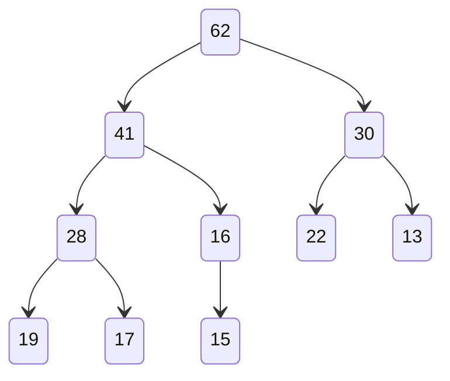

# 树

## 二叉查找树

- 擅长数据的查找
- 高效

**特点**

每个结点的键值大于左孩子，小于右孩子

每个孩子又是二叉查找树

**二分查找树不一定是完全二叉树**

对于任何节点：

- 左子树上所有节点都小于它
- 右子树所有节点都大于它

### 插入

```java
if (root == null) {
    count++;
    return new Node(key, value); // 当前节点为null，则创建一个节点返回
}
if (key.equals(root.key)) { //　当前节点等于要插入的节点，则直接覆盖
    root.value = value;
} else if (less(key, root.key)) { //　当前节点比要插入的大，则向当前节点的左子树插入
    root.left = insert(root.left, key, value);
} else if (greater(key, root.key)) {  //　当前节点比要插入的小，则向当前节点的右子树插入
    root.right = insert(root.right, key, value);
}
```

### 查找

原理同插入，根据左子树比父节点小，右子树比父节点大的条件

```java
if (root == null){
    return null;
}
if (key.equals(root.key)){
    return root.value;
}else if(less(key,root.key)){
    return search(root.left,key);
}else {
    return search(root.right,key);
}
```

**floor与ceil**

- floor：是最接近key值且**小于**key的节点
- ceil：是最接近key值且**大于**key的节点


### 遍历

- 前序遍历

先访问当前节点，再递归访问左右子树

```java
if (root != null){
    consumer.accept(root.key,root.value);
    preOrder(root.left,consumer);
    preOrder(root.right,consumer);
}
```

- 中序遍历

先递归访问左子树，再访问自身，再递归访问右子树

```java
if (root != null){
    preOrder(root.left,consumer);
    consumer.accept(root.key,root.value);
    preOrder(root.right,consumer);
}
```

- 后序遍历

先递归访问左右子树，在访问自身

```java
if (root != null){
    preOrder(root.left,consumer);
    preOrder(root.right,consumer);
    consumer.accept(root.key,root.value);
}
```

- 广度优先遍历(层序)

```java
Queue<Node> queue = new LinkedList<>();
queue.add(root);
while (!queue.isEmpty()) {
    var node = queue.remove();
    consumer.accept(node.key,node.value);
    if (node.left != null){
        queue.add(node.left);
    }
    if (node.right != null){
        queue.add(node.right);
    }
}
```

### 删除

分为三种情况

- 删除叶子节点
  - 直接解除父节点对其的引用即可

- 删除只有一个子节点的
  - 将父节点指向其子节点

```java
private Node removeMax(Node node) {
    
    if (node.right == null) {
        // 代表当前节点就是最大节点，所以返回当前节点的左子树给父节点
        count--;
        return node.left;
    }
    // 将删除的节点的左子树作为父节点的右子树
    node.right = removeMax(node.right);
    return node;
}
```

- 删除有两个子节点的

**Hubbard Deletion**

 使用被删除节点右子树中的最小节点来代替被删除节点

### 局限性

- 同样的数据会对应不同的查找树
- 查找树随着数据的不断增加或插入容易失衡，退化成链表

## 平衡二叉树

- 树及其子树的左右高度差不能超过1
- 空树及只有根节点的树也是平衡二叉树

## AVL树

在增加和删除节点时通过旋转来保持平衡

右旋：以某个节点为中心 将它沉入当前右子节点的位置 然后让当前左子节点作为新树的根


左旋：


## 2-3查找树


### 搜索

搜索的过程和二叉树并没有太多的区别，只是遇到 3 节点的时候，多判断一次是否介于 a、b 之间

### 插入

> 2-3树之所以完美平衡，关键在于插入时的维护


### 删除

## 红黑树

红黑树，正是采用标准的二叉查找树节点附着上额外的颜色信息来表示 2-3 树的实现，每一个红色节点都和它的父亲节点一起，构成了一个 3 节点的模拟，通过旋转操作完成 2-3 节点的合并和分裂，从而在不改变二叉树节点结构的前提下，保证二叉树的有序性和平衡性

红黑树不追求左右子树高度差不超过1，而是保证从根节点到叶尾的最长路径不超过最短路径的2倍，高度近似 log2n，是近似平衡的，插入、删除、查找操作的时间复杂度都是 O(logn)

其他约束条件：

- 节点只能是红色或者黑色
- 根节点必须是黑色
- NIL(Nothing in leaf)节点都是黑色
- 相连的两个节点不能都是红色
- 根节点到叶子节点的所有路径黑色节点数量都相同

红黑树的任何旋转至多3次就能完成

这些约束，都是为了保证每一颗红黑树和 2-3 Tree 是一一对应的


### 基本操作

#### 旋转

左旋：本质上就是将某个 3 节点从以较小的键为根转移成较大的键为根


#### 反色


### 插入

新插入的节点均设为红色

#### 黑节点插入


#### 红节点插入


### 删除

## 堆

> 可被应用优先级队列

### 堆的存储

#### 二叉堆

- 是一棵完全二叉树
- 每个节点和其子节点都有一样的偏序关系，要么大于要么小于

大顶堆就要求堆中所有节点的值，一定大于其左右子树中的任何一个节点的值,小顶堆就正好相反

优先级队列适合用大顶堆实现，这样每次只需要从顶部取出元素即可获得优先级最高的元素

- [PriorityQueue](/编程语言/JAVA/JAVA并发编程/并发集合.md#PriorityQueue)

#### 用数组存储二叉堆



```
[62,41,30,28,16,22,13,19,17,15]
```

#### 操作

- shift up

新加入的元素与其父元素判断，是否比父元素大，如果是，交换两个元素，以此类推，直到小于其父亲

```java
while (less(data,i/2,i)) {
    swap(data,i/2,i);
    i/=2;
}
```

- shift down

只能取出根节点的元素，取出后，使用堆中的最后一个元素填补空缺

填补后，跟左右两个孩子比较，哪个孩子大就跟谁交换...以此类推，直至自己比两个孩子都大

```java
while (2 * k <= count) {
    int j =2*k;
    // 确定要跟左子树比较还是跟右子树
    if (j+1<=count && greater(data,j+1,j)){
        // 右子树
        j++;
    }
    // 如果自己大于要比较的子树，则停止
    if (greaterThan(data,k,j)){
        break;
    }
    swap(data,k,j);
    k=j;
}
```

- 删除

将根节点删除后，我们把二叉堆中最后的元素提到根节点的位置，这样又可以保证新的二叉树是一颗满二叉树了，然后要做的比较 + 交换

### 堆排序

```java
MaxHeap<Comparable<?>> heap = new MaxHeap<>(a.length+1);
for (int i = 0; i < a.length; i++) {
    heap.insert(a[i]);
}
for (int i = 0; i < a.length; i++) {
    a[i]=heap.remove();
}
```

### Heapify

堆化：将数组转为堆

对于一棵完全二叉树，其最后一个非叶子节点是元素个数除二取整

所以要把一个数组堆化，只需要对其非叶子结点进行shift down

```java
for (int i = 0; i < a.length; i++) {
    data[i + 1] = a[i];
}
count = a.length;
// 对其非叶子结点进行shift down
for (int i = count / 2; i >= 1; i--) {
    shiftDown(i);
}
```

### 原地堆排序

```java
int n = a.length;
// 先将整个数组构造成一个最大堆
for (int i = (n - 2) / 2; i >= 0; i--) {
    shiftDown(a, n, i);
}
// 将堆中的第一大元素移到末尾，再次构造最大堆(排除末尾排好序的元素)
// 然后下一次循环再将第一大元素移到倒数第二个...以此类推，直至只剩一个元素
for (int i = n - 1; i > 0; i--) {
    swap(a, 0, i);
    shiftDown(a, i, 0);
}
```

### 索引堆

- 引入一个index数组，在增删改查的时候，提供一个index
- 索引堆根据这个index找到数据在data中的位置


## 并查集

并查集是一种树型的数据结构，用于处理一些不交集（Disjoint Sets）的合并及查询问题

- 连接问题

### find

- find操作返回该节点连接的节点

```java
int find(int p) {
    return data[p];
}
```

另外一种实现，通过判断两个节点是否拥有同样的祖先来判断是否相连

```java
while (p != parent[p]) {
    p = parent[p];
}
return p;
```

### isConnected

- 判断两个节点是否连接在一起的（判断这两个节点是否连接了同一个节点）

```java
boolean isConnected(int p, int q) {
    return find(p) == find(q);
}
```

### union

- 连接两个节点（将一个节点指向另外一个节点）

```java
int pid = find(p);
int qid = find(q);
if (pid == qid){
    return;
}
for (int i = 0; i < count; i++) {
    if (data[i]==pid){
        data[i]=qid;
    }
}
```

使用另外一种实现的union

```java
int qRoot = find(p);
int pRoot = find(q);
if (qRoot == pRoot){
    return;
}
parent[pRoot]=qRoot;
```

基于size的优化，维护一个size数组，代表以i为根的集合的元素个数

```java
if (sz[pRoot]<sz[qRoot]){        
    parent[pRoot] = qRoot;
    sz[qRoot]+=sz[pRoot];
}else {
    parent[qRoot] = pRoot;
    sz[qRoot]+=sz[pRoot];
}
```

使用rank来决定谁连接谁

```java
if (rank[pRoot] < rank[qRoot]) {
    parent[pRoot] = qRoot;
} else if ((rank[pRoot] > rank[qRoot])) {
    parent[qRoot] = pRoot;
} else {
    parent[pRoot] = qRoot;
    rank[qRoot] += 1;
}
```

### 路径压缩

- find

```java
while (p != parent[p]) {
    parent[p]=parent[parent[p]];
    p = parent[p];
}
return p;
```

