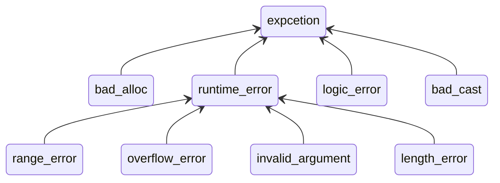

# C++

## 生命周期

- 编码
- 预处理：目的是文字替换，用到的就是各种预处理指令，比如 #include、#define、#if 等
- 编译
- 链接
- 运行

### 预处理阶段编程

```cpp
#include <iostream> // 可以包含任意的文件，只是编译器无法识别
// 避免头文件被多次包含
#ifndef _XXX_H_INCLUDED_
#define _XXX_H_INCLUDED_

...    // 头文件内容

#endif // _XXX_H_INCLUDED_

#ifdef AUTH_PWD                  // 检查是否已经有宏定义
#  undef AUTH_PWD                // 取消宏定义
#endif                           // 宏定义检查结束
#define AUTH_PWD "xxx"           // 重新宏定义

// 条件编译
#elif (NGX_LINUX)
#  include <ngx_linux.h>

#endif
```

### 编译阶段编程

属性：编译阶段的“标签”，用来标记变量、函数或者类

```cpp
[[deprecated("过时")]] // c++14 or later
//[[gnu::deprecated]] // c+11 or later
int old_func()
{
    //[[gnu::deprecated("I hate this")]]
    int value = 0;
    return value;
}

int main() {
  old_func();
  return 1;
}
```

静态断言：在编译阶段计算常数和类型，如果断言失败就会导致编译错误

```cpp
static_assert(1 != 1, "1 is 1");
```

## 面向对象

```cpp
#include <iostream>

class Animal {
  private:
    int age = 0;
  public:
    friend class Dog;
    // 构造函数
    Animal() = default; // 明确告诉编译器，使用默认实现
    // 析构函数
    ~Animal() {
      std::cout << "~Animal\n" << std::endl;
    }
    void test() {
      std::cout << "Animal\n";
    }
    virtual void test1() {
      std::cout << "Animal\n";
    }
};

// 继承
class Dog: public Animal {
private:
  int name = 0;
public:
  Dog() = default;
  Dog(int name) {
    this->name = name;
  }
  void test() {
    std::cout << "Dog\n";
  }

  // 方法覆写
  void test1() override {
    std::cout << "Dog\n";
  }

  void test2(const Animal& a) {
    // 访问友元类的私有数据
    a.age;
  }

  // 运算符重载
  Dog operator+(const Dog & dog) {
    std::cout << "two dog plus\n";
    return Dog(2);
  }
};

int main() {
  Animal* a = new Dog();
  a->test(); // Animal
  a->test1(); // Dog

  Animal b = Dog();
  b.test1(); // Animal

  Dog c;
  Dog d;
  Dog e = c + d;
  
}
```

## 变量

### 自动类型推导

- auto 只能用在初始化语句中
- auto 总是推导出“值类型”，绝不会是“引用”
- auto 可以附加上 const、volatile、*、& 这样的类型修饰符，得到新的类型

```cpp
auto        x = 10L;    // auto推导为long，x是long

auto&       x1 = x;      // auto推导为long，x1是long&
auto*       x2 = &x;    // auto推导为long，x2是long*
const auto& x3 = x;        // auto推导为long，x3是const long&
auto        x4 = &x3;    // auto推导为const long*，x4是const long*

// c++14后 auto也能用在函数返回值中
auto f() {
  return 1;
}
```

decltype 的形式很像函数，后面的圆括号里就是可用于计算类型的表达式（和 sizeof 有点类似），其他方面就和 auto 一样了，也能加上 const、*、& 来修饰

```cpp
void (*signal(int signo, void (*func)(int)))(int);
// 使用decltype可以轻松得到函数指针类型
using sig_func_ptr_t = decltype(&signal);

// 获取复杂类型
std::set s = {1,2,3};
using iterator_type = decltype(s.cbegin());
iterator_type iterator = s.cbegin();
```

### const/volatile/mutable

const

- 它是一个类型修饰符，可以给任何对象附加上“只读”属性，保证安全
- 它可以修饰引用和指针，“const &”可以引用任何类型，是函数入口参数的最佳类型
- 它还可以修饰成员函数，表示函数是“只读”的，const 对象只能调用 const 成员函数

volatile

- 表示变量可能会被“不被察觉”地修改，禁止编译器优化，每次使用时，都要去内存中读

mutable

- 对于一些特殊的变量，给它加上 mutable 修饰，解除 const 的限制，让任何成员函数都可以操作它

```cpp
class A {
  public:
    int a = 1;
    mutable int b = 2;
    void test() {
      a = 2;
    }
    void test1() const {
      // a = 2; 不行
      b = 2;
    }
};

int main() {
  const A a = A();
  // a.test(); 无法调用
  a.test1();
  return 1;
}
```

### 智能指针

智能指针是代理模式的具体应用，它使用 RAII 技术代理了裸指针，能够自动释放内存，无需程序员干预

unique_ptr：

unique_ptr 是一个对象。不要对它调用 delete，它会自动管理初始化时的指针，在离开作用域时析构释放内存，它也没有定义加减运算，不能随意移动指针地址，也不能通过拷贝赋值，要通过 move 语义进行指针的所有权转移

```cpp
class A {
public:
  ~A() {
    cout << "~A";
  }
};

int main() {
  {
    unique_ptr<A> p1(new A());
    // auto p2 = p1; ERROR
    auto p2 = move(p1); // 要通过 move 进行指针所有权转移
  }
  cout << "exit";
  return 1;
}
```

shared_ptr：

其所有权是可以被安全共享的，其内部有个引用计数，会导致循环引用的问题。如果发生拷贝赋值——也就是共享的时候，引用计数就增加，而发生析构销毁的时候，引用计数就减少。只有当引用计数减少到 0，内存就会被回收

```cpp
shared_ptr<A> p3(new A());
auto p4 = p3;
```

weak_ptr：

只观察指针，不会增加引用计数（弱引用），但在需要的时候，可以调用成员函数 lock()，获取 shared_ptr（强引用）

## 异常



```cpp
try {
    throw runtime_error("runtime_error");
  }catch(const exception& e) {
    cout << e.what();
  }catch(const runtime_error& e) { // 只会按照顺序匹配，而不会根据异常继承树匹配最佳
    cout << e.what();
  }

// noexcept 告知编译器该函数不会抛异常，可以做一些优化，但如果真的发生异常，程序直接崩掉
int f() noexcept {
  throw runtime_error("runtime_error");
}
```

## lambda

```cpp
int n = 1;
// = 捕获外层变量，值类型。 &捕获外层变量，引用类型
auto f1 = [=](const int& a, const int& b) {
  return a + b + n;
};
```

## 标准库

### 字符串

字面量后缀：

明确地表示它是 string 字符串类型，而不是 C 字符串

```cpp
using namespace std::literals::string_literals; //必须打开名字空间
auto str = "hello"s;
```

原始字符串：

```cpp
auto s = R"(\n123\n)"; // 输出\n123\n
```

字符串转换函数：

```cpp
using namespace std;
cout << s;
cout << stoi("123");
cout << stol("123");
cout << stod("123.0");
```

字符串视图：内部只保存一个指针和长度，无论是拷贝，还是修改，都非常廉价

```cpp
auto view = new string_view("aaa")
```

### 容器

```cpp
// 动态数组
vector<int> v(2);
v.emplace_back(3);
// 队列
deque<int> d;
d.emplace_back(4);
// 集合
set s = {7, 3, 9};
// 散列表
unordered_map<int, int> map;
map.emplace(1,2);
```

迭代器：

容器一般都会提供 begin()、end() 成员函数，调用它们就可以得到表示两个端点的迭代器。迭代器和指针类似，可以前进和后退，但不能假设它一定支持“++”“--”操作符

```cpp
for(auto it = v.begin(); it != v.end(); it++) {
  cout << *it;
}
// 更加通用的迭代器操作
for(auto it = v.begin(); it != v.end(); advance(it, distance(it, next(it)))) {
  cout << *it;
}
```

### 线程

```cpp
static once_flag flag;        // 全局的初始化标志
thread_local int n = 0; // 线程本地变量
atomic<int> at = {0}; // 原子变量

thread t1([&](){
  n += 10;
  cout << "t1, " << n;
  at++;
  // 只会被调用一次
  call_once(flag, []{ cout << "Hello, once" << endl; });
  cout << "t1, " << this_thread::get_id() << endl;
});
thread t2([](){
  n += 20;
  cout << "t2, " << n;
  // 只会被调用一次
  call_once(flag, []{ cout << "Hello, once" << endl; });
  cout << "t2, " << this_thread::get_id() << endl;
});

t1.join();
t2.join();
// 异步执行代码块返回future
auto f = async([](){cout << "async" << endl;});
f.wait();
```
