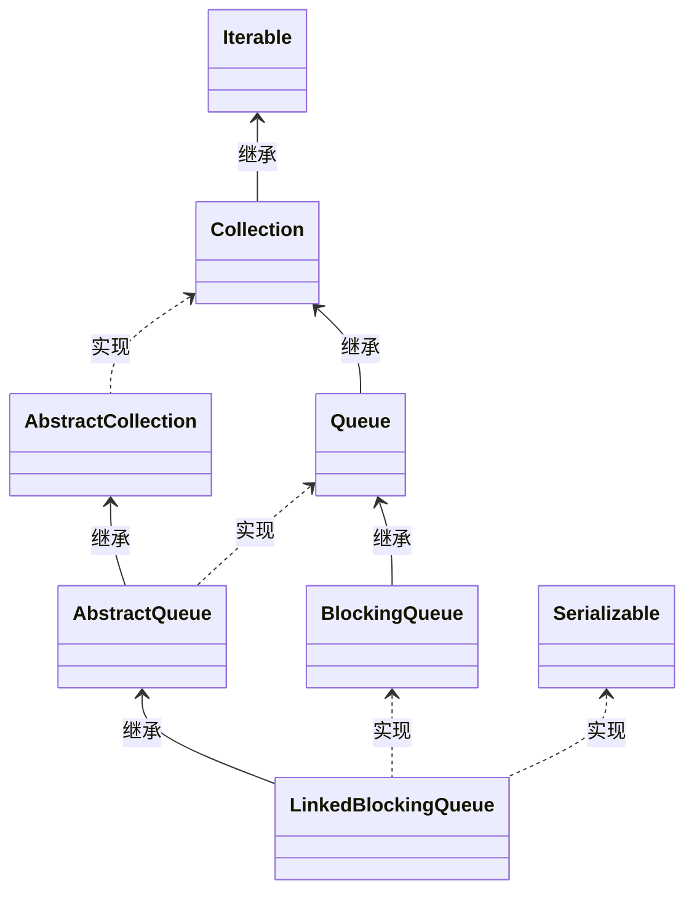
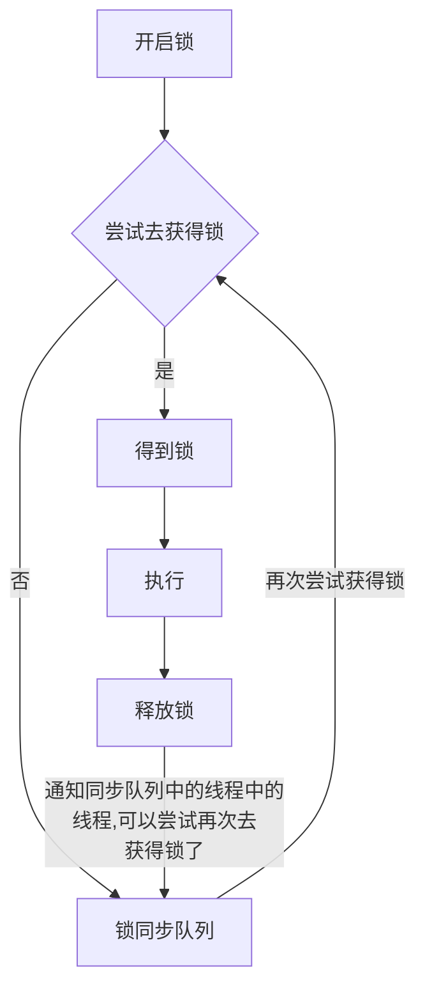

# 并发集合

## 基本不用

Vector, HashTable 都是JDK1.0时期提供的集合类，这两个类所有方法都加了synchronized，所以性能都很差，在新版本的JDK中都将逐渐被废弃移除

## ConcurrentModificationException

- 当在迭代的时候，容器元素发生了修改，则会抛出这个异常

这个问题在非多线程环境也会出现，比如边迭代边remove元素

这是一种快速失败(fail-fast)机制，当检测到可能存在错误时，马上将错误显现出来，大部分容器都是通过版本号(modCount)来实现，快速失败是一种性能与错误检测的平衡

```java
public void remove(int index) {
    ...
    modCount++;
    ...
}

final void checkForComodification() {
    if (modCount != expectedModCount)
        throw new ConcurrentModificationException();
}
```

隐式迭代器：toString equals ...

## ConcurrentHashMap

效率主要体现在读上面，通过分段的细粒度锁而对整个Map对象加锁来达到对性能的提升

### 操作

- put

```java
final V putVal(K key, V value, boolean onlyIfAbsent) {
    if (key == null || value == null) throw new NullPointerException();
    int hash = spread(key.hashCode());
    int binCount = 0;
    for (Node<K,V>[] tab = table;;) {
        Node<K,V> f; int n, i, fh; K fk; V fv;
        // table为空，初始化
        if (tab == null || (n = tab.length) == 0)
            tab = initTable();
        // 当前索引位置为空，直接存放到这里
        else if ((f = tabAt(tab, i = (n - 1) & hash)) == null) {
            if (casTabAt(tab, i, null, new Node<K,V>(hash, key, value)))
                break;                   // no lock when adding to empty bin
        }
        // 当前节点是在扩容，等待扩容完成
        else if ((fh = f.hash) == MOVED)
            tab = helpTransfer(tab, f);
        else if (onlyIfAbsent // check first node without acquiring lock
                 && fh == hash
                 && ((fk = f.key) == key || (fk != null && key.equals(fk)))
                 && (fv = f.val) != null)
            return fv;
        else {
            V oldVal = null;
            // 锁住当前节点
            synchronized (f) {
                // 其他的跟HashMap差不多
                if (tabAt(tab, i) == f) {
                    // 链表添加
                    if (fh >= 0) {
                        binCount = 1;
                        for (Node<K,V> e = f;; ++binCount) {
                            K ek;
                            if (e.hash == hash &&
                                ((ek = e.key) == key ||
                                 (ek != null && key.equals(ek)))) {
                                oldVal = e.val;
                                if (!onlyIfAbsent)
                                    e.val = value;
                                break;
                            }
                            Node<K,V> pred = e;
                            if ((e = e.next) == null) {
                                pred.next = new Node<K,V>(hash, key, value);
                                break;
                            }
                        }
                    }
                    // 红黑树添加
                    else if (f instanceof TreeBin) {
                        Node<K,V> p;
                        binCount = 2;
                        if ((p = ((TreeBin<K,V>)f).putTreeVal(hash, key,
                                                       value)) != null) {
                            oldVal = p.val;
                            if (!onlyIfAbsent)
                                p.val = value;
                        }
                    }
                    else if (f instanceof ReservationNode)
                        throw new IllegalStateException("Recursive update");
                }
            }
            // 新增成功
            if (binCount != 0) {
                // 是否需要转为红黑树
                if (binCount >= TREEIFY_THRESHOLD)
                    treeifyBin(tab, i);
                if (oldVal != null)
                    return oldVal;
                break;
            }
        }
    }
    addCount(1L, binCount);
    return null;
}
```

数组初始化，如何保证只有一个线程初始化并且能初始化成功？

```java
private final Node<K,V>[] initTable() {
    Node<K,V>[] tab; int sc;
    // 自旋
    while ((tab = table) == null || tab.length == 0) {
        // 代表当前有线程在初始化，让线程调度器重新调度线程
        if ((sc = sizeCtl) < 0)
            Thread.yield(); // lost initialization race; just spin
        // 保证只有一个线程能初始化
        else if (U.compareAndSetInt(this, SIZECTL, sc, -1)) {
            try {
                // 双重检查
                if ((tab = table) == null || tab.length == 0) {
                    int n = (sc > 0) ? sc : DEFAULT_CAPACITY;
                    @SuppressWarnings("unchecked")
                    Node<K,V>[] nt = (Node<K,V>[])new Node<?,?>[n];
                    table = tab = nt;
                    sc = n - (n >>> 2);
                }
            } finally {
                sizeCtl = sc;
            }
            break;
        }
    }
    return tab;
}
```

新增槽点，通过自旋死循环保证一定可以新增成功。

如果当前槽点为空，通过CAS新增

槽点如果有值，会锁住当前槽点

红黑树旋转时，锁住红黑树的根节点，保证同一时刻，当前红黑树只能被一个线程旋转

- 扩容

- 首先需要把老数组的值全部拷贝到扩容之后的新数组上，先从数组的队尾开始拷贝；
- 拷贝数组的槽点时，先把原数组槽点锁住，保证原数组槽点不能操作，成功拷贝到新数组时，把原数组槽点赋值为转移节点；
- 这时如果有新数据正好需要 put 到此槽点时，发现槽点为转移节点，就会一直等待，所以在扩容完成之前，该槽点对应的数据是不会发生变化的；
- 从数组的尾部拷贝到头部，每拷贝成功一次，就把原数组中的节点设置成转移节点；
- 直到所有数组数据都拷贝到新数组时，直接把新数组整个赋值给数组容器，拷贝完成

- get

get跟HashMap很像


## ConcurrentLinkedQueue

CAS实现

## ConcurrentSkipListMap

TreeMap使用的红黑树

树的CAS操作很难实现

TreeMap的并发版本

## CopyOnWriteArrayList

通过锁 + 数组拷贝 + volatile 关键字保证了线程安全，每次数组操作，都会把数组拷贝一份出来，在新数组上进行操作，操作成功之后再赋值回去

### 架构

在对数组进行操作的时候，基本会分四步走：

- 加锁；
- 从原数组中拷贝出新数组；
- 在新数组上进行操作，并把新数组赋值给数组容器；
- 解锁。

### 操作

- 新增

```java
public boolean add(E e) {
    synchronized (lock) {
        // 获取真实数组
        Object[] es = getArray();
        int len = es.length;
        // 根据真实数组复制出一个数组
        es = Arrays.copyOf(es, len + 1);
        // 在新数组上做操作
        es[len] = e;
        // 把新数组作为真实数组
        setArray(es);
        return true;
    }
}
```

都已经加锁了，为什么需要拷贝数组？

- volatile 关键字修饰的是数组，如果我们简单的在原来数组上修改其中某几个元素的值，是无法触发可见性的，我们必须通过修改数组的内存地址才行
- 第二个原因是get并没有加锁，通过复制一个新数组进行操作，可以防止get访问到一些数据的中间组合

- 在指定位置新增

```java
public void add(int index, E element) {
    synchronized (lock) {
        Object[] es = getArray();
        int len = es.length;
        if (index > len || index < 0)
            throw new IndexOutOfBoundsException(outOfBounds(index, len));
        Object[] newElements;
        // numMoved指定是后半部分数组的长度
        int numMoved = len - index;
        // 如果删除的是最后一个，直接创建一个比原来数组小1的数组复制数据
        if (numMoved == 0)
            newElements = Arrays.copyOf(es, len + 1);
        else {
            // 这里会根据计算，通过两次复制分别将原数组的前半部分以及后半部分复制到新数组里
            newElements = new Object[len + 1];
            System.arraycopy(es, 0, newElements, 0, index);
            System.arraycopy(es, index, newElements, index + 1,
                             numMoved);
        }
        newElements[index] = element;
        setArray(newElements);
    }
}
```

- 删除

```java
public E remove(int index) {
    synchronized (lock) {
        Object[] es = getArray();
        int len = es.length;
        E oldValue = elementAt(es, index);
        int numMoved = len - index - 1;
        Object[] newElements;
        if (numMoved == 0)
            newElements = Arrays.copyOf(es, len - 1);
        else {
            // 复制前半部分数组同上
            newElements = new Object[len - 1];
            System.arraycopy(es, 0, newElements, 0, index);
            // 复制后半部分数组需要位置向左偏移1个单位
            System.arraycopy(es, index + 1, newElements, index,
                             numMoved);
        }
        setArray(newElements);
        return oldValue;
    }
}
```

- indexOf

```java
private static int indexOfRange(Object o, Object[] es, int from, int to) {
    if (o == null) {
        // 返回第一个为null的下标
        for (int i = from; i < to; i++)
            if (es[i] == null)
                return i;
    } else {
        // 返回equals的对象
        for (int i = from; i < to; i++)
            if (o.equals(es[i]))
                return i;
    }
    return -1;
}
```

- 迭代

由于CopyOnWriteArrayList的迭代器需要持有一个数组引用，所以即使在迭代的过程中对CopyOnWriteArrayList进行修改也不会抛异常


## 阻塞队列

### 设计思想


阻塞队列是一种线程之间转移对象所有权的工具，是一种串行的线程封闭

- 数据结构
- 入队出队方式
- 通信机制
  - 强关联：take与put要互相等待
  - 无关联：只要队列容器不满，生产者就能放成功，生产者就可以直接返回，和有无消费者一点关系都没有，生产者和消费者完全解耦

- BlockingQueue
    - 该类型的队列执行take时如果没有元素则会一直阻塞，put如果超过了界限也会一直阻塞，直至有可用空间
    - 实现类:ArrayBlockingQueue与LinkedBlockingDeque等

### ArrayBlockingQueue

这个队列一个重要的特点是有界的阻塞数组，容量一旦创建，后续大小无法修改

对于生产速率快于消费速率的场景，使用有界队列可以有效避免队列元素不断堆积，最终资源耗尽，应用被压垮

#### 操作

- 初始化

```java
public ArrayBlockingQueue(int capacity, boolean fair) {
    if (capacity <= 0)
        throw new IllegalArgumentException();
    this.items = new Object[capacity];
    //第二个参数是否公平，主要用于读写锁是否公平，如果是公平锁，那么在锁竞争时，就会按照先来先到的顺序，如果是非公平锁，锁竞争时随机的
    lock = new ReentrantLock(fair);
    // 在put成功之后通知其他等待take的线程
    notEmpty = lock.newCondition();
    // 在take成功之后通知其他等待put的线程
    notFull =  lock.newCondition();
}
```

- put

```java
public void put(E e) throws InterruptedException {
    Objects.requireNonNull(e);
    final ReentrantLock lock = this.lock;
    lock.lockInterruptibly();
    try {
        // 当队列满时，进行等待
        while (count == items.length)
            notFull.await();
        // 被唤醒，入队
        enqueue(e);
    } finally {
        lock.unlock();
    }
}
private void enqueue(E e) {
    final Object[] items = this.items;
    // 从这里可以看出，putIndex就是当入队的时候，元素放置的位置
    items[putIndex] = e;
    // 当下次的putInex超过数组大小时，则下次放置的位置就是0，也就说队头
    if (++putIndex == items.length) putIndex = 0;
    count++;
    // 唤醒等待take的线程
    notEmpty.signal();
}
```

- take

```java
public E take() throws InterruptedException {
    final ReentrantLock lock = this.lock;
    lock.lockInterruptibly();
    try {
        // 队列为空，进行等待
        while (count == 0)
            notEmpty.await();
        // 被唤醒，出队
        return dequeue();
    } finally {
        lock.unlock();
    }
}
private E dequeue() {
    final Object[] items = this.items;
    @SuppressWarnings("unchecked")
    // // 从这里可以看出，takeIndex就是当出队的时候，元素的位置
    E e = (E) items[takeIndex];
    items[takeIndex] = null;
    // 同样，当下一次takeIndex超过数组容量时，就从头开始
    if (++takeIndex == items.length) takeIndex = 0;
    count--;
    if (itrs != null)
        itrs.elementDequeued();
    // 唤醒等待put的线程
    notFull.signal();
    return e;
}
```

- remove

```java
void removeAt(final int removeIndex) {
    final Object[] items = this.items;
    // 删除的位置等于下一次take的位置
    if (removeIndex == takeIndex) {
        // removing front item; just advance
        items[takeIndex] = null;
        // takeIndex往后移动一位
        if (++takeIndex == items.length) takeIndex = 0;
        count--;
        if (itrs != null)
            itrs.elementDequeued();
    } else {
        // 删除的位置非takeIndex
        // 从删除的位置开始遍历
        for (int i = removeIndex, putIndex = this.putIndex;;) {
            int pred = i;
            if (++i == items.length) i = 0;
            // 如果遍历到putIndex的位置，删除这个位置的元素
            if (i == putIndex) {
                items[pred] = null;
                this.putIndex = pred;
                break;
            }
            // 将removeIndex后的元素全部往前移动一位
            items[pred] = items[i];
        }
        count--;
        if (itrs != null)
            itrs.removedAt(removeIndex);
    }
    // 通知等待put的线程
    notFull.signal();
}
```

#### 使用场景

一般用于生产数据固定的场景

### LinkedBlockingQueue 

#### 类结构层次




#### 架构

- 使用链表来维护先进先出队列
- 分成三个部分：链表存储 + 锁 + 迭代器

#### 操作

- 初始化

```java
// 直接根据大小初始化
public LinkedBlockingQueue(int capacity) {
    if (capacity <= 0) throw new IllegalArgumentException();
    this.capacity = capacity;
    // 将链表头尾节点置为同一空节点
    last = head = new Node<E>(null);
}
// 根据给定集合初始化
public LinkedBlockingQueue(Collection<? extends E> c) {
    // 初始化近乎无限的队列
    this(Integer.MAX_VALUE);
    // put锁
    final ReentrantLock putLock = this.putLock;
    putLock.lock(); // Never contended, but necessary for visibility
    try {
        int n = 0;
        // 通过循环以此对集合内的元素入列
        for (E e : c) {
            if (e == null)
                throw new NullPointerException();
            if (n == capacity)
                throw new IllegalStateException("Queue full");
            enqueue(new Node<E>(e));
            ++n;
        }
        // 维护队列状态信息
        count.set(n);
    } finally {
        putLock.unlock();
    }
}
```

- 阻塞新增

```java
public void put(E e) throws InterruptedException {
    if (e == null) throw new NullPointerException();
    final int c;
    final Node<E> node = new Node<E>(e);
    final ReentrantLock putLock = this.putLock;
    final AtomicInteger count = this.count;
    // 可中断锁
    putLock.lockInterruptibly();
    try {
        // 当前队列满，等待
        while (count.get() == capacity) {
            notFull.await();
        }
        // 等待结束（此时是队列从满变为没满，被唤醒），入队
        enqueue(node);
        // 获得上一刻队列大小
        c = count.getAndIncrement();
        // 如果当前队列大小仍然小于最大容量，唤醒一个put的等待线程
        if (c + 1 < capacity)
            notFull.signal();
    } finally {
        putLock.unlock();
    }
    // 此时，队列实际大小为1，唤醒一个等待put的线程
    if (c == 0)
        signalNotEmpty();
}
```

- 阻塞删除

```java
public E take() throws InterruptedException {
    final E x;
    final int c;
    final AtomicInteger count = this.count;
    final ReentrantLock takeLock = this.takeLock;
    takeLock.lockInterruptibly();
    try {
        // 当队列为空时，进行等待
        while (count.get() == 0) {
            notEmpty.await();
        }
        // 被唤醒，代表队列有数据了，出队
        x = dequeue();
        // 上一刻的队列大小
        c = count.getAndDecrement();
        // 代表队列还有数据，再唤醒一个等待take的线程
        if (c > 1)
            notEmpty.signal();
    } finally {
        takeLock.unlock();
    }
    // 队列还剩一个空位，唤醒一个等待put的线程
    if (c == capacity)
        signalNotFull();
    return x;
}
```


#### 使用场景

适合对生产的数据大小不定（时高时低），数据量较大的场景

### DelayQueue 

DelayQueue 中的元素必须是 Delayed 的子类，Delayed 是表达延迟能力的关键接口，其继承了 Comparable 接口，并定义了还剩多久过期的方法

这个集合支持用来调度定时任务

```java
public interface Delayed extends Comparable<Delayed> {
    long getDelay(TimeUnit unit);
}
```

#### 操作

- put

```java
public boolean offer(E e) {
    final ReentrantLock lock = this.lock;
    lock.lock();
    try {
        // 利用优先队列进行排序
        q.offer(e);
        // 如果刚放进去的元素在队头
        if (q.peek() == e) {
            leader = null;
            // 则会唤醒在等待可用元素的线程
            available.signal();
        }
        return true;
    } finally {
        lock.unlock();
    }
}
```

- take

```java
public E take() throws InterruptedException {
    final ReentrantLock lock = this.lock;
    lock.lockInterruptibly();
    try {
        // 自旋
        for (;;) {
            // 获取队头数据
            E first = q.peek();
            // 队头没数据，进行等待
            if (first == null)
                available.await();
            else {
                // 获取队头数据的过期时间
                long delay = first.getDelay(NANOSECONDS);
                // 以及过期了
                if (delay <= 0L)
                    // 直接返回
                    return q.poll();
                first = null; // don't retain ref while waiting
                // leader不为null，代表当前元素以及被设置阻塞时间了
                if (leader != null)
                    available.await();
                else {
                    Thread thisThread = Thread.currentThread();
                    leader = thisThread;
                    // 对当前线程阻塞队头元素的阻塞时间
                    try {
                        available.awaitNanos(delay);
                    } finally {
                        if (leader == thisThread)
                            leader = null;
                    }
                }
            }
        }
    } finally {
        if (leader == null && q.peek() != null)
            available.signal();
        lock.unlock();
    }
}
```

#### 使用场景

用于任务不想立马执行，想等待一段时间才执行的场景

### PriorityQueue

取出的顺序是会根据添加的元素进行排序

### SynchronousQueue 

其本身是没有容量大小，比如我放一个数据到队列中，我是不能够立马返回的，我必须等待别人把我放进去的数据消费掉了，才能够返回

#### 架构

```java
// 堆栈和队列共同的接口
// 负责执行 put or take
abstract static class Transferer<E> {
    // e 为空的，会直接返回特殊值，不为空会传递给消费者
    // timed 为 true，说明会有超时时间
    abstract E transfer(E e, boolean timed, long nanos);
}
// 堆栈 后入先出 非公平
// Scherer-Scott 算法
static final class TransferStack<E> extends Transferer<E> {}
    
// 队列 先入先出 公平
static final class TransferQueue<E> extends Transferer<E> {}
```

- transfer

该方法比较复杂，总而言之，如果传进来的e是null，并且当前有一个put线程阻塞，则会返回这个put的e，并且put线程解除阻塞。否则就一直阻塞到有数据为止

反之，如果传进来的e不是null，并且有一个take线程阻塞，则将e通过节点传给take线程

### TransferQueue

拥有普通阻塞队列的put-poll功能与SynchronousQueue的阻塞数据交换功能

- transfer

### Deque

- 双端队列

这种类型的队列允许从头尾两端都可以取得元素，这样在消费能力不一的多消费者情况，提前完成消费的消费者可以从其他消费者的队列末端窃取一些数据来处理，称之为工作窃取

## 问题

#### 对队列的理解

首先队列本身也是个容器，底层也会有不同的数据结构，列把生产数据的一方和消费数据的一方进行解耦，生产者只管生产，消费者只管消费，队列还可以对消费者和生产者进行管理，当队列满时或者空时，会阻塞住生产者或者消费者

#### 队列和集合的区别

队列（部分例外）和集合都提供了数据存储的功能，底层的储存数据结构是有些相似的

但两者为了完成不同的事情，提供的 API 和其底层的操作实现是不同的， 队列提供了阻塞的功能，解耦了生产者和消费者

####  哪些队列具有阻塞的功能，大概是如何阻塞的

LinkedBlockingQueue 链表阻塞队列和 ArrayBlockingQueue 数组阻塞队列是一类，两个阻塞队列都可以指定容量大小，当队列满时，如果有线程 put 数据，线程会阻塞住，直到有其他线程进行消费数据后，才会唤醒阻塞线程继续 put，当队列空时，如果有线程 take 数据，线程会阻塞到队列不空时，继续 take

SynchronousQueue 同步队列，当线程 put 时，必须有对应线程把数据消费掉，put 线程才能返回，当线程 take 时，需要有对应线程进行 put 数据时，take 才能返回

#### 底层是如何实现阻塞的

利用 Condition 的等待唤醒机制

#### 经常使用队列的 put、take 方法有什么危害，如何避免

两个方法都是无限（永远、没有超时时间的意思）阻塞的方法

使用 offer 和 poll 方法来代替两者，可以设置超时阻塞时间

## 队列在JDK中的其他运用

- 线程池


```java
public static ExecutorService newFixedThreadPool(int nThreads) {
    return new ThreadPoolExecutor(nThreads, nThreads,
                                  0L, TimeUnit.MILLISECONDS,
                                  new LinkedBlockingQueue<Runnable>());
}
```

> 参考JAVA编程规范中的不要用Executors创建线程池，而要手动创建

### 锁

同步队列


