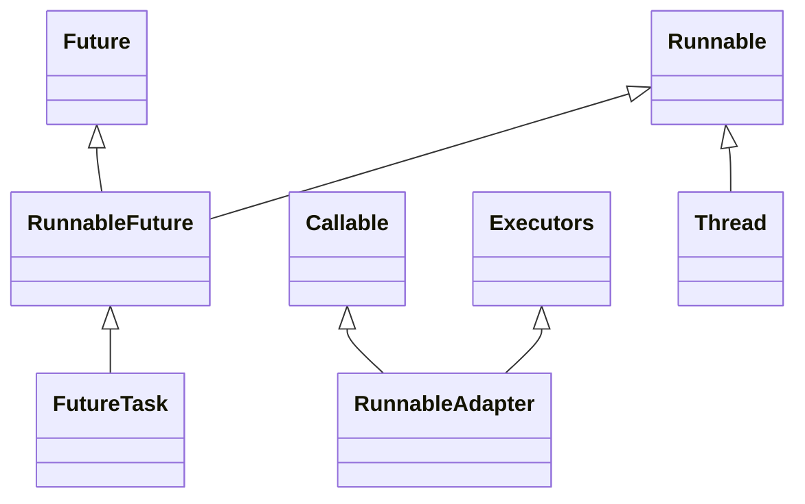
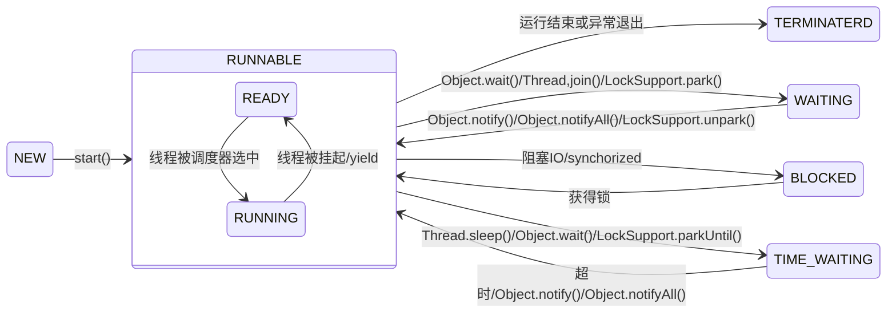

# 线程

## 进程与线程

进程是所有线程的集合，每一个线程是进程中的一条执行路径

## 线程API之间的关系



## 线程分类

- 用户线程
  - 主线程
  - 子线程
- 守护线程
  - *守护线程当进程不存在或主线程停止，守护线程也会被停止*
  - GC线程

HotSpot的每一个Java线程都是直接映射到一个操作系统原生线程来实现的

## 创建线程

### 继承Thread类

```java
class MyThread extends Thread{
    @Override
    public void run() {}
}
```

多线程执行时，在栈内存中，每一个执行线程都有一片自己所属的[栈内存](/编程语言/JAVA/JVM/自动内存管理/内存结构.md)空间。进行方法的压栈和弹栈


Thread类

- public String getName() :获取当前线程名称。
- public void start() :导致此线程开始执行; Java虚拟机调用此线程的run方法。
- public void run() :此线程要执行的任务在此处定义代码。
- public void yield():让出CPU，返回到就绪状态
- join：等待被调用join的线程执行完毕再继续运行
- public static void sleep(long millis) :使当前正在执行的线程以指定的毫秒数暂停（暂时停止执行）。
- public static Thread currentThread() :返回对当前正在执行的线程对象的引用

**InterruptedException**

调用一个线程的 interrupt() 来中断该线程，如果该线程处于阻塞(sleep)、限期等待或者无限期等待(wait)状态，那么就会抛出 InterruptedException，从而提前结束该线程

**interrupted()**

在自定义线程执行任务使，可以使用这个方法作为一个flag，作为是否继续运行的依据

```java
while(interrupted()){
    // do
}
// end
```

### 实现Runnable接口

**实现Runnable接口比继承Thread类所具有的优势：**

- 适合多个相同的程序代码的线程去共享同一个资源。
- 可以避免java中的单继承的局限性。
- 增加程序的健壮性，实现解耦操作，代码可以被多个线程共享，代码和线程独立。
- 线程池只能放入实现Runable或Callable类线程，不能直接放入继承Thread的类。

## Thread相关源码

### 初始化

```java
private Thread(ThreadGroup g , Runnable target, String name,
                   long stackSize, AccessControlContext acc,
                   boolean inheritThreadLocals) {
        if (name == null) {
            throw new NullPointerException("name cannot be null");
        }

        this.name = name;
        // 当前线程作为这条线程的父线程
        Thread parent = currentThread();
        // 一些安全检查
        SecurityManager security = System.getSecurityManager();
        if (g == null) {
           
            if (security != null) {
                g = security.getThreadGroup();
            }

            if (g == null) {
                g = parent.getThreadGroup();
            }
        }

        g.checkAccess();
        // 权限检查
        if (security != null) {
            if (isCCLOverridden(getClass())) {
                security.checkPermission(
                        SecurityConstants.SUBCLASS_IMPLEMENTATION_PERMISSION);
            }
        }

        g.addUnstarted();
        // 设置线程组
        this.group = g;
        // 继承父线程的一些属性，包括是否是守护线程、线程优先级等
        this.daemon = parent.isDaemon();
        this.priority = parent.getPriority();
        if (security == null || isCCLOverridden(parent.getClass()))
            this.contextClassLoader = parent.getContextClassLoader();
        else
            this.contextClassLoader = parent.contextClassLoader;
        this.inheritedAccessControlContext =
                acc != null ? acc : AccessController.getContext();
        this.target = target;
        // 设置线程优先级
        setPriority(priority);
        if (inheritThreadLocals && parent.inheritableThreadLocals != null)
            this.inheritableThreadLocals =
                ThreadLocal.createInheritedMap(parent.inheritableThreadLocals);
        // 设置线程栈大小
        this.stackSize = stackSize;

        /* Set thread ID */
        this.tid = nextThreadID();
    }
```

### 启动

```java
public synchronized void start() {
    // 线程并非NEW状态
    if (threadStatus != 0)
        throw new IllegalThreadStateException();
    // 通知线程组加入自身
    group.add(this);
            
    boolean started = false;
    try {
        // 调用native方法启动线程
        start0();
        started = true;
    } finally {
        try {
            // 如果启动失败，通知线程组启动失败
            if (!started) {
                group.threadStartFailed(this);
            }
        } catch (Throwable ignore) {
            /* do nothing. If start0 threw a Throwable then
              it will be passed up the call stack */
        }
    }
}
```

### join

join 的意思就是当前线程(currentThread)等待另一个线程(调用join的那个线程)执行完成之后，才能继续操作

```java
public final synchronized void join(final long millis)
throws InterruptedException {
    if (millis > 0) {
        // 判断自身是否已执行完毕，
        if (isAlive()) {
            // 如果还未完毕等待一定的时间
            final long startTime = System.nanoTime();
            long delay = millis;
            do {
                wait(delay);
            } while (isAlive() && (delay = millis -
                    TimeUnit.NANOSECONDS.toMillis(System.nanoTime() - startTime)) > 0);
        }
    // 无限等待
    } else if (millis == 0) {
        // 原理就是自旋判断自身是否已经执行完毕
        while (isAlive()) {
            // 如果还未执行完毕，则进入wait
            wait(0);
        }
    } else {
        throw new IllegalArgumentException("timeout value is negative");
    }
}
```

## 线程调度

- Java 使用的抢占式调度多线程系统

可以通过Thread实例setPriority来调整优先级，不过此举总体而言不是一个稳定的调节手段

## 线程状态



线程状态                | 导致状态发生条件
------------------- | -------------------------------------------------------------------------------------------------------------
NEW(新建)             | 线程刚被创建，但是并未启动。还没调用start方法。
Runnable(可运行)       | 线程可以在java虚拟机中运行的状态，可能正在运行自己代码，也可能没有，这取决于操 作系统处理器。
Blocked(锁阻塞)        | 当一个线程试图获取一个对象锁，而该对象锁被其他的线程持有，则该线程进入Blocked状 态；当该线程持有锁时，该线程将变成Runnable状态。
Waiting(无限等待)       | 一个线程在等待另一个线程执行一个（唤醒）动作时，该线程进入Waiting状态。进入这个 状态后是不能自动唤醒的，必须等待另一个线程调用notify或者notifyAll方法才能够唤醒。
Timed Waiting(计时等待) | 同waiting状态，有几个方法有超时参数，调用他们将进入Timed Waiting状态。这一状态 将一直保持到超时期满或者接收到唤醒通知。带有超时参数的常用方法有Thread.sleep 、 Object.wait。
Teminated(被终止)      | 因为run方法正常退出而死亡，或者因为没有捕获的异常终止了run方法而死亡。

## 虚拟线程

在没有虚拟线程之前，创建平台线程是很耗费资源的一种操作，如果应用程序使用[每请求一线程](/编程语言/并发模型.md#每消息一线程模式（Thread-Per-Message）)这种风格的编程方式，并发一般到几百就上不去了，大量线程都阻塞浪费在等待 IO 上了

虚拟线程可以让使用这种编程风格的代码变得更充分利用资源

```java
try (ExecutorService executorService = Executors.newVirtualThreadPerTaskExecutor()) {
    for (int i = 0; i < 10000; i++) {
        executorService.execute(() -> {
            try {
                URLConnection urlConnection = new URL("https://www.baidu.com/img/PCtm_d9c8750bed0b3c7d089fa7d55720d6cf.png").openConnection();
                urlConnection.connect();
                InputStream inputStream = urlConnection.getInputStream();
                System.out.println(inputStream.readAllBytes().length);
                inputStream.close();
            } catch (Exception e) {
                throw new RuntimeException(e);
            }
        });
    }
}
```

虚拟线程执行并不比平台线程快，同样都是执行代码，虚拟线程执行代码依托于平台线程（carrier），当虚拟线程碰到阻塞操作时，就会从平台线程上被卸载，此时 Java 的任务窃取调度器就会再选择一条新的虚拟线程安装到平台线程上进行调度，当阻塞操作完成，虚拟线程就可以提交到调度队列中，等待一下次被运行

但遇到 Object.wait 、synchorized 代码块等，受限于操作系统，执行这些操作的虚拟线程还是会被阻塞

由于虚拟线程的创建代价很小，所以不必对虚拟线程进行池化操作
