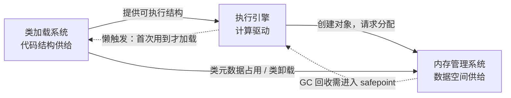
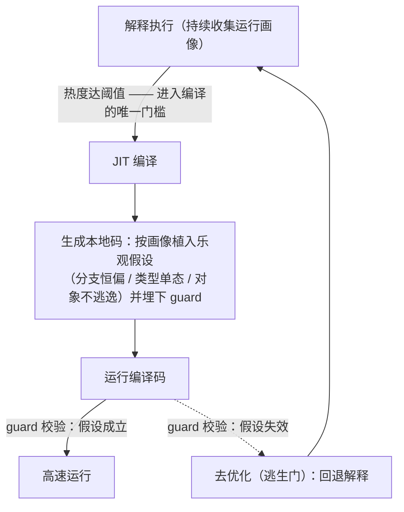

# JVM

## JVM 解决的根本问题

**问题本质**

> 如何让程序在不同硬件与操作系统上，以可控、安全、可优化的方式运行？

“运行 Java”只是 JVM 的表象。其本质是在“源代码”与“硬件”之间引入一个**标准化的中间抽象层**，在长期演化中持续化解以下系统级矛盾：

| 矛盾           | 传统方案的代价    | JVM 的化解方向        |
| ------------ | ---------- | --------------- |
| 性能 vs 可移植性   | 原生编译快但不可移植 | 字节码 + 运行期编译     |
| 安全 vs 直接执行   | 直接运行机器码风险高 | 字节码校验 + 受控执行     |
| 静态优化 vs 动态行为 | 编译期信息不完整   | 运行期采集信息再优化（JIT） |
| 可治理 vs 不透明执行 | 机器码丢失语义，只能硬件层有损反推 | 保留语义元数据，语义层内建监控/干预 |

## JVM 的抽象架构模型

第一性原理回答「为何需要 JVM」，架构模型回答「靠什么结构兑现」——它把抽象承诺落到可定位的模块。

### JVM 的最小完备系统

从架构视角，JVM 只做三件事：

```
输入：字节码
过程：受控执行
输出：与硬件交互
```

对应三大核心模块：

| 模块      | 本质职责         |
| ------- | ------------ |
| 类加载系统   | 将符号世界转为可执行结构 |
| 内存管理系统 | 管理状态与生命周期    |
| 执行引擎    | 决定“如何执行代码”   |

三者构成「代码 + 数据 + 驱动」的协作三元：执行引擎居中驱动，类加载与内存管理分别供给**代码结构**与**数据空间**。它们不是「加载→执行→回收」的直线，而是以执行引擎为中心的相互回调：


```mermaid
flowchart LR
    CL["类加载系统<br/>代码结构供给"]
    EE["执行引擎<br/>计算驱动"]
    MM["内存管理系统<br/>数据空间供给"]

    CL -->|"提供可执行结构"| EE
    EE -.->|"懒触发：首次用到才加载"| CL
    EE -->|"创建对象，请求分配"| MM
    MM -.->|"GC 回收需进入 safepoint"| EE
    CL -->|"类元数据占用 / 类卸载"| MM
```

> 实线为主供给/消费流，虚线为反向回调（懒加载、GC 协调）。本质即「代码 / 数据 / 处理器」的冯诺依曼结构在**字节码抽象层**的重演。

### 抽象层级模型

最小完备系统给的是「部件」的静态结构；抽象层级模型是程序形态逐级降维的动态视图：

| 形态 | 抽象层级 | → 到下一形态的转换（由谁完成） |
|---|---|---|
| 源代码 | 高层语义，平台无关 | 编译（javac，**非 JVM**） |
| 字节码 | 中间表示，仍平台无关 ←── **平台分界线** | 类加载转为运行时结构 + 执行引擎解释 / JIT —— **JVM 独占的一跳** |
| 机器行为 | 绑定具体硬件 | —（终态） |

把「平台无关」翻译成「平台相关」。JVM 的不可替代，正是它**独占了这一跳**，且翻译的**时机**（解释 / JIT）、**力度**（分层）、**可否回退**（去优化）全部可控。

## 关键设计哲学与权衡

- **用可回退换可激进**——自适应执行（去优化是投机的前提）
- **用结构约束复杂性**——栈帧（以隔离边界驯服并发与生命周期）
- **代价不消除，只搬运与治理化**——抽象税（化固定开销为可调旋钮）
- **一致状态只能离散获取**——可治理性（safepoint 与跨域同构）

### 为什么 JVM 选择「基于栈」的指令模型？

**对比维度**

| 维度      | 栈架构（JVM）     | 寄存器架构（如 Dalvik） |
| ------- | ------------ | --------------- |
| 操作数获取   | 隐式压栈 / 弹栈    | 指令显式编址          |
| 字节码体积   | 紧凑（操作数隐式）    | 较大（约 +26%）      |
| 解释执行速度  | 较慢（指令多、派发开销大） | 较快（指令少约 46%）    |
| 实现复杂度   | 简单（无需寄存器分配）  | 较高（需寄存器分配）       |
| 可移植性    | 平台无关         | 同样平台无关（虚拟寄存器）    |
| JIT 编译后 | 差异基本抹平       | 差异基本抹平          |

**JVM 为何选栈**——由其目标约束反推，三者共同指向栈式：

- **要紧凑**：字节码需网络分发、跨平台传输，操作数隐式压栈使体积最小
- **要易验证**：字节码须经校验才进安全沙箱，栈式的操作数栈深度与类型推导更易静态验证
- **解释慢可接受**：峰值性能交给 JIT，而 JIT 后栈式与寄存器式差异抹平

### 为什么同时存在解释执行与 JIT？

| 执行方式   | 解决的问题    |
| ------ | -------- |
| 解释执行   | 快速启动、低成本 |
| JIT 编译 | 热点优化、高性能 |

**核心思想**

> 不在“运行前”做决策，而在“运行中”学习程序行为。

这使 JVM 成为一种：

> **自适应执行系统（Adaptive Runtime）**

### 自适应执行如何既激进又正确

“运行中学习”若只前进不回退，激进优化必在假设失效时崩坏。JVM 用一个反馈闭环化解这一矛盾：


```mermaid
flowchart TD
    I["解释执行（持续收集运行画像）"]
    I -->|"热度达阈值 —— 进入编译的唯一门槛"| C["JIT 编译"]
    C --> E["生成本地码：按画像植入乐观假设<br/>（分支恒偏 / 类型单态 / 对象不逃逸）并埋下 guard"]
    E --> R["运行编译码"]
    R -->|"guard 校验：假设成立"| F["高速运行"]
    R -.->|"guard 校验：假设失效"| D["去优化（逃生门）：回退解释"]
    D --> I
```

> 门槛只有热度：**热度决定编不编，画像与假设决定编多快**。乐观假设是编译产物内部、由运行时 guard 校验的加速手段，而非进入 JIT 的前置检测。

支撑整个体系的是一条不变量：

> **回退能力是激进的前提**：去优化让编译器敢押大概率假设——赌错不出错，只是退回解释再重编。没有“逃生门”，就不敢投机。

至于何时投入多强的优化，是一场成本下注：

> 编译成本固定、执行次数可变 ⇒ 冷代码用快编译器、热代码用强优化器，是数学最优。分层编译即这一下注的工程形态。

这一模式跨域复用——凡“不完全信息下决策”的系统大多如此：

| 系统  | 乐观假设            | 失败回退              |
| --- | --------------- | ----------------- |
| CPU | 分支预测、投机执行       | 预测错则丢弃结果、重取正确路径   |
| 数据库 | 自适应查询执行         | 按运行期统计重选执行计划      |
| JVM | profile 驱动的投机编译 | uncommon trap → 去优化 |

> 自适应执行的本质：用“可回退”换“可激进”，让运行期数据成为优化的依据，而非负担。

### 方法调用与栈帧的哲学意义

栈帧的两个结构属性——**LIFO**（进入压栈、返回弹栈）与**线程私有**（每线程一条独立栈）——分别「物理地」强制出三项性质，而非靠运行时检查或编程规则：

| 结构属性 | 强制出的性质 | 机制 |
|---|---|---|
| LIFO | **生命周期边界** | 局部变量生命周期绑定调用周期，出栈即整帧回收；变量活不过其帧、帧活不过其调用，悬垂/泄漏在结构上不可能 |
| 帧间物理分隔 | **资源隔离单元** | 方法只能访问自己帧内变量 + 传入参数，碰不到调用方的帧；作用域边界 = 帧边界，隔离靠布局而非访问规则 |
| 线程私有 | **并发安全基础** | 同一方法在各线程有独立帧与独立局部变量副本，不共享——没有共享就没有竞争，故免锁 |

对照「全局状态」即见差异：生命周期要手动管或靠 GC、可见性靠约定、并发靠加锁——三者都要**纪律**维持；栈帧用结构一次性消解。

> JVM 用「栈帧」而非「全局状态」，本质是 **用结构约束复杂性**——把本要靠纪律保证的性质编码进数据结构的形态，让错误无从发生（而非发生后再拦）。逃逸分析的价值正在于把不逃逸的堆对象也拉回这套栈帧红利之下（见前文 JIT 的「对象不逃逸」假设）。

### 抽象税：受控执行的代价

JVM 的每一项收益都源自同一个决策——在源码与硬件间插入中间抽象层。这一层带来的所有开销，本质是同一笔“抽象税”。只讲收益不认税，就无法理解后续所有演进为何发生。

**关键认知：JVM 不消除代价，而是把代价变成可治理的旋钮。**

| 抽象税            | 来源     | 性质      | 可调维度                          |
| -------------- | ------ | ------- | ----------------------------- |
| 启动需加载/验证/链接上万类 | 字节码中间层 | 固有，可前移摊薄 | CDS / AOT 缓存                  |
| 预热税（达峰值前 p99 抖动） | 运行期 JIT | 固有，可前移  | 训练期 profiling / 分层编译          |
| GC 停顿（STW）     | 自动内存管理 | **可调**  | 延迟×吞吐×足迹三角：选收集器        |
| safepoint 停顿 + 观察者效应 | 受控可观测 | 固有，可降低  | JFR（低开销）vs 插桩                 |
| 类型安全检查         | 字节码验证  | 固有，一次性  | 加载期完成，运行期免检                    |

> GC 最能说明问题：从 Serial（极小足迹）到 ZGC/Shenandoah（亚毫秒停顿、大堆）共五款生产收集器，覆盖“延迟—吞吐—足迹”三角的不同顶点。**停顿不是固定缺陷，而是在三角上选的那个点**——并发收集消除停顿，代价是更高 CPU 与更低吞吐，没有银弹。

#### 反模式：把代价误当缺陷

抽象层在隐藏复杂度的同时，也隐藏了开销的真实来源，由此产生最常见的误用——**把可治理的代价当成缺陷去对抗**。

| 反模式                          | 信号（常被误判为）                         | 根因          | 对策                          |
| ---------------------------- | --------------------------------- | ----------- | --------------------------- |
| 误判归因                         | GC 停顿→网络抖动；预热→机器不足；JIT 活动→CPU 打满 | 抽象层遮蔽真实层级   | 先用 JVM 级可观测（JFR）定位层级，再动手     |
| 过早 JVM 调优                    | “性能差就调 JVM 参数”                     | 把代码/架构问题甩给 JVM | 优先代码与架构；JVM 调优是不得已的最后手段      |
| 对抗自适应（滥用 System.gc()、强行关 JIT） | —                                 | 试图手动接管运行期决策 | 信任自适应执行，除非证据明确指向            |

> 代价不可消除，只能**搬运与重新分配**——这正是下一章所有演进（CDS / Leyden / CRaC / Native）的统一动机：把抽象税从生产运行期，前移到训练期、快照或构建期。

### 可治理性的代价：一致状态只能离散获取

JVM “可监控、可分析、可干预”，其背后是一切并发系统共通的权衡：

> 要安全地观测或干预一个运行中的系统，必先让它进入一致状态；而一致状态无法在持续运行中维持，只能在**离散的协调点**达成。

这一权衡跨领域同构：

| 领域  | 一致视图的获取方式            |
| --- | -------------------- |
| 数据库 | 停写取快照，或多版本（MVCC）并发读  |
| 分布式 | 协调各节点到一致切点（全局快照）     |
| JVM | safepoint：让线程停在可遍历的点 |

**JVM 的解是 safepoint**——协作式地让线程在“栈可遍历、类型确定、堆一致”的点暂停。它是几乎一切运行期干预的共同前提：

| 干预        | 共同前提            |
| --------- | --------------- |
| GC        | 一致对象图快照才能做可达性分析 |
| 去优化       | 确定点才能重建栈帧、回退解释  |
| 采样 / dump | 可遍历点才能读取调用栈     |

之所以是离散点而非随时：类型信息（哪些槽是引用）只在特定位置被预先物化（HotSpot 以 OopMap 实现）。可理解性的代价，是必须**预先布点**。

**必然推论是观察者效应**：观测受限于、并干扰被观测系统——依赖协调点的采样会偏置（测到的是“能观测之处”而非“真实耗时处”），插桩会改变运行期优化，使被测 ≠ 生产。

> 可治理是 JVM 的核心收益，但有价：以“离散暂停 + 预先布点”换“一致、可读、可干预的执行状态”。实现层（如 JFR 这类内建、低开销、不依赖协调点的记录机制）持续在压低这笔代价。

## JVM 实现的多样性

JVM 首先是一套**规范（行为契约）**，而非某个实现：

| 层次     | 含义         |
| ------ | ---------- |
| JVM 规范 | 定义“应该如何运行” |
| JVM 实现 | 定义“如何具体做到” |

规范唯一、实现多样。规范只固定行为语义，把「如何达成」留作自由度——实现间差异是**工程权衡**，不是理论分歧。标准化抽象的价值正在于开放这个选点空间。

### 实现权衡的三条原理轴

各实现的差异看似繁多（编译器、GC、缓存机制、启动方案），穿透表层后全部落在三条正交轴上——且每条轴都是前文既有原理在「实现空间」的投影：

| 原理轴 | 权衡的本质 | 对应前文原理 | 各实现的选点 |
|---|---|---|---|
| **决策时机**：抽象→机器码的转换发生在何时 | 越晚信息越全（优化上限高），越早启动越快 | 代价不消除，只搬运 | HotSpot 纯运行期；OpenJ9（共享类缓存）/ Zing（历史画像重放）前移到「历史运行」；GraalVM Native Image 前移到构建期 |
| **信息来源**：优化依据静态证明还是运行画像 | 封闭世界（一次定死、不可回退）↔ 开放世界（边跑边学、可去优化） | 用可回退换可激进 | 仅 Native Image 选封闭端——放弃回退能力，就必须禁止运行期意外，故牺牲反射等动态性 |
| **资源三角**：延迟 × 吞吐 × 足迹 | 三者不可兼得，只能选顶点 | GC 的延迟—吞吐—足迹三角 | Zing 押延迟（并发压缩收集）；OpenJ9 押足迹（省 30–50% 内存）；HotSpot 居中多选 |

### 范式边界：什么时候不再是 JVM

信息来源轴同时给出一条**范式归属判据**：

> 一个实现仍属 JVM 范式，当且仅当它保留「运行期语义层」（信息来源轴的开放端）。

GraalVM Native Image 正踩在这条线外侧：它放弃开放世界（封闭世界假设、无运行期自适应、产出平台相关二进制），本质上是退回 AOT 编译语言阵营，只是复用 Java 语法与生态。**JVM 的变与不变，分界线画在是否保留运行期语义层上**。

### JVM 与 JRE、JDK：同心封装

前述都在谈 JVM 本身；镜头拉远，JVM 只是 Java 工具链最内的一层，外面被逐层封装：

| 概念  | 本质            | 相对内层新增       |
| --- | ------------- | ------------ |
| JVM | 执行规范（内核）      | —            |
| JRE | 运行时环境         | + 标准类库与运行支撑   |
| JDK | 开发 + 运行的完整工具链 | + 编译 / 诊断 / 打包 |

关系不是简单「包含」，而是**职责分层**：每层在内层之外加一圈职责，且依赖单向——外层依赖内层，内层不反依赖（JVM 无需 JDK 即可运行字节码）。

## JVM 的长期演进趋势

JVM 的演进沿几条正交轴展开：

| 演进轴       | 根本驱动            | 方向                       |
| --------- | --------------- | ------------------------ |
| 部署形态 / 冷启动 | 云原生：快启动、低足迹、弹性扩缩 | 把运行期工作前移                 |
| 语言平台化     | 复用 JVM 优化能力承载多语言 | 从 Java Runtime → 通用计算运行时 |
| 运行时治理     | 云时代对可观测与管控的要求    | 从应用进程 → 基础设施组件           |

### 轴一：冷启动张力

云原生把一个长期被 JIT 掩盖的矛盾推到台前：

> **JIT 需要预热才能达峰值，而云原生要求快启动、低足迹、可弹性扩缩。**

近年所有相关方案，都是在“启动 × 预热/峰值 × 足迹 × 兼容性”上取不同的点：

| 方案                   | 核心手段                       | 启动     | 预热 / 峰值       | 兼容性代价             |
| -------------------- | -------------------------- | ------ | ------------- | ----------------- |
| CDS / AppCDS         | 共享预解析类元数据                  | 略快     | 不变            | 无                 |
| Project Leyden       | 训练期前移加载/链接/profiling，保留 JIT | 快 ~40% | 预热更快、峰值不降     | 几乎无（非闭世界）         |
| CRaC                 | 预热后快照，恢复即满速               | 极快     | 恢复即峰值        | 仅 Linux，需协调资源句柄   |
| GraalVM Native Image | 闭世界 AOT 编译为原生码，弃 JIT       | 毫秒级    | 无预热、峰值常低于 JVM | 反射/动态需显式声明，调试难    |

> 统一动机：**把工作前移**——前移到训练期（Leyden）、快照（CRaC）或构建期（Native）。
> 这正是“代价只能搬运、不能消除”的体现：抽象税从生产运行期，被搬到了更早的阶段。

### 轴二：语言平台化

GraalVM 的多语言能力，本质是把 JVM「插入抽象层」的手法向下**再递归一层**：JVM 在源码与硬件间插抽象层，Graal 在其下的编译器图（IR）层再设一个统一层，让运行期优化能力（投机编译、逃逸分析、去优化闭环）复用到多种语言。

**统一抽象的层级，决定能承载的异质性。**

| 统一层 | 承载范围 | 原因 |
|---|---|---|
| 字节码层 | 仅语义接近 Java 的语言 | 字节码是「Java 形状的」（静态类型、类模型固定），异质语言塞入即错位 |
| 编译器图层 | 含动态语言 | 图层只剩节点与数据流，无语言形状，共性更强 |

> 通用规律：要统一越异质的对象，统一点就得下沉到它们**共性所在的更低层**——层级越低，形状约束越少，通用性越强，代价是离具体语义越远。

### 轴三：运行时治理

可观测与管控能力的增强，不是功能堆砌，而是定位变迁。但方向需说准——不是 JVM 升格为基础设施，而是**双向适配**：

> JVM 从「平台无关的黑盒进程」变为「**基础设施感知、且被基础设施深度管理**的运行时」——它适配平台，平台吸收它的生命周期。

| 方向 | 证据 |
|---|---|
| JVM 适配基础设施 | 容器感知（自动识别 cgroup 配额）、GC 主动向 OS 归还空闲内存、JFR 事件流化为标准可观测信号（机制见前文 safepoint / JFR） |
| 基础设施吸收 JVM | AWS Lambda SnapStart 把 CRaC 式快照做进云平台层——JVM 生命周期被平台接管 |

### 演进中的不变量

| 不变（稳定锚点）            | 变（工程取舍）                                                |
| ------------------- | ------------------------------------------------------ |
| 字节码作为统一编译入口、Java 语言语义 | “何时何地”完成抽象→机器码（训练期 / 构建期 / 运行期）                        |
| 受控执行的行为契约           | 运行时基底：Native Image 由 SubstrateVM 重写内存/线程/安全，已非传统 JVM |

## 适用边界：何时不该用 JVM

一个范式的成熟，体现在知道它何时不成立。前文确立：JVM 用运行期代价（预热、停顿、足迹、间接层）换长期收益（峰值优化、可移植、可治理）。边界即由此推出。

> 判据：当部署形态或硬约束使“运行期代价 < 长期收益”翻转，JVM 范式即不再划算。

| 翻负方向    | 触发场景            | 根因                       | 替代方向                |
| ------- | --------------- | ------------------------ | ------------------- |
| 收益侧坍缩   | 极短命进程（FaaS/CLI） | 自适应与预热来不及摊销             | 前移方案（CRaC/Native）或原生 |
| 代价越界·停顿 | 硬实时 / 确定性延迟    | GC 与 safepoint 停顿不可完全消除 | C / C++ / Rust      |
| 代价越界·资源 | 极限内存 / 嵌入式      | 运行时与堆元数据足迹偏大           | C / Rust            |
| 代价越界·硬件 | 榨取极低延迟、需贴硬件     | 抽象层与 OS 依赖挡在中间          | C++ / Rust          |

注意：边界是“确定性与极限”，而非“Java 慢”。在吞吐导向场景，JVM 反而能凭运行期信息做静态编译语言做不到的优化。

## 关联内容（自动生成）

- [/编程语言/JAVA/JVM/字节码执行引擎.md](/编程语言/JAVA/JVM/字节码执行引擎.md) 详解栈帧结构、方法调用与解释/编译执行，是本文「执行引擎」模块与「栈帧哲学」「自适应执行」的机制落地
- [/编程语言/JAVA/JVM/后端编译与优化.md](/编程语言/JAVA/JVM/后端编译与优化.md) 深入 JIT 分层编译（C1/C2）、逃逸分析与去优化，是本文自适应执行反馈闭环的具体实现
- [/编程语言/JAVA/JVM/字节码.md](/编程语言/JAVA/JVM/字节码.md) 详解 Class 文件格式与栈式指令集，对应本文「为何选栈」与「抽象层级模型」中字节码这一中间形态
- [/编程语言/JAVA/JVM/类加载机制.md](/编程语言/JAVA/JVM/类加载机制.md) 阐述加载/验证/准备/解析/初始化与双亲委派，是本文「类加载系统」模块与 CDS 前移的展开
- [/编程语言/JAVA/JVM/自动内存管理/内存结构.md](/编程语言/JAVA/JVM/自动内存管理/内存结构.md) 详解堆/栈/方法区等运行时数据区，是本文「内存管理系统」模块的结构细节
- [/编程语言/JAVA/JVM/自动内存管理/垃圾回收.md](/编程语言/JAVA/JVM/自动内存管理/垃圾回收.md) 详解 GC 算法与各代收集器，是本文「延迟—吞吐—足迹三角」与抽象税的机制来源
- [/编程语言/JAVA/JVM/自动内存管理/调优.md](/编程语言/JAVA/JVM/自动内存管理/调优.md) 提供 GC 与 JIT 的调参实践，对应本文「代价变成可调旋钮」与「过早调优」反模式
- [/编程语言/JAVA/JVM/前端编译与优化.md](/编程语言/JAVA/JVM/前端编译与优化.md) 讲解 javac 从源码到字节码的编译与语法糖，对应本文抽象层级模型中「非 JVM 完成」的那一跳
- [/编程语言/JAVA/JVM/JAVA内存模型.md](/编程语言/JAVA/JVM/JAVA内存模型.md) 探讨 JMM 的可见性与有序性语义，是本文受控执行在并发内存层面的延伸
- [/编译原理/编译原理.md](/编译原理/编译原理.md) 介绍词法/语法/语义分析等通用编译理论，为本文「抽象到机器码的转换」提供理论背景
- [/计算机系统/程序结构和执行/汇编.md](/计算机系统/程序结构和执行/汇编.md) 介绍底层机器指令与执行原理，对应本文抽象层级模型的终态「平台相关的机器行为」
