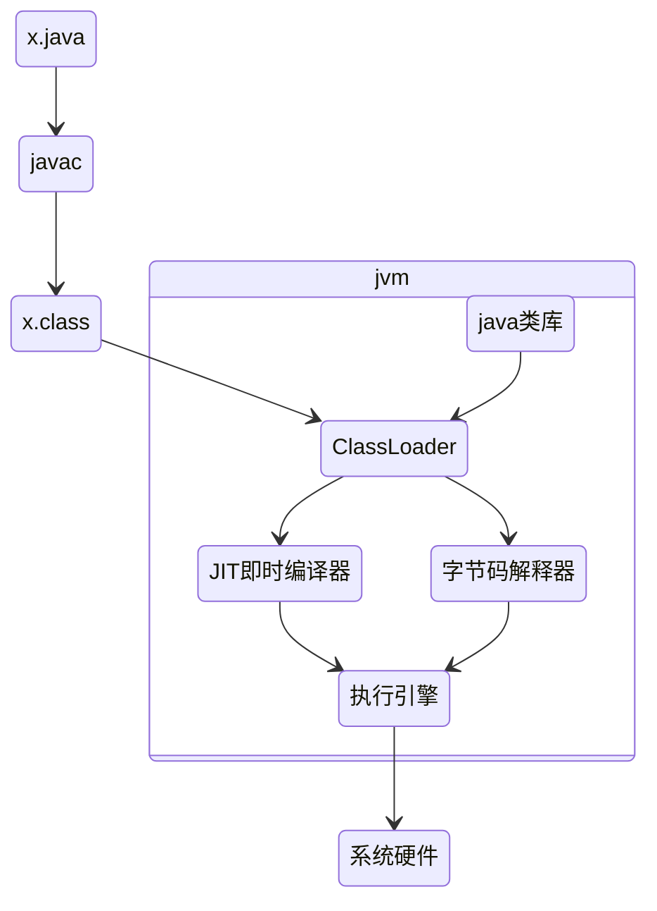

# JVM

- 系统虚拟机
- 软件虚拟机



JVM是一种规范

JDK14:<https://docs.oracle.com/javase/specs/jvms/se14/jvms14.pdf>

## 常见JVM实现

- Hotspot
- Jrockit
- J9

越过操作系统的虚拟机：

- LiquidVM
- azul zing

其他：

- Apache Harmony
- Android Dalvik
- Microsoft JVM

### 未来的趋势

- GraalVM：将这些语言的源代码（例如JavaScript）或源代码编译后的中间格式（例如LLVM字节码）通过解释器转换为能被Graal VM接受的中间表示
- Graal编译器：新一代即时编译器
- Native化：提前编译
- 功能越来越多：监控 调试
- 语法特性持续增强

## JDK JRE JVM


## JVM 体系结构


- 类加载器
- 内存区
- 执行引擎

基于栈的架构：

- 平台无关 不同的平台寄存器各不相同
- 基于栈的寄存器指令更加紧凑

执行引擎的架构：


执行引擎的执行过程：

偏移量|指令|说明
-|-|-
0:|iconst1|常数1入栈
1:|istore_1|将栈顶元素移入本地变量1存储
2:|iconst2|常数2入栈
3:|istore2|将栈顶元素移入本地变量2存储
4:|i1oad1|本地变量1入栈
5:|i1oad2|本地变量2入栈
6:|iadd|弹出栈顶两个元素相加
7:|bipush| 将10入栈
9:|imul|栈顶两个元素相乘
10:|istore3|栈顶元素移入本地变量3存储
11:|return|返回

方法调用：

执行方法调用指令时 会创建一个新栈帧 这个栈帧会存储传递过来的参数

## 编译JDK

- 安装依赖库

```sh
apt install libfreetype6-dev
apt install libcups2-dev
apt install libx11-dev libxext-dev libxrender-dev libxrandr-dev libxtst-dev libxt-dev
apt install libasound2-dev
apt install libffi-dev
apt install autoconf
```

- 准备一个目标JDK-1的bootstrap jdk

```sh
sudo apt-get install openjdk-11-jdk
```

- 编译前配置与检查

```sh
bash configure --enable-debug --with-jvm-variants=server
```

- 开始编译

```sh
make images
```
