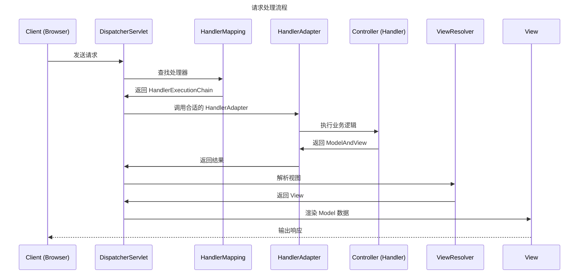

# Spring MVC

## 1. [MVC设计模式原理](/软件工程/架构模式/分层架构.md#MVC)

## 2. Spring MVC 架构概述

Spring MVC 是基于前端控制器（Front Controller）模式的 Web 框架，其核心理念是将所有请求都路由到单一控制器进行处理。这种设计通过将请求处理流程标准化，使得开发者可以专注于业务逻辑而无需关心底层的请求处理细节。

Spring MVC 遵循控制反转（IoC）原则，将组件的生命周期和依赖关系交给容器管理，降低了组件间的耦合度。同时通过策略模式（Strategy Pattern）和模板方法模式（Template Method Pattern）实现了高度可配置性。

## 3. 核心组件职责与设计原理

### 3.1 DispatcherServlet：前端控制器

DispatcherServlet 是 Spring MVC 的核心组件，体现了前端控制器设计模式。其设计原理是：
- 统一请求入口：所有请求都由它接收和分配
- 职责协调：作为协调者调用其他组件处理请求
- 降低耦合：各组件无需了解请求处理的完整流程

### 3.2 HandlerMapping：处理器映射器

HandlerMapping 负责将请求映射到相应的处理器，体现了映射策略的可配置性。其设计原理包括：
- 策略模式：支持多种映射策略（注解、XML配置、正则表达式等）
- 链式处理：支持多个 HandlerMapping 按优先级处理
- 逻辑解耦：映射逻辑与处理逻辑分离

### 3.3 Handler：处理器（Controller）

处理器负责处理具体的业务逻辑，体现了单一职责原则。其设计原理包括：
- 统一接口：所有处理器实现统一接口，框架通过反射机制和 HandlerAdapter 实现对不同类型处理器的统一调用
- 注解驱动：通过注解声明处理逻辑，降低配置复杂度
- 灵活性：支持多种返回值类型和参数类型

### 3.4 HandlerAdapter：处理器适配器

- 负责调用不同类型的处理器（Controller）
- 实现了处理器调用的统一入口
- 体现了适配器模式（Adapter Pattern），使框架支持多种控制器风格

### 3.5 View Resolver：视图解析器

视图解析器将逻辑视图名解析为具体的视图实现，体现了视图与实现的解耦。其设计原理包括：
- 解耦性：逻辑视图与物理视图分离
- 可配置性：支持多种视图技术（JSP、Thymeleaf、FreeMarker等）
- 缓存机制：通过缓存提高视图解析性能

### 3.6 View：视图渲染器

视图负责将模型数据渲染为用户可理解的界面，体现了数据与展示的分离。其设计原理包括：
- 模型驱动：视图渲染基于模型数据
- 模板化：通过模板技术实现界面复用
- 抽象性：提供统一的视图接口，支持多种实现

## 4. 请求处理流程的架构设计

Spring MVC 的请求处理流程遵循了明确的架构设计原则：

1. **接收请求**：DispatcherServlet 接收所有请求
2. **映射处理器**：HandlerMapping 确定处理请求的处理器
3. **执行处理器**：处理器处理请求并返回结果
4. **解析视图**：ViewResolver 解析逻辑视图名
5. **渲染响应**：View 渲染模型数据为响应
6. **返回响应**：DispatcherServlet 返回响应给客户端

这种流程设计的优点：
- 标准化：统一的处理流程
- 可扩展：各环节可单独扩展
- 可配置：映射和处理逻辑可配置
- 可测试：各组件可独立测试

## 5. 视图渲染架构原理

视图渲染是 Spring MVC 中的重要环节，其架构设计体现了以下原理：

### 5.1 视图解析策略
- 逻辑视图名：控制器返回逻辑视图名而非具体视图
- 视图解析器：将逻辑视图名转换为具体的视图实现
- 视图缓存：通过缓存机制提高性能

### 5.2 模型-视图-控制器协作
- 模型传递：控制器将数据封装为模型传递给视图
- 模板引擎：通过模板引擎将数据渲染到视图
- 数据绑定：自动将模型数据绑定到视图组件

### 5.3 内容协商机制
- 格式多样性：支持 HTML、JSON、XML 等多种响应格式
- 协商策略：基于请求头、文件扩展名等确定响应格式
- 视图选择：根据内容类型选择合适的视图实现

## 6. 拦截器与过滤器架构模式

Spring MVC 提供了拦截器机制，允许在请求处理的关键节点插入自定义逻辑。其架构设计原理包括：

### 6.1 拦截器链模式
- 顺序执行：拦截器按配置顺序执行
- 可中断：拦截器可中断请求处理流程
- 后处理：提供请求处理后的回调机制

### 6.2 责任链模式
- 预处理：preHandle 方法在处理器执行前调用
- 后处理：postHandle 方法在处理器执行后调用
- 完成回调：afterCompletion 在请求完成时调用

## 7. 异常处理架构设计

Spring MVC 的异常处理架构采用集中式处理策略，体现了统一错误处理的设计思想：

### 7.1 异常处理分层
- 应用层异常：业务逻辑相关的异常
- 系统层异常：框架或系统级别的异常
- 处理器级异常：特定处理器的异常

### 7.2 异常处理策略
- 全局异常处理：通过@ControllerAdvice 统一处理异常
- 局部异常处理：在特定控制器中处理异常
- 异常映射：将异常映射到特定视图或响应

## 8. 数据绑定与验证原理

数据绑定和验证机制是 Spring MVC 的核心功能，其设计原理包括：

### 8.1 数据绑定机制
- 类型转换：自动将请求数据转换为指定类型
- 属性映射：将请求参数映射到对象属性
- 嵌套绑定：支持嵌套对象的属性绑定

### 8.2 验证机制
- 声明式验证：通过注解声明验证规则
- 验证流程：数据绑定后自动验证
- 错误收集：收集验证错误并反馈给用户

## 9. 配置管理与架构设计

Spring MVC 支持多种配置方式，体现了配置灵活性的设计思想：

### 9.1 Java 配置 vs XML 配置
- 配置灵活性：支持代码和配置文件两种方式
- 类型安全：Java 配置提供编译时类型检查
- 运行时动态：代码配置支持动态配置

### 9.2 组件自动扫描
- 注解驱动：通过注解自动识别组件
- 自动装配：自动装配组件依赖关系
- 配置简化：减少配置工作量

## 10. 可扩展性与插件化设计

Spring MVC 的架构设计充分考虑了可扩展性：

### 10.1 策略接口
- HandlerMapping 接口：可自定义处理器映射策略
- ViewResolver 接口：可自定义视图解析策略
- HandlerExceptionResolver 接口：可自定义异常处理策略

### 10.2 钩子机制
- 扩展点：提供预定义的扩展点
- 回调方法：在关键节点提供回调机制
- 组件注册：支持运行时注册自定义组件
