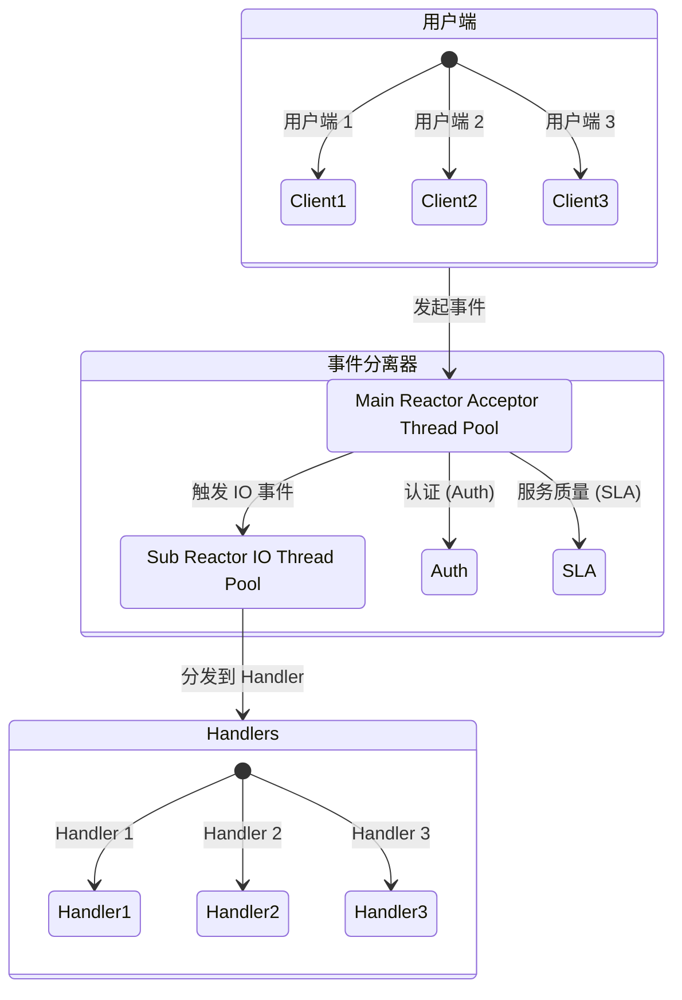
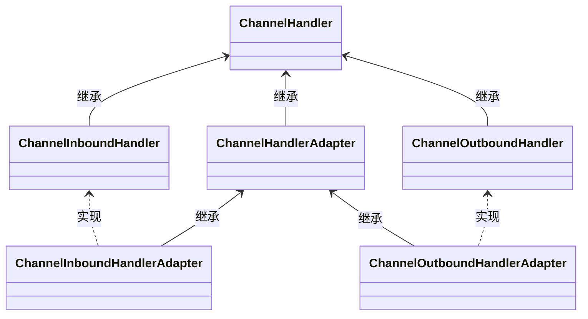
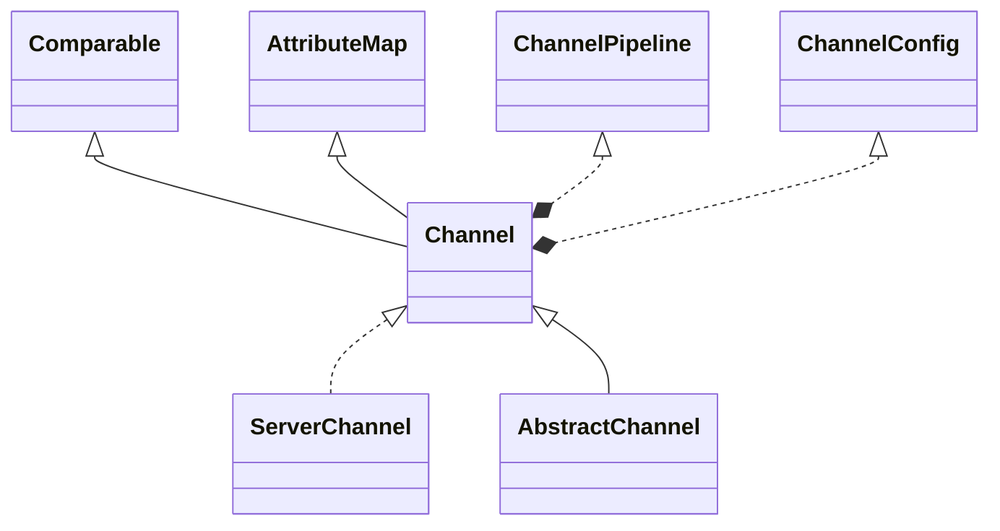
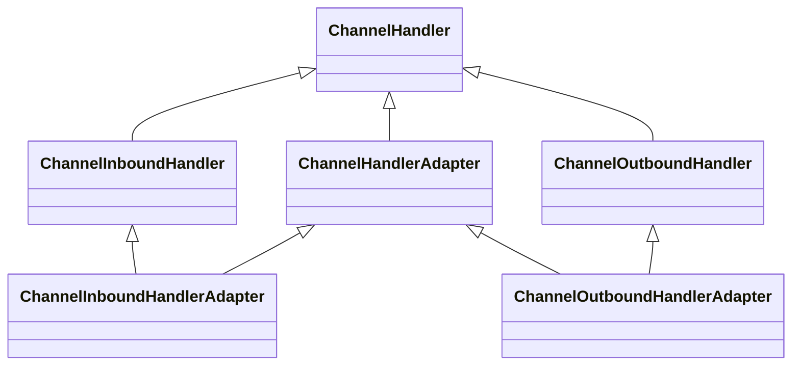
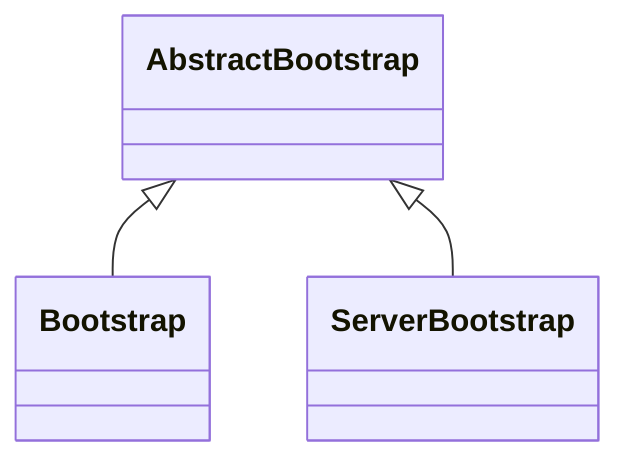

# Netty

>Netty是由JBOSS提供的一个java开源框架。Netty提供异步的、事件驱动的网络应用程序框架和工具，用以快速开发高性能、高可靠性的网络服务器和客户端程序。

使用场景：

- 高性能领域
- 多线程并发领域    
- 异步通信领域

## Reactor主从多线程模型

- 处理高并发
- 一组线程接收请求，一组线程处理IO



## 特性

分类|特性
-|-
设计|统一的API,支持多种传输类型，阻塞的和非阻塞的；简单而强大的线程模型；真正的无连接数据报套接字支持；链接逻辑组件以支持复用
性能|拥有比Java的核心API更高的吞吐量以及更低的延迟；得益于池化和复用，拥有更低的资源消耗；最少的内存复制
健壮性|不会因为慢速、快速或者超载的连接而导致OutofMemoryError；消除在高速网络中NIO应用程序常见的不公平读/写比率

- 非阻塞网络调用使得我们可以不必等待一个操作的完成。完全异步的I/O正是基于这个特性构建的，并且更进一步：异步方法会立即返回，并且在它完成时，会直接或者在稍后的某个时间点通知用户。
- 选择器使得我们能够通过较少的线程便可监视许多连接上的事件。

## 核心组件

- 回调
  - netty使用回调来将事件处理交给程序
- Future
  - netty的实现：ChannelFuture
  - ChannelFutureListener
    - 回调的更精细版本
- 事件与ChannelHandler


## 组件和设计

### Channel

它代表一个到实体（如一个硬件设备、一个文件、一个网络套接字或者一个能够执行一个或者多个不同的I/O操作的程序组件）的开放连接，如读操作和写操作

- EmbeddedChannel；
- LocalServerChannel；
- NioDatagramChannel；
- NioSctpChannel；
- NioSocketChannel。

### EventLoop


一个EventLoop在它的生命周期内只和一个Thread绑定 这个Thread会处理EventLoop所有的IO事件

一个Channel对应一个EventLoop 一个EventLoop有一个或多个Channel

### ChannelFuture

提供了另一种在操作完成时通知应用程序的方式。这个对象可以看作是一个异步操作的结果的占位符；它将在未来的某个时刻完成，并提供对其结果的访问。

属于同一个Channel的操作都能保证按调用的顺序执行

### ChannelHandler

ChannelHandler 为 Netty 中最核心的组件，它充当了所有处理入站和出站数据的应用程序逻辑的容器。ChannelHandler 主要用来处理各种事件，这里的事件很广泛，比如可以是连接、数据接收、异常、数据转换等



### ChannelPipeline

ChannelPipeline 为 ChannelHandler 链提供了一个容器并定义了用于沿着链传播入站和出站事件流的 API


在netty中，有两种消息发送方式

- Channel: 消息会从头开始传递
- ChannelHandlerContext 消息会从某一个Handler开始传递

### 编码器解码器

- xxxDecoder
- xxxEncoder

### ServerBootStrap

- 使用服务器的ServerBootStrap，用于接受客户端的连接以及为已接受的连接创建子通道。
- 用于客户端的BootStrap，不接受新的连接，并且是在父通道类完成一些操作。

Server端需要两组EventLoop


## 异常处理

- 入站异常
  - ChannelHnadler.exceptionCaught
- 出站异常
  - ChannelFutureListener
  - ChannelFuture

## 线程模型

线程模型确定了代码的执行方式

### 线程池模型

线程池管理着一些线程，当任务被提交时，就会被分配给其中一个线程进行处理。

这种模型不能消除由上下文切换所带来的开销

### EventLoop

```java
for (;;) {
    Runnable task = takeTask();
    if (task != null) {
        task.run();
        updateLastExecutionTime();
    }

    if (confirmShutdown()) {
        break;
    }
}
```

一个EventLoop 由 永远都不会变动的一个 Thread 驱动 

### 任务调度

- JDK自带的ScheduleExecutorService
- netty 自带的调度

```java
Channel ch = ...
ScheduledFuture<?> future = ch.eventLoop().schedule(  ← --  创建一个Runnable以供调度稍后执行
　　new Runnable() { 
　　@Override
　　public void run() {  ← --  要执行的代码
　　　　System.out.println("60 seconds later");　
　　}
}, 60, TimeUnit.SECONDS);　 ← --  调度任务在从现在开始的60 秒之后执行
```

### 线程管理

当一个任务交由 eventloop 执行时，如果当前线程是 eventloop 所属的线程，则就直接执行了。如果当前线程不是 eventloop 所属的线程，则将任务放入到任务队列中，等待 eventloop 线程来执行

所以一定不能将一个长时间运行的任务放入到执行队列中 否则EventLoop会被阻塞

### 线程分配


## 单元测试

### EmbeddedChannel


```java
EmbeddedChannel channel = new EmbeddedChannel(new EchoServerHandler());

channel.writeInbound("hello"); // 入站数据
assertTrue(channel.finish()); // 标记为完成
String outData = channel.readOutbound(); // 出站数据
assertEquals("hello",outData);
```

## 传输

## API

核心是 **Channel**



Channel的方法

方法名           | 描述
------------- | --------------------------------------------------------------------------------------------------
eventLoop     | 返回分配给`Channel`的`EventLoop`
pipeline      | 返回分配给`Channel`的`ChannelPipeline`
isActive      | 如果`Channel`是活动的，则返回`true`。活动的意义可能依赖于底层的传输。例如，一个`Socket`传输一旦连接到了远程节点便是活动的，而一个`Datagram`传输一旦被打开便是活动的
localAddress  | 返回本地的`SocketAddress`
remoteAddress | 返回远程的`SocketAddress`
write         | 将数据写到远程节点。这个数据将被传递给`ChannelPipeline`，并且排队直到它被flush
flush         | 将之前已写的数据刷新到底层传输，如一个`Socket`
writeAndFlush | 一个简便的方法，等同于调用`write()`并接着调用`flush()`

Channel 是线程安全的

## 内置的传输方式

名称       | 包                             | 描述                                                                              | 使用场景
-------- | ----------------------------- | ------------------------------------------------------------------------------- | --------------------
NIO      | `io.netty.channel.socket.nio` | 使用`java.nio.channels`包作为基础----基于选择器的方式                                          | 需要非阻塞的情况下（常用）
Epoll    | `io.netty.channel.epoll`      | 由JNI驱动的`epoll()`和非阻塞IO。这个传输支持只有在Linux上可用的多种特性，如`SO_REUSEPORT`，比NIO传输更快，而且是完全非阻塞 | 同上
OIO      | `io.netty.channel.socket.oio` | 使用`java.net`包作为基础----使用阻塞流                                                      | 需要阻塞传输的情况下
Local    | `io.netty.channel.local`      | 可以在VM内部通过管道进行通信的本地传输                                                            | 在同一个JVM内部
Embedded | `io.netty.channel.embedded`   | Embedded传输，允许使用`ChannelHandler`而又不需要一个真正的基于网络的传输                                | 测试`ChannelHandler`时

在实际生产环境中，只推荐使用 NIO 了，Epoll 也是NIO， 是 Netty 自己单独实现的，性能称比 Linux 自带的好

### NIO

### Epoll

该传输的语义同NIO 如果要使用该传输 只需要将 EventLoop 中的 NioServerSocketChannel 替换为 EpollServerSocketChannel即可

### OIO

更熟悉的名字叫做 BIO

### Local

没有绑定物理网络地址

### Embedded

可以将一组ChannelHandler 嵌入到 其他 ChannelHandler内部

## ByteBuf

数据容器

- 可以进行扩展
- 容量按需增长
- 读写切换不需要调用flip
- 读写使用不同索引
- 方法链式调用
- 引用计数
- 池化


### [零拷贝](/操作系统/输入输出.md#零拷贝)

Netty 零拷贝完全是基于（Java 层面）用户态的，不同于操作系统中的零拷贝，操作系统的零拷贝描述的是用户态与内核态之间的内存拷贝。Netty 的更多的是偏向于数据操作优化：

1. 通过 wrap 操作把字节数组、ByteBuf、ByteBuffer 包装成一个 ByteBuf 对象, 进而避免了拷贝操作
2. 支持 slice 操作, 因此可以将 ByteBuf 分解为多个共享同一个存储区域的 ByteBuf，避免了内存的拷贝
3. CompositeByteBuf 类，它可以将多个 ByteBuf 合并为一个逻辑上的 ByteBuf，避免了各个 ByteBuf 之间的拷贝
4. 堆外内存，避免 JVM 堆内存到堆外内存的数据拷贝

### 使用模式

- 堆缓冲区

ByteBuf将数据存储在JVM的堆空间中

```java
ByteBuf heapBuf = ...;
if (heapBuf.hasArray()) {  ← --  检查ByteBuf 是否有一个支撑数组
　　byte[] array = heapBuf.array();  ← --  如果有，则获取对该数组的引用　
　　int offset = heapBuf.arrayOffset() + heapBuf.readerIndex();  ← --  计算第一个字节的偏移量。
　　int length = heapBuf.readableBytes();　 ← --  获得可读字节数
　　handleArray(array, offset, length);　 ← --  使用数组、偏移量和长度作为参数调用你的方法
}
```

- 直接缓冲区

这种模式下的ByteBuf支持通过本地调用分配内存

所以直接缓冲区的数据在堆外，不会被GC处理

```java
ByteBuf directBuf = ...; 
if (!directBuf.hasArray()) {  ← --  检查ByteBuf 是否由数组支撑。如果不是，则这是一个直接缓冲区
　　int length = directBuf.readableBytes();  ← --  获取可读字节数
　　byte[] array = new byte[length];　 ← --  分配一个新的数组来保存具有该长度的字节数据　　
　　directBuf.getBytes(directBuf.readerIndex(), array);  ← --  将字节复制到该数组
　　handleArray(array, 0, length);  ← --  使用数组、偏移量和长度作为参数调用你的方法
}
```

- 复合缓冲区

这种模式下允许多个ByteBuf聚合起来，提供一个ByteBuf整体视图来进行操作

### 字节级操作

- 随机访问

```java
ByteBuf buffer = ...;
for (int i = 0; i < buffer.capacity(); i++) {
　　byte b = buffer.getByte(i);
　　System.out.println((char)b);
}
```

不会改变索引的值

- 顺序访问


调用discardReadBytes()可以回收可丢弃字节的空间

读取所有数据

```java
ByteBuf buffer = ...;
while (buffer.isReadable()) {
　　System.out.println(buffer.readByte());
}
```

写入数据

```java
ByteBuf buffer = ...;
while (buffer.writableBytes() >= 4) {
　　buffer.writeInt(random.nextInt());
}
```

- 索引管理
  - readerIndex(int)：设置读索引位置
  - writerIndex(int)： 设置写索引位置
  - clear()：将读索引写索引重置为0

- 查找

```java
// 查找回车符(\r)
ByteBuf buffer = ...;
int index = buffer.forEachByte(ByteBufProcessor.FIND_CR);
```

- 派生缓冲区

  - duplicate()
  - slice()
  - slice(int, int)
  - Unpooled.unmodifiableBuffer(…)
  - order(ByteOrder)
  - readSlice(int)
  - copy()

这些方法都会返回一个新的ByteBuf实例

- 读/写
  - get和set操作，从给定的索引开始，并且保持索引不变；
  - read和write操作，从给定的索引开始，并且会根据已经访问过的字节数对索引进行调整。
- 其他操作

名称                | 描述
----------------- | ----------------------------------------------------------------------
`isReadable()`    | 如果至少有一个字节可供读取，则返回`true`
`isWritable()`    | 如果至少有一个字节可被写入，则返回`true`
`readableBytes()` | 返回可被读取的字节数
`writableBytes()` | 返回可被写入的字节数
`capacity()`      | 返回`ByteBuf`可容纳的字节数。在此之后，它会尝试再次扩展直 到达到`maxCapacity()`
`maxCapacity()`   | 返回`ByteBuf`可以容纳的最大字节数
`hasArray()`      | 如果`ByteBuf`由一个字节数组支撑，则返回`true`
`array()`         | 如果 `ByteBuf`由一个字节数组支撑则返回该数组；否则，它将抛出一个`UnsupportedOperationException`异常


### ByteBufHolder

- 支持缓冲区池化
  - 从池中复用ByteBuf

名称            | 描述
------------- | --------------------------------------------------
`content()`   | 返回由这个`ByteBufHolder`所持有的`ByteBuf`
`copy()`      | 返回这个`ByteBufHolder`的一个深拷贝，包括一个其所包含的`ByteBuf`的非共享副本
`duplicate()` | 返回这个`ByteBufHolder`的一个浅拷贝，包括一个其所包含的`ByteBuf`的共享副本

### ByteBuf分配

**ByteBufAllocator**

- 池化
- buffer 返回基于对或者直接缓存存储
- headBuffer 返回基于堆内存
- directBuffer 返回基于直接内存
- compositeBuffer
- ioBuffer 返回套接字的IO操作buffer

实现：

- PooledByteBufAllocator
  - 池化
- UnpooledByteBufAllocator
  - 每次调用都会返回一个新实例

**Unpooled缓冲区**

提供了一些静态方法来创建ByteBuf实例

**ByteBufUtils**

- hexdump 以16进制打印缓冲区
- equals 比较两个ByteBuf

### 引用计数

ByteBuf 与 ByteBufHolder 都实现了引用计数

```java
boolean released = buffer.release();  ← --  减少到该对象的活动引用。当减少到0 时，该对象被释放，并且该方法返回true
```

访问一个引用计数被释放的对象 会抛出异常

## Channel相关

### Channel

#### 生命周期

状态                    | 描述
--------------------- | ------------------------------------------
`ChannelUnregistered` | `Channel`已经被创建，但还未注册到`EventLoop`
`ChannelRegistered`   | `Channel`已经被注册到了`EventLoop`
`ChannelActive`       | `Channel`处于活动状态（已经连接到它的远程节点）。它现在可以接收和发送数据了
`ChannelInactive`     | `Channel`没有连接到远程节点


### ChannelHandler

#### 生命周期

类型                | 描述
----------------- | -------------------------------------------
`handlerAdded`    | 当把`ChannelHandler`添加到`ChannelPipeline`中时被调用
`handlerRemoved`  | 当从`ChannelPipeline`中移除`ChannelHandler`时被调用
`exceptionCaught` | 当处理过程中在`ChannelPipeline`中有错误产生时被调用

#### ChannelInboundHandler

- 入站消息操作

类型                          | 描述
--------------------------- | ---------------------------------------------------------------------------------------------------------------------------------------------------------------------------------------------------------------------------------------------------
`channelRegistered`         | 当`Channel`已经注册到它的`EventLoop`并且能够处理I/O时被调用
`channelUnregistered`       | 当`Channel`从它的`EventLoop`注销并且无法处理任何I/O时被调用
`channelActive`             | 当`Channel`处于活动状态时被调用；`Channel`已经连接/绑定并且已经就绪`channelInactive`                                                                                                                                                                                        | 当`Channel`离开活动状态并且不再连接它的远程节点时被调用
`channelReadComplete`       | 当`Channel`上的一个读操作完成时被调用
`channelRead`               | 当从`Channel`读取数据时被调用
`ChannelWritabilityChanged` | 当`Channel`的可写状态发生改变时被调用。用户可以确保写操作不会完成得太快（以避免发生`OutOfMemoryError`）或者可以在`Channel`变为再次可写时恢复写入。可以通过调用`Channel`的`isWritable()`方法来检测`Channel`的可写性。与可写性相关的阈值可以通过`Channel.config(). setWriteHighWaterMark()`和`Channel.config().setWriteLowWaterMark()`方法来设置
`userEventTriggered`        | 当`ChannelnboundHandler.fireUserEventTriggered()`方法被调用时被调用，因为一个POJO被传经了`ChannelPipeline`


需要注意的是 在channelRead方法里面需要显式释放ByteBuf

```java
@Override
public void channelRead(ChannelHandlerContext ctx, Object msg) {  ← --  丢弃已接收的消息
  ReferenceCountUtil.release(msg);
}
```

SimpleChannelInboundHandler 会自动释放资源

#### ChannelOutboundHandler

- 出站消息操作

类型                                                                          | 描述
--------------------------------------------------------------------------- | ---------------------------------
`bind(ChannelHandlerContext,SocketAddress,ChannelPromise)`                  | 当请求将`Channel`绑定到本地地址时被调用
`connect(ChannelHandlerContext,SocketAddress,SocketAddress,ChannelPromise)` | 当请求将`Channel`连接到远程节点时被调用
`disconnect(ChannelHandlerContext,ChannelPromise)`                          | 当请求将`Channel`从远程节点断开时被调用
`close(ChannelHandlerContext,ChannelPromise)`                               | 当请求关闭`Channel`时被调用
`deregister(ChannelHandlerContext,ChannelPromise)`                          | 当请求将`Channel`从它的`EventLoop`注销时被调用
`read(ChannelHandlerContext)`                                               | 当请求从`Channel`读取更多的数据时被调用
`flush(ChannelHandlerContext)`                                              | 当请求通过`Channel`将入队数据冲刷到远程节点时被调用
`write(ChannelHandlerContext,Object,<br>``ChannelPromise)`                  | 当请求通过`Channel`将数据写到远程节点时被调用

#### ChannelHandlerAdapter



#### ResourceLeakDetector

通过分配1%的采样来检测内存泄漏

1. 创建ByteBuf时调用了track0(obj)方法，传入的obj就是创建的ByteBuf对象。
2. track0(obj)方法内做了2件事
  - 创建一个弱引用对象，绑定上面传入的ByteBuf对象和一个全局的弱引用队列refQueue。
  - 把这个弱引用对象加入到另一个全局集合allLeaks里面。
3. ByteBuf对象用完了，正常情况会调用release()方法回收堆外内存，同时release()方法中调用了弱引用对象DefaultResourceLeak的close()方法，从allLeaks集合里面把这个弱引用对象移除。如果开发者忘记调用release()方法，则allLeaks集合里还会存在这个弱引用对象。
4. 一段时间后，ByteBuf对象被GC回收，此时会触发一个操作：ByteBuf对象所绑定的弱引用对象被加入到refQueue中。
5. 下一次创建ByteBuf时又调用了track0(obj)方法，把refQueue和allLeaks这俩集合一对比，既存在于refQueue（说明ByteBuf用完了且已经被GC回收），又存在于allLeaks（说明没调用release释放内存），表明存在内存泄漏

#### XXTrafficShapingHandler

通过指定一个限制速度，读取或写入时进行计算，如果当前速度超限，会让生产者或者消费者等待一段时间后，再进行读取写入

### ChannelPipeline

拦截流经 Channel 的入站和出站时间的ChannelHandler 示例链

#### 修改

名称                                    | 描述
------------------------------------- | --------------------------------------------------------------
`addFirst addBefore addAfter addLast` | 将一个`ChannelHandler`添加到`ChannelPipeline`中
`remove`                              | 将一个`ChannelHandler`从`ChannelPipeline`中移除
`replace`                             | 将`ChannelPipeline`中的一个`ChannelHandler`替换为另一个`Channel- Handler`

#### 访问 ChannelHandler

名称        | 描述
--------- | ---------------------------------------------
`get`     | 通过类型或者名称返回`ChannelHandler`
`context` | 返回和`ChannelHandler`绑定的`ChannelHandlerContext`
`names`   | 返回`ChannelPipeline`中所有`ChannelHandler`的名称


#### 出入站事件

### ChannelHandlerContext

代表了 ChannelHandler 与 ChannelPipeline 之间的关联

这个类提供的一些访问在 Channel 与 ChannelPipeline 上也有

使用该类的目的是产生更短的事件流以及为了更高的性能

## 引导



### Bootstrap

- 客户端

名称                                                                                                  | 描述
--------------------------------------------------------------------------------------------------- | ----------------------------------------------------------------------------------------------------------------------------------------------------------------------------------
`Bootstrap group(EventLoopGroup)`                                                                   | 设置用于处理`Channel`所有事件的`EventLoopGroup`
`Bootstrap channel(Class<? extends C>)`, `Bootstrap channelFactory(` `ChannelFactory<? extends C>)` | `channel()`方法指定了`Channel`的实现类。如果该实现类没提供默认的构造函数，可以通过调用`channelFactory()`方法来指定一个工厂类，它将会被`bind()`方法调用
`Bootstrap localAddress(` `SocketAddress)`                                                          | 指定`Channel`应该绑定到的本地地址。如果没有指定，则将由操作系统创建一个随机的地址。或者，也可以通过`bind()`或者`connect()`方法指定`localAddress`
`Bootstrap option(ChannelOption<> option,T value)`                                                  | 设置`ChannelOption`，其将被应用到每个新创建的`Channel`的`ChannelConfig`。这些选项将会通过`bind()`或者`connect()`方法设置到`Channel`，不管哪个先被调用。这个方法在`Channel`已经被创建后再调用将不会有任何的效果。支持的`ChannelOption`取决于使用的`Channel`类型。
`Bootstrap attr(Attribute<> key, T value)`                                                          | 指定新创建的`Channel`的属性值。这些属性值是通过`bind()`或者`connect()`方法设置到`Channel`的，具体取决于谁最先被调用。这个方法在`Channel`被创建后将不会有任何的效果。
`Bootstrap handler(ChannelHandler)`                                                                 | 设置将被添加到`ChannelPipeline`以接收事件通知的`ChannelHandler`
`Bootstrap clone()`                                                                                 | 创建一个当前`Bootstrap`的克隆，其具有和原始的`Bootstrap`相同的设置信息
`Bootstrap remoteAddress(SocketAddress)`                                                            | 设置远程地址。或者，也可以通过`connect()`方法来指定它
`ChannelFuture connect()`                                                                           | 连接到远程节点并返回一个`ChannelFuture`，其将会在连接操作完成后接收到通知
`ChannelFuture bind()`                                                                              | 绑定`Channel`并返回一个`ChannelFuture`，其将会在绑定操作完成后接收到通知，在那之后必须调用`Channel. connect()`方法来建立连接
 
   
```java
String host = "127.0.0.1";
int port = 1234;
EventLoopGroup workerGroup = new NioEventLoopGroup();

try {
    Bootstrap b = new Bootstrap();
    // 指定线程工作池
    b.group(workerGroup);
    // 指定实例化channel的方式
    b.channel(NioSocketChannel.class);
    // 连接参数
    b.option(ChannelOption.SO_KEEPALIVE, true);
    b.handler(new ChannelInitializer<SocketChannel>() {
        @Override
        public void initChannel(SocketChannel ch) throws Exception {
            ch.pipeline().addLast(new TimeClientHandler());
        }
    });

    // Start the client.
    ChannelFuture f = b.connect(host, port).sync(); // (5)

    // Wait until the connection is closed.
    f.channel().closeFuture().sync();
} catch (InterruptedException e) {
    e.printStackTrace();
} finally {
    workerGroup.shutdownGracefully();
}
```

### ServerBootStrap

- 服务端

名称               | 描述
---------------- | -------------------------------------------------------------------------------------------------------------------------------------------------------------------------------------------------------------------------------------
`group`          | 设置`ServerBootstrap`要用的`EventLoopGroup`。这个`EventLoopGroup`将用于`ServerChannel`和被接受的子`Channel`的I/O处理
`channel`        | 设置将要被实例化的`ServerChannel`类
`channelFactory` | 如果不能通过默认的构造函数创建`Channel`，那么可以提供一个`Channel- Factory`
`localAddress`   | 指定`ServerChannel`应该绑定到的本地地址。如果没有指定，则将由操作系统使用一个随机地址。或者，可以通过`bind()`方法来指定该`localAddress`
`option`         | 指定要应用到新创建的`ServerChannel`的`ChannelConfig`的`Channel- Option`。这些选项将会通过`bind()`方法设置到`Channel`。在`bind()`方法被调用之后，设置或者改变`ChannelOption`都不会有任何的效果。所支持的`ChannelOption`取决于所使用的`Channel`类型。参见正在使用的`ChannelConfig`的API文档
`childOption`    | 指定当子`Channel`被接受时，应用到子`Channel`的`ChannelConfig`的`ChannelOption`。所支持的`ChannelOption`取决于所使用的`Channel`的类型。参见正在使用的`ChannelConfig`的API文档
`attr`           | 指定`ServerChannel`上的属性，属性将会通过`bind()`方法设置给`Channel`。在调用`bind()`方法之后改变它们将不会有任何的效果
`childAttr`      | 将属性设置给已经被接受的子`Channel`。接下来的调用将不会有任何的效果
`handler`        | 设置被添加到`ServerChannel`的`ChannelPipeline`中的`ChannelHandler`。更加常用的方法参见`childHandler()`
`childHandler`   | 设置将被添加到已被接受的子`Channel`的`ChannelPipeline`中的`Channel- Handler`。`handler()`方法和`childHandler()`方法之间的区别是：前者所添加的`ChannelHandler`由接受子`Channel`的`ServerChannel`处理，而`childHandler()`方法所添加的`ChannelHandler`将由已被接受的子`Channel`处理，其代表一个绑定到远程节点的套接字
`clone`          | 克隆一个设置和原始的`ServerBootstrap`相同的`ServerBootstrap`
`bind`           | 绑定`ServerChannel`并且返回一个`ChannelFuture`，其将会在绑定操作完成后收到通知（带着成功或者失败的结果）

Netty 通过指定 EventLoopGroup 来决定使用哪一种 [Reactor 模型](/编程语言/并发模型.md#Reactor%20模型)


```java
// 单线程模式：
EventLoopGroup eventGroup new NioEventLoopGroup(1);
// 非主从多线程：
EventLoopGroup eventGroup new NioEventLoopGroup();
// 主从多线程：
EventLoopGroup bossGroup new NioEventLoopGroup();
EventLoopGroup workerGroup new NioEventLoopGroup()
```


```java
// 接收到来的连接
EventLoopGroup bossGroup = new NioEventLoopGroup();
// 处理已建立连接的流量
EventLoopGroup workerGroup = new NioEventLoopGroup();
try {
    // 复制启动服务器
    ServerBootstrap b = new ServerBootstrap();
    b.group(bossGroup, workerGroup)
            // 使用 NioServerSocketChannel 将到来的连接实例化为Channel
            .channel(NioServerSocketChannel.class)
            // 指定处理器来处理 channel 与 channel 的事件
            .childHandler(new ChannelInitializer<SocketChannel>() {
                @Override
                public void initChannel(SocketChannel ch) throws Exception {
                    ch.pipeline().addLast(new DiscardServerHandler());
                }
            })
            // 指定一些参数（针对到来的连接）
            .option(ChannelOption.SO_BACKLOG, 128)
            // 指定一些参数（针对channel）
            .childOption(ChannelOption.SO_KEEPALIVE, true);

    // Bind and start to accept incoming connections.
    ChannelFuture f = b.bind(port).sync();

    // Wait until the server socket is closed.
    // In this example, this does not happen, but you can do that to gracefully
    // shut down your server.
    f.channel().closeFuture().sync();
} finally {
    workerGroup.shutdownGracefully();
    bossGroup.shutdownGracefully();
}
```

尽可能重用 EventLoop , 减少先创创建所带来的的开销

### ChannelOption

这里可以设置处理连接的一些参数，如：

```java
bootstrap.option(ChannelOption.SO_KEEPALIVE,true)
　　.option(ChannelOption.CONNECT_TIMEOUT_MILLIS, 5000);
```

- ChannelOption.SO_BACKLOG

ChannelOption.SO_BACKLOG对应的是tcp/ip协议listen函数中的backlog参数，函数listen(int socketfd,int backlog)用来初始化服务端可连接队列，服务端处理客户端连接请求是顺序处理的，所以同一时间只能处理一个客户端连接，多个客户端来的时候，服务端将不能处理的客户端连接请求放在队列中等待处理，backlog参数指定了队列的大小

- ChannelOption.SO_KEEPALIVE

Channeloption.SO_KEEPALIVE参数对应于套接字选项中的SO_KEEPALIVE，该参数用于设置TCP连接，当设置该选项以后，连接会测试链接的状态，这个选项用于可能长时间没有数据交流的连接。当设置该选项以后，如果在两小时内没有数据的通信时，TCP会自动发送一个活动探测数据报文

### 关闭

```java
Future<?> future = group.shutdownGracefully();　 ← --  shutdownGracefully()方法将释放所有的资源，并且关闭所有的当前正在使用中的Channel
// block until the group has shutdown
future.syncUninterruptibly();
```

## 编解码器

### 解码器

#### ByteToMessageDecoder

数据通过网络传输，最终会缓存在一个字节数组里

所以就会可能出现传输：

```
|ABC|DEF|GHI|
```

接收：

```
|AB|CDEFG|H|I|
```

```java
public class TimeDecoder extends ByteToMessageDecoder {
    @Override
    protected void decode(ChannelHandlerContext ctx, ByteBuf in, List<Object> out) throws Exception {
        // 如果缓冲区没有足够的数据，不进行处理，只有缓冲区累积一定的数据时，才将数据添加到out
        if (in.readableBytes() < 4){
            return;
        }
        // 添加到out后，代表解码器成功解码了一条消息
        out.add(in.readBytes(4));
    }
}
...
bootstrap.handler(new ChannelInitializer<SocketChannel>() {
    @Override
    public void initChannel(SocketChannel ch) throws Exception {
        ch.pipeline().addLast(new TimeDecoder(),new TimeClientHandler());
    }
});
```

当然这种粘包也可以通过创建一个缓冲区，每次数据到来时，将数据放入到缓冲区，如果缓冲区超过一定大小则就进行处理

```java
public class TimeClientHandler extends ChannelInboundHandlerAdapter {
    private ByteBuf buf;

    @Override
    public void channelRead(ChannelHandlerContext ctx, Object msg) {
        ByteBuf m = (ByteBuf) msg;
        buf.writeBytes(m); // (2)
        m.release();
        
        if (buf.readableBytes() >= 4) { // (3)
            long currentTimeMillis = (buf.readUnsignedInt() - 2208988800L) * 1000L;
            System.out.println(new Date(currentTimeMillis));
            ctx.close();
        }
    }
}
```

#### ReplayingDecoder

使用了一个自定义的ByteBuf 支持更简单的操作

#### MessageToMessageDecoder

ByteToMessage 是一次解码，而MessageToMessage在一次解码的基础上，对其进行二次解码

### 编码器

#### MessageToByteEncoder

```java
public class ShortToByteEncoder extends MessageToByteEncoder<Short> { //← --  扩展了MessageToByteEncoder
    @Override
    public void encode(ChannelHandlerContext ctx, Short msg, ByteBuf out)
      throws Exception {
        out.writeShort(msg); // ← --  将Short 写入ByteBuf 中
    }
}
```

#### MessageToMessageEncoder

### 编解码器

- xxxCodec

### netty 内置的 Handler 以及 编解码器

- SslHandler
  - SSL/TLS
- Http
  - HttpResponseDecoder
  - HttpRequestEncoder
  - HttpServerCodec
  - `pipeline.addLast("aggregator",new HttpObjectAggregator(512 * 1024));`
  - 压缩:HttpContentCompressor
- WebSocket

```java
　　@Override
　　protected void initChannel(Channel ch) throws Exception {
　　　　ch.pipeline().addLast(
　　　　　　new HttpServerCodec(),
　　　　　　new HttpObjectAggregator(65536),   ← --  为握手提供聚合的HttpRequest
　　　　　  new WebSocketServerProtocolHandler("/websocket"), ← --  如果被请求的端点是"/websocket"，则处理该升级握手　
　　　　　　new TextFrameHandler(),　 ← --  TextFrameHandler 处理TextWebSocketFrame
　　　　　  new BinaryFrameHandler(),　← -- BinaryFrameHandler 处理BinaryWebSocketFrame　
　　　　　  new ContinuationFrameHandler());　← -- ContinuationFrameHandler 处理ContinuationWebSocketFrame　 
　　}
```

- 检测空闲连接或超时 前两者都是通过定时任务调度，检测最后操作时间实现，后者则是在特定时间检查特定状态实现
  - IdleStateHandler
  - ReadTimeoutHandler
  - WriteTimeoutHandler
- 根据分隔符分割字节流
  - DelimiterBasedFrameDecoder
  - LineBasedFrameDecoder
- 根据长度分割字节流
  - FixedLengthFrameDecoder
  - LengthFieldBasedFrameDecoder
- 写大型数据

```java
FileInputStream in = new FileInputStream(file);   ← -- 创建一个FileInputStream 
FileRegion region = new DefaultFileRegion(　 ← -- 以该文件的完整长度创建一个新的DefaultFileRegion
　　in.getChannel(), 0, file.length());
channel.writeAndFlush(region);
```

```java
pipeline.addLast(new ChunkedWriteHandler());　 ← --  添加Chunked-WriteHandler以处理作为ChunkedInput传入的数据
　　　　pipeline.addLast(new WriteStreamHandler());   ← --  一旦连接建立，WriteStreamHandler就开始写文件数据　 
```

#### 数据传输前置长度

无论使用什么分割符代表消息间隔，数据中都会可能出现这样的符号，为了避免这个问题，可以通过使用固定的字节长度代表消息数据段长度来解决

```text
03 下雨天 03 留客天 02 天留 03 我不留
```

- LengthFieldBasedFrameDecoder

#### 序列化
  
##### JDK

名称                        | 描述
------------------------- | ------------------------------------------------------------------
`CompatibleObjectDecoder` | 和使用JDK序列化的非基于Netty的远程节点进行互操作的解码器
`CompatibleObjectEncoder` | 和使用JDK序列化的非基于Netty的远程节点进行互操作的编码器
`ObjectDecoder`           | 构建于JDK序列化之上的使用自定义的序列化来解码的解码器；当没有其他的外部依赖时，它提供了速度上的改进。否则其他的序列化实现更加可取
`ObjectEncoder`           | 构建于JDK序列化之上的使用自定义的序列化来编码的编码器；当没有其他的外部依赖时，它提供了速度上的改进。否则其他的序列化实现更加可取

##### JBoss Marshalling

名称                                                            | 描述
------------------------------------------------------------- | -----------------------------------
`CompatibleMarshallingDecoder`,`CompatibleMarshallingEncoder` | 与只使用JDK序列化的远程节点兼容
`MarshallingDecoder`, `MarshallingEncoder`                    | 适用于使用JBoss Marshalling的节点。这些类必须一起使用

##### Protocol Buffers

名称                                     | 描述
-------------------------------------- | ---------------------------------------------------------------------------
`ProtobufDecoder`                      | 使用protobuf对消息进行解码
`ProtobufEncoder`                      | 使用protobuf对消息进行编码
`ProtobufVarint32FrameDecoder`         | 根据消息中的Google Protocol Buffers的"Base 128 Varints"a整型长度字段值动态地分割所接收到的`ByteBuf`
`ProtobufVarint32LengthFieldPrepender` | 向`ByteBuf`前追加一个Google Protocal Buffers的"Base 128 Varints"整型的长度字段值
