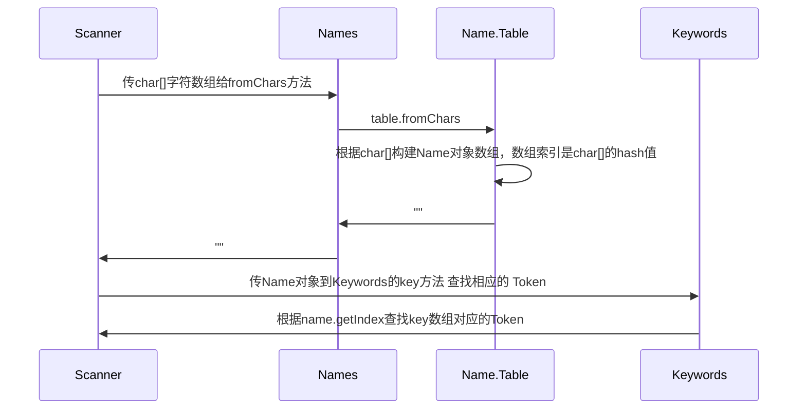

# 编译原理

## 词法解析

```java
// JavaParser
public JCTree.JCCompilationUnit parseCompilationUnit() {
        Token firstToken = token;
        JCModifiers mods = null;
        boolean consumedToplevelDoc = false;
        boolean seenImport = false;
        boolean seenPackage = false;
        ListBuffer<JCTree> defs = new ListBuffer<>();
        if (token.kind == MONKEYS_AT)
            mods = modifiersOpt(); // 解析修饰符

        if (token.kind == PACKAGE) { // 解析包声明
            int packagePos = token.pos;
            List<JCAnnotation> annotations = List.nil();
            seenPackage = true;
            if (mods != null) {
                checkNoMods(mods.flags);
                annotations = mods.annotations;
                mods = null;
            }
            nextToken();
            JCExpression pid = qualident(false);
            accept(SEMI);
            JCPackageDecl pd = toP(F.at(packagePos).PackageDecl(annotations, pid));
            attach(pd, firstToken.comment(CommentStyle.JAVADOC));
            consumedToplevelDoc = true;
            defs.append(pd);
        }

        boolean checkForImports = true;
        boolean firstTypeDecl = true;
        while (token.kind != EOF) {
            if (token.pos <= endPosTable.errorEndPos) {
                // error recovery
                skip(checkForImports, false, false, false);
                if (token.kind == EOF)
                    break;
            }
            if (checkForImports && mods == null && token.kind == IMPORT) { // 解析import
                seenImport = true;
                defs.append(importDeclaration());
            } else { // 解析类主体
                Comment docComment = token.comment(CommentStyle.JAVADOC); // 类doc注释
                if (firstTypeDecl && !seenImport && !seenPackage) {
                    docComment = firstToken.comment(CommentStyle.JAVADOC);
                    consumedToplevelDoc = true;
                }
                if (mods != null || token.kind != SEMI)
                    mods = modifiersOpt(mods);
                if (firstTypeDecl && token.kind == IDENTIFIER) {
                    ModuleKind kind = ModuleKind.STRONG; // 模块解析
                    if (token.name() == names.open) {
                        kind = ModuleKind.OPEN;
                        nextToken();
                    }
                    if (token.kind == IDENTIFIER && token.name() == names.module) {
                        if (mods != null) {
                            checkNoMods(mods.flags & ~Flags.DEPRECATED);
                        }
                        defs.append(moduleDecl(mods, kind, docComment));
                        consumedToplevelDoc = true;
                        break;
                    } else if (kind != ModuleKind.STRONG) {
                        reportSyntaxError(token.pos, Errors.ExpectedModule);
                    }
                }
                JCTree def = typeDeclaration(mods, docComment);
                if (def instanceof JCExpressionStatement)
                    def = ((JCExpressionStatement)def).expr;
                defs.append(def);
                if (def instanceof JCClassDecl)
                    checkForImports = false;
                mods = null;
                firstTypeDecl = false;
            }
        }
        JCTree.JCCompilationUnit toplevel = F.at(firstToken.pos).TopLevel(defs.toList());
        if (!consumedToplevelDoc)
            attach(toplevel, firstToken.comment(CommentStyle.JAVADOC));
        if (defs.isEmpty())
            storeEnd(toplevel, S.prevToken().endPos);
        if (keepDocComments)
            toplevel.docComments = docComments;
        if (keepLineMap)
            toplevel.lineMap = S.getLineMap();
        this.endPosTable.setParser(null); // remove reference to parser
        toplevel.endPositions = this.endPosTable;
        return toplevel;
    }
```

JavaParser 根据 Java 语言规范来解析.java文件进行词法解析

每调用一次nextToken 就会构造一个Token 



## 语法分析

- 进行package词法分析的时候构建一个节点

```java
JCExpression t = toP(F.at(token.pos).Ident(ident()));
```

- 进行import词法分析时构造的import语法树

```java
protected JCTree importDeclaration() {
    int pos = token.pos;
    nextToken();
    boolean importStatic = false;
    if (token.kind == STATIC) {
        importStatic = true;
        nextToken();
    }
    JCExpression pid = toP(F.at(token.pos).Ident(ident()));
    do {
        int pos1 = token.pos;
        accept(DOT);
        if (token.kind == STAR) {
            pid = to(F.at(pos1).Select(pid, names.asterisk));
            nextToken();
            break;
        } else {
            pid = toP(F.at(pos1).Select(pid, ident()));
        }
    } while (token.kind == DOT);
    accept(SEMI);
    return toP(F.at(pos).Import(pid, importStatic));
}
```

- 类主体语法树构造

```java
JCTree typeDeclaration(JCModifiers mods, Comment docComment) {
    int pos = token.pos;
    if (mods == null && token.kind == SEMI) {
        nextToken();
        return toP(F.at(pos).Skip());
    } else {
        return classOrRecordOrInterfaceOrEnumDeclaration(modifiersOpt(mods), docComment);
    }
}
```

最后会生成一颗完整的语法树

## 语义分析

打磨语法树

- Enter类

## 代码生成

- Gen类

## 编译器API

- 对.java文件即时编译
- 对字符串即时编译
- 监听编译与错误

`JavaCompiler`

- run方法：调用直接在源代码目录生成class文件，api较为简单
- getTask方法：功能较为强大，支持对内存中的源代码生成class

### 编译文件

```java
JavaCompiler javaCompiler = ToolProvider.getSystemJavaCompiler();
javaCompiler.run(null,null,null,"path");
```

### 编译字符串

```java
private static Class<?> compile(String className, String javaCodes) throws URISyntaxException {

    class JavaSourceFromString extends SimpleJavaFileObject {
        private final String src;

        public JavaSourceFromString(String className, String code) throws URISyntaxException {
            super(URI.create("string:///" + className.replace('.', '/')
                    + ".java"), JavaFileObject.Kind.SOURCE);
            this.src = code;
        }

        public String getCode() {return src;}

        @Override
        public CharSequence getCharContent(boolean ignoreEncodingErrors) {
            return src;
        }
    }

    //将字符串包装为SimpleJavaFileObject对象
    JavaSourceFromString srcObject = new JavaSourceFromString(className, javaCodes);
    System.out.println(srcObject.getCode());
    Iterable<? extends JavaFileObject> fileObjects = Arrays.asList(srcObject);

    JavaCompiler compiler = ToolProvider.getSystemJavaCompiler();
    StandardJavaFileManager fileManager = compiler.getStandardFileManager(null, null, null);
    DiagnosticCollector<JavaFileObject> diagnosticCollector = new DiagnosticCollector<JavaFileObject>();

    //设置编译的输出目录，并包装在options中
    String flag = "-d";
    String outDir = "";
    try {
        File classPath = new File(Thread.currentThread().getContextClassLoader().getResource("").toURI());
        outDir = classPath.getAbsolutePath() + File.separator;
        System.out.println(outDir);
    } catch (URISyntaxException e1) {
        e1.printStackTrace();
    }
    Iterable<String> options = Arrays.asList(flag, outDir);

    //JavaCompiler.getTask方法：以future的任务形式(多线程)，来执行编译任务

    // 第一个参数：额外输出流，null表示默认使用system.err
    // 第二个参数：文件管理器，null表示编译器标准文件管理器
    // 第三个参数：诊断监听器，null表示使用编译器默认方法来报告诊断信息
    // 第四个参数：编译器参数，null表示无参数
    // 第五个参数：需要经过annotation处理的类名，null表示没有类需要annotation处理
    // 第六个参数：待编译的类

    JavaCompiler.CompilationTask task =
            compiler.getTask(null, fileManager, diagnosticCollector, options, null, fileObjects);

    //等待编译结束
    boolean result = task.call();
    if (result) {
        try {
            return Class.forName(className);
        } catch (ClassNotFoundException e) {
            e.printStackTrace();
        }
    }
    else
    {
        //print the Diagnostic's information
        for  (Diagnostic diagnostic : diagnosticCollector
                .getDiagnostics())
        {
            System.out.println("Error on line: "
                    + diagnostic.getLineNumber() + "; URI: "
                    + diagnostic.getSource().toString());
        }
    }
    return null;
}
```

```java
String sourceCode = """
public class HelloWorld {
    public static void main(String[] args) {
        System.out.println("hello world");
    }
}
""";
Class<?> klass = compile("HelloWorld", sourceCode);
Method method = klass.getDeclaredMethod("main", String[].class);
method.invoke(null, new Object[]{new String[]{}}); // print hello world
```

### 应用

- JSP编译
- 在线编程
- 自动化构建和测试
