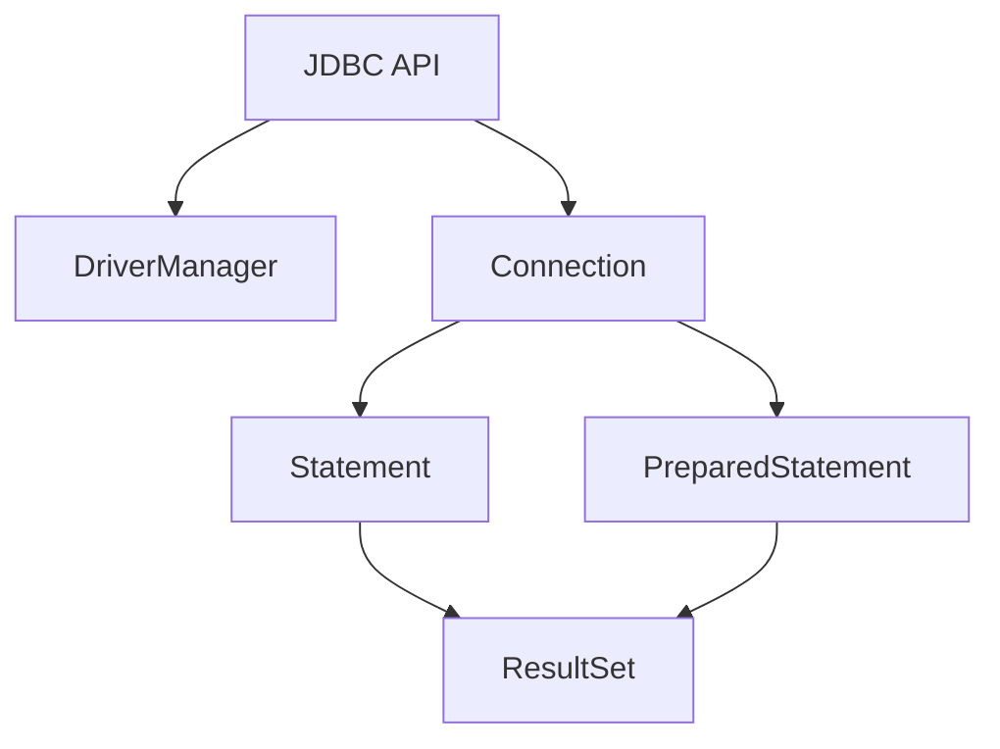

# JDBC

## 概述

Java 数据库连接（Java Database Connectivity，JDBC）是 Java 平台提供的用于访问关系型数据库的标准 API。JDBC 规范定义了客户端程序与数据库交互的方式，包括数据查询、更新、事务控制以及连接管理等功能。通过 JDBC，Java 程序可以实现与各种数据库的无缝互操作，而无需依赖特定数据库厂商的实现。

**核心价值：**

* 提供统一的数据访问接口
* 支持多种关系型数据库
* 支持事务与并发控制
* 可扩展的连接池管理与优化

---

## 本质

JDBC 的本质是**数据库访问抽象层**，将数据库操作与底层数据库实现解耦。它通过接口定义和驱动机制，使得应用程序可以专注于业务逻辑而无需考虑具体数据库的通信细节。

* **抽象接口**：Connection、Statement、ResultSet 等
* **驱动机制**：DriverManager 管理不同数据库驱动
* **事务管理**：支持显式或隐式事务控制
* **资源管理**：通过连接池与工具类优化连接创建和释放

---

## 模型

JDBC 访问模型可抽象为以下几个核心组件：

* **DriverManager**：管理和注册数据库驱动
* **Connection**：表示与数据库的会话
* **Statement / PreparedStatement**：执行 SQL 语句
* **ResultSet**：封装查询结果

---

## 核心能力体系

| 能力模块    | 描述                                   |
| ------- | ------------------------------------ |
| 连接管理    | 获取、释放数据库连接，支持多种驱动与数据库                |
| SQL 执行  | 提供 Statement、PreparedStatement 等执行方式 |
| 数据类型映射  | Java 与 SQL 数据类型相互映射                  |
| 事务控制    | 支持手动提交、回滚及自动提交                       |
| 资源管理    | 通过 JDBCUtils 或连接池（c3p0、Druid）管理资源    |
| 并发与性能优化 | 池化连接、检测空闲连接、避免死锁                     |
| 安全防护    | 使用 PreparedStatement 避免 SQL 注入       |

---

## 架构模型

JDBC 的架构可分为三层：

1. **API 层**：提供标准接口供应用程序使用
2. **驱动层**：实现对特定数据库的访问（Type 1~4 驱动）
3. **数据库层**：关系型数据库实际存储与执行

---

## 类型体系（数据类型映射）

| SQL 类型           | JDBC 方法              | Java 返回类型          |
| ---------------- | -------------------- | ------------------ |
| BIT(1), BIT(n)   | getBoolean()         | boolean            |
| TINYINT          | getByte()            | byte               |
| SMALLINT         | getShort()           | short              |
| INT              | getInt()             | int                |
| BIGINT           | getLong()            | long               |
| CHAR, VARCHAR    | getString()          | String             |
| TEXT(CLOB), BLOB | getClob(), getBlob() | Clob, Blob         |
| DATE             | getDate()            | java.sql.Date      |
| TIME             | getTime()            | java.sql.Time      |
| TIMESTAMP        | getTimestamp()       | java.sql.Timestamp |

---

## 边界与生态

JDBC 面向关系型数据库，其生态包括：

* **主流数据库**：MySQL、PostgreSQL、Oracle、SQL Server
* **连接池框架**：c3p0、Druid
* **工具类**：JDBCUtils 提供便捷的连接、释放、配置管理
* **注意事项**：空闲连接超时、并发写入阻塞、SQL 注入防护

---

## 治理体系

治理体系主要针对资源管理与性能优化：

| 维度       | 实践方法                           |
| -------- | ------------------------------ |
| 连接池管理    | 设置最大活动连接数、空闲检测、释放超时连接          |
| SQL 执行安全 | 使用 PreparedStatement 避免 SQL 注入 |
| 事务管理     | 显式事务提交和回滚，避免自动提交带来的数据不一致       |
| 并发控制     | 调整池大小、避免线程阻塞，必要时监控连接持有状态       |
| 性能监控     | 使用工具如 VisualVM 分析线程和连接阻塞情况     |

---

## 演进趋势

* **JDBC 版本升级**：JDBC 4+ 支持自动驱动加载，无需手动 Class.forName
* **连接池智能化**：动态调整池大小、心跳检测空闲连接
* **响应式数据库访问**：结合 R2DBC 和异步非阻塞模型提升并发性能
* **云数据库适配**：原生支持云端数据库连接和高可用部署

---

## 选型方法论

选型关键维度：

| 维度    | 推荐策略                           |
| ----- | ------------------------------ |
| 数据库类型 | 关系型数据库优先，NoSQL 可通过专门驱动或 ORM 支持 |
| 连接池选择 | 小并发选择 c3p0，企业高并发选择 Druid       |
| 并发量   | 根据线程数和事务复杂度设置池大小               |
| 安全性   | 必须使用 PreparedStatement 或参数化查询  |
| 事务要求  | 高一致性选择显式事务管理，低延迟可使用自动提交        |

---

## 总结

JDBC 是 Java 数据访问的核心标准，其价值在于**统一接口、事务管理、资源治理与扩展性**。高级使用涉及以下关键点：

1. 熟练掌握 Connection、Statement、PreparedStatement、ResultSet 的使用
2. 理解数据类型映射及其影响
3. 精通事务控制与异常处理
4. 使用连接池优化性能并防止死锁或资源泄露
5. 安全性设计（防 SQL 注入）
6. 并发环境下合理配置连接池参数，结合监控工具进行性能调优

通过体系化的理解，JDBC 不仅是一个 API，更是一套数据库访问和管理的能力体系。

## 关联内容（自动生成）

- [/DSL/SQL.md](/DSL/SQL.md) JDBC 是 Java 对 SQL 语言的访问接口，通过 Connection、Statement、PreparedStatement 等对象执行 SQL 语句，实现对关系型数据库的操作
- [/中间件/数据库/数据库.md](/中间件/数据库/数据库.md) JDBC 是应用程序与数据库交互的桥梁，提供了标准的数据库访问接口，是数据库管理系统的重要组成部分
- [/中间件/数据库/数据库系统/事务管理/事务.md](/中间件/数据库/数据库系统/事务管理/事务.md) JDBC 提供了事务管理能力，支持 ACID 特性，通过 Connection 对象的 commit()、rollback() 方法实现事务控制
- [/中间件/数据库/mysql/mysql.md](/中间件/数据库/mysql/mysql.md) MySQL 是 JDBC 常连接的关系型数据库之一，JDBC 通过 MySQL 驱动实现对 MySQL 数据库的访问
- [/软件工程/架构模式/分层架构.md](/软件工程/架构模式/分层架构.md) JDBC 通常用于分层架构中的数据访问层，实现业务逻辑层与数据库之间的解耦
- [/编程语言/JAVA/框架/ORM.md](/编程语言/JAVA/框架/ORM.md) JDBC 是 ORM 框架的基础，ORM 框架如 MyBatis、Hibernate 在 JDBC 基础上提供了更高层次的抽象
- [/中间件/数据库/分库分表中间件.md](/中间件/数据库/分库分表中间件.md) 分库分表中间件通过 JDBC 驱动拦截 SQL 语句，实现对分布式数据库的访问
- [/软件工程/架构/系统设计/分布式/分布式事务.md](/软件工程/架构/系统设计/分布式/分布式事务.md) JDBC 在分布式事务中扮演重要角色，支持 XA 事务协议，实现跨多个数据库的事务一致性
- [/软件工程/软件设计/代码质量/软件测试/单元测试.md](/软件工程/软件设计/代码质量/软件测试/单元测试.md) JDBC 数据访问层需要特别的单元测试策略，通常使用内存数据库如 H2 进行数据访问层的测试
- [/计算机网络/网络安全/Web安全.md](/计算机网络/网络安全/Web安全.md) JDBC 使用 PreparedStatement 可有效防止 SQL 注入攻击，是 Web 安全的重要防护手段
- [/软件工程/架构/系统设计/高并发.md](/软件工程/架构/系统设计/高并发.md) JDBC 连接池是高并发系统中的重要组件，通过连接池管理可有效提升数据库访问性能
- [/软件工程/架构/系统设计/可用性.md](/软件工程/架构/系统设计/可用性.md) JDBC 连接管理对系统可用性至关重要，当数据库不可用时，合理的连接池配置和异常处理可提升系统可用性
- [/中间件/数据库/数据库系统/数据库设计.md](/中间件/数据库/数据库系统/数据库设计.md) JDBC 访问数据库时需要考虑数据库设计规范，如数据类型映射、索引使用等
- [/软件工程/架构/系统设计/流量控制.md](/软件工程/架构/系统设计/流量控制.md) JDBC 连接池大小是流量控制的重要参数，通过控制连接数可对数据库访问流量进行限制
- [/软件工程/微服务/集成.md](/软件工程/微服务/集成.md) 在微服务架构中，JDBC 在服务内部的数据访问层发挥作用，每个服务通过 JDBC 管理自己的数据访问
- [/中间件/数据库/mysql/查询优化.md](/中间件/数据库/mysql/查询优化.md) JDBC 与查询优化密切相关，PreparedStatement 的使用和合理的 SQL 语句设计是查询优化的重要方面
