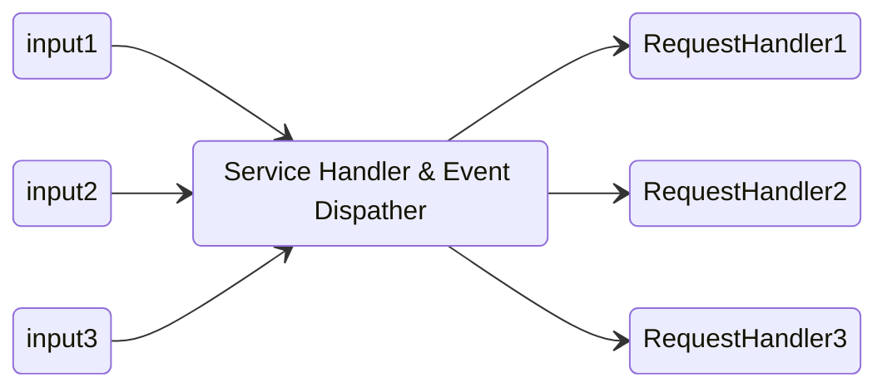
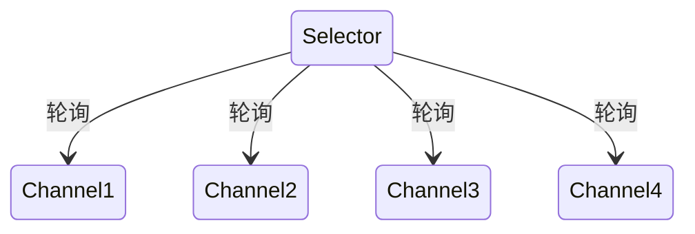

# NIO

## 与BIO的区别

- BIO是面向流的，NIO是面向缓冲区的；
- BIO流是阻塞的，NIO流是不阻塞的;
- NIO有选择器，而IO没有。

## 传统BIO模型的缺点

- 严重依赖于线程 线程是很昂贵的
  - 线程内存资源 上下文切换成本


NIO 的线程模型

```java
 while(channel=Selector.select()){//选择就绪的事件和对应的连接
      if(channel.event==accept){
         registerNewChannelHandler(channel);//如果是新连接，则注册一个新的读写处理器
      }
      if(channel.event==write){
         getChannelHandler(channel).channelWritable(channel);//如果可以写，则执行写事件
      }
      if(channel.event==read){
          getChannelHandler(channel).channelReadable(channel);//如果可以读，则执行读事件
      }
    }
   }
```

## NIO 的 Reactor Proactor

### Reactor



事件驱动思想

- 多线程模型
  - 一个接收线程，多个处理线程

- 步骤1：等待事件到来（Reactor负责）。
- 步骤2：将读就绪事件分发给用户定义的处理器（Reactor负责）。
- 步骤3：读数据（用户处理器负责）。
- 步骤4：处理数据（用户处理器负责）。

### Proactor


- 步骤1：等待事件到来（Proactor负责）。
- 步骤2：得到读就绪事件，执行读数据（现在由Proactor负责）。
- 步骤3：将读完成事件分发给用户处理器（Proactor负责）。
- 步骤4：处理数据（用户处理器负责）。

Proactor 中，直接监听读/写操作是否完成，也就是说读/写操作是否 OS 来完成，并将读写数据放入一个缓冲区提供给程序

## Buffer

- DirectByteBuffer 可以减少内存从内核到用户的拷贝 但是创建消费成本更高 需要池化
- HeapByteBuffer 使用堆内存

## 核心类


- Buffer：数据容器，除了布尔类型，所有原始数据类型都有相应的 Buffer 实现
- Channel：类似 Linux 之类操作系统上的文件描述符
- Selector：可以实现单线程对多 Channel 的高效管理，Linux 上依赖于epoll，Windows 上 NIO2（AIO）模式则是依赖于iocp

### ByteBuffer

属性：

- capacity 缓冲区数组总长度
- position 下一个要操作的数据元素位置
- limit 缓冲区不可操作的下一个元素的位置 limit<=capacity
- mark 类似于书签


对比项    | HeapByteBuffer             | DirectByteBuffer
-|-|-
存储位置 | Java Heap中                 | Native内存中
I/O  | 需要在用户地址空间和操作系统内核地址空间复制数据   | 不需复制
内存管理 | Java GC回收，创建和回收开销少          | 通过调用System.gc要释放掉Java对象引用的DirectByteBuffer内空间， 如果Java对象长时间持有引用可能会导致Native内存泄漏，创建和回收内存开销较大
适用场景 | 并发连接数少于1000, I/O 操作较少时比较合适 | 数据量比较大、生命周期比较长的情况下比较合适

大多数垃圾收集过程中，都不会主动收集 DirectBuffer，其内部使用 Cleaner 和虚引用（PhantomReference）机制，其本身不是 public 类型，内部实现了一个 Deallocator 负责销毁的逻辑

#### [零拷贝](/操作系统/输入输出.md#零拷贝)

- MappedByteBuffer 是 NIO 基于内存映射（mmap）这种零拷贝方式的提供的一种实现
- DirectByteBuffer 在 MappedByteBuffer 的基础上提供了内存映像文件的随机读取 get() 和写入 write() 的操作
- FileChannel.transferXXX 是 sendfile 的实现

### 文件输出例子

```java
FileOutputStream fos = new FileOutputStream("file.txt");
FileChannel channel = fos.getChannel();
ByteBuffer buffer = ByteBuffer.allocate(1024);
buffer.put("20191204".getBytes());
// 翻转缓冲区
buffer.flip();
channel.write(buffer);
fos.close();
```

### 文件输入

```java
File file = new File("file.txt");
FileInputStream fis = new FileInputStream(file);
ByteBuffer buffer = ByteBuffer.allocate((int) file.length());
FileChannel channel = fis.getChannel();
channel.read(buffer);
System.out.println(new String(buffer.array()));
fis.close();
```

### 文件复制

```java
FileInputStream fis = new FileInputStream("file.txt");
FileOutputStream fos = new FileOutputStream("file1.txt");
FileChannel source = fis.getChannel();
FileChannel target = fos.getChannel();
target.transferFrom(source,0,source.size());
source.close();
target.close();
```

## 网络编程

- Selector

它是Java NIO核心组件中的一个，用于检查一个或多个NIO Channel（通道）的状态是否处于可读、可写。如此可以实现单线程管理多个channels,也就是可以管理多个网络链接



- SelectionKey

一个SelectionKey键表示了一个特定的通道对象和一个特定的选择器对象之间的注册关系

- ServerSocketChannel

Java NIO 中的 ServerSocketChannel 是一个可以监听新进来的 TCP 连接的通道, 就像标准 IO 中的 ServerSocket一样

- SocketChannel

Java NIO 中的 SocketChannel 是一个连接到 TCP 网络套接字的通道

### 客户端

```java
// 得到一个网络通道
SocketChannel channel = SocketChannel.open();
// 设置非阻塞方式
channel.configureBlocking(false);
// 提供服务器IP与端口
InetSocketAddress address = new InetSocketAddress("127.0.0.1", 1999);
// 连接
if (!channel.connect(address)) {
    while (!channel.finishConnect()) {
        System.out.println("客户端：正在连接服务器");
    }
}
// 发送数据
ByteBuffer buffer = ByteBuffer.wrap("cxk 打篮球".getBytes());
channel.write(buffer);
```

### 服务端框架

```java
// 获取网络通道
ServerSocketChannel serverSocketChannel = ServerSocketChannel.open();
// 获取选择器
Selector selector = Selector.open();
// 绑定端口
serverSocketChannel.bind(new InetSocketAddress(1999));
// 设置为非阻塞方式(accept时不阻塞)
serverSocketChannel.configureBlocking(false);
// 注册选择器，让选择器监听连接事件
serverSocketChannel.register(selector, SelectionKey.OP_ACCEPT);
while (true) {
    // 每2000ms轮询一次，select返回的结果是客户数
    if (selector.select(2000) == 0){
        System.out.println("等待客户连接");
        continue;
    }
    // 获取准备连接的所有客户
    Iterator<SelectionKey> iterator = selector.selectedKeys().iterator();
    while (iterator.hasNext()){
        SelectionKey key = iterator.next();
        if (key.isAcceptable()){
            // 客户端连接事件
            System.out.println("客户端连接");
            SocketChannel socketChannel = serverSocketChannel.accept();
            socketChannel.configureBlocking(false); // 读取客户端数据时不会阻塞
            socketChannel.register(selector,SelectionKey.OP_READ, ByteBuffer.allocate(1024));
        }
        if (key.isReadable()){
            // 读取客户端数据事件
            SocketChannel channel = (SocketChannel) key.channel();
            ByteBuffer buffer = (ByteBuffer) key.attachment();
            channel.read(buffer);
            System.out.println("客户端发来数据:"+new String(buffer.array()));
        }
        // 删除客户key，防止重复处理
        iterator.remove();
    }
}
```

## [系统层面的NIO](/操作系统/输入输出.md#IO模型)
