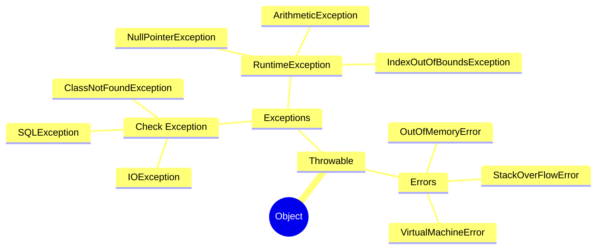

# 异常

## 异常体系



- Error（错误）:是程序无法处理的错误，表示运行应用程序中较严重问题
- Exception（异常）:是程序本身可以处理的异常

**分类**

- 编译时期异常:checked异常。在编译时期,就会检查,如果没有处理异常,则编译失败。(如日期格式化异常) 
    - 无能为力,引起注意类型的异常 此类异常需要完整保存异常现场 供事后排查
    - 可以处理的异常 如未授权异常
- 运行时期异常:runtime异常。在运行时期,检查异常.在编译时期,运行异常不会编译器检测(不报错)。(如数学异常)
    - 可预测异常 应在编码时注意边界条件 空指针判断等来避免
    - 需要捕获的异常 如超时异常 可以进行降级或者重试
    - 可忽略异常 对于某些异常 框架或者系统会自行处理 这类异常可以不用管


## 使用

```java
try{
    // do something
}catch (Throwable t){
    t.printStackTrace();
    throw new RuntimeException(t);
}finally {
    // resource recycle
    /*以下情况finally不会执行
        前面的代码中用了 System.exit(int)已退出程序
        try代码块出现了死循环或者死锁
        CPU关闭
    */
}
```

## 注意事项

- 多个异常一次捕获多次处理
- 运行时异常被抛出可以不处理。即不捕获也不声明抛出。 
- 如果finally有return语句,永远返回finally中的结果,避免该情况、
- 如果父类抛出了多个异常,子类重写父类方法时,抛出和父类相同的异常或者是父类异常的子类或者不抛出异 常。 
- 父类方法没有抛出异常，子类重写父类该方法时也不可抛出异常。此时子类产生该异常，只能捕获处理，不 能声明抛出 

### 异常的性能开销

1. try-catch 往往会影响 JVM 对代码进行优化
2. 每实例化一个 Exception，都会对当时的栈进行快照，这是一个相对比较重的操作，该操作会逐一访问当前线程的 Java 栈帧，并且记录下各种调试信息，包括栈帧所指向方法的名字，方法所在的类名、文件名，以及在代码中的第几行触发该异常

## 关于系统设计中的异常

远程服务调用应该使用result对象来封装错误码与描述 主要是因为：

1. 防止调用方没有捕获
2. 异常对调用方的帮助不会很大

基于防御式编程, 服务提供方可以返回null, 调用方要进行事先判断 防止NPE

如果由于 “吞掉” 了接口的异常，有些业务异常中包含的错误原因，无法传给上层再封装给前端，可能会造成出错后用户懵逼，实际开发中，一般都不会吞掉异常，遇到 “吞掉” 异常的场景要慎重思考是否合理

通常开发中自定义的业务异常（BusinessException）属于非受检异常，如果定义的受检异常，则一旦异常发生变更，则依赖该层的所有上层全都要发生变更

## 异常处理

- 异常处理是大部分复杂性的来源

使用异常来避免处理困难：与其想出一种干净的方法来处理它，不如抛出一个异常并将问题平移给调用者

1. 消除异常处理复杂性的最好方法：设计良好的对外接口，不抛出异常，将异常屏蔽在模块之内，会使类更深。但这种方式仅在模块外部不需要异常信息时才有意义

2. 统一异常处理：在一个统一的位置处理异常，使用统一的方式，但对特定异常一无所知，这对于异常恢复成本较高的操作很有用

3. 快速崩溃：在大多数应用程序中，有些异常是不值得恢复的，恢复机制将给程序增加相当大的复杂性

特殊情况会使代码更加复杂，为避免特殊情况，设计一种普通情况，这种方式可以自动处理特殊情况而无需任何额外的代码
