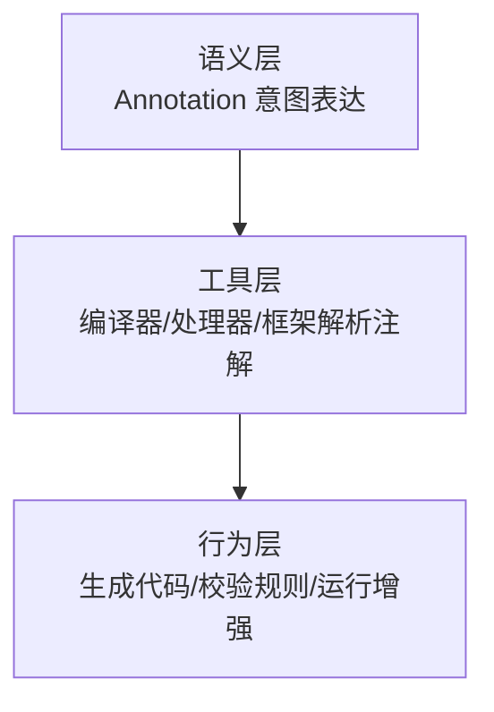
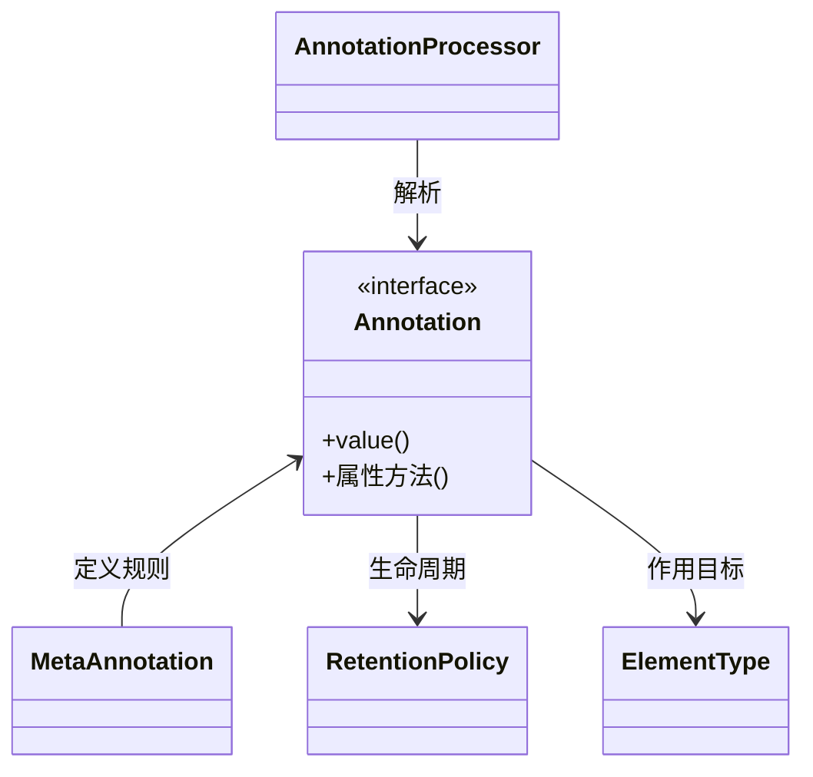
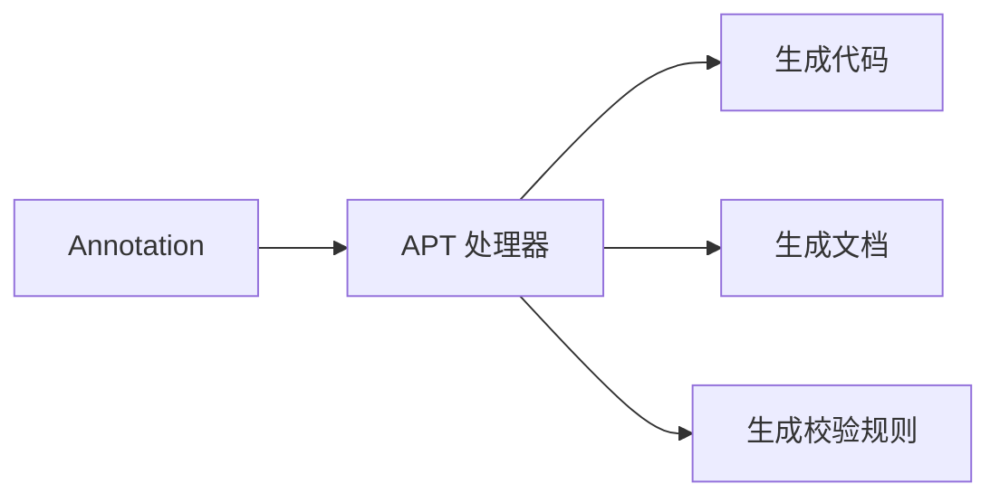
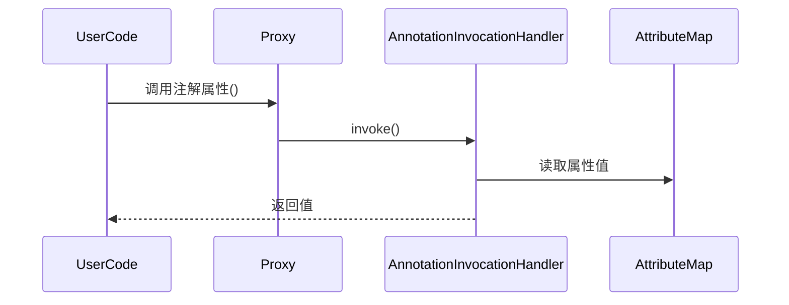
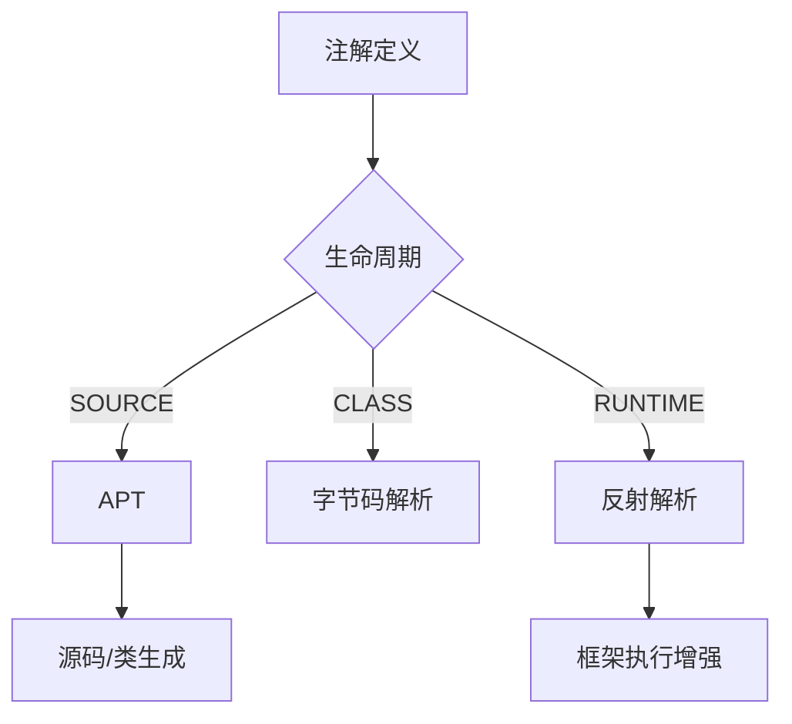

# Java 注解

---

## 概述（Overview）

Java 注解（Annotation）是一种向程序结构附着**结构化元信息（Metadata）**的机制，使编译器、运行时系统以及外部工具能够在不改变代码语义的情况下**实现行为增强、约束校验、代码生成与运行时协作**。

本质上，注解是一种 **语言级的声明式编程模型**，通过“元信息”驱动工具链和运行时代码，使系统具备更高的自动化、解耦性与可扩展性。

---

## 本质（Essence）

### 注解的本质定义

注解是一种 **类型安全、可扩展、可分层解释的元数据机制**，其核心作用包括：

* **描述性元数据**：不直接参与业务语义，只传递结构信息或意图。
* **驱动式编程模型**：通过编译器、框架或运行时解析，触发动作。
* **约束与契约机制**：在编译期或运行期建立一致性和规范。
* **声明式能力抽象**：从命令式逻辑上升到声明式规则。

### 注解的三层本质模型



注解**本身不产生行为**，行为来自解释它的“注解处理器”。

---

## 核心概念（Core Concepts）

### 注解结构模型



注解系统由四类核心构件组成：

| 构件                     | 作用          |
| ---------------------- | ----------- |
| 注解类型（Annotation）       | 元信息的定义      |
| 元注解（Meta-Annotation）   | 描述注解自身的语义规则 |
| 处理机制（Processor/反射/编译器） | 注解解释与执行载体   |
| 生命周期模型（Retention）      | 决定注解信息保存的阶段 |

---

## 分类体系（Taxonomy）

### 按生命周期分类（最核心分类）

| RetentionPolicy | 解释载体               | 典型用途                 |
| --------------- | ------------------ | -------------------- |
| **SOURCE**      | 仅源码可见              | Lombok、错误检查、代码生成     |
| **CLASS**       | class 文件存在，JVM 不加载 | 字节码增强工具              |
| **RUNTIME**     | JVM 加载，可反射获取       | Spring、Junit、Servlet |

### 按语义功能分类

| 类别       | 说明           | 示例                              |
| -------- | ------------ | ------------------------------- |
| **约束型**  | 编译期验证意图      | @Override, @FunctionalInterface |
| **文档型**  | 生成文档、注释      | @Documented                     |
| **结构型**  | 描述结构信息供框架使用  | @Controller, @Entity            |
| **配置型**  | 声明运行时配置      | @Bean, @Value                   |
| **行为型**  | 驱动切面或逻辑增强    | @Transactional, @Cacheable      |
| **元编程型** | 用于代码生成与编译期计算 | Lombok 注解、APT 注解                |

---

## 能力体系（Capability System）

Java 注解提供三大核心能力：

### 能力一：结构化元信息表达

* 以类型安全、编译期可检查的方式表达元信息
* 结构化（非字符串）
* 随代码演进而更新，不会脱离实际

### 能力二：编译期增强能力

由注解处理器（APT）实现：



典型能力：

* 文档生成（如 Javadoc）
* class 生成（如 Dagger2）
* 源码生成（如 Lombok）
* 结构检查（如 @Override）

### 能力三：运行时代码增强（框架最常用）

由反射 + 动态代理 + 字节码增强驱动：

```mermaid
flowchart TD
A[Annotation@Runtime] --> B[反射扫描]
B --> C[Bean 组装]
B --> D[AOP 拦截]
B --> E[配置注入]
```

---

## 注解模型（Model）

### 注解运行时模型本质

注解在运行时的行为是由 JDK 动态代理解释：

* 注解类型本质是 **继承 Annotation 接口的接口**
* JVM 读取注解属性 → 映射成一个值 Map
* 实际对象是 `Proxy` 生成的代理对象
* 调用由 `AnnotationInvocationHandler` 分发

抽象模型如下：



---

## 元注解体系（Meta-Annotation System）

元注解用于“定义注解的规则”，是 Java 注解体系的语法基础。

| 元注解             | 作用                           |
| --------------- | ---------------------------- |
| **@Target**     | 指定可修饰的程序结构位置                 |
| **@Retention**  | 指定生命周期（SOURCE/CLASS/RUNTIME） |
| **@Documented** | 是否加入文档生成                     |
| **@Inherited**  | 是否被子类继承                      |
| **@Repeatable** | 是否支持重复注解（JDK8+）              |

---

## 边界与生态（Boundary & Ecosystem）

### 注解的边界

注解只能提供元信息，不能直接执行代码。
行为必须由“解释器”实现：

* 编译器（javac）
* APT 注解处理器
* 运行时反射
* 框架内部扫描器（Spring、Junit）
* 字节码增强工具（ASM、Javassist）

### 注解生态系统主要使用者

| 生态组件            | 使用目的               |
| --------------- | ------------------ |
| **Spring**      | 组件扫描、依赖注入、AOP、配置声明 |
| **Spring Boot** | 自动装配、配置绑定          |
| **Servlet 3.0** | 基于注解的 Web 配置替代 XML |
| **Junit**       | 测试框架流程驱动           |
| **Lombok**      | 语法增强、自动生成代码        |

---

## 应用场景（Applications）

### 编译期场景

* API 变更警告（@Deprecated）
* 泛型安全校验（@SafeVarargs）
* 函数式接口约束（@FunctionalInterface）
* 文档生成（@Documented）

### 运行期场景

* Spring IOC/DI（@Component, @Autowired, @Value）
* Spring MVC（@Controller, @RequestMapping）
* AOP 事务（@Transactional）
* JPA ORM 映射（@Entity, @Table）
* Junit 框架（@Test, @BeforeEach）

---

## 注解解析机制（Annotation Processing Mechanisms）

### 三种处理路径

| 生命周期        | 解析方式        | 工具                        |
| ----------- | ----------- | ------------------------- |
| **SOURCE**  | 编译期处理器（APT） | Lombok, MapStruct, Dagger |
| **CLASS**   | 字节码解析       | ASM, Javassist            |
| **RUNTIME** | 反射 & 动态代理   | Spring, Junit             |

### 抽象流程



---

## 治理体系（Governance System）

注解作为元信息机制，需要治理以控制复杂度和一致性。

### 治理维度

| 维度      | 内容                         |
| ------- | -------------------------- |
| 语义一致性治理 | 注解命名、含义不可模糊                |
| 生命周期治理  | 规范 SOURCE/CLASS/RUNTIME 使用 |
| 依赖治理    | 保证框架对注解的使用可控               |
| 性能治理    | 大规模注解扫描需要限制包路径             |
| 安全治理    | 避免运行时反射暴露敏感结构              |

### 最佳实践

* 应优先使用 **SOURCE** 注解减少运行时负担
* 避免滥用注解作为“万能配置容器”
* 避免在注解中存放复杂逻辑或可变数据
* 自定义注解必须提供清晰语义说明

---

## 演进趋势（Evolution）

| 阶段             | 特点                                         |
| -------------- | ------------------------------------------ |
| 初代（JDK5）       | 引入注解机制，用于文档/编译检查                           |
| 二代（JDK6）       | APT 注解处理器标准化                               |
| 三代（现代框架）       | Spring、JPA 等大量使用运行时注解驱动系统                  |
| 四代（声明式编程与代码生成） | Lombok、MapStruct、Micronaut 提倡编译期增强，减少运行期反射 |

未来趋势：
**由运行时增强 → 编译期增强**，以降低反射与动态代理带来的性能损耗。

---

## 选型方法论（Selection Framework）

### 生命周期选择

| 使用目的                  | 推荐      | 原因      |
| --------------------- | ------- | ------- |
| 重写检查、文档、代码生成          | SOURCE  | 不污染运行期  |
| 字节码增强或中间工具链           | CLASS   | 避免运行期开销 |
| 运行时行为增强（Spring/Junit） | RUNTIME | 必须运行时可见 |

### 语义选择

| 场景     | 注解是否合适 | 替代方案         |
| ------ | ------ | ------------ |
| 配置型信息  | 是      | 配置文件         |
| 动态逻辑   | 否      | 策略模式、工厂模式    |
| 框架扩展点  | 是      | SPI、注解       |
| 复杂状态信息 | 否      | Java 对象/JSON |

---

## 总结（Conclusion）

Java 注解是**声明式编程的核心基础设施**，其价值不在于语法，而在于它赋予系统：

* 明确语义表达的能力
* 工具链协作与代码生成能力
* 编译期保障与运行时增强能力
* 模型驱动开发（MDD）的基础能力

掌握注解，不是掌握语法，而是理解：

**元信息如何驱动系统行为，以及工具链如何利用注解实现自动化、解耦和体系化构建。**

## 关联内容（自动生成）

- [/编程语言/JAVA/高级/反射.md](/编程语言/JAVA/高级/反射.md) Java 注解与反射密切相关，注解在运行时通过反射机制进行解析和处理，实现动态获取注解信息和元数据驱动的程序行为
- [/编程语言/JAVA/框架/Spring/Spring.md](/编程语言/JAVA/框架/Spring/Spring.md) Spring框架大量使用注解实现依赖注入、AOP和事务管理，是Java注解在企业级开发中的重要应用案例
- [/编程语言/JAVA/高级/Lambda表达式.md](/编程语言/JAVA/高级/Lambda表达式.md) @FunctionalInterface 注解定义函数式接口，与Lambda表达式密切相关，体现了注解约束编译期验证的功能
- [/编程语言/JAVA/JVM/字节码.md](/编程语言/JAVA/JVM/字节码.md) 注解在字节码层面以特定属性存在，RuntimeVisibleAnnotations等属性支持运行时反射获取注解信息
- [/编程语言/JAVA/框架/Spring/SpringMVC.md](/编程语言/JAVA/框架/Spring/SpringMVC.md) SpringMVC中的@Controller、@RequestMapping等注解展示了注解在Web框架中的结构型应用场景
- [/编程语言/JAVA/框架/ORM.md](/编程语言/JAVA/框架/ORM.md) ORM框架通过@Entity、@Table等注解实现对象-关系映射，是注解在数据持久化领域的应用
- [/编程语言/JAVA/JAVA并发编程/Disruptor.md](/编程语言/JAVA/JAVA并发编程/Disruptor.md) @Contended注解用于解决缓存行伪共享问题，展示了注解在性能优化方面的应用
- [/软件工程/架构/系统设计/日志.md](/软件工程/架构/系统设计/日志.md) 通过AOP和注解实现日志记录是注解在切面编程中的典型应用
- /编程语言/JAVA/框架/Dubbo.md Dubbo框架使用@Service等注解进行服务暴露和引用，是分布式系统中注解的重要应用
- [/软件工程/架构/系统设计/流量控制.md](/软件工程/架构/系统设计/流量控制.md) Sentinel等流量控制组件通过注解方式提供资源定义和控制功能
- [/软件工程/设计模式/结构型模式.md](/软件工程/设计模式/结构型模式.md) 适配器模式（Adapter）与注解处理器结合使用，有助于理解注解处理的架构模式
- [/编程语言/JAVA/JVM/类加载机制.md](/编程语言/JAVA/JVM/类加载机制.md) 注解的处理与类加载时机密切相关，特别是RUNTIME级别的注解在类加载后仍可访问
- [/编程语言/JAVA/框架/SpringBoot.md](/编程语言/JAVA/框架/SpringBoot.md) SpringBoot的自动配置大量使用条件注解，是注解在自动化配置方面的高级应用
- [/数据技术/数据处理.md](/数据技术/数据处理.md) 大数据处理框架如Spark也提供注解支持，用于优化执行计划
- [/运维/K8s.md](/运维/K8s.md) Kubernetes资源定义中也使用注解来存储元数据，与Java注解在概念上有相似之处
- [/计算机网络/rpc.md](/计算机网络/rpc.md) RPC框架中注解用于服务注册发现，体现了注解在分布式系统中的应用
- [/编程语言/编程范式/编程范式.md](/编程语言/编程范式/编程范式.md) 注解是声明式编程的重要工具，通过注解可以实现行为与业务逻辑的分离
- [/软件工程/微服务/服务治理/服务容错.md](/软件工程/微服务/服务治理/服务容错.md) 服务容错机制如Hystrix使用@HystrixCommand注解实现资源隔离和熔断
