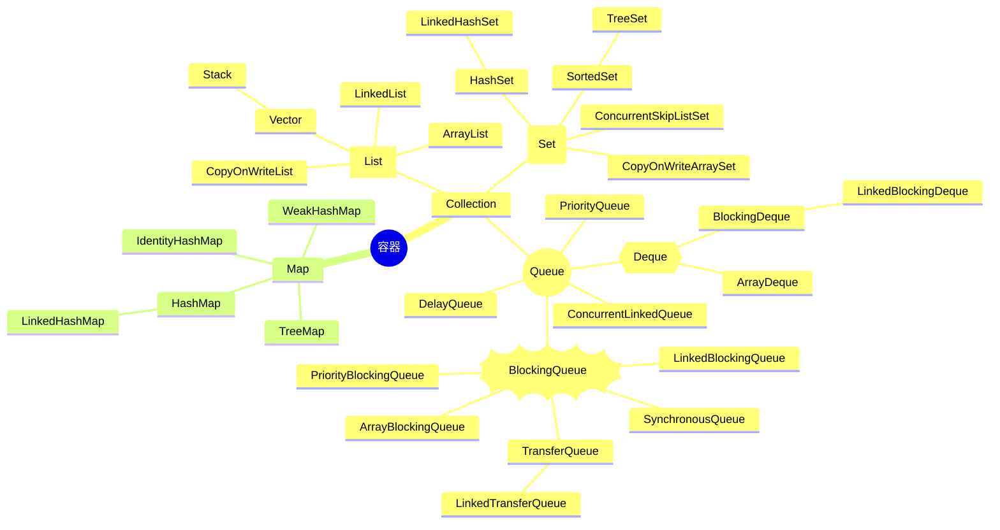
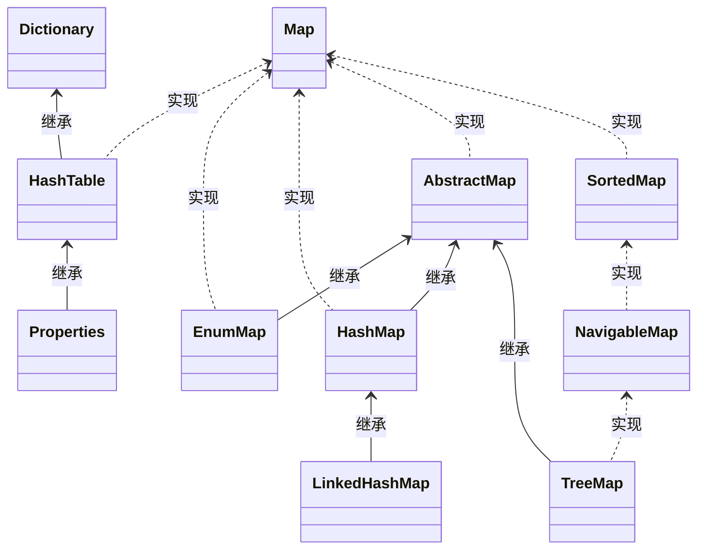

# 集合

> 集合是java中提供的一种容器，可以用来存储多个数据

## 类层次结构



- List 存储一组不唯一（可以有多个元素引用相同的对象），有序的对象
- Set 不允许重复的集合。不会有多个元素引用相同的对象
- Queue 被设计用来可以以某种优先级处理元素的集合
- Map 使用键值对存储。Map会维护与Key有关联的值

可以学习人家的接口是怎么划分的，这个类虽然接口众多，但是职责却很清晰

以及人家是如何复用已有的代码来实现新功能

## Iterator迭代器

```java
Iterator<String> it = coll.iterator();
while(it.hasNext()){ //判断是否有迭代元素
    String s = it.next();//获取迭代出的元素
    System.out.println(s);
}
```

## List

List 集合的遍历结果是稳定的

- ArrayList
    - 非线程安全
    - 内部使用数组
    - 快速随机访问 插入删除慢
- LinkedList
    - 本质双向链表
    - 插入删除快 随机访问慢
    - 内存利用率较高

### 常用方法

- public void add(int index, E element) : 将指定的元素，添加到该集合中的指定位置上。 -
- public E get(int index) :返回集合中指定位置的元素。
- public E remove(int index) : 移除列表中指定位置的元素, 返回的是被移除的元素。
- public E set(int index, E element) :用指定元素替换集合中指定位置的元素,返回值的更新前的元素

## Queue

- FIFO
- 阻塞队列阻塞的特性与FIFO结合 适合做Buffer

## Map集合

- Collection 接口定义了单列集合规范，每次存储一个元素
- Map 接口定义了双列集合的规范，每次存储一对元素

### 常用子类

Map集合类            | Key          | Value        | Super       | JDK | 说明
----------------- | ------------ | ------------ | ----------- | --- | ------------------
Hashtable         | **不允许为null** | **不允许为null** | Dictionary  | 1.0 | 线程安全（过时）
ConcurrentHashMap | **不允许为null** | **不允许为null** | AbstractMap | 1.5 | 锁分段技术或CAS(JDK8及以上)
TreeMap           | **不允许为null** | 允许为null      | AbstractMap | 1.2 | 线程不安全(有序)
HashMap           | 允许为null      | 允许为null      | AbstractMap | 1.2 | 线程不安全( resize死链问题)

在任何Map中 都要避免KV设置为null

- HashMap

并发场景下 数据丢失 

死链问题：并发情况下链表修改导致的不一致问题

- ConcurrentHashMap

JDK11后取消了分段锁机制 引入了红黑树结构 put remove size等操作都是用了CAS

- LinkedHashMap 
- TreeMap key有序 基于红黑树实现

并非一定要覆写hashCode与equals 其内部元素时通过Comparable与Comparator来实现key去重排序的

### 常用方法

- public V put(K key, V value) :  把指定的键与指定的值添加到Map集合中。 
- public V remove(Object key) : 把指定的键 所对应的键值对元素 在Map集合中删除，返回被删除元素的 值。 
- public V get(Object key) 根据指定的键，在Map集合中获取对应的值。 
- public Set<K> keySet() : 获取Map集合中所有的键，存储到Set集合中。 
- public Set<Map.Entry<K,V>> entrySet() : 获取到Map集合中所有的键值对对象的集合(Set集合)。

## Set集合

- 不允许出现重复

### HashSet

> 底层使用hashmap


存储自定义类型元素时，需要重写对象中的hashCode和equals方法

### TreeSet

底层使用TreeMap 保证Key有序

### LinkedHashSet 

> 有序的哈希集合

## Collections 工具类

- public static <T> boolean addAll(Collection<T> c, T... elements) :往集合中添加一些元素。 
- public static void shuffle(List<?> list) 打乱顺序 :打乱集合顺序。 
- public static <T> void sort(List<T> list) :将集合中元素按照默认规则排序。 
- public static <T> void sort(List<T> list，Comparator<? super T> ) :将集合中元素按照指定规则排序

## 集合初始化

- ArrayList的初始值为10 每次扩容以1.5倍的速度进行扩容
- HashMap的初始值为16 每次扩容以2的幂进行扩容

这样如果存放在集合的元素比较多 就会造成不断扩容 影响性能

所以集合初始化时应该指定好默认值

## 数组与集合

```java
new int[-1]; // 运行时异常：NegativeArraySizeException：-1
```

数组遍历优先使用foreach方式

### 数组转集合

注意转集合的过程中是否使用了视图的方式：

Arrays.asList(...)这个方法返回了一个不可变的ArrayList（Arrays的内部类）,不能进行修改操作 否则会抛出异常

### 集合转数组

```java
Object[] objects = list.toArray();// 泛型丢失

String[] arr1 = new String[2];
list.toArray(arr1); // arr1为[null,null]

String[] arr2 = new String[3];
list.toArray(arr2); // arr2为[1,2,3]
```

当toArray传入的数组容量比size小时 该方法就会弃用这个数组 而是自己创建一个数组返回

当数组容量等于size时 运行时最快的,空间效率也是最高的

## 集合与泛型

```java
//第一段:泛型出现之前的集合定义方式
List al = new ArrayList();
al.add (new Object());
al.add (new Integer(111));
al.add(new String("hello alal"));

//第二段:把a1引用赋值给a2，注意a2与al的区别是增加了泛型限制<object>
List<Object> a2 = al;
a2.add (new Object());
a2.add (new Integer(222));
a2.add(new String("hello a2a2")）;

//第三段:把a1引用赋值给a3，注意a3与al的区别是增加了泛型<Integer>
List<Integer> a3 = al;
a3.add(new Integer (333)）;
下方两行编译出错，不允许增加非Integer类型进入集合
a3.add(new object());
a3.add(new String("hello a3a3"));

//第四段:把a1引用赋值给a4，al与a4的区别是增加了通配符
List<?>a4 = al;
//允许副除和清除元素
al.remove(O);
a4.clear();
// 编译出错。不允许增加任何元素
a4.add (new Object());
```

`<? extends T>` put功能受限 ?只能是T及T的子类型

`<? super T>` get 功能受限 ?只能是T及T的父类型

## 元素的比较

Comparable和Comparator两个接口的区别：
- Comparable：自己与别人比较
- Comparator：第三方比较两个对象

### hashCode 与 equals

通过哈希将数据分散开来

- equals相等 则hashCode必须相等
- 覆写equals 必须覆写hashCode

```java
// HashMap 判断两个key是否相等
if (e.hash == hash &&
    ((k = e.key) == key || (key != null && key.equals(k))))
```

## 快速失败机制

当前线程维护一个expectedModCount 遍历之前这个值等于modCount

如果在遍历的过程中发现 expectedModCount != modCount 就代表集合被别的线程修改了 这时候会跑出一个ConcurrentModificationException

这个时候得使用迭代器来实现在遍历中修改集合的功能

并发集合都是使用快速失败机制实现的 集合修改与遍历没有任何关系 但这种机制会导致读取不到最新的数据 也是CAP理论中 A与P的矛盾

## 注意事项

### 线程安全

Collections 帮我们实现了 List、Set、Map 对应的线程安全的方法

synchronized打头的方法可以将指定的集合包装成线程安全的集合

### 集合性能

- 批量新增

在 List 和 Map 大量数据新增的时候，我们不要使用 for 循环 + add/put 方法新增，这样子会有很大的扩容成本，我们应该尽量使用 addAll 和 putAll 方法进行新增

- 批量删除

ArrayList的remove方法，删除之后都会对被删除位置的元素进行移动，如果进行循环remove，会造成性能问题，可以采用removeAll方法，这个批量删除接口只会对数组的元素移动一次

### 集合的坑

- Arrays.asList(array),当array被修改时，会造成list也被修改
- toArray 方法如果声明的数组小于list长度，会得到一个空数组

## JAVA7到JAVA8集合的升级

- 所有集合都新增了forEach 方法
- JAVA7中ArrayList无参初始化是直接初始化10，JAVA8无参初始化则是一个空数组
- JAVA7中的HashMap无参初始化的大小是16，JAVA8无参初始化则是一个空数组，并且引入了红黑树，并且增加了xxIfAbsent等方法
- Arrays 提供了很多 parallel 开头的方法，这些方法支持并行计算

## Guava

### 工厂模式初始化

```java
HashMap<Object, Object> map = Maps.newHashMap();
```

### Lists

```java
ArrayList<String> list = Lists.newArrayList();
ArrayList<Object> objects = Lists.newArrayListWithCapacity(10);
// 不知道精确值，给出一个模糊值
ArrayList<Object> objects1 = Lists.newArrayListWithExpectedSize(20);
// 反转一个list，并非物理反转，而是通过对传入index的处理实现的
var list = Lists.reverse(list)
// list拆分
var list = Lists.partition(list,3)
```

### Maps

## List

### ArrayList

ArrayList的subList方法会返回一个list视图，对这个SubList的修改都会映射到原来的list

而Arrays.asList返回的arrays包下的ArrayList，这个类并没有重写add,remove等方法，所以修改时会抛出异常

#### 结构


- DEFAULT_CAPACITY 表示数组的初始大小，默认是 10
- size 表示当前数组的大小
- modCount 统计当前数组被修改的版本次数，数组结构有变动，就会 +1

#### 解析

- 初始化

一共有三种方式可以初始化ArrayList

```java
public ArrayList(Collection<? extends E> c) {
    elementData = c.toArray();
    if ((size = elementData.length) != 0) {
        // 直接将传入的集合转成数组复制给内部数组
        if (elementData.getClass() != Object[].class)
            elementData = Arrays.copyOf(elementData, size, Object[].class);
    } else {
        this.elementData = {};
    }
}

public ArrayList() {
    this.elementData = {};
}

public ArrayList(int initialCapacity) {
    if (initialCapacity > 0) {
        this.elementData = new Object[initialCapacity];
    } else if (initialCapacity == 0) {
        this.elementData = {};
    } else {
        throw new IllegalArgumentException("Illegal Capacity: "+
                                           initialCapacity);
    }
}
```

- 新增与扩容

添加元素时：

- 判断是否需要扩展，如果需要则只需扩容
- 添加

```java
// 这个版本是基于JDK13的
private void add(E e, Object[] elementData, int s) {
    // 当发现现在list的size跟数组容量一样大时，则进行扩容
    if (s == elementData.length)
        // 这里扩容完，会产生一个新数组，我们要将新数组保存
        elementData = grow(size+1);
    //添加index:size
    elementData[s] = e;
    size = s + 1;
}
// 扩容核心代码
private Object[] grow(int minCapacity) {
    int oldCapacity = elementData.length;
    // 只有数组不为空时，才进行扩容，否则直接创建
    if (oldCapacity > 0 || elementData != DEFAULTCAPACITY_EMPTY_ELEMENTDATA) {
        // 计算数组的新容量
        int newCapacity = ArraysSupport.newLength(oldCapacity,
                minCapacity - oldCapacity, /* minimum growth */
                oldCapacity >> 1           /* preferred growth */);
        // 复制老数组到新数组
        return elementData = Arrays.copyOf(elementData, newCapacity);
    } else {
        return elementData = new Object[Math.max(DEFAULT_CAPACITY, minCapacity)];
    }
}
// 计算容量的方法
public static int newLength(int oldLength, int minGrowth, int prefGrowth) {
    // 判断list的size与elementData的差值如果大于elementData长度的一半
    // 新数组长度就等于老数组长度加上list的size与elementData的差值
    // 否则新数组的长度就等于老数组的1.5倍
    int newLength = Math.max(minGrowth, prefGrowth) + oldLength;
    if (newLength - MAX_ARRAY_LENGTH <= 0) { // 数组长度不能大于整数最大值
        return newLength;
    }
    return hugeLength(oldLength, minGrowth);
}
```

所以扩容的本质就是申请一个更大的数组，将旧数组的内容移过去

**源码扩容过程值得借鉴的地方**

- 通过自动扩容的方式，让使用者不用关心底层数据结构的变化，封装得很好
- 1.5 倍的扩容速度，可以让扩容速度在前期缓慢上升，在后期增速较快
- 扩容过程中，注意数组大小溢出的情况


- 删除

无论是根据Object删除还是index删除，都必须给出被删除元素的index

```java
private void fastRemove(Object[] es, int i) {
    modCount++;
    final int newSize;
    if ((newSize = size - 1) > i)
        // 将elementData 下标为i后面的全部元素往前移动一个位
        System.arraycopy(es, i + 1, es, i, newSize - i);
    // 如果删除的是最后一个元素，置为null就行
    es[size = newSize] = null; // 同时记得size-1
}
```


#### 迭代器

- hasNext

```java
public boolean hasNext() {
    return cursor != size;
}
```

- next

```java
public E next() {
    // 有点乐观锁的意思，通过版本号来确定持有的数据是否被修改了
    if (modCount != expectedModCount)
        throw new ConcurrentModificationException();
    // 否则每次根据游标获取元素，获取完游标+1
    int i = cursor;
    if (i >= size)
        throw new NoSuchElementException();
    Object[] elementData = ArrayList.this.elementData;
    if (i >= elementData.length)
        throw new ConcurrentModificationException();
    cursor = i + 1;
    return (E) elementData[lastRet = i];
}
```

- remove

```java
public void remove() {
    if (lastRet < 0)
        throw new IllegalStateException();
   if (modCount != expectedModCount)
        throw new ConcurrentModificationException();
    // 将当前游标作为下标，删除这个位置的元素
    try {
        ArrayList.this.remove(lastRet);
        // 删除完之后要更新版本号
        cursor = lastRet;
        lastRet = -1;
        expectedModCount = modCount;
    } catch (IndexOutOfBoundsException ex) {
        throw new ConcurrentModificationException();
    }
}
```

#### 线程安全

ArrayList 有线程安全问题的本质，是因为 ArrayList 自身的 elementData、size、modConut 在进行各种操作时，都没有加锁

---

问：对 ArrayList 的理解？

答：底层数据结构、对数组的封装、add、remove

问：为什么说扩容会消耗性能

答：扩容底层使用的是 System.arraycopy 方法，会把原数组的数据全部拷贝到新数组上，所以性能消耗比较严重


### LinkedList

#### 架构

LinkedList 底层数据结构是一个双向链表


#### 解析

- node的结构

```java
private static class Node<E> {
    E item;
    Node<E> next;
    Node<E> prev;
    
    Node(Node<E> prev, E element, Node<E> next) {
        this.item = element;
        this.next = next;
        this.prev = prev;
    }
}
```

- 尾部追加节点

```java
void linkLast(E e) {
    final Node<E> l = this.last;
    final Node<E> newNode = new Node<>(l, e, null);
    this.last = newNode;
    // 如果尾节点为空，则代表当前链表是空的，直接把插入节点作为头节点
    if (l == null)
        first = newNode;
    else
        l.next = newNode; // 否则就将插入节点设置为尾节点，并且把旧尾节点的next指向插入节点
    size++;
    modCount++;
}
```

- 头部追加节点

```java
private void linkFirst(E e) {
    final Node<E> f = this.first;
    final Node<E> newNode = new Node<>(null, e, f);
    this.first = newNode;
    // 如果头节点为空，则代表当前链表是空的，直接把插入节点作为尾节点
    if (f == null)
        last = newNode;
    else
        f.prev = newNode; // 否则就将插入节点设置为头节点，并且把旧头节点的prev指向插入节点
    size++;
    modCount++;
}
```

- 删除节点

```java
E unlink(Node<E> x) {
    // assert x != null;
    final E element = x.item;
    final Node<E> next = x.next;
    final Node<E> prev = x.prev;
    // 当前删除的是头节点，所以将删除节点的next变为头节点
    if (prev == null) {
        first = next;
    } else {
        // 否则设置删除节点的上一个节点的next指向删除节点的next
        prev.next = next;
        x.prev = null;
    }
    // 当前删除的是尾节点，所以将删除节点的prev变为尾节点
    if (next == null) {
        last = prev;
    } else {
        // 否则设置删除节点的下一个节点的prev指向删除节点的prev
        next.prev = prev;
        x.next = null;
    }
    
    x.item = null;
    size--;
    modCount++;
    return element;
}
```

- 根据下标查询节点

```java
Node<E> node(int index) {
    // assert isElementIndex(index);
    if (index < (size >> 1)) { // 在前半部分，所以从头节点迭代查找
        Node<E> x = first;
        for (int i = 0; i < index; i++)
            x = x.next;
        return x;
    } else { // 在后半部分，所以尾头节点迭代查找
        Node<E> x = last;
        for (int i = size - 1; i > index; i--)
            x = x.prev;
        return x;
    }
}
```

#### 迭代器

```java
// 双向迭代器
private class ListItr implements ListIterator<E> {
    private Node<E> lastReturned;//上一次执行 next() 或者 previos() 方法时的节点位置
    private Node<E> next;//下一个节点
    private int nextIndex;//下一个节点的位置
    …………
}
```

- 从头到尾迭代

```java
public boolean hasNext() {
    return nextIndex < size;
}
    
public E next() {
    checkForComodification();
    if (!hasNext())
        throw new NoSuchElementException();

    lastReturned = next;
    next = next.next; // next指向当前遍历元素的next
    nextIndex++;
    return lastReturned.item;
}
```

- 从尾到头迭代

```java
public boolean hasPrevious() {
    return nextIndex > 0;
}

public E previous() {
    checkForComodification();
    if (!hasPrevious())
        throw new NoSuchElementException();
    // 主要是判断next为空的情况下要选择last作为遍历节点，否则选择遍历元素的prev
    lastReturned = next = (next == null) ? last : next.prev;
    nextIndex--;
    return lastReturned.item;
}
```

- 删除

```java
public void remove() {
    checkForComodification();
    // lastReturned 是本次迭代需要删除的值，分以下空和非空两种情况：
    // lastReturned 为空，说明调用者没有主动执行过 next() 或者 previos()，直接报错
    // lastReturned 不为空，是在上次执行 next() 或者 previos()方法时赋的值
    if (lastReturned == null)
        throw new IllegalStateException();
    Node<E> lastNext = lastReturned.next;
    //删除当前节点
    unlink(lastReturned);
    // next == lastReturned 的场景分析：从尾到头递归顺序，并且是第一次迭代，并且要删除最后一个元素的情况下
    // 这种情况下，previous() 方法里面设置了 lastReturned = next = last,所以 next 和 lastReturned会相等
    if (next == lastReturned)
        // 这时候 lastReturned 是尾节点，lastNext 是 null，所以 next 也是 null，这样在 previous() 执行时，发现 next 是 null，就会把尾节点赋值给 next
        next = lastNext;
    else
        nextIndex--;
    lastReturned = null;
    expectedModCount++;
}
```

---

问：ArrayList 和 LinkedList 有何不同

答：底层数据结构，数组结构导致的读写差异

问： ArrayList 和 LinkedList 应用场景

答：ArrayList 更适合于快速的查找匹配，不适合频繁新增删除，像工作中经常会对元素进行匹配查询的场景比较合适，LinkedList 更适合于经常新增和删除，对查询反而很少的场景

问：ArrayList 和 LinkedList 两者有没有最大容量

答：两个都有最大容量，是int的最大值，原因是ArrayList使用的数组容量不能超过int最大值，LinkedList则是因为size使用int表示的，所以也不能超过int的最大值

问：ArrayList 和 LinkedList 是如何对 null 值进行处理的

答：ArrayList 允许 null 值新增，也允许 null 值删除。删除 null 值时，是从头开始，找到第一值是 null 的元素删除；LinkedList 新增删除时对 null 值没有特殊校验，是允许新增和删除的

问：ArrayList 和 LinedList 是线程安全的么，为什么

答：都非线程安全，主要的问题点在于多线程环境下，所有线程任何时刻都可对数组和链表进行操作，这会导致值被覆盖，甚至混乱的情况

## Map



### HashMap

- 允许 null 值，不同于 HashTable ，是线程不安全的
- load factor（影响因子） 默认值是 0.75， 是均衡了时间和空间损耗算出来的值
- 如果有很多数据需要储存到 HashMap 中，建议 HashMap 的容量一开始就设置成足够的大小，这样可以防止在其过程中不断的扩容，影响性能
- 在迭代过程中，如果 HashMap 的结构被修改，会快速失败

#### 架构


#### 操作

- 新增


1.空数组有无初始化，没有的话初始化；
2.如果通过 key 的 hash 能够直接找到值，跳转到 6，否则到 3；
3.如果 hash 冲突，两种解决方案：链表 or 红黑树；
4.如果是链表，递归循环，把新元素追加到队尾；
5.如果是红黑树，调用红黑树新增的方法；
6.通过 2、4、5 将新元素追加成功，再根据 onlyIfAbsent 判断是否需要覆盖；
7.判断是否需要扩容，需要扩容进行扩容，结束。

```java
final V putVal(int hash, K key, V value, boolean onlyIfAbsent,
               boolean evict) {
    Node<K,V>[] tab; Node<K,V> p; int n, i;
    // 如果数组为空，那就初始化数组
    if ((tab = table) == null || (n = tab.length) == 0)
        n = (tab = resize()).length;
    // 如果根据hashCode得到的索引位置为空，直接将新节点放到该节点
    if ((p = tab[i = (n - 1) & hash]) == null)
        tab[i] = newNode(hash, key, value, null);
    else {
        Node<K,V> e; K k;
        // 如果现在索引位置的hash值与key都相等，直接将新节点放在这里
        if (p.hash == hash &&
            ((k = p.key) == key || (key != null && key.equals(k))))
            e = p;
        // 否则就需要追加节点到当前索引位置节点的后面（链表或者红黑树）
        // 如果是红黑树，那就调用红黑树的增加方法
        else if (p instanceof TreeNode)
            e = ((TreeNode<K,V>)p).putTreeVal(this, tab, hash, key, value);
        else {
            // 否则就是链表，进行遍历
            for (int binCount = 0; ; ++binCount) {
                if ((e = p.next) == null) {
                    p.next = newNode(hash, key, value, null);
                    if (binCount >= TREEIFY_THRESHOLD - 1) // -1 for 1st
                        treeifyBin(tab, hash);
                    break;
                }
                // 当遍历的节点hash值与key都相等时，那新节点就是放在这里
                if (e.hash == hash &&
                    ((k = e.key) == key || (key != null && key.equals(k))))
                    break;
                p = e;
            }
        }
        // 这里的e如果不为null，那就代表插入的这个key中是有值得，根据传入的onlyIfAbsent决定是否覆盖
        if (e != null) { // existing mapping for key
            V oldValue = e.value;
            if (!onlyIfAbsent || oldValue == null)
                e.value = value;
            afterNodeAccess(e);
            return oldValue;
        }
    }
    // 维护HashMap的其他状态信息
    ++modCount;
    if (++size > threshold)
        // size达到一定的程度，就需要扩容
        resize();
    afterNodeInsertion(evict);
    return null;
}
```

**链表转为红黑树**

只有当链表长度大于等于8，并且整个数组长度大于等于64时，才会进行链表转红黑树

至于为什么是8，链表查询的时间复杂度是 O (n)，红黑树的查询复杂度是 O (log (n))。在链表数据不多的时候，使用链表进行遍历也比较快，只有当链表数据比较多的时候，才会转化成红黑树，但红黑树需要的占用空间是链表的 2 倍，考虑到转化时间和空间损耗，8是最合适的

在元素放置过程中，恶意构造哈希冲突的数据是有可能的，针对于JDK8之前使用链表来存储相同哈希的数据可以进行哈希碰撞拒绝服务攻击，消耗服务端的CPU

**红黑树的插入**

```java
final TreeNode<K,V> putTreeVal(HashMap<K,V> map, Node<K,V>[] tab,
                               int h, K k, V v) {
    Class<?> kc = null;
    boolean searched = false;
    // 找到根节点
    TreeNode<K,V> root = (parent != null) ? root() : this;
    // 遍历
    for (TreeNode<K,V> p = root;;) {
        int dir, ph; K pk;
        // 说明应该插在当前遍历节点的右子树
        if ((ph = p.hash) > h)
            dir = -1;
        // 说明应该插在当前遍历节点的左子树
        else if (ph < h)
            dir = 1;
        // 找到跟插入节点相等的节点，返回
        else if ((pk = p.key) == k || (k != null && k.equals(pk)))
            return p;
        // 实现了Comparable，通过compareTo比较
        else if ((kc == null &&
                  (kc = comparableClassFor(k)) == null) ||
                 (dir = compareComparables(kc, k, pk)) == 0) {
            if (!searched) {
                TreeNode<K,V> q, ch;
                searched = true;
                if (((ch = p.left) != null &&
                     (q = ch.find(h, k, kc)) != null) ||
                    ((ch = p.right) != null &&
                     (q = ch.find(h, k, kc)) != null))
                    return q;
            }
            dir = tieBreakOrder(k, pk);
        }

        // 插入新节点
        TreeNode<K,V> xp = p;
        if ((p = (dir <= 0) ? p.left : p.right) == null) {
            Node<K,V> xpn = xp.next;
            TreeNode<K,V> x = map.newTreeNode(h, k, v, xpn);
            if (dir <= 0)
                xp.left = x;
            else
                xp.right = x;
            xp.next = x;
            x.parent = x.prev = xp;
            if (xpn != null)
                ((TreeNode<K,V>)xpn).prev = x;
            moveRootToFront(tab, balanceInsertion(root, x));
            return null;
        }
    }
}
```

着色是指红黑树的节点着上红色或黑色，旋转是为了让红黑树更加平衡，提高查询的效率，总的来说都是为了满足红黑树的 5 个原则：

1. 节点是红色或黑色
2. 根是黑色
3. 所有叶子都是黑色
4. 从任一节点到其每个叶子的所有简单路径都包含相同数目的黑色节点
5. 从每个叶子到根的所有路径上不能有两个连续的红色节点

- 查找

```
1.根据 hash 算法定位数组的索引位置，equals 判断当前节点是否是我们需要寻找的 key，是的话直接返回，不是的话往下。
2.判断当前节点有无 next 节点，有的话判断是链表类型，还是红黑树类型。
3.分别走链表和红黑树不同类型的查找方法
```

链表查找

```java
do {
    // 遍历，看遍历的节点的key是否与查找的key相等
    if (e.hash == hash &&
        ((k = e.key) == key || (key != null && key.equals(k))))
        return e;
} while ((e = e.next) != null);
```

红黑树查找

```java
final TreeNode<K,V> find(int h, Object k, Class<?> kc) {
    TreeNode<K,V> p = this;
    do {
        int ph, dir; K pk;
        TreeNode<K,V> pl = p.left, pr = p.right, q;
        // hash比当前节点小，往左子树寻找
        if ((ph = p.hash) > h)
            p = pl;
        // hash比当前节点大，往左右树寻找
        else if (ph < h)
            p = pr;
        // 找到了
        else if ((pk = p.key) == k || (k != null && k.equals(pk)))
            return p;
        // 左子树为空，所以只能向右子树找
        else if (pl == null)
            p = pr;
        // 右子树为空，所以只能左右子树找
        else if (pr == null)
            p = pl;
        // 使用compareTo比较
        else if ((kc != null ||
                  (kc = comparableClassFor(k)) != null) &&
                 (dir = compareComparables(kc, k, pk)) != 0)
            p = (dir < 0) ? pl : pr;
        else if ((q = pr.find(h, k, kc)) != null)
            return q;
        else
            p = pl;
    } while (p != null);
    return null;
}
```

### TreeMap

TreeMap 底层的数据结构就是红黑树，TreeMap 利用了红黑树左节点小，右节点大的性质，根据 key 进行排序，使每个元素能够插入到红黑树大小适当的位置，维护了 key 的大小关系

- 新增

```java
public V put(K key, V value) {
    Entry<K,V> t = root;
    // 根节点为空，直接将插入节点作为根节点
    if (t == null) {
        compare(key, key); // type (and possibly null) check
        root = new Entry<>(key, value, null);
        size = 1;
        modCount++;
        return null;
    }
    int cmp;
    Entry<K,V> parent;
    // split comparator and comparable paths
    Comparator<? super K> cpr = comparator;
    if (cpr != null) {
        // 遍历找到插入节点应该插入的位置，parent保存了该位置的父节点
        do {
            parent = t;
            cmp = cpr.compare(key, t.key);
            if (cmp < 0)
                t = t.left;
            else if (cmp > 0)
                t = t.right;
            else
                return t.setValue(value);
        } while (t != null);
    }
    else {
        // 实现了Comparable的情况下的比较
        if (key == null)
            throw new NullPointerException();
        @SuppressWarnings("unchecked")
            Comparable<? super K> k = (Comparable<? super K>) key;
        do {
            parent = t;
            cmp = k.compareTo(t.key);
            if (cmp < 0)
                t = t.left;
            else if (cmp > 0)
                t = t.right;
            else
                return t.setValue(value);
        } while (t != null);
    }
    Entry<K,V> e = new Entry<>(key, value, parent);
    if (cmp < 0)
        parent.left = e;
    else
        parent.right = e;
    fixAfterInsertion(e);
    size++;
    modCount++;
    return null;
}
```

### LinkedHashMap

LinkedHashMap 本身是继承 HashMap 的，所以它拥有 HashMap 的所有特性，再此基础上，还提供了两大特性：

- 按照插入顺序进行访问；
- 实现了访问最少最先删除功能

**按照插入顺序新增**

```java
// 通过在创建新节点时，把这个节点加到一个链表的最尾部来维护插入顺序
Node<K,V> newNode(int hash, K key, V value, Node<K,V> e) {
    LinkedHashMap.Entry<K,V> p =
        new LinkedHashMap.Entry<>(hash, key, value, e);
    linkNodeLast(p);
    return p;
}
private void linkNodeLast(LinkedHashMap.Entry<K,V> p) {
    LinkedHashMap.Entry<K,V> last = tail;
    tail = p;
    if (last == null)
        head = p;
    else {
        p.before = last;
        last.after = p;
    }
}
```

**按照插入顺序访问**

```java
// 跟链表的迭代器一样
final LinkedHashMap.Entry<K,V> nextNode() {
    LinkedHashMap.Entry<K,V> e = next;
    if (modCount != expectedModCount)
        throw new ConcurrentModificationException();
    if (e == null)
        throw new NoSuchElementException();
    current = e;
    next = e.after;
    return e;
}
```

**最少访问删除的实现**

在get之后，LinkedHashMap会对获取到的节点执行移到链表尾部的操作

```java
public V get(Object key) {
    Node<K,V> e;
    if ((e = getNode(hash(key), key)) == null)
        return null;
    if (accessOrder)
        afterNodeAccess(e);
    return e.value;
}
```

```java
// 这段代码是负责把e移到末尾
// 这样就队头的元素就是访问最少的元素
void afterNodeAccess(Node<K,V> e) { // move node to last
    LinkedHashMap.Entry<K,V> last;
    if (accessOrder && (last = tail) != e) {
        LinkedHashMap.Entry<K,V> p =
            (LinkedHashMap.Entry<K,V>)e, b = p.before, a = p.after;
        p.after = null;
        if (b == null)
            head = a;
        else
            b.after = a;
        if (a != null)
            a.before = b;
        else
            last = b;
        if (last == null)
            head = p;
        else {
            p.before = last;
            last.after = p;
        }
        tail = p;
        ++modCount;
    }
}
```

### 问题

#### HashMap 底层数据结构

底层采用了数组、链表、红黑树来实现的

数组的主要作用是查找，时间复杂度为O(1)，默认大小16，元素存放的下标是根据key的hashCode计算出来的

元素存放在Node里面，当key的hashCode一样时，但是key并不相等，Node就会串起来，形成链表，链表的时间复杂度是O(N)

当链表长度大于等于8且数组长度大于等于64时，链表就会转成红黑树，红黑树的时间复杂度为O(lg n)

#### HashMap、TreeMap、LinkedHashMap 三者有啥相同点，有啥不同点

相同点：

- 都使用了红黑树
- hash算法相同
- 都非线程安全

不同点：

- HashMap数据结构以数组为主，查询速度快，TreeMap利用了红黑树左小右大的特点，可以实现对key的排序，LinkedHashMap则增加了链表的结构，实现了顺序访问以及最少访问删除

#### hash算法

```java
n=array.length;
tab[i = (n - 1) & hash]
```

取模算法的好处，就是可以保证计算出来的索引下标值可以均匀的分布在数组的各个索引位置上

当 b 是 2 的幂次方时，a % b = a &（b-1）

#### 解决hash冲突的办法

- 好的hash算法
- 自动扩容
- 冲突后使用链表与红黑树

#### HashMap 是如何扩容的

- put时，发现数组为空，初始化扩容，默认大小16
- put成功后，发现数组大于现在数组的容量*0.75，会进行扩容，每次扩容为原来数组大小的两倍
- 扩容之后，需要对数组中的Node节点重新计算hash值，重新放置

#### 对象作为 Map 的 key 时，需要注意的点

一定需要覆写 equals 和 hashCode 方法，如果是 TreeMap 的话，需要实现 Comparable 接口

## Set

HashSet、TreeSet 两个类是在 Map 的基础上组装起来的类

### HashSet

HashSet 使用的就是组合方式来内置 HashMap

**多用组合，少用继承**

#### 操作

- 初始化

```java
// 当根据传入的集合进行初始化时，会根据集合的数量计算HashMap大小
public HashSet(Collection<? extends E> c) {
    map = new HashMap<>(Math.max((int) (c.size()/.75f) + 1, 16));
    addAll(c);
}
```

#### 值得借鉴的地方

- 使用组合还是继承
- 包装复杂逻辑，暴露易用api
- 组合使用其他api时，要多了解组合的api

### TreeSet

TreeSet底层组合的是 TreeMap，迭代的时候，也可以按照 key 的排序顺序进行迭代

#### TreeSet如何复用TreeMap的

第一种方式：直接使用

```java
public boolean add(E e) {
    return m.put(e, PRESENT)==null;
}
```

第二种方式：定义接口，交给服务提供者实现

TreeMap内部实现了NavigableSet接口来提供一些比较复杂的功能

### 问题

#### TreeSet的使用场景

一般都是在需要把元素进行排序的时候使用 TreeSet，使用时需要注意元素最好实现 Comparable 接口

#### 如何根据 key 的新增顺序进行遍历

选择使用 LinkedHashSet

#### 如何对 key 进行去重

使用TreeSet，TreeSet 底层使用的是 TreeMap，TreeMap 在 put 的时候，如果发现 key 是相同的，会把 value 值进行覆盖，所有不会产生重复的 key
